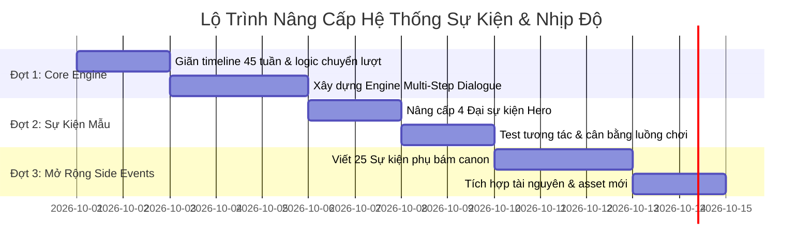

# KẾ HOẠCH NÂNG CẤP TOÀN DIỆN: NHỊP ĐỘ DÒNG THỜI GIAN, HỘI THOẠI ĐA TẦNG & HỆ THỐNG SỰ KIỆN PHỤ
### Bối cảnh: *Thanh Mao Sơn Ký (Cổ Chân Nhân - Quyển 1)*

> **Mục tiêu tài liệu**: Kế hoạch chi tiết này giải quyết triệt để 3 vấn đề người chơi phản hồi:
> 1. *Sự kiện chính xảy ra quá nhanh, thiếu khoảng thở để tu luyện và chuẩn bị.*
> 2. *Vừa nhấn vào sự kiện phụ, chưa kịp làm gì đã bị ép chuyển tuần nhảy sang sự kiện chính.*
> 3. *Sự kiện quá đơn điệu (chỉ 1 đoạn văn ngắn + click 1 nút là đóng sập lại), thiếu đối thoại tương tác qua lại và chiều sâu ma đạo.*

---

## MỤC LỤC
1. [Phân Tích Hiện Trạng & Điểm Nghẽn Kỹ Thuật](#1-phân-tích-hiện-trạng--điểm-nghẽn-kỹ-thuật)
2. [Trụ Cột 1: Giãn Dòng Thời Gian & Kiểm Soát Nhịp Độ (27 Tuần ➔ 45 Tuần)](#2-trụ-cột-1-giãn-dòng-thời-gian--kiểm-soát-nhịp-độ)
3. [Trụ Cột 2: Kiến Trúc Engine Hội Thoại Đa Tầng (Multi-Step Interactive Dialogue)](#3-trụ-cột-2-kiến-trúc-engine-hội-thoại-đa-tầng)
4. [Trụ Cột 3: Bộ Danh Mục 25+ Sự Kiện Phụ Mới Đậm Chất Nguyên Tác](#4-trụ-cột-3-bộ-danh-mục-25-sự-kiện-phụ-mới)
5. [Trụ Cột 4: Kịch Bản Chi Tiết 4 Đại Sự Kiện Làm Mẫu (Hero Event Specs)](#5-trụ-cột-4-kịch-bản-chi-tiết-4-đại-sự-kiện-làm-mẫu)
6. [Lộ Trình Triển Khai & Tiêu Chí Đánh Giá (Milestones & Acceptance Criteria)](#6-lộ-trình-triển-khai--tiêu-chí-đánh-giá)

---

## 1. PHÂN TÍCH HIỆN TRẠNG & ĐIỂM NGHẼN KỸ THUẬT

### 1.1. Hiện Trạng Timeline
- Hiện tại toàn bộ 206 chương Quyển 1 được nén vào **27 tuần** (`FINAL_TURN = 27`, tương đương 9 tháng, mỗi tháng 3 tuần: Thượng, Trung, Hạ tuần).
- Trong 27 tuần này có tới **19 mốc canon bắt buộc** (`CANON = {1, 3, 4, 6, 8, 10, 11, 13, 15, 16, 17, 19, 20, 21, 22, 23, 24, 25, 26, 27}`).
- **Hậu quả**:
  - Giai đoạn cao trào (từ tuần 19 đến tuần 27) diễn ra liên tục 9 tuần không có lấy 1 tuần trống để nghỉ ngơi.
  - Người chơi bị cuốn theo cốt truyện một cách bị động, không có đủ lượt để bế quan tăng chân nguyên, không kịp nuôi cổ, và không có thời gian tích lũy ngân lượng mổ đá.

### 1.2. Hiện Trạng Cơ Chế Chuyển Tuần
- Trong [js/engine.js](file:///Users/huukhanh/cochannhan_game/js/engine.js):
  - Mỗi tuần có 3 việc (`VIỆC 1/3`, `2/3`, `3/3`).
  - Khi người chơi chọn 1 hành động bản đồ (ví dụ: *Học đường* hay *Dạo sơn trại*), nếu có sự kiện phụ xuất hiện, người chơi nhấn chọn 1 phương án -> sự kiện biến mất ngay lập tức.
  - Sau khi hoàn thành việc 3/3, hàm `advance()` tự động gọi `endTurn()` -> `startTurn()` -> `S.turn++`.
  - Hàm `startTurn()` lập tức quét `CANON[S.turn]` hoặc tự động lấy sự kiện trong `NPC_POOL` đẩy vào `S.evq`.
  - **Hậu quả**: Người chơi vừa bấm xong sự kiện phụ ở cuối tuần, tuần mới lập tức nổ ra sự kiện chính đè lên màn hình mà người chơi chưa kịp nhìn thấy số liệu nhân vật thay đổi ra sao.

### 1.3. Hiện Trạng Chiều Sâu Sự Kiện
- Mỗi sự kiện hiện tại chỉ là một cấu trúc phẳng:
  `{ title: '...', text: () => '...', choices: [ {t: '...', eff: ...} ] }`
- Người chơi đọc 2 câu mô tả, bấm 1 trong 3 nút, popup đóng sập lại và chỉ để lại 1 dòng chữ nhỏ trong khung nhật ký bên dưới.
- Không có hội thoại đối đáp (A nói -> B cãi lại -> A đe dọa -> B rút kiếm), làm mất đi 80% sức hấp dẫn của ma đạo đấu trí trong nguyên tác Cổ Chân Nhân.

---

## 2. TRỤ CỘT 1: GIÃN DÒNG THỜI GIAN & KIỂM SOÁT NHỊP ĐỘ

### 2.1. Mở Rộng Từ 27 Tuần Lên 45 Tuần
Dòng thời gian được tái cấu trúc thành 15 tháng (mỗi tháng 3 tuần = 45 tuần), tạo ra các **"Tuần Đệm Tự Do" (Open Buffer Weeks)**:

| Giai Đoạn Cốt Truyện | Tuần Cũ (27) | Tuần Mới (45) | Số Tuần Đệm Tự Do | Trọng Tâm Trải Nghiệm Của Người Chơi |
| :--- | :---: | :---: | :---: | :--- |
| **I. Khai Khiếu & Học Đường** | Tuần 1 – 6 | **Tuần 1 – 10** | **4 tuần tự do** | Thích nghi không khiếu, luyện Nguyệt Quang Cổ, chặn cổng cướp thạch, đi học nghe giảng, bế quan tăng chân nguyên. |
| **II. Mật Thất Hoa Tửu & Di Sản** | Tuần 7 – 9 | **Tuần 11 – 18** | **4 tuần tự do** | Tìm cửa hang Đào Hoa Tửu, bắt Tửu Trùng, đòi lại quán rượu của cậu mợ, mổ đá tại quầy buôn. |
| **III. Thương Đội & Giả Kim Sinh** | Tuần 10 – 14 | **Tuần 19 – 26** | **4 tuần tự do** | Chợ phiên Giả gia sầm uất, mâu thuẫn với Giả Kim Sinh, dụ ra bờ sông ám sát, đối mặt Giả Phú điều tra. |
| **IV. Tiểu Tổ Thanh Thư & Tầng 2** | Tuần 15 – 18 | **Tuần 27 – 34** | **4 tuần tự do** | Gia nhập tiểu tổ tinh anh, săn thú ngoài trại, phá bẫy tầng 2 đoạt Bạch Thỉ Cổ & Ngọc Bì Cổ, chạm trán Bạch Ngưng Băng lần đầu. |
| **V. Huyết Chiến Lang Triều** | Tuần 19 – 22 | **Tuần 35 – 39** | **2 tuần tự do** | Tam gia liên minh, sói điện vây thành, cấy Địa Thính Nhục Nhĩ Thảo, diệt Hùng gia đoạt Hắc Thỉ Cổ (Song Trư Lực). |
| **VI. Thần Bổ Dò Án & Đại Kết Cục** | Tuần 23 – 27 | **Tuần 40 – 45** | **1 tuần tự do** | Thiết Huyết Lãnh tra án gắt gao, khám phá động Huyết Hồ, Nhất Đại hồi sinh Huyết Mạc Thiên Hoa, Bạch Ngưng Băng tự bạo, Xuân Thu Thiền lần 2. |

### 2.2. Cơ Chế Điều Khiển Tuần Rõ Ràng (Player-Controlled Pacing)
1. **Trả quyền điều khiển về bản đồ sau mỗi sự kiện phụ**:
   - Khi giải quyết xong sự kiện phụ ở lượt 1 hoặc 2, giao diện hiển thị thông báo kết quả rõ ràng (Toast/Popup thông báo), cập nhật tài nguyên (khí huyết, chân nguyên, nguyên thạch) ngay trước mắt người chơi.
2. **Nút "Sang Tuần Mới" (End Week Button)**:
   - Khi người chơi đã thực hiện đủ 3 việc trong tuần (`VIỆC 3/3`), game sẽ **không tự động nhảy tuần ngay**.
   - Bản đồ sẽ hiện nút nổi bật: **`[Sang Tuần Mới ➔]`** kèm bản tóm tắt tình trạng tuần tới (ví dụ: *Dự báo tuần sau: Thương đội sắp tới / Sương mù dày đặc*).
   - Người chơi hoàn toàn chủ động bấm sang tuần mới khi đã sẵn sàng tinh thần.

---

## 3. TRỤ CỘT 2: KIẾN TRÚC ENGINE HỘI THOẠI ĐA TẦNG

### 3.1. Cấu Trúc Dữ Liệu Node-Based Cho Sự Kiện
Thay vì mảng `choices` phẳng, sự kiện hỗ trợ cấu trúc cây phân nhánh (`steps` hoặc `nodes`):

```javascript
c_sample_event: {
  title: 'Tiêu Đề Sự Kiện',
  loc: 'trai',
  canon: true,
  startNode: 'intro',
  nodes: {
    intro: {
      speaker: 'npc_key',          // Hiển thị avatar & tên người nói
      mood: 'angry' | 'smirk' | 'cold', // Biểu cảm
      text: 'Lời thoại mở đầu của NPC hoặc mô tả tình thế...',
      choices: [
        { 
          text: 'Câu thoại đáp lại số 1 (Ma đạo)', 
          tag: 'ma', 
          nextNode: 'node_threat' 
        },
        { 
          text: 'Câu thoại đáp lại số 2 (Đàm phán)', 
          tag: 'chinh', 
          check: ['tamco', 12],
          onSuccess: 'node_negotiate_ok',
          onFail: 'node_negotiate_fail'
        }
      ]
    },
    node_threat: {
      speaker: 'narrator',
      text: 'NPC sầm mặt, sát khí bùng nổ...',
      choices: [
        { text: 'Rút đao tấn công', eff: () => fight('npc_enemy') },
        { text: 'Lùi bước giấu nghề', nextNode: 'resolution_retreat' }
      ]
    },
    resolution_retreat: {
      type: 'resolution', // Màn hình tổng kết kết quả
      title: 'Tạm Thời Lùi Bước',
      text: 'Ngươi lặng lẽ biến mất sau màn sương. Danh vọng -5, nhưng bảo toàn được bí mật.',
      rewardText: '+2 Tâm cơ, -5 Danh vọng',
      choices: [
        { text: 'Trở lại bản đồ', close: true }
      ]
    }
  }
}
```

### 3.2. Màn Hình Tổng Kết Sự Kiện (Resolution Card)
- Loại bỏ hoàn toàn tình trạng "click là biến mất".
- Mọi chuỗi sự kiện đều kết thúc bằng một **Thẻ Tổng Kết (Resolution Card)**:
  - Hiển thị tóm tắt hậu quả: Nhân vật nào tăng/giảm hảo cảm, nhận được bao nhiêu nguyên thạch, tổn thương hay tu vi tăng thêm.
  - Người chơi bấm nút `[Xác Nhận / Tiếp Tục]` để đóng thẻ và quay lại giao diện chơi.

---

## 4. TRỤ CỘT 3: BỘ DANH MỤC 25+ SỰ KIỆN PHỤ MỚI

Các sự kiện phụ được phân bố theo 4 địa danh chính, kích hoạt dựa trên cảnh giới và thời điểm:

### Khu Vực 1: Học Đường Gia Tộc (7 Sự Kiện)
| Mã Sự Kiện | Tên Sự Kiện | Điều Kiện | Nội Dung Canon | Phân Nhánh & Thưởng/Phạt |
| :--- | :--- | :---: | :--- | :--- |
| `r_macbac_phuckich` | **Mạc Bắc Phục Kích** | Tuần 3–8 | Mạc Bắc cay cú vì bị cướp thạch, dẫn 3 đệ tử chặn ngõ tối. | 1. Đập gãy tay Mạc Bắc (+20 Thạch, Mạc gia thù địch).<br>2. Dùng lời kích động nội bộ chúng.<br>3. Trèo tường né tránh. |
| `r_xichthanh_duoc` | **Bí Mật Thuốc Dưỡng Khiếu** | Tuần 5–12 | Bắt gặp Xích Thành lén uống canh sâm bồi bổ không khiếu sau giờ học. | 1. Tống tiền gia lão Xích Luyện (+15 Thạch/tuần).<br>2. Giả vờ không thấy.<br>3. Mách lẻo Mạc gia gây hỗn loạn. |
| `r_giangnha_comoi` | **Giang Nha Gạ Bán Cổ** | Tuần 4–15 | Giang Nha rủ rê ngươi tuồn lá trà và thảo dược học đường ra ngoài bán. | 1. Hợp tác kiếm lời (+25 Thạch, tăng Hiềm nghi).<br>2. Báo cáo gia lão lập công.<br>3. Cướp luôn hàng của hắn. |
| `r_khaohach_biahinh` | **Bắn Bia Nguyệt Nhận Cải Biên** | Tuần 2–10 | Gia lão dạy kỹ thuật bắn Nguyệt Nhận hình xoắn ốc xuyên giáp. | 1. Thể hiện xuất sắc (Thưởng 10 Thạch, lộ tu vi).<br>2. Bắn trúng vừa đủ (Tăng Tâm cơ). |
| `r_phuongchinh_khoe` | **Phương Chính Khoe Cổ Mới** | Tuần 4–14 | Phương Chính được Tộc trưởng ban thưởng cổ Nhất chuyển quý, trước mặt bạn học liếc nhìn ngươi. | 1. Lạnh lùng chỉ điểm sơ hở của cổ.<br>2. Chúc mừng lấy lòng.<br>3. Bỏ đi coi như không khí. |
| `r_dongmon_khieuchien` | **Lôi Đài Đồng Môn** | Tuần 6–16 | Một đệ tử Ất đẳng thách đấu cược 10 nguyên thạch. | 1. Lên đài hạ gục trong 1 chiêu (+10 Thạch).<br>2. Từ chối thi đấu giữ sức. |
| `r_gialao_canhcao` | **Gia Lão Học Đường Răn Đe** | Hiềm nghi > 30 | Học đường gia lão gọi ngươi vào phòng riêng thẩm vấn về việc cướp thạch. | 1. Dùng môn quy đối đáp sắc sảo.<br>2. Hối lỗi nộp phạt 5 thạch.<br>3. Tỏ vẻ ngoan ngoãn giả tạo. |

### Khu Vực 2: Sơn Trại & Tửu Quán (6 Sự Kiện)
| Mã Sự Kiện | Tên Sự Kiện | Điều Kiện | Nội Dung Canon | Phân Nhánh & Thưởng/Phạt |
| :--- | :--- | :---: | :--- | :--- |
| `r_tuuquan_hoatuu` | **Chuyện Cũ Lão Ma Đầu** | Tuần 2–15 | Lão Cổ sư say rượu kể về trận đánh với Hoa Tửu Hành Giả năm xưa. | 1. Mua thêm rượu ngon chuốc say moi tin (Mở manh mối hang động).<br>2. Nghe lỏm rồi rời đi. |
| `r_caumo_doi_nha` | **Cậu Mợ Gây Sức Ép** | Tuần 5–18 | Cậu Đống Thổ sai gia nhân đến đòi lại chìa khóa quán rượu cha mẹ. | 1. Kích hoạt Ngọc Bì Cổ đánh gãy chân gia nhân.<br>2. Nhượng bộ chia 20% lợi nhuận.<br>3. Nhờ gia tộc can thiệp. |
| `r_choden_thieuthach` | **Thương Nhân Chợ Đen** | Đạo tâm ma | Một Cổ sư lang bạt chào bán tàn quyển bí phương hợp luyện Nhị chuyển. | 1. Bỏ 40 thạch mua bí phương.<br>2. Đánh úp cướp đồ trong hẻm tối.<br>3. Bỏ qua. |
| `r_phamnhan_oanuc` | **Tiếng Khóc Dưới Chân Tường** | Bất kỳ | Một phàm nhân bị Cổ sư Mạc gia đánh đập dã man van xin ngươi cứu giúp. | 1. Lạnh lùng bước qua (Tâm cơ +1).<br>2. Ra tay cứu đổi lấy tin tức nội bộ Mạc gia.<br>3. Đòi tiền chuộc mạng. |
| `r_tramthuy_matthu` | **Mật Thư Của Trầm Thúy** | Có cờ Trầm Thúy | Trầm Thúy lén gửi thư báo Phương Chính sắp được bế quan suối nguyên tuyền. | 1. Tận dụng thời cơ đột nhập trộm tài nguyên.<br>2. Tăng cường phòng bị.<br>3. Hủy thư giữ kín. |
| `r_ruou_ngon_thanhmao` | **Mẻ Rượu Bách Hoa** | Có quán rượu | Quán rượu nhà ngươi ủ thành công mẻ rượu quý hiếm. | 1. Đem bán thu 50 nguyên thạch.<br>2. Giữ lại làm mồi nhử bẫy Tửu Trùng và dã cổ. |

### Khu Vực 3: Hậu Sơn & Rừng Trúc Thanh Mâu (6 Sự Kiện)
| Mã Sự Kiện | Tên Sự Kiện | Điều Kiện | Nội Dung Canon | Phân Nhánh & Thưởng/Phạt |
| :--- | :--- | :---: | :--- | :--- |
| `r_khi_hau_nhi` | **Đàn Khỉ Trộm Rượu Hầu Nhi** | Tuần 3–15 | Bắt gặp bầy khỉ hoang đang say sưa bên hốc cây chứa rượu thơm nồng. | 1. Dùng Nguyệt Nhận xua đuổi cướp rượu Hầu Nhi.<br>2. Đặt bẫy bắt khỉ chúa.<br>3. Rút lui an toàn. |
| `r_bai_nguyetlan` | **Bãi Hoa Nguyệt Lan Dại** | Tuần 2–18 | Phát hiện cánh đồng hoa lan ăn cánh trăng nở rộ dưới ánh trăng rằm. | 1. Hái trọn vẹn hoa tươi (Miễn phí nuôi Nguyệt Quang Cổ 5 tuần).<br>2. Đào cả gốc mang về trồng. |
| `r_khe_da_channguyen` | **Mạch Nước Ngầm Tinh Khiết** | Tuần 6–22 | Tìm thấy mạch nước ngầm rò rỉ từ suối nguyên tuyền trong vách đá. | 1. Ngồi thiền hấp thu hồi phục 100% Chân nguyên.<br>2. Đánh dấu vị trí làm điểm bế quan bí mật. |
| `r_bay_thu_hoang` | **Bẫy Gai Rừng Trúc** | Tuần 10–25 | Dẫm phải bẫy săn thú của Cổ sư thợ săn Hùng gia. | 1. Dùng Ngọc Bì Cổ chống đỡ giáp sắt.<br>2. Phá bẫy truy vết kẻ đặt bẫy.<br>3. Bị thương nhẹ. |
| `r_dong_da_phatquang` | **Cửa Động Lân Tinh** | Tuần 8–20 | Một khe nứt phát ra ánh lân tinh xanh biếc, nghi là dấu vết dã cổ. | 1. Thò tay vào bắt dã cổ (Test Thể lực).<br>2. Dùng khói hun hang.<br>3. Bỏ qua vì sợ độc trùng. |
| `r_di_hai_co_su` | **Thi Thể Cổ Sư Vô Danh** | Tuần 12–30 | Phát hiện xác một Cổ sư bị thú cắn chết khô trong bụi rậm. | 1. Lục soát thi thể (+15 Thạch, nhận 1 linh dược).<br>2. Chôn cất tử tế (Tăng Danh vọng).<br>3. Cắt thịt bẫy thú. |

### Khu Vực 4: Điểm Tuần Tra & Thương Đội (6 Sự Kiện)
| Mã Sự Kiện | Tên Sự Kiện | Điều Kiện | Nội Dung Canon | Phân Nhánh & Thưởng/Phạt |
| :--- | :--- | :---: | :--- | :--- |
| `r_thachdau_doanthach` | **Cược Mổ Đá Tay Đôi** | Có thương đội | Cổ sư Giả gia thách đấu ngươi cược 30 thạch xem ai mổ ra cổ sống. | 1. Chấp nhận thách cược (Dựa vào ký ức kiếp trước thắng 60 thạch).<br>2. Từ chối giữ vốn. |
| `r_soi_trinhsat` | **Vết Chân Điện Lang Lẻ Loi** | Tuần 25–34 | Đi tuần phát hiện xác hươu rừng bị lôi điện thiêu cháy, dấu chân sói lớn. | 1. Báo cáo gia tộc sớm (+20 Chiến công).<br>2. Lần theo dấu vết săn sói đơn độc.<br>3. Giữ kín thông tin. |
| `r_bachgia_lam_ranh` | **Cổ Sư Bạch Gia Lấn Ranh** | Tuần 15–30 | Chạm trán tiểu tổ Bạch gia đang bí mật đo đạc cắm cọc gần suối Cổ Nguyệt. | 1. Tấn công phủ đầu đuổi đi.<br>2. Dò xét mục đích của chúng.<br>3. Nhượng bộ tránh xung đột. |
| `r_thuongnhan_luatsu` | **Thương Nhân Bán Cấm Thư** | Có thương đội | Gã lái buôn lén lút chào mời sách chép bí mật về các cổ phái Nam Cương. | 1. Mua sách (Mở khóa tri thức cổ).<br>2. Dọa báo quan để ép giá rẻ.<br>3. Bỏ đi. |
| `r_cuu_vien_nongdan` | **Đàn Heo Rừng Tấn Công Thôn Làng** | Tuần 8–24 | Phàm nhân nông trang chạy lên cầu cứu Cổ sư tiểu tổ. | 1. Xuống núi diệt heo rừng (Nhận thịt tươi nuôi Bạch Thỉ Cổ).<br>2. Đòi thôn làng trả thù lao 20 thạch.<br>3. Bỏ mặc. |
| `r_ho_ve_say_ruou` | **Hộ Vệ Giả Gia Gây Rối** | Có thương đội | Một tên hộ vệ Tam chuyển uống say đập phá quán rượu đòi quỵt tiền. | 1. Vận dụng danh tiếng Cổ Nguyệt tộc dọa hắn.<br>2. Chuốc thêm rượu độc.<br>3. Nhờ Giả Phú phân xử. |

---

## 5. TRỤ CỘT 4: KỊCH BẢN CHI TIẾT 4 ĐẠI SỰ KIỆN LÀM MẪU

Dưới đây là thiết kế chi tiết dạng kịch bản tương tác đa tầng cho 4 sự kiện cốt lõi:

### 1. `c_khaikhieu` – Lễ Khai Khiếu (Tuần 1)
- **Node 1 (Mở màn)**: 
  - *Speaker*: Học đường gia lão.
  - *Text*: “Cổ Nguyệt Phương Chính, Giáp đẳng! Biển chân nguyên tám mươi bốn phần!” Cả hang suối ngầm rung chuyển vì tiếng hoan hô. Phương Chính bước ra, mặt đỏ bừng vì tự hào, ánh mắt ngập tràn kiêu hãnh nhìn về phía ngươi.
  - *Choices*:
    - [A]: *"Lặng lẽ quan sát, tâm như mặt nước hồ thu."* ➔ Sang Node 2A.
    - [B]: *"Mỉm cười bước lên chúc mừng đệ đệ trước mặt tộc trưởng."* ➔ Sang Node 2B.
- **Node 2 (Tới lượt Phương Nguyên)**:
  - *Speaker*: Gia lão.
  - *Text*: “Cổ Nguyệt Phương Nguyên, Bính đẳng! Biển chân nguyên bốn mươi bốn phần!” Tiếng reo hò im bặt, thay vào đó là tiếng cười khúc khích, thương hại và khinh bỉ. Cậu mợ đứng đằng xa lập tức quay mặt đi chỗ khác.
  - *Choices*:
    - [A]: *"Năm trăm năm ma đạo dạy ta: lời đàm tiếu phàm nhân chẳng đáng một viên nguyên thạch." (Ma đạo)* ➔ Tâm cơ +2, nhận buff `Nhẫn Nại`.
    - [B]: *"Nắm chặt nắm đấm, mắt lóe lên một tia sắc lạnh nhìn quanh."* ➔ Sát phạt +1, Mạc gia để ý.
- **Resolution**: Gia lão phát Nguyệt Quang Cổ. Ngươi thức trắng một đêm dùng uy áp Xuân Thu Thiền ép dã cổ quy phục, nhận thưởng 100 thạch hạng nhất.

---

### 2. `c_giasan` – Đòi Lại Di Sản Cậu Mợ (Tuần 12)
- **Node 1**: 
  - *Speaker*: Cậu Đống Thổ.
  - *Text*: “Phương Nguyên à, cháu mới Nhất chuyển, tu vi chưa vững, giữ quán rượu làm sao nổi? Chi bằng giao lại cho cậu mợ trông nom, mỗi tháng cậu cho cháu 2 khối nguyên thạch tiêu vặt!”
  - *Choices*:
    - [A]: *Cười nhạt đập gia quy lên bàn: “Gia quy điều 7: Học viên thành nhân có quyền thu hồi toàn bộ gia sản. Cậu muốn lên Hình Đường đối chất không?”* ➔ Sang Node 2A (Cứng rắn).
    - [B]: *Giả vờ mềm mỏng: “Cậu nói cũng có lý, nhưng cháu cần tiền mua thức ăn cho cổ trùng...”* ➔ Sang Node 2B (Thương lượng).
- **Node 2A**:
  - *Speaker*: Mợ.
  - *Text*: Mợ ngươi từ sau rèm bước ra, the the giọng: “Đồ vong ân bội nghĩa! Nuôi cháu mười năm, giờ cháu định đuổi cậu mợ ra đường sao?” Ba tên gia đinh Cổ sư Nhất chuyển rút đao tiến lại gần.
  - *Choices*:
    - [A]: *Kích hoạt Ngọc Bì Cổ, tay không bẻ gãy đao chém gãy chân gia đinh! (Cần Ngọc Bì Cổ)* ➔ Thu trọn vẹn quán rượu (+10 thạch/tuần, mở khóa di sản).
    - [B]: *Dọa báo cáo gia lão Mạc Trần chuyện cậu mợ lén bán đất công.* ➔ Thu được 8 thạch/tuần.
- **Resolution**: Lấy lại hợp đồng quán rượu, mợ uất ức phái Trầm Thúy sang làm tỳ nữ để dò xét.

---

### 3. `c_kimsinh` – Giả Kim Sinh & Bờ Sông Án Mạng (Tuần 20)
- **Node 1 (Chặn đường)**:
  - *Speaker*: Giả Kim Sinh.
  - *Text*: “Tiểu tử! Trên người ngươi sao lại có mùi Đào Hoa Tửu nồng thế này? Thứ rượu này đã biến mất mấy trăm năm... Khai mau, ngươi giấu Tửu Trùng ở đâu? Bán lại cho ta 30 nguyên thạch, bằng không ta báo gia tộc bắt giam ngươi vì tội trộm cắp!”
  - *Choices*:
    - [A]: *Giả ngốc: “Ngươi nhầm rồi, ta chỉ uống rượu gạo bình thường thôi.”* ➔ Giả Kim Sinh bám đuôi đe dọa gắt hơn.
    - [B]: *Đấu trí dụ địch: “Nơi này đông người qua lại... Giờ Tý đêm nay, mang 180 thạch ra bờ sông vắng, ta giao Tửu Trùng cho ngươi.”* ➔ Sang Node 2 (Bẫy bờ sông).
    - [C]: *Lạnh lùng nhìn thẳng: “Cút.”* ➔ Giả Kim Sinh tức tối thuê sát thủ phục kích.
- **Node 2 (Đêm bờ sông tĩnh mịch)**:
  - *Speaker*: Giả Kim Sinh.
  - *Text*: Giữa đêm đen tĩnh mịch ven sông, Giả Kim Sinh một mình mò tới, mắt sáng rực vì lòng tham: “Tiền đây! Mau đưa Tửu Trùng ra!”
  - *Choices*:
    - [A]: *Không nói nửa lời, vung Nguyệt Nhận chém đứt yết hầu! (Canon diệt khẩu)* ➔ Vào trận chiến ám sát Giả Kim Sinh.
    - [B]: *Nhận tiền rồi bỏ chạy.* (Lệch nguyên tác).
- **Resolution**: Giết chết Giả Kim Sinh, lục đoạt 120 nguyên thạch và túi trữ vật, chặt xác chôn sâu dưới cát sỏi ven sông, kích hoạt bão ngầm Giả Phú điều tra.

---

### 4. `c_bai` – Chạm Trán Quái Kiệt Bạch Ngưng Băng Rừng Tuyết (Tuần 34)
- **Node 1 (Xuất hiện)**:
  - *Speaker*: Bạch Ngưng Băng (Nam).
  - *Text*: Giữa bão tuyết mịt mù, một thiếu niên áo trắng tuấn mỹ như ngọc, tóc trắng tung bay, chân giẫm trên xác gấu tuyết khổng lồ. Hắn quay đầu, đôi mắt xanh biếc nhìn ngươi với nụ cười điên loạn: “Cổ Nguyệt Phương Nguyên? Nghe nói ngươi là kẻ thú vị nhất Cổ Nguyệt trại. Hãy cho ta một trận sinh tử rực rỡ!”
  - *Choices*:
    - [A]: *Bình thản đón nhận: “Kẻ muốn chết thì khắp nơi đều là mồ chôn, cần gì phải vội?” (Đấu khẩu triết lý)* ➔ Sang Node 2A.
    - [B]: *Kích hoạt Song Trư Lực và Cứ Xỉ Kim Ngô vào thế nghênh chiến.* ➔ Sang Node 2B (Giao đấu).
    - [C]: *Quay đầu bỏ chạy vào rừng trúc.* ➔ Bị Bạch Ngưng Băng cười khinh bỉ phóng băng tiễn bắn rách áo.
- **Node 2A (Đấu khẩu sinh tử)**:
  - *Speaker*: Bạch Ngưng Băng.
  - *Text*: Bạch Ngưng Băng sững người, nụ cười trên môi tắt ngấm, ánh mắt lóe lên tia kinh ngạc: “Ngươi biết thể chất Bắc Minh Băng Phách của ta sắp nổ tung? Ngươi không sợ chết sao?”
  - *Choices*:
    - [A]: *“Sống trên đời, ai chẳng hướng về cái chết? Sợ hãi hay điên cuồng đều là chấp niệm phàm phu.”* ➔ Bạch Ngưng Băng rung động tâm can, coi ngươi là tri kỷ sinh tử duy nhất!
    - [B]: *“Muốn đánh thì đánh, nói nhảm làm gì?”* ➔ Bùng nổ trận chiến cầm hòa trong tuyết.
- **Resolution**: Hai bên giao đấu bất phân thắng bại, Bạch Ngưng Băng thu hồi băng đao, hẹn ngày tái đấu trên đỉnh lôi đài Tam gia.

---

## 6. LỘ TRÌNH TRIỂN KHAI & TIÊU CHÍ ĐÁNH GIÁ



### Tiêu Chí Nghiệm Thu (Acceptance Criteria):
1. **Kiểm soát nhịp độ**: Mỗi tuần cho phép làm trọn vẹn 3 việc; sau khi xong việc không tự ý đè sự kiện chính lên mặt người chơi.
2. **Hội thoại hấp dẫn**: Sự kiện chính có ít nhất 2–3 nhịp thoại tương tác, người chơi được lựa chọn câu thoại ma đạo và nhìn thấy phản ứng NPC.
3. **Màn hình kết quả**: Mọi sự kiện đều có thẻ tổng kết rõ ràng (+/- thạch, chân nguyên, hảo cảm) kèm nút tiếp tục.
4. **Không lỗi script**: Toàn bộ codebase vượt qua `node -c` và không bị treo vòng lặp vô tận khi kiểm tra bằng test bot.

---

*Tài liệu này được lưu tại [KE_HOACH_NANG_CAP_SU_KIEN.md](file:///Users/huukhanh/cochannhan_game/KE_HOACH_NANG_CAP_SU_KIEN.md) để người dùng rà soát và phê duyệt trước khi tiến hành code.*
