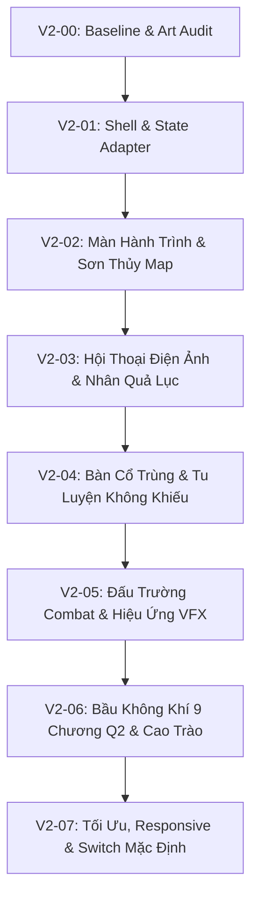

# Kế Hoạch Thực Thi UI V2 — Sân Khấu Sơn Thủy, Hành Trình Nghịch Mệnh

> **Căn cứ thiết kế:** [`docs/big-update-q1-q2/08_UI_ART_DIRECTION_V2.md`](docs/big-update-q1-q2/08_UI_ART_DIRECTION_V2.md)  
> **Kế thừa kỹ thuật:** [`02_UI_UX.md`](docs/big-update-q1-q2/02_UI_UX.md), [`03_EFFECT_AUDIO.md`](docs/big-update-q1-q2/03_EFFECT_AUDIO.md), [`CANON_MAP.md`](docs/big-update-q1-q2/CANON_MAP.md)  
> **Nguyên tắc bất biến:**
> 1. **Zero Gameplay Regression:** Không phá vỡ bất kỳ logic gameplay, state `S`, RNG hay test harness nào (`check.cjs`, `story_test.cjs`, `sim.cjs`, `sim2.cjs` phải luôn PASS 100%).
> 2. **DOM Hook Contract:** Giữ tương thích ngược toàn bộ DOM listener/IDs cần thiết (`hud`, `stage`, `sheet`, `modalContainer`...) thông qua Adapter Pattern.
> 3. **Dual-Mode Switch:** Hỗ trợ toggle bật/tắt UI V2 trong Settings/Dev mode trong suốt quá trình xây dựng trước khi chuyển mặc định ở đợt nghiệm thu cuối.

---

## 🗺️ Lộ Trình Triển Khai (8 Giai Đoạn: V2-00 $\rightarrow$ V2-07)

---

## 📌 Chi Tiết Từng Giai Đoạn Thực Thi

### 🔹 V2-00: Baseline Audit, Design Tokens & Mock Saves
* **Mục tiêu:** Rà soát toàn bộ DOM hooks, kiểm kê kho asset thực tế, thiết lập bộ design token CSS và tạo các save profile mẫu để test nhanh các màn.
- [x] **DOM Contract Map:** Lập danh sách toàn bộ ID và class mà `js/engine.js`, `js/battle.js`, `js/rt.js`, `js/ui.js`, `js/story.js` đang truy vấn (`hud`, `mainPanel`, `stage`, `sheet`, `log`, `modalContainer`, `titleLayer`...). *(Hoàn thành 01/10/2026)*
- [x] **Asset & Font Audit:** Kiểm kê đường dẫn ảnh thực qua hàm `asset()`, kiểm tra tương thích font Google `Ma Shan Zheng`, `Be Vietnam Pro`, `Cormorant Garamond` (kiểm tra hiển thị dấu tiếng Việt đầy đủ). *(Hoàn thành 01/10/2026)*
- [x] **Design Tokens (`css/ui-v2/tokens.css`):** Đã tạo tệp định nghĩa đầy đủ bảng màu Mực sâu, Giấy ngà, Ngọc trầm, Đồng cổ, Chu sa, Lam lạnh, Aura cảnh giới và Typography. *(Hoàn thành 01/10/2026)*
- [x] **Save Mẫu (Mock Saves `js/ui-v2/mock_data.js`):** Tạo 3 mock state (`q1_early`, `q1_mid`, `q2_thanh`) phục vụ preview sandbox độc lập. *(Hoàn thành 01/10/2026)*
- [x] **Sandbox Preview Độc Lập (`ui_v2_preview.html`):** Xây dựng trang preview độc lập tách biệt khỏi main game để User trực tiếp mở trình duyệt kiểm tra và phê duyệt. *(Hoàn thành 01/10/2026)*

---

### 🔹 V2-01: Kiến Trúc Shell Mới & Presentation State Adapter
* **Mục tiêu:** Xây dựng khung Shell UI V2 không còn chia 3 cột cứng nhắc, thiết lập adapter đọc state `S` thuần túy (không side-effect) và cờ bật/tắt UI V2.
- [ ] **Presentation Adapter (`js/ui_adapter.js`):** Hàm `getPresentationState(S)` trích xuất sạch sẽ dữ liệu hiển thị (Mode, Theme, Tài nguyên, Thời gian, AP còn lại, Pending event, Danh sách cổ khả dụng) không làm biến đổi `S`.
- [ ] **Shell Layout (`css/ui-v2/shell.css`):**
  - Viewport-centric container (loại bỏ hai cột cứng `300px + 290px` của UI V1).
  - Tích hợp 4 chế độ hiển thị: Hành trình (`journey`), Câu chuyện (`narrative`), Chiến đấu (`combat`), Bảng phụ (`drawer/modal`).
- [ ] **Overlay & Focus Manager:** Quản lý tập trung các cửa sổ phủ (Kho cổ, Nhân Quả Lục, Cài đặt), bắt phím `Escape` để đóng, cô lập focus và kiểm soát trạng thái tạm dừng game (`pauseReason`) không để rò rỉ tick.
- [ ] **Toggle Switch:** Cho phép chuyển đổi linh hoạt UI V1 $\leftrightarrow$ UI V2 trong Settings hoặc qua phím tắt debug để đối chiếu trực tiếp.

---

### 🔹 V2-02: Màn Hành Trình (Journey & Sơn Thủy Map Stage)
* **Mục tiêu:** Biến bản đồ thành một sân khấu sơn thủy sống động, hiển thị pin địa điểm thông minh, HUD tài nguyên tối giản và thanh điều hướng đáy.
- [ ] **HUD Tinh Gọn (Top Bar 56–72px):** Hiển thị cảnh giới, sinh mệnh, chân nguyên, nguyên thạch, trạng thái Xuân Thu Thiền; tích hợp nút Menu & Nhật ký.
- [ ] **Sân Khấu Bản Đồ (Map Stage):**
  - Tranh phong cảnh nền chiếm phần lớn màn hình với hiệu ứng sương khói / bụi chuyển động chậm theo theme vùng.
  - Pin địa điểm với 4 trạng thái trực quan: *Bình thường, Điểm đang chọn, Biến cố mới, Bị phong tỏa/nguy hiểm*.
  - Hỗ trợ cả 2 chế độ: Click trực tiếp trên bản đồ hoặc danh sách điểm đến bên dưới (tối ưu cho mobile không bị che/cắt).
- [ ] **Biến Cố Đang Chờ (Pending Banner):** Hiển thị 1 câu tóm tắt biến cố then chốt và nút "Đi tới" rõ ràng, không che khuất cảnh.
- [ ] **Thanh Điều Hướng Đáy (Bottom Nav 64–80px):** 4 nút điều hướng lớn có nhãn rõ ràng: `Hành trình`, `Cổ trùng`, `Nhân vật`, `Nhân quả` cùng nút `Qua tuần / Qua ngày`.

---

### 🔹 V2-03: Màn Hội Thoại Điện Ảnh & Nhân Quả Lục (Story Stage)
* **Mục tiêu:** Dàn cảnh đối thoại đậm chất điện ảnh mỹ thuật xianxia, trình bày rõ ràng cái giá và rủi ro của quyết định, biên nhận kết quả lưu vết vào Nhân Quả Lục.
- [ ] **Bố Cục Hội Thoại Điện Ảnh:**
  - Tranh đại cảnh 16:9 sắc nét ở trên kết hợp chân dung nhân vật bán thân/avatar đặt trang trọng.
  - Khối văn bản lời thoại trên nền ngà mực sâu ổn định, chữ to rõ (17–18px, line-height 1.7), chống mỏi mắt.
  - Typewriter mượt mà: click lần 1 hiện hết chữ ngay, click lần 2 chuyển đoạn; có tùy chọn tắt typewriter và nút xem lại lịch sử thoại.
- [ ] **Trình Bày Lựa Chọn & Chi Phí (Decision Cards):**
  - Phân tách rõ ràng: *Hành động canon*, *Chi phí chắc chắn* (nguyên thạch, AP), *Điều kiện thiếu* (ổ khóa đỏ), *Nguy cơ/Ký ức báo trước*.
  - Lựa chọn trên mobile tự động co giãn dòng, không bị cắt cụt chữ.
- [ ] **Biên Nhận Hệ Quả (Consequence Receipt):** Kết quả lựa chọn quan trọng được ghim lại dưới dạng thẻ ấn triện cho tới khi người chơi chủ động bấm tiếp tục.
- [ ] **Nhân Quả Lục Visual Modal:** Hiển thị cây nhân quả nguyên nhân $\rightarrow$ kết quả đã xảy ra, mốc bí mật chưa mở được ẩn tên để kích thích khám phá.

---

### 🔹 V2-04: Màn Bàn Cổ Trùng & Tu Luyện Không Khiếu
* **Mục tiêu:** Đem lại cảm giác sở hữu cổ trùng chân thực như sinh vật sống, không khiếu tu luyện trực quan và quy trình hợp luyện minh bạch.
- [ ] **Bàn Cổ Trùng (Gu Inventory):**
  - Hiển thị dạng lưới thẻ bài cổ trùng sống động (ảnh Canva AI chuẩn + Hán tự thư pháp dự phòng).
  - Phân loại rõ ràng: Chuyển (Nhất $\rightarrow$ Lục), Lưu phái, Thức ăn hàng tuần, Tình trạng đói/no, và Hiệu ứng chiến đấu.
  - Thao tác một chạm: Cho ăn, Kích hoạt nội tại, hoặc Ghim công thức hợp luyện làm mục tiêu.
- [ ] **Không Khiếu Tu Luyện (Cultivation Stage):**
  - Hoạt cảnh Không Khiếu ở trung tâm tỏa sáng theo màu chân nguyên chân thực (`Thanh Đồng`, `Xích Thiết`, `Bạch Ngân`, `Hoàng Kim`).
  - Dự báo trực quan lượng chân nguyên tăng và chi phí trước khi bấm tu luyện.
  - Nút "Xung kích bích khiếu" bừng sáng khi chân nguyên viên mãn, hoạt cảnh thăng cấp tiểu cảnh giới uy lực và dứt khoát.
- [ ] **Bàn Luyện Cổ Minh Bạch:**
  - Trình bày trực quan: Nguyên liệu gốc + Nguyên liệu phụ $\rightarrow$ Cổ mục tiêu + Tỉ lệ thành công.
  - Tích hợp mượt mà với minigame luyện cổ hiện có, bảo toàn state khi reload.

---

### 🔹 V2-05: Đấu Trường Combat & Hiệu Ứng VFX Chiến Thuật
* **Mục tiêu:** Tái thiết kế giao diện chiến đấu thành đấu trường sơn thủy rộng mở, chỉ thị ý đồ địch rõ ràng, kỹ năng có lực và tương thích cả Turn-based lẫn Realtime.
- [ ] **Đấu Trường Sơn Thủy (Arena Stage):**
  - Kẻ địch và người chơi đối mặt trên nền phong cảnh đại chiến (rừng trúc, huyết động, tường thành lang triều, tam vương phúc địa).
  - Thước đo 3 cự ly chiến đấu (*Cận chiến - Tầm trung - Tầm xa*) hiển thị rõ ràng.
- [ ] **Chỉ Thị Ý Đồ Địch (Intent Banners):** Hiển thị rõ đòn đánh tới của đối phương (*Công kích, Trọng kích, Thủ thế, Chuẩn bị đại chiêu*) giúp người chơi tính toán đối sách phá thế.
- [ ] **Thanh Kỹ Năng Ấn Triện:**
  - Nút chiêu thức lớn, nổi bật Hán tự thư pháp chuẩn của từng cổ, hiển thị rõ tiêu hao chân nguyên và lượt hồi chiêu (`CD`).
  - Nút combo sát chiêu bừng sáng viền kim khi đủ điều kiện thi triển.
- [ ] **Lớp Hiệu Ứng VFX Độc Lập:** Chùm tia nguyệt nhận, đao băng tuyết, sóng âm, lửa thiêu đốt render qua canvas riêng biệt, không giật lag DOM chính.
- [ ] **Pause & Modal Isolation:** Đảm bảo khi mở bất kỳ menu/journal nào trong trận, thời gian và animation lập tức dừng tuyệt đối, không có tình trạng mất máu ngầm.

---

### 🔹 V2-06: Bầu Không Khí 9 Chương Quyển 2 & Hoạt Cảnh Cao Trào
* **Mục tiêu:** Thể hiện trọn vẹn 9 sắc thái không gian của Quyển 2 và các hoạt cảnh mang tính bước ngoặt của toàn bộ cốt truyện.
- [ ] **Theme Động 9 Vùng Đất Quyển 2:**
  - *Sông Hoàng Long:* Sóng nước đục ngầu, bè trôi lạnh lẽo.
  - *Bạch Cốt Sơn:* Xương trắng nhô khỏi sương mù, ánh lân tinh.
  - *Thương Đội:* Lều bạt, đuốc ấm giữa đường núi hiểm trở.
  - *Thương Gia Thành:* Đô thị phồn hoa ngọc bích nhiều tầng rực rỡ.
  - *Diễn Võ Trường:* Cột đá đen sừng sững, tiếng reo hò ma tu.
  - *Tam Xoa Sơn:* Ba cột sáng đỏ/vàng/lam vút thẳng trời cao.
  - *Bá Quy Phúc Địa:* Vạc luyện cổ sôi sục, địa linh rùa rêu phong.
- [ ] **Màn Mở Đầu & Chọn Mệnh Cách:** Tái thiết kế 3 thẻ mệnh cách như 3 bức họa cuộn thư pháp cổ.
- [ ] **Hoạt Cảnh Trọng Đại (Cinematic Moments):**
  - Tự bạo kích hoạt Xuân Thu Thiền quay ngược thời gian (hiệu ứng quang âm nghịch chuyển).
  - Luyện Tiên Cổ Định Tiên Du và truyền tống đến đỉnh Đãng Hồn Sơn Trung Châu.
  - Trang Tổng Kết Cuối Quyển (Epilogue Scroll) vinh danh chiến tích người chơi.

---

### 🔹 V2-07: Tối Ưu Hóa Toàn Diện, Responsive & Nghiệm Thu Phát Hành
* **Mục tiêu:** Đảm bảo giao diện mượt mà 60 FPS desktop / 30+ FPS mobile, không lỗi layout ở mọi độ phân giải và chuyển UI V2 thành giao diện chính thức.
- [ ] **Kiểm Thử Responsive:**
  - Mobile màn hình nhỏ: 360px, 390px $\times$ 844px.
  - Tablet: 768px $\times$ 1024px.
  - Desktop: 1440px $\times$ 900px, 1920px $\times$ 1080px.
  - Kiểm tra zoom trình duyệt 200%, không bị vỡ hoặc che mất nút bấm quan trọng.
- [ ] **Tối Ưu Tài Nguyên & Tốc Độ Tải:**
  - Áp dụng lazy-loading tranh cảnh, nén ảnh webp/jpg tối ưu dung lượng.
  - Dọn dẹp listener và ticker khi đổi màn, đảm bảo bộ nhớ không bị rò rỉ.
- [ ] **Chạy Bộ Test Harness Toàn Diện:**
  - `node tools/check.cjs` $\rightarrow$ 0 lỗi dữ liệu.
  - `node tools/story_test.cjs` $\rightarrow$ 57/57 tests PASS 100%.
  - `node tools/sim.cjs 100 6` $\rightarrow$ Winrate chuẩn 45% - 55%.
  - `node tools/sim2.cjs 100 5` $\rightarrow$ Vượt qua đủ 9 chương Q2.
- [ ] **Kích Hoạt Mặc Định:** Chuyển UI V2 thành giao diện mặc định của trò chơi, lưu trữ module UI cũ làm phương án dự phòng.

---

## 📊 Bảng Theo Dõi Tiến Độ Thực Thi

| Giai đoạn | Mô tả hạng mục | File can thiệp chính | Trạng thái | Ngày hoàn thành |
| :---: | :--- | :--- | :---: | :---: |
| **V2-00** | Baseline Audit, Tokens & Mock Saves | `css/ui-v2/tokens.css`, `js/ui-v2/mock_data.js`, `ui_v2_preview.html` | ✅ Hoàn thành | 01/10/2026 |
| **V2-01** | Shell & State Adapter | `index.html`, `js/ui_adapter.js`, `css/ui-v2/shell.css` | ⏳ Đang chờ | — |
| **V2-02** | Màn Hành Trình & Sơn Thủy Map | `js/ui_journey.js`, `css/ui-v2/journey.css` | ⏳ Đang chờ | — |
| **V2-03** | Hội Thoại Điện Ảnh & Nhân Quả Lục | `js/ui_story.js`, `css/ui-v2/story.css` | ⏳ Đang chờ | — |
| **V2-04** | Bàn Cổ Trùng & Tu Luyện Không Khiếu | `js/ui_inventory.js`, `css/ui-v2/inventory.css` | ⏳ Đang chờ | — |
| **V2-05** | Đấu Trường Combat & Hiệu Ứng VFX | `js/ui_combat.js`, `css/ui-v2/combat.css` | ⏳ Đang chờ | — |
| **V2-06** | Bầu Không Khí 9 Chương & Cao Trào | `js/present.js`, `css/ui-v2/themes.css` | ⏳ Đang chờ | — |
| **V2-07** | Tối Ưu, Responsive & Switch Mặc Định | Toàn bộ codebase | ⏳ Đang chờ | — |

---

> **Nguyên tắc hành động:** Bắt đầu tuần tự từ **V2-00** $\rightarrow$ **V2-01** $\rightarrow$ **V2-02**; kiểm thử tự động sau mỗi bước để đảm bảo tính ổn định tuyệt đối trước khi bước sang giai đoạn tiếp theo.
