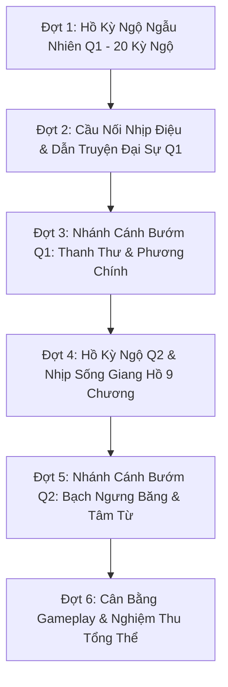

# Kế Hoạch Trau Chuốt Nội Dung & Nhánh Cánh Bướm (Quyển 1 & Quyển 2)

> **Mục tiêu tối thượng:** Chấm dứt tình trạng "bấm nút tiêu AP nhận thông báo trơ trọi", biến thế giới Cổ Chân Nhân thành một **Visual Novel sinh động, tàn khốc, nhiều bất ngờ và có chiều sâu nhân quả**.  
> **Nguyên tắc làm việc:** Làm theo từng đợt (Phase), mỗi đợt hoàn tất sẽ dừng lại để User trực tiếp chơi thử / review và duyệt mới bước sang đợt kế tiếp.

---

## 🧭 Bảng Tổng Quan Lộ Trình 5 Đợt

---

## 📌 Chi Tiết Các Đợt Triển Khai

### 🔹 Đợt 1: Hồ Kỳ Ngộ Ngẫu Nhiên Quyển 1 (20 Kỳ Ngộ Đậm Chất Ma Đạo)
* **Vấn đề giải quyết:** Xóa bỏ hoàn toàn các log vô vị (*"Một buổi học bình lặng"*, *"Sơn trại yên ả, uống chén trà rồi về"*). Mỗi khi người chơi đi vào các địa điểm, có xác suất cao kích hoạt một tình huống ngắn (2–3 nhịp thoại) với các lựa chọn phong cách Phương Nguyên.
* **Danh mục 20 Kỳ Ngộ Q1:**
  1. **Khu Vực Sơn Trại (6 sự kiện):**
     - `kn_cho_den`: Quầy hàng phàm nhân bán "côn trùng lạ" sắp chết đói (mắt nhìn 500 năm phát hiện dị chủng).
     - `kn_gia_dinh_tong_tien`: Gia đinh nhà cậu mợ dò xét tài chính, tống tiền hoặc bị giết người diệt khẩu trong hẻm tối.
     - `kn_quan_ruou_tin_don`: Nghe lỏm cuộc trò chuyện của hai thợ săn về dấu chân sói lạ trong đêm tuyết.
     - `kn_hoc_tro_cai_nhau`: Đệ tử Xích gia và Mạc gia ẩu đả, người chơi có thể khích tướng, cược thạch hoặc thó đồ lúc hỗn loạn.
     - `kn_mon_no_cu`: Người quen cũ của cha mẹ đến tìm, thử lòng hay muốn đòi lại di vật.
     - `kn_thau_da_vun`: Người buôn thạch làm rơi đá vụn có tỏa linh khí nhẹ.
  2. **Khu Vực Núi Thanh Mao (7 sự kiện):**
     - `kn_hai_cot_vo_danh`: Bộ xương Cổ sư mắc kẹt trong khe đá, để lại tàn phương hợp luyện rách nát và lời trăn trối.
     - `kn_ong_doc_mat_hoa`: Bầy ong độc canh tổ mật ngàn năm, dùng mưu xua đuổi hay mạo hiểm cướp mật.
     - `kn_ma_tu_trong_thuong`: Bắt gặp ma tu bị trọng thương đang trốn lệnh truy nã: Cứu để moi tin, giết đoạt cổ, hay bán đứng cho gia tộc lấy thưởng?
     - `kn_dien_lang_lac_bay`: Chó sói điện con bị thương kẹt trong bẫy sắt: Nuôi lấy thịt, thuần hóa hay bẻ gãy cổ?
     - `kn_duoc_thao_hiem`: Bụi hoa nguyệt lan hoang dại mọc bên bờ vực cheo leo.
     - `kn_bui_truc_phuc_kich`: Cổ sư Hùng gia lén lút dò la biên giới sơn trại.
     - `kn_ho_nuoc_ngam`: Hang nước ngầm phát ra tiếng thở của dị thú thủy đạo.
  3. **Khu Vực Học Đường (4 sự kiện):**
     - `kn_gia_lao_khao_van`: Học đường gia lão đột xuất khảo vấn kinh nghiệm nuôi cổ, trả lời giả ngu hay bộc lộ tâm cơ?
     - `kn_thu_vien_giau_sach`: Phát hiện cuốn nhật ký cũ của một gia lão đời trước giấu trong gáy sách.
     - `kn_dong_hoc_cau_cuu`: Một học trò Bính đẳng bị bạn học bắt nạt đến xin Phương Nguyên bảo kê với giá 2 thạch/tuần.
     - `kn_phuong_chinh_nhin_trom`: Bắt gặp Phương Chính đứng ngoài cửa sổ nhìn lén ca ca luyện quyền.
  4. **Khu Vực Hậu Sơn / Động Hoa Tửu (3 sự kiện):**
     - `kn_co_quan_tuu_khoi`: Dấu vết cơ quan Hoa Tửu để lại câu đố bằng vò rượu vỡ.
     - `kn_da_phat_quang`: Rêu lân tinh soi rọi một dòng chữ khắc bằng máu trên vách đá.
     - `kn_khe_gio_am`: Luồng gió mang theo mùi rượu thơm thoang thoảng dẫn lối vào một ngóc ngách bí mật.
* **Review Gate Đợt 1:** Chạy test, mở game chơi thử đi lại giữa các địa điểm để cảm nhận thế giới không còn bị rỗng.

---

### 🔹 Đợt 2: Cầu Nối Nhịp Điệu & Điềm Báo Đại Sự Q1 (Foreshadowing & Pacing)
* **Vấn đề giải quyết:** Các mốc cốt truyện hiện tại xuất hiện hơi đột ngột theo số tuần cố định. Cần thêm "điềm báo" và sự biến chuyển của môi trường xung quanh.
- [ ] **Điềm báo Vụ án Cổ Kim Sinh (Tuần 9 - 10):**
  - Cổ Kim Sinh xuất hiện sớm ở chợ phiên, khoe khoang kho cổ và coi thường đệ tử bản địa.
  - Ánh mắt ghen ghét, âm hiểm của Cổ Phú ở quầy trà đối diện.
- [ ] **Điềm báo Lang Triều Ngập Núi (Tuần 16 - 18):**
  - Đêm nào cũng có tiếng sói tru từ phía đỉnh núi; giá thảo dược và nguyên thạch ở chợ biến động tăng vọt.
  - Gia tộc bắt đầu huy động thợ rèn gia cố tường thành, học trò khóa trên được phát giáp da.
- [ ] **Bầu không khí Diệt Tộc & Hồi Kết (Tuần 24 - 26):**
  - Trời đổ tuyết trắng xóa giữa mùa hè; sương mù màu máu bốc lên từ lòng đất; chim chóc bay loạn khỏi rừng trúc.
* **Review Gate Đợt 2:** Người chơi cảm nhận được nhịp thở hồi hộp, căng thẳng tăng dần trước mỗi biến cố lớn.

---

### 🔹 Đợt 3: Nhánh Cánh Bướm Sâu Sắc Q1 (Thanh Thư & Phương Chính)
* **Vấn đề giải quyết:** Lựa chọn khác nguyên tác phải tạo ra hệ quả bước ngoặt (Alternate Timelines), không chỉ đơn thuần là tăng giảm chỉ số.
- [ ] **Nhánh Cổ Nguyệt Thanh Thư:**
  - *Nhánh 1 (Canon):* Thanh Thư hóa thành Thụ Tinh tử chiến bảo vệ trại, để lại Mộc Mị Cổ $\rightarrow$ Tộc trưởng Cổ Nguyệt Bác đau buồn suy sụp.
  - *Nhánh 2 (Cứu sống / Cánh bướm):* Phương Nguyên dùng mưu chia sẻ áp lực, Thanh Thư giữ được mạng sống nhưng phế một cánh tay $\rightarrow$ Cục diện chính trị thay đổi: Thanh Thư vẫn là người thừa kế, bảo bọc Phương Chính chống lại các phe phái; Cổ Nguyệt Bác giữ được tỉnh táo chỉ huy đại cục.
  - *Nhánh 3 (Đẩy vào chỗ chết sớm):* Mượn tay Lôi Quan Lang diệt Thanh Thư sớm để đoạt tài nguyên $\rightarrow$ Gia tộc rơi vào hỗn loạn sớm hơn 2 tuần.
- [ ] **Nhánh Phương Chính:**
  - *Nhánh 1 (Canon - Đè bẹp):* Phương Chính tự ti, căm hận nhưng bất lực, trở thành quân cờ của gia tộc.
  - *Nhánh 2 (Hắc hóa / Thao túng):* Phương Nguyên dùng độc thoại tâm lý và di vật của cha mẹ, bẻ gãy sự ngây thơ của Phương Chính, biến hắn thành nội ứng ngầm trong phủ tộc trưởng.
  - *Nhánh 3 (Tuyệt tình):* Cắt đứt hoàn toàn quan hệ huynh đệ trước mặt toàn tộc $\rightarrow$ Phương Chính thề giết ca ca, mở khóa trận quyết đấu riêng.
* **Review Gate Đợt 3:** Thử nghiệm các nhánh rẽ và kiểm tra tính toàn vẹn của mạch truyện.

---

### 🔹 Đợt 4: Hồ Kỳ Ngộ Quyển 2 & Nhịp Sống Giang Hồ 9 Chương
* **Vấn đề giải quyết:** Quyển 2 rất hoành tráng nhưng diễn biến giữa các chương hơi vội. Cần bổ sung các kỳ ngộ phản ánh phong vị ma đạo lãng tử và sinh tồn khắc nghiệt.
* **Danh mục 20 Kỳ Ngộ Q2:**
  1. **Sông Hoàng Long (Chương 1):** Bè gỗ thủng giữa đêm, vớt được xác cổ sư chết đuối còn giữ túi tiền, bầy muỗi hút máu trong lau sậy.
  2. **Bạch Cốt Sơn (Chương 2):** Cây nấm xương mọc trên đá, bẫy địa lôi của thợ săn Bách gia bỏ quên, tiếng khóc của oan hồn trong hốc xương.
  3. **Thương Đội Liên Hiệp (Chương 3):** Đấu giá chui trong lều ma tu, người hầu phàm nhân chết cóng được Phương Nguyên thí nghiệm cổ, lừa đổi thuốc giả lấy cổ trùng thật.
  4. **Thương Gia Thành (Chương 4 & 5):** Quán trà đàm đạo về bảng xếp hạng Diễn Võ, đệ tử thế gia đụng độ cậy thế ép người, sới bạc mổ đá ngầm ở ngõ hẻm khu thứ tư, nha hoàn của Thương Tâm Từ đến gửi điểm tâm.
  5. **Tam Xoa Sơn & Phúc Địa (Chương 6 - 8):** Ma tu tàn sát lẫn nhau trước cửa truyền thừa, mua bán tin tức về quy luật bẫy của Tam Vương, nhặt xác cao thủ chết trước cửa ải, quỷ hỏa trong đêm sương mù.
* **Review Gate Đợt 4:** Người chơi trải nghiệm một chuyến hành trình Nam Cương hiểm trở, chân thực và đầy cám dỗ.

---

### 🔹 Đợt 5: Nhánh Cánh Bướm Quyển 2 (Bạch Ngưng Băng & Thương Tâm Từ)
* **Vấn đề giải quyết:** Tình cảm và thái độ với hai nhân vật nữ quan trọng nhất của Quyển 2 cần để lại dấu ấn sâu đậm vào kết cục.
- [ ] **Tuyến Bạch Ngưng Băng (Âm Dương & Phản Bội):**
  - Mức độ tin phục / thù hận ở Q1 và trong suốt Q2 tích lũy qua từng hành động chia chác chiến lợi phẩm.
  - *Nhánh Canon:* Bạch Ngưng Băng lạnh lùng phản bội ở điện luyện cổ, kích hoạt Định Tinh Cổ phối hợp Thiết gia $\rightarrow$ Phương Nguyên buộc phải dùng Xuân Thu Thiền tự bạo.
  - *Nhánh Lệch (Tri Kỷ Ma Đạo):* Nếu đạt độ tin cậy và hiểu nhau tột bậc, trước khi kích hoạt Định Tinh Cổ, Bạch Ngưng Băng có khoảnh khắc do dự hoặc để lại ám hiệu báo trước cho Phương Nguyên chuẩn bị đối sách!
- [ ] **Tuyến Thương Tâm Từ:**
  - Định hình tính cách Tâm Từ: Tiếp tục là đóa bạch liên hoa thuần khiết cần che chở, hay được Phương Nguyên hun đúc trở thành một thiếu chủ quyết đoán, biết dùng thủ đoạn ma đạo để giữ vững quyền lực Thương gia thành.
* **Review Gate Đợt 5:** Đạt đến đỉnh cao trải nghiệm Visual Novel - nhập vai sâu sắc vào tư tưởng của Phương Nguyên.

---

### 🔹 Đợt 6: Cân Bằng Toàn Diện & Nghiệm Thu Phát Hành
- [ ] **Cân bằng kinh tế & tài nguyên:** Đảm bảo các kỳ ngộ mới không làm "lạm phát" nguyên thạch hay làm game quá dễ/quá khó.
- [ ] **Chạy toàn bộ Test Harness:**
  - `tools/check.cjs` (0 lỗi cú pháp/dữ liệu).
  - `tools/story_test.cjs` (PASS 100% mọi nhánh canon và alternate).
  - `tools/sim.cjs 100 6` (Duy trì winrate chuẩn 45% - 55%).
  - `tools/sim2.cjs 100 5` (100% hoàn thành trọn vẹn 9 chương Q2).
- [ ] **Bàn giao hoàn tất và chốt chặn trước khi mở rộng Quyển 3.**

---

## 📊 Bảng Theo Dõi Tiến Độ Trau Chuốt

| Đợt | Nội dung thực thi | Trạng thái | Ngày hoàn thành | Ghi chú Review của User |
| :---: | :--- | :---: | :---: | :--- |
| **Đợt 1** | Hồ Kỳ Ngộ Ngẫu Nhiên Q1 (20 kỳ ngộ) | ⏳ Đang chờ | — | Chuẩn bị triển khai |
| **Đợt 2** | Cầu Nối Nhịp Điệu & Dẫn Truyện Đại Sự Q1 | ⏳ Đang chờ | — | — |
| **Đợt 3** | Nhánh Cánh Bướm Q1: Thanh Thư & Phương Chính | ⏳ Đang chờ | — | — |
| **Đợt 4** | Hồ Kỳ Ngộ Q2 & Nhịp Sống Giang Hồ 9 Chương | ⏳ Đang chờ | — | — |
| **Đợt 5** | Nhánh Cánh Bướm Q2: Bạch Ngưng Băng & Tâm Từ | ⏳ Đang chờ | — | — |
| **Đợt 6** | Cân Bằng Toàn Diện & Nghiệm Thu Phát Hành | ⏳ Đang chờ | — | — |

---

> **Cam kết thực hiện:** Làm xong từng đợt, bàn giao để User trực tiếp chơi thử nghiệm thu, đạt yêu cầu mới làm đợt tiếp theo!
