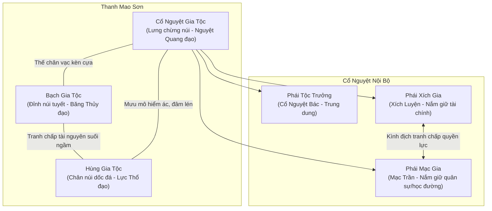
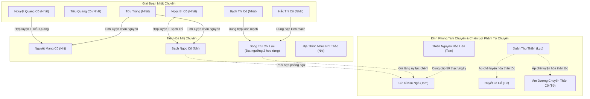

# BÁCH KHOA TOÀN THƯ NGUYÊN TÁC QUYỂN 1: THANH MAO SƠN (CHƯƠNG 1 – 206)
### Chi Tiết Cốt Truyện, Cơ Chế Cổ Trùng, Phân Bố Phe Phái & Bộ Event Mở Rộng Cho Game

> **Định vị tài liệu**: Cẩm nang đối chiếu chuẩn xác tuyệt đối theo nguyên tác tiểu thuyết *Cổ Chân Nhân* (Quyển 1: Ma Đầu Xuất Thế / Thanh Mao Sơn, từ Chương 1 đến Chương 206). Tài liệu này ghi chép tường tận từng cụm chương, cách thức xuất hiện và cơ chế kích hoạt của từng cổ trùng, mạng lưới chính trị 3 đại gia tộc, và cung cấp 12 kịch bản sự kiện (Event Specs) chi tiết để tích hợp trực tiếp vào hệ thống game (`events.js`).

---

## MỤC LỤC
1. [Bảng Niên Biểu Toàn Diện (Chương 1 – 206)](#1-bảng-niên-biểu-toàn-diện-chương-1--206)
2. [Bối Cảnh Chính Trị & Xung Đột Phe Phái Thanh Mao Sơn](#2-bối-cảnh-chính-trị--xung-đột-phe-phái-thanh-mao-sơn)
3. [Ghi Chép Chi Tiết Theo Cụm Chương (Biến Cố, Tâm Lý & Thủ Đoạn)](#3-ghi-chép-chi-tiết-theo-cụm-chương)
   - Cung 1: Khai Khiếu & Trấn Áp Học Đường (Chương 1 – 20)
   - Cung 2: Di Sản Hoa Tửu & Án Mạng Giả Kim Sinh (Chương 21 – 60)
   - Cung 3: Tầng 2 Mật Động, Song Trư Chi Lực & Di Sản Cậu Mợ (Chương 61 – 90)
   - Cung 4: Bắc Minh Băng Phách & Huyết Chiến Lang Triều (Chương 91 – 135)
   - Cung 5: Thanh Thư Tử Trận & Thần Bổ Thiết Huyết Lãnh Dò Án (Chương 136 – 165)
   - Cung 6: Cấm Địa Huyết Hồ, Khôi Phục Cổ Nguyệt Nhất Đại & Diệt Tộc (Chương 166 – 206)
4. [Hồ Sơ Toàn Bộ Cổ Trùng Xuất Hiện Trong Quyển 1](#4-hồ-sơ-toàn-bộ-cổ-trùng-xuất-hiện-trong-quyển-1)
5. [Cây Tiến Hóa / Hợp Luyện Cổ Của Phương Nguyên (Quyển 1)](#5-cây-tiến-hóa--hợp-luyện-cổ-của-phương-nguyên-quyển-1)
6. [Thiết Kế 12 Event Chi Tiết Cho Game (`events.js`)](#6-thiết-kế-12-event-chi-tiết-cho-game-eventsjs)

---

## 1. BẢNG NIÊN BIỂU TOÀN DIỆN (CHƯƠNG 1 – 206)

| Mốc | Chương | Giai Đoạn Canon | Nhân Vật Trọng Tâm | Cổ Trùng Đạt Được / Xuất Hiện | Biến Cố Cốt Truyện Cốt Lõi |
| :---: | :---: | :--- | :--- | :--- | :--- |
| **01** | 1 – 5 | **Trọng Sinh & Khai Khiếu Đại Điển** | Phương Nguyên, Cổ Nguyệt Phương Chính, Cậu Mợ Đống Thổ, Tộc trưởng Cổ Nguyệt Bác | **Xuân Thu Thiền** (Lục), **Hy Vọng Cổ** (Nhất) | PN tự bạo trên Nghĩa Thiên Sơn, trùng sinh về 15 tuổi. Khai khiếu suối ngầm: Phương Chính Giáp đẳng 84%, PN Bính đẳng 44%. Cậu mợ lập tức quay ngoắt thái độ, ghẻ lạnh PN. |
| **02** | 6 – 10 | **Chọn Bản Mệnh Cổ & Luyện Cổ Đêm** | Phương Nguyên, Học đường gia lão, Đồng học khóa mới | **Nguyệt Quang Cổ** (Nhất) | Vào Tàng Cổ Các chọn Nguyệt Quang Cổ. Mượn uy áp Xuân Thu Thiền trấn áp dã cổ, luyện hóa xong trong 1 đêm, nhận 100 nguyên thạch thưởng hạng nhất. |
| **03** | 11 – 15 | **Chặn Cổng Học Đường & Cướp Thạch** | Phương Nguyên, Phương Chính, Mạc Bắc, Xích Thành | Nguyệt Quang Cổ | Thiếu thạch nuôi cổ, PN chặn cổng đập từng học viên cướp 1 thạch/người. Đánh gãy tâm lý Phương Chính; bộc lộ thủ đoạn ma đầu bất chấp quy tắc. |
| **04** | 16 – 25 | **Tầm Bảo Rừng Trúc & Bắt Tửu Trùng** | Phương Nguyên, Di cốt Hoa Tửu Hành Giả | **Tửu Trùng** (Nhất), Dạ Quang Cổ (Nhất) | Lần theo mùi Đào Hoa Tửu phát hiện cửa hang ngầm. Dùng Hầu Nhi Tửu bẫy bắt Tửu Trùng. Tinh luyện chân nguyên Thanh Đồng sơ giai lên trung giai. |
| **05** | 26 – 35 | **Khảo Hạch Nguyệt Nhận & Tranh Đấu Phái Hệ** | Phương Nguyên, Mạc Bắc, Xích Thành, Gia lão | Nguyệt Quang Cổ, Tiểu Quang Cổ | Khảo hạch bắn bia thảo nhân. PN giấu tài, chỉ bắn vừa đủ điểm chuẩn. Mâu thuẫn giữa Xích gia và Mạc gia leo thang, tộc trưởng Cổ Nguyệt Bác thủ thế cân bằng. |
| **06** | 36 – 45 | **Thương Đội Giả Gia & Chợ Phiên Đổ Thạch** | Phương Nguyên, Giả Kim Sinh, Thương nhân Giả gia | Tửu Trùng, Bùn Lầy Cổ, Ngoan thạch | Thương đội Thương Lượng Sơn đến trại. PN bán dược liệu, đổ thạch trúng cổ quý kiếm bộn tiền, gom nguyên liệu dự trữ nuôi Tửu Trùng. |
| **07** | 46 – 52 | **Sát Hại Giả Kim Sinh & Phi Tang Bờ Sông** | Phương Nguyên, Giả Kim Sinh | Túi cổ của Giả Kim Sinh, Đoản đao | Giả Kim Sinh phát hiện Tửu Trùng ép mua và nghi ngờ di sản. PN dụ ra bờ sông đêm tối dùng Nguyệt Nhận chém chết, đoạt của, chôn xác phi tang. |
| **08** | 53 – 60 | **Giả Phú Dò Tội & Cổ Nguyệt Bác Bảo Hộ** | Phương Nguyên, Giả Phú (Tam chuyển), Cổ Nguyệt Bác | Trinh sát cổ, Chân nguyên Tam chuyển | Giả Phú Tam chuyển đến trại nổi giận truy tìm hung thủ. PN điềm đạm diễn kịch hướng nghi vấn sang Hùng gia, Bạch gia. Tộc trưởng bảo vệ học viên để giữ thể diện trại. |
| **09** | 61 – 70 | **Tốt Nghiệp & Gia Nhập Tiểu Tổ Thanh Thư** | Phương Nguyên, Cổ Nguyệt Thanh Thư, Xích Sơn, Phương Hoa | Nguyệt Quang Cổ, Độc châm | Ra trường, PN vào tổ tinh anh của Thanh Thư (con nuôi tộc trưởng, Tam chuyển mộc đạo). Tuần tra biên giới, săn heo rừng, phối hợp chiến đấu. |
| **10** | 71 – 80 | **Mật Thất Tầng 2: Bạch Thỉ & Ngọc Bì** | Phương Nguyên, Cạm bẫy Hoa Tửu | **Bạch Thỉ Cổ** (Nhất), **Ngọc Bì Cổ** (Nhất) | Phá bẫy rễ cây gai độc tầng 2 động ngầm. Lấy Bạch Thỉ Cổ (ăn thịt sống tăng vĩnh viễn 1 heo rừng lực) và Ngọc Bì Cổ (da hóa ngọc, kháng đao kiếm). |
| **11** | 81 – 90 | **Thăng Nhị Chuyển & Giành Lại Di Sản Cậu Mợ** | Phương Nguyên, Cậu Cổ Nguyệt Đống Thổ, Mợ | Xích Thiết Chân Nguyên, Ngọc Bì Cổ | Phá vỡ bích khiếu thăng Nhị chuyển sơ giai. Dùng luật tộc và đòn đánh phủ đầu ép cậu mợ nhả lại di sản quán rượu của cha mẹ, thu tiền xâu đều đặn. |
| **12** | 91 – 105 | **Bạch Ngưng Băng Xuất Thế & Kỳ Phùng Địch Thủ** | Phương Nguyên, Bạch Ngưng Băng (Bắc Minh Băng Phách) | **Băng Tinh Cổ**, **Băng Đao Cổ**, Sương Tức Cổ | Thiên tài 10 thành tư chất Bạch Ngưng Băng điên cuồng tìm cái chết rực rỡ. Giao đấu Phương Nguyên trong rừng tuyết; PN dùng tâm lý chiến ma đạo cầm hòa. |
| **13** | 106 – 120 | **Lang Triều Đại Nạn & Địa Thính Nhục Nhĩ Thảo** | Phương Nguyên, Tam tộc liên minh, Bầy sói điện | Điện Lang, Hào Điện Lang, **Địa Thính Nhục Nhĩ Thảo** (Nhị) | Đàn sói sấm sét tràn xuống núi. Ba trại liên minh sinh tử. PN phòng thủ cổng thành tích công điểm, đổi lấy Địa Thính Thảo, tự cắt tai phải cấy rễ để nghe 300 dặm. |
| **14** | 121 – 135 | **Hùng Gia Phản Trắc, Hắc Thỉ & Song Trư Lực** | Phương Nguyên, Tiểu tổ Cổ sư Hùng gia | **Hắc Thỉ Cổ** (Nhất), Lôi Quan Cổ | Hùng gia dụ sói hại Cổ Nguyệt & Bạch gia. PN phát hiện tàn sát sạch tiểu tổ Hùng gia, đoạt Hắc Thỉ Cổ, hợp thành "Song Trư Chi Lực" (sức 2 con heo rừng). Hùng trại bị sói diệt. |
| **15** | 136 – 145 | **Băng Phách Nứt Vỡ & Cơn Cuồng Sát Của Họ Bạch** | Phương Nguyên, Bạch Ngưng Băng | Bắc Minh Chân Nguyên Băng Tuyết | Không khiếu Bạch Ngưng Băng nứt toác, sắp tự bạo. Hắn điên cuồng săn lùng tiêu diệt toàn bộ thiên tài Cổ Nguyệt tộc để tìm khoái cảm sinh tử tối thượng. |
| **16** | 146 – 155 | **Thanh Thư Hóa Thụ Tử Trận Bằng Mộc Mị Cổ** | Phương Nguyên, Thanh Thư, Bạch Ngưng Băng | **Mộc Mị Cổ** (Tam chuyển Cấm Cổ) | Thanh Thư kích hoạt Mộc Mị Cổ biến thành Cự Thụ Tinh giam cầm Bạch Ngưng Băng, bảo vệ tộc nhân rồi kiệt sức hy sinh. PN đến sau thu dọn chiến trường. |
| **17** | 156 – 165 | **Thần Bổ Thiết Huyết Lãnh Giáng Lâm Dò Án** | Phương Nguyên, Thiết Huyết Lãnh (Ngũ), Thiết Nhược Nam | Trấn Ma Thiết Tác, Khôi Khôi Cổ, Vọng Khí Cổ | Thần Bổ Nam Cương cùng con gái dùng cổ trinh sát tìm ra vết máu cũ Giả Kim Sinh ở bờ sông. Vòng vây siết chặt quanh PN; PN buộc phải tính kế thoát thân. |
| **18** | 166 – 175 | **Cấm Địa Huyết Hồ: Cứ Xỉ Kim Ngô & Thiên Liên** | Phương Nguyên, Di hài Hoa Tửu Hành Giả | **Cứ Xỉ Kim Ngô** (Tam), **Thiên Nguyên Bảo Liên** (Tam) | Dùng Nhĩ Thảo đào thông động Huyết Hồ ngầm. Thu phục Rết Vàng Răng Cưa làm vũ khí cận chiến tàn bạo; phát hiện bảo sen tự sinh 50 nguyên thạch/ngày. |
| **19** | 176 – 180 | **Chân Tướng Rợn Người Của Cổ Nguyệt Nhất Đại** | Phương Nguyên, Hoa Tửu (di ngôn) | Huyết Hải di sản, Huyết Chủng Cổ | Văn bia vạch trần: Nhất Đại là ma đạo lập trại Cổ Nguyệt làm "chuồng lợn", nuôi con cháu để dùng Huyết Lô tàn sát lấy máu thăng tư chất lên Giáp đẳng phá Lục chuyển! |
| **20** | 181 – 185 | **Tam Gia Đại Tỷ Võ & Địa Lang Tri Trồi Lên** | Phương Nguyên, Phương Chính, Bạch Ngưng Băng | Địa Lang Tri (Nhện ngầm), Băng đao | Tỷ võ đỉnh núi giữa bão tuyết. Bạch Ngưng Băng cuồng sát đập gãy tay chân Phương Chính. PN cưỡi Địa Lang Tri phá đất xông lên tham chiến. |
| **21** | 186 – 195 | **Nhất Đại Thức Tỉnh & Huyết Mạc Thiên Hoa** | Phương Nguyên, Nhất Đại, Thiết Huyết Lãnh | **Huyết Mạc Thiên Hoa** (Ngũ), Huyết Quỷ Phi Cương | Nhất Đại thức tỉnh thành Huyết Quỷ Phi Cương Ngũ chuyển, tung Huyết Mạc bao trùm đỉnh núi tàn sát con cháu. Thiết Huyết Lãnh liều mình giao chiến rồi tử trận. |
| **22** | 196 – 200 | **Bạch Ngưng Băng Tự Bạo & Băng Phong Vạn Trượng** | Phương Nguyên, Bạch Ngưng Băng, Nhất Đại | Bắc Minh Băng Phách tự bạo | Bạch Ngưng Băng giải phóng toàn bộ không khiếu, đóng băng toàn bộ đỉnh Thanh Mao Sơn, giam cầm Nhất Đại trong băng. PN cũng bị băng phong sắp chết. |
| **23** | 201 – 206 | **Xuân Thu Thiền Lần 2, Nghịch Thiên Cải Mệnh & Rời Núi** | Phương Nguyên, Bạch Ngưng Băng (nữ), Thiên Hạc Thượng Nhân | **Xuân Thu Thiền** (Lục), **Huyết Lô Cổ** (Tứ), **Âm Dương Chuyển Thân** | PN kích hoạt Xuân Thu Thiền quay về quá khứ vài khắc. Giết Nhất Đại; dùng Âm Cổ chuyển Bạch Ngưng Băng thành nữ để giải án tử; dùng Huyết Lô tắm máu tăng tư chất lên Giáp 90%. Trốn khỏi núi cùng BNB! |

---

## 2. BỐI CẢNH CHÍNH TRỊ & XUNG ĐỘT PHE PHÁI THANH MAO SƠN

Thanh Mao Sơn là một ngọn núi độc lập ở Nam Cương, trên núi có ba đại gia tộc chân vạc tồn tại hàng trăm năm:

### 1. Cổ Nguyệt Sơn Trại (Chính Đạo Gia Tộc)
- **Tổ tiên**: Cổ Nguyệt Nhất Đại lập trại cách đây hơn 500 năm trên suối nguyên tuyền dồi dào.
- **Phong cách tu luyện**: Chuyên tu Nguyệt đạo (Nguyệt Quang Cổ, Nguyệt Nhận, Nguyệt Mang, Nguyệt Toàn, Nguyệt Nghê Thường) kết hợp Thảo mộc.
- **Cơ cấu quyền lực nội bộ**:
  - **Tộc trưởng Cổ Nguyệt Bác (Tứ chuyển)**: Giữ thế cân bằng giữa các gia lão, nhận Cổ Nguyệt Thanh Thư làm con nuôi để làm người kế vị, sau này dốc lòng bồi dưỡng Cổ Nguyệt Phương Chính (Giáp đẳng).
  - **Phái Mạc Gia (Mạc Trần - Tam chuyển gia lão)**: Phe phái quyền thế, cháu nội là Cổ Nguyệt Mạc Bắc. Tính tình nóng nảy, hiếu chiến.
  - **Phái Xích Gia (Xích Luyện - Tam chuyển gia lão)**: Phe phái thâm sâu, cháu nội là Cổ Nguyệt Xích Thành (vốn chỉ có Đinh đẳng nhưng được ông nội dùng chân nguyên bồi dưỡng giả mạo Ất đẳng). Phương Nguyên kiếp này đã nhìn thấu điểm yếu này để tống tiền Xích Luyện.
  - **Cậu Cổ Nguyệt Đống Thổ & Mợ**: Đại diện cho sự ích kỷ, tham lam của tầng lớp tiểu thị dân trong gia tộc. Chiếm đoạt di sản của cha mẹ Phương Nguyên, lập tức trở mặt khi thấy Phương Nguyên chỉ có Bính đẳng.

### 2. Bạch Gia Sơn Trại
- **Địa bàn**: Nằm ở phần núi cao nhiều sương giá của Thanh Mao Sơn.
- **Phong cách**: Chuyên tu Băng Tuyết đạo, Thủy đạo. Tính cách tộc nhân ngạo mạn, kỷ luật thép.
- **Nhân vật biểu tượng**: **Bạch Ngưng Băng** – Thập Tuyệt Thể (Bắc Minh Băng Phách thể 100% tư chất). Là thanh kiếm sắc bén nhất nhưng cũng là quả bom nổ chậm đe dọa hủy diệt chính gia tộc mình.

### 3. Hùng Gia Sơn Trại
- **Địa bàn**: Nằm ở vùng đất dốc đá hiểm trở dưới chân núi.
- **Phong cách**: Chuyên tu Lực đạo, Thổ đạo (Gấu, Heo rừng, Cương nham). Tộc nhân thô kệch, hung hãn nhưng lãnh đạo cực kỳ gian xảo, luôn rình rập cơ hội nuốt chửng hai gia tộc còn lại khi đại nạn ập đến.

---

## 3. GHI CHÉP CHI TIẾT THEO CỤM CHƯƠNG

### Cung 1: Khai Khiếu & Trấn Áp Học Đường (Chương 1 – 20)

#### Chương 1 – 3: Trọng Sinh 500 Năm & Thức Tỉnh Tại Sơn Trại
- **Diễn biến**: Trên đỉnh Nghĩa Thiên Sơn, Ma đầu Cổ Nguyệt Phương Nguyên sau 500 năm tung hoành giang hồ bị chính ma lưỡng đạo vây hãm đến đường cùng. Trong khoảnh khắc ngàn cân treo sợi tóc, Phương Nguyên kích hoạt Tiên Cổ Lục Chuyển **Xuân Thu Thiền**, tự bạo cơ thể để ý niệm xuôi dòng Quang Âm trường hà quay ngược thời gian.
- Phương Nguyên giật mình tỉnh dậy trong căn gác xép cũ nát tại Cổ Nguyệt sơn trại, năm đó tròn 15 tuổi. Bên cạnh là người em song sinh Cổ Nguyệt Phương Chính còn ngây thơ nhút nhát. Bằng tâm tính ma đầu đã trải qua 500 năm gió tanh mưa máu, Phương Nguyên bình thản đón nhận thực tại, bắt đầu tính toán từng bước đi để không lặp lại bi kịch kiếp trước.

#### Chương 4 – 5: Khai Khiếu Đại Điển & Bi Kịch Tư Chất Bính Đẳng
- **Cơ chế Khai Khiếu**: Tổ chức tại động suối ngầm gia tộc. Học viên bước xuống suối bơi vào màn sương để dã cổ **Hy Vọng Cổ** bay vào bụng, công phá bụng dưới tạo thành Không Khiếu (quang mô bao bọc biển chân nguyên).
- **Kết quả**: Cổ Nguyệt Phương Chính thức tỉnh tư chất **Giáp đẳng (84%)**, ánh sáng rực rỡ chiếu sáng cả động ngầm. Toàn bộ gia tộc rúng động, tộc trưởng Cổ Nguyệt Bác lập tức nhận làm đệ tử đích truyền.
- Phương Nguyên bước vào suối, Không Khiếu mở ra chỉ đạt **Bính đẳng (44% Thanh Đồng chân nguyên sơ giai)**. Cậu Cổ Nguyệt Đống Thổ và mợ vốn cung phụng, nịnh hót Phương Nguyên từ nhỏ lập tức quay ngoắt thái độ 180 độ: trục xuất Phương Nguyên ra nhà phụ, cắt giảm tiền tiêu vặt, dồn toàn bộ sự sùng kính sang Phương Chính.

#### Chương 6 – 10: Tàng Cổ Các, Luyện Cổ Đêm & Giành Hạng Nhất
- **Chọn Cổ**: Gia tộc mở Tàng Cổ Các cho học viên chọn cổ bản mệnh đầu tiên. Giữa Toàn Phong Cổ và Thiết Bì Cổ, Phương Nguyên quyết đoán chọn **Nguyệt Quang Cổ** (tầm xa, sát thương ổn định của Cổ Nguyệt tộc).
- **Kỹ thuật Luyện Cổ**: Thông thường học viên Bính đẳng phải mất 3-4 ngày dùng chân nguyên mài mòn ý chí dã cổ. Phương Nguyên mượn một tia khí tức của Lục chuyển Tiên Cổ Xuân Thu Thiền đang ngủ say trong không khiếu: dã cổ cảm nhận uy áp thiên địa lập tức sợ hãi thần phục tuyệt đối. Phương Nguyên luyện hóa thành công chỉ trong vòng **1 đêm**, đứng đầu toàn khóa, nhận thưởng 100 khối nguyên thạch từ Học đường gia lão trước sự kinh ngạc của toàn tộc.

#### Chương 11 – 15: Chặn Cổng Học Đường & "Phí Bảo Kê" Nguyên Thạch
- **Khó khăn**: Nuôi cổ và tu luyện ngốn rất nhiều nguyên thạch. Với tư chất Bính đẳng (chân nguyên chỉ hồi phục 44%), nếu không có nguyên thạch bổ sung thì Phương Nguyên sẽ bị bỏ xa. Trợ cấp học đường chỉ có 3 thạch/tuần.
- **Thủ đoạn ma đầu**: Mỗi buổi chiều tan học, Phương Nguyên đứng chắn ngay lối ra duy nhất của cổng học đường. Hắn đánh ngã từng học viên cùng khóa, bắt mỗi người nộp 1 khối nguyên thạch mới được đi qua.
- Cổ Nguyệt Mạc Bắc (cháu Mạc Trần) và Cổ Nguyệt Xích Thành (cháu Xích Luyện) cậy thế gia tộc lao vào đều bị Phương Nguyên dùng kinh nghiệm cận chiến 500 năm đập gãy mũi, đánh bầm dập.
- Cổ Nguyệt Phương Chính ỷ vào tư chất Giáp đẳng ra mặt can ngăn liền bị Phương Nguyên tát thẳng mặt ngã lăn lóc. Phương Chính ôm mặt khóc trong nhục nhã, bóng ma tâm lý về người anh trai bắt đầu hình thành sâu sắc. Mỗi tuần Phương Nguyên ung dung bỏ túi hàng chục khối nguyên thạch.

#### Chương 16 – 20: Tầm Bảo Rừng Trúc & Cửa Hang Hoa Tửu Hành Giả
- Phương Nguyên nhớ lại truyền thuyết kiếp trước: mấy trăm năm trước có ma đầu Ngũ chuyển **Hoa Tửu Hành Giả** bị Cổ Nguyệt tộc vây giết trên núi Thanh Mao. Trước khi chết, Hoa Tửu đã kịp giấu một mật tàng truyền thừa.
- Đêm đêm, Phương Nguyên men theo sườn núi rừng trúc Thanh Mâu, dùng khứu giác lần theo mùi hương thoang thoảng của Đào Hoa Tửu. Cuối cùng, sau vách đá dây leo rậm rạp, hắn tìm thấy một vết nứt ngầm dẫn sâu vào lòng đất: cửa động Hoa Tửu Hành Giả chính thức mở ra!

---

### Cung 2: Di Sản Hoa Tửu & Án Mạng Giả Kim Sinh (Chương 21 – 60)

#### Chương 21 – 25: Bẫy Bắt Tửu Trùng & Cơ Chế Tinh Luyện Chân Nguyên
- **Trong mật thất tầng 1**: Phương Nguyên phát hiện một bộ hài cốt dựa lưng vào tường đá, trước mặt là đống vò rượu vỡ. Giữa đống vò rượu có một con sâu mập mạp màu trắng ngà đang say sưa ngủ: **Tửu Trùng (Nhất chuyển kỳ cổ)**.
- **Phương pháp thu phục**: Tửu Trùng rất nhạy cảm với rượu. Phương Nguyên mua rượu Hầu Nhi ngon nhất, đổ ra bát dụ dỗ. Khi Tửu Trùng bò vào uống say mèm, Phương Nguyên phóng thích uy áp Xuân Thu Thiền thu phục ngay lập tức.
- **Tác dụng cốt truyện**: Tửu Trùng nuốt chân nguyên Thanh Đồng sơ giai (màu lục nhạt) cùng hơi rượu, sau đó nhả ra chân nguyên Thanh Đồng **trung giai** (màu lục sẫm). Nhờ đó, chân nguyên của Phương Nguyên có uy lực gấp đôi Cổ sư cùng cấp, tốc độ tu luyện Bính đẳng đuổi kịp tốc độ của Giáp đẳng!

#### Chương 26 – 35: Khảo Hạch Bắn Bia & Nắm Thóp Xích Gia
- Học đường tổ chức thi bắn bia rơm bằng Nguyệt Nhận để xếp hạng và thưởng nguyên thạch. Phương Nguyên cố tình bắn chỉ đạt mức khá để giấu tài, tránh làm tộc trưởng nghi ngờ.
- Trong lúc quan sát, Phương Nguyên phát hiện Cổ Nguyệt Xích Thành (cháu gia lão Xích Luyện) dù danh xưng Ất đẳng nhưng chân nguyên dao động bất thường và sắc mặt tái nhợt. Bằng kinh nghiệm lão ma, hắn nhận ra Xích Luyện đã dùng bí pháp "Chân Nguyên Ôn Dưỡng" dùng chân nguyên của bản thân để mở rộng không khiếu cho cháu trai (hành vi đại kỵ gian lận tư chất). Phương Nguyên ngầm nắm thóp Xích gia, tạo bàn đạp tống tiền sau này.

#### Chương 36 – 45: Thương Đội Thương Lượng Sơn & Sòng Đổ Thạch
- Thương đội khổng lồ của Giả gia (đến từ Thương Lượng Sơn danh tiếng) dựng lều bạt quanh Thanh Mao Sơn mở hội chợ phiên.
- **Sòng Đổ Thạch**: Nơi các Cổ sư bỏ tiền mua những khối đá tự nhiên (ngoan thạch) chưa bóc vỏ để mổ tìm cổ trùng bên trong. Phương Nguyên tận dụng kiến thức địa chất và thị trường kiếp trước:
  - Bỏ qua các khối đá bóng bẩy giả mạo.
  - Chọn mua khối đá xám sần sùi chứa **Bùn Lầy Cổ** và khối đá tím nhạt nở ra Cổ trùng hiếm, bán lại kiếm lời hàng trăm khối nguyên thạch.
  - Thu gom nguyên liệu thực phẩm đặc thù và các loại rượu quý để nuôi dưỡng Tửu Trùng lâu dài.

#### Chương 46 – 52: Án Mạng Bờ Sông: Giết Chết Giả Kim Sinh
- **Mâu thuẫn bùng phát**: **Giả Kim Sinh** (con trai thứ của Tộc trưởng Giả gia, tư chất kém, kinh doanh xảo quyệt, đang cạnh tranh quyền thừa kế với ca ca Giả Phú) tình cờ nhìn thấy Phương Nguyên sở hữu Tửu Trùng.
- Giả Kim Sinh biết rõ Tửu Trùng cực kỳ hiếm ở vùng núi này, liền chặn đường ép Phương Nguyên bán lại với giá rẻ, thậm chí đe dọa báo cho gia tộc Cổ Nguyệt biết Phương Nguyên có thu nhập bất minh.
- **Hành động quyết đoán của Phương Nguyên**: Nhận thấy Giả Kim Sinh là mối họa làm lộ truyền thừa Hoa Tửu, Phương Nguyên giả vờ đồng ý giao dịch, hẹn Giả Kim Sinh ra bờ sông vắng vẻ lúc nửa đêm.
- Giữa đêm đen tĩnh mịch, vừa bước ra khỏi tầm mắt lính gác, Phương Nguyên bất ngờ kích hoạt Nguyệt Quang Cổ: một vầng trăng lưỡi liềm màu lục xé toạc màn đêm chém đứt yết hầu Giả Kim Sinh! Phương Nguyên lục soát đoạt toàn bộ túi tiền, cổ trùng, sau đó dùng đoản đao rạch nát mặt, chặt xác chôn sâu dưới lòng cát sỏi ven sông, dùng rượu xóa sạch mùi máu tanh.

#### Chương 53 – 60: Giả Phú Nổi Giận Truy Tội & Cổ Nguyệt Bác Can Thiệp
- Hôm sau, thương đội náo loạn vì Giả Kim Sinh mất tích. Ca ca của hắn là **Giả Phú (Tam chuyển đỉnh phong)** dẫn đoàn võ sĩ đằng đằng sát khí kéo vào nghị sự đường Cổ Nguyệt trại đòi câu trả lời.
- Cổ Nguyệt Bác (Tộc trưởng Cổ Nguyệt) chịu áp lực nặng nề nhưng quyết không để Giả gia lộng hành trên đất mình.
- Giả Phú dùng các loại Cổ trinh sát triệu tập toàn bộ học viên thẩm vấn. Khi đến lượt Phương Nguyên, đối mặt với khí thế áp đảo của Cổ sư Tam chuyển, Phương Nguyên giữ nhịp tim hoàn toàn bình thản, ánh mắt trong veo giả dạng một thiếu niên chăm chỉ nghèo khó. Hắn khéo léo buông lời suy đoán: *"Đêm qua ta thấy bóng người khả nghi đi về hướng Hùng gia trại..."*.
- Lời nói kích động mối nghi ngờ giữa các thế lực. Cổ Nguyệt Bác lập tức đứng ra cắt ngang cuộc thẩm vấn để bảo vệ học viên Cổ Nguyệt. Giả Phú không tìm được chứng cứ đành cay đắng rút lui, chuyển hướng điều tra sang Hùng gia và Bạch gia. Nguy cơ tạm thời hóa giải!

---

### Cung 3: Tầng 2 Mật Động, Song Trư Chi Lực & Di Sản Cậu Mợ (Chương 61 – 90)

#### Chương 61 – 70: Lễ Tốt Nghiệp & Gia Nhập Tiểu Tổ Thanh Thư
- Học đường kết thúc, các học viên đạt Nhất chuyển cao giai làm lễ thành nhân và chia vào các tiểu tổ 5 người làm nhiệm vụ bên ngoài.
- Để kiềm tỏa Phương Nguyên và theo dõi bí mật của hắn, Tộc trưởng Cổ Nguyệt Bác cố tình xếp Phương Nguyên vào tiểu tổ mạnh nhất gia tộc do chính con nuôi của mình là **Cổ Nguyệt Thanh Thư (Tam chuyển sơ giai mộc đạo)** làm đội trưởng.
- Các thành viên gồm:
  - **Cổ Nguyệt Thanh Thư**: Người ôn nhu như ngọc, tài trí vẹn toàn, dùng Mộc đạo (Đằng xà, Độc châm).
  - **Cổ Nguyệt Xích Sơn**: Cổ sư Lực đạo thuộc Xích gia, thân hình hộ pháp, nóng nảy nhưng trượng nghĩa.
  - **Cổ Nguyệt Phương Hoa**: Cổ sư Trị liệu dịu dàng.
  - **Phương Nguyên**: Thành viên phụ trách trinh sát và công kích tầm xa.
- Tiểu tổ thực hiện các nhiệm vụ tiêu diệt đàn dã trư, dọn dẹp sói hoang ven suối. Phương Nguyên thể hiện phong độ ổn định, học hỏi trọn vẹn cách thức phối hợp chiến đấu thực tế của Cổ sư chính đạo.

#### Chương 71 – 80: Phá Bẫy Tầng 2 Động Hoa Tửu: Bạch Thỉ & Ngọc Bì
- Tranh thủ lúc đi tuần tra, Phương Nguyên lén tách đội trườn vào mật thất ngầm Hoa Tửu. Lần này hắn đi sâu hơn vào tầng 2:
  - Cửa ải ngầm là một lối đi phủ đầy **Địa Căn Đằng** (rễ cây gai độc cắm sâu dưới đất, hễ có chấn động sẽ bắn ra vô số gai nhọn đâm chết kẻ xâm nhập).
  - Phương Nguyên dùng đá sỏi kích hoạt bẫy từ xa, lần mò từng bước an toàn vượt qua.
- **Chiến lợi phẩm tầng 2**:
  - **Bạch Thỉ Cổ (Nhất chuyển Lực đạo)**: Nằm trong hốc đá, to bằng nắm tay, hình dáng giống một chú heo rừng màu trắng. Cổ này dùng thịt lợn sống để nuôi, khi kích hoạt sẽ biến đổi cơ bắp người dùng, tăng vĩnh viễn sức mạnh của một con lợn rừng trắng.
  - **Ngọc Bì Cổ (Nhất chuyển Phòng ngự)**: Nằm trong khe đá thạch anh, phát ra ánh sáng xanh lục biếc. Khi rót chân nguyên, toàn bộ bề mặt da của Cổ sư sẽ hóa thành ngọc thạch bóng loáng, đao kiếm chém vào tóe lửa không đứt.

#### Chương 81 – 90: Đột Phá Nhị Chuyển & Đòi Lại Quán Rượu Của Cậu Mợ
- Nhờ Tửu Trùng liên tục tinh luyện chân nguyên và Bạch Thỉ Cổ rèn luyện thể phách, Phương Nguyên dồn toàn lực công phá màng quang mô không khiếu, chính thức thăng cấp lên **Nhị chuyển sơ giai (Xích Thiết Chân Nguyên)**.
- **Thu hồi di sản**: Cha mẹ mất sớm để lại cho hai anh em một căn nhà lớn và một quán rượu kinh doanh rất phát đạt, nhưng bị cậu Cổ Nguyệt Đống Thổ và mợ dùng thủ đoạn chiếm đoạt suốt nhiều năm.
- Đến tuổi thành nhân, Phương Nguyên cầm gia quy Cổ Nguyệt xông thẳng vào phủ đệ của cậu mợ:
  - Cậu mợ thuê Cổ sư cận vệ hòng đe dọa, ép Phương Nguyên ký giấy từ bỏ quyền thừa kế với giá bèo bọt.
  - Phương Nguyên kích hoạt Ngọc Bì Cổ, tay không bẻ gãy binh khí của đám hộ vệ, đập gãy tay chân quản gia.
  - Hắn tuyên bố rõ ràng trước mặt toàn bộ gia tộc: hoặc trả lại quán rượu đúng hạn, hoặc hắn sẽ lôi vụ việc lên hình phạt đường gia lão.
  - Cậu mợ run sợ nhượng bộ, giao trả lại quyền sở hữu quán rượu. Phương Nguyên lập tức đem quán rượu cho thuê lại với giá cao, bảo đảm dòng tiền nguyên thạch ổn định chảy vào túi mỗi tháng.

---

### Cung 4: Bắc Minh Băng Phách & Huyết Chiến Lang Triều (Chương 91 – 135)

#### Chương 91 – 105: Bạch Ngưng Băng Xuất Thế – Quái Kiệt Điên Cuồng
- Trong một chuyến đi săn ở rừng rậm phủ đầy tuyết, Phương Nguyên lần đầu chạm trán **Bạch Ngưng Băng** – đệ nhất thiên tài của Bạch gia trại.
- **Bí mật Thập Tuyệt Thể**: Bạch Ngưng Băng sinh ra mang thể chất **Bắc Minh Băng Phách (100% tư chất)**. Biển chân nguyên trong không khiếu của hắn luôn tự động đầy tràn 100%, không khiếu tinh bích không chịu nổi áp lực liên tục nứt vỡ. Biết mình chắc chắn sẽ chết trước năm 20 tuổi vì không khiếu phát nổ, Bạch Ngưng Băng trở nên điên cuồng, coi trời bằng vung, luôn tìm kiếm những trận sinh tử để trải nghiệm cảm giác rực rỡ nhất trước khi biến mất.
- **Cuộc đối đầu kịch liệt**: Bạch Ngưng Băng dùng Băng Tinh Cổ và Băng Đao Cổ tấn công Phương Nguyên với nụ cười man dại. Phương Nguyên không hề nao núng, phối hợp Nguyệt Quang Cổ, Ngọc Bì Cổ và sức mạnh heo rừng nghênh chiến bền bỉ.
- Phương Nguyên dùng những triết lý ma đạo tàn khốc về sự tồn tại và cái chết để đối đáp: *"Kẻ sống không sợ chết mới là kẻ đáng sợ nhất, nhưng chết một cách vô nghĩa chỉ là trò hề của số phận"*. Những lời này đánh trúng vào tâm can Bạch Ngưng Băng, khiến hắn lần đầu tiên coi một kẻ tu vi thấp hơn mình là "tri kỷ sinh tử" duy nhất trên đời.

#### Chương 106 – 120: Đại Nạn Lang Triều & Địa Thính Nhục Nhĩ Thảo
- Mùa đông khắc nghiệt tràn về, **Lang triều** (hàng vạn con Sói Điện từ trên đỉnh núi bị rét buốt xua đuổi) tràn xuống chân núi như thác lũ.
- Cổ Nguyệt trại, Bạch gia và Hùng gia buộc phải ký hiệp ước đình chiến, thành lập **Tam Gia Liên Minh** để cùng nhau cố thủ.
- Tường thành Cổ Nguyệt trại nhuốm máu: đàn Điện Lang lao lên như thiêu thân, lôi điện bắn xé toạc bầu trời. Phương Nguyên đứng trên pháo đài bình thản bắn Nguyệt Nhận hạ từng con sói, tích lũy điểm chiến công một cách lạnh lùng và chuẩn xác.
- **Cấy ghép Địa Thính Nhục Nhĩ Thảo**: Phương Nguyên dùng điểm chiến công đổi lấy một gốc **Địa Thính Nhục Nhĩ Thảo (Nhị chuyển thảo cổ)** từ kho gia tộc.
  - Để dung nạp cổ này, hắn tự giam mình trong phòng kín, dùng dao găm **tự cắt bỏ một nửa vành tai phải**, nhét rễ thảo cổ vào thịt sống để rễ cây ăn sâu vào màng nhĩ.
  - Khi kích hoạt bằng chân nguyên, Phương Nguyên có thể áp tai xuống đất nghe rõ từng bước chân của bầy thú, âm thanh nói chuyện của kẻ thù trong bán kính **300 dặm**, trở thành trinh sát viên thượng thừa không ai phát hiện được.

#### Chương 121 – 135: Hùng Gia Đâm Lén, Đoạt Hắc Thỉ & Đạt "Song Trư Lực"
- Khi lang triều lên đến đỉnh điểm với sự xuất hiện của **Cuồng Điện Lang (Thú vương Tam chuyển)**, Hùng gia trại bộc lộ dã tâm đen tối: bí mật dùng cổ trùng thu hút đàn sói dồn toàn lực tấn công Cổ Nguyệt và Bạch gia nhằm mượn tay sói trừ khử hai kình địch.
- Giữa trận hỗn chiến trong rừng rậm, Phương Nguyên dùng Địa Thính Nhục Nhĩ Thảo phát hiện một tiểu tổ Cổ sư Hùng gia đang lén lút đặt bẫy dẫn sói. Hắn lập tức đơn thương độc mã tập kích từ phía sau:
  - Vung đao chém chết Cổ sư trinh sát Hùng gia.
  - Đập nát đầu tên Cổ sư phòng thủ.
  - Lục soát thi thể đoạt được **Hắc Thỉ Cổ (Nhất chuyển Lực đạo)**.
- **Thành tựu Song Trư Lực**: Phương Nguyên vừa nuốt thịt sống vừa luyện hóa Hắc Thỉ Cổ. Bạch Thỉ tăng sức mạnh heo trắng, Hắc Thỉ tăng sức mạnh heo đen; hai luồng lực đạo âm dương dung hợp hoàn hảo trong kinh mạch, giúp Phương Nguyên sở hữu **Song Trư Chi Lực** (sức mạnh 2 con heo rừng khổng lồ). Cú đấm của hắn giờ đây có thể đập nát tảng đá ngàn cân trong nháy mắt.
- Ngay sau đó, âm mưu của Hùng gia bị bại lộ, đàn sói điên cuồng quay lại dẫm nát toàn bộ Hùng gia sơn trại, đồ sát sạch sẽ tộc nhân họ Hùng. Thế chân vạc chính thức sụp đổ!

---

### Cung 5: Thanh Thư Tử Trận & Thần Bổ Thiết Huyết Lãnh Dò Án (Chương 136 – 165)

#### Chương 136 – 145: Thể Chất Nứt Vỡ & Cuộc Săn Của Bạch Ngưng Băng
- Thể chất Bắc Minh Băng Phách của Bạch Ngưng Băng bước vào giai đoạn cuối: toàn bộ kinh mạch và da thịt của hắn bắt đầu hóa đá thành băng trong suốt, nhiệt độ cơ thể hạ xuống mức đóng băng.
- Hắn rời khỏi Bạch gia trại, cầm băng kiếm đi khắp các cánh rừng Thanh Mao Sơn, điên cuồng săn giết bất kỳ Cổ sư Tam chuyển nào hắn gặp. Mục tiêu tiếp theo của hắn chính là tiêu diệt thế hệ trẻ của Cổ Nguyệt trại để thách thức Phương Nguyên.

#### Chương 146 – 155: Khúc Ca Bi Tráng Của Thanh Thư: Kích Hoạt Mộc Mị Cổ
- Tiểu tổ của Phương Nguyên chạm trán Bạch Ngưng Băng trong một khe núi tuyết phủ kín.
- Bạch Ngưng Băng tung ra bão tuyết đóng băng toàn bộ mặt đất, chém trọng thương Cổ Nguyệt Xích Sơn và truy sát Phương Hoa. Để bảo vệ các thành viên trong tổ và giữ an toàn cho Phương Nguyên (người đang mang hy vọng của gia tộc), đội trưởng **Cổ Nguyệt Thanh Thư** bước ra nghênh chiến.
- Nhận thấy chênh lệch tu vi không thể bù đắp, Thanh Thư cắn răng nuốt cấm cổ bí truyền của phái Tộc trưởng: **Mộc Mị Cổ (Tam chuyển Mộc đạo cấm cổ)**.
  - **Hậu quả của Mộc Mị**: Cổ sư đổi toàn bộ sinh mệnh và tuổi thọ để hòa tan linh hồn vào đại ngàn, biến cơ thể thành một **Cự Thụ Tinh cổ đại** cao hàng chục trượng.
  - Thụ Tinh mọc ra hàng trăm xúc tu rễ cây quấn chặt lấy Bạch Ngưng Băng, gai độc đâm xuyên lớp giáp băng, đè bẹp Bạch Ngưng Băng xuống đất tuyết.
- Thanh Thư hoàn toàn hóa gỗ, mỉm cười thanh thản trút hơi thở cuối cùng trong tư thế đứng thẳng hiên ngang bảo vệ sơn trại.
- Bạch Ngưng Băng nhờ có cổ bảo mệnh của tộc trưởng Bạch gia nên kịp thời giữ lại một hơi tàn, tháo chạy trong thương tích đầy mình. Phương Nguyên bước tới chiến trường, im lặng nhìn cái xác hóa gỗ của người đội trưởng, sau đó lạnh lùng thu dọn toàn bộ túi tiền và cổ trùng rơi vãi của hai bên.

#### Chương 156 – 165: Thần Bổ Thiết Huyết Lãnh & Thiết Nhược Nam Giáng Lâm
- Theo lời mời tha thiết và khoản thù lao khổng lồ của Giả Phú, Thần Bổ đệ nhất Nam Cương **Thiết Huyết Lãnh (Ngũ chuyển đỉnh phong chính đạo)** cưỡi Thiết Vũ Đại Ưng bay đến Cổ Nguyệt trại cùng con gái **Thiết Nhược Nam**.
- **Tài năng trinh sát siêu phàm**: Thiết Huyết Lãnh sử dụng hàng loạt Cổ trùng kỳ dị:
  - **Khôi Khôi Cổ**: Tái hiện lại dấu vết năng lượng cổ trùng đã thi triển trong quá khứ.
  - **Vọng Khí Cổ**: Nhìn thấy tử khí và sát khí bốc lên từ hiện trường.
  - **Huyết Tích Cổ**: Lần theo mùi máu dù đã bị vùi dưới cát sâu 3 thước suốt nửa năm.
- Đoàn điều tra tìm thấy khúc xương cháy dở và một mảnh vải áo của Giả Kim Sinh chôn bên bờ sông. Thiết Nhược Nam bằng trí thông minh trác tuyệt đã khoanh vùng nghi phạm: hung thủ phải là người có mặt tại hội chợ phiên, sở hữu Nguyệt Quang Cổ, có động cơ cướp tài sản và có tâm lý cực kỳ vững vàng.
- Mọi manh mối bắt đầu chỉ thẳng vào **Cổ Nguyệt Phương Nguyên**! Phương Nguyên cảm nhận rõ nguy cơ sinh tử cận kề: nếu bị Thiết Huyết Lãnh vạch mặt trước hội đồng gia tộc, hắn sẽ bị xử trảm ngay lập tức. Hắn bắt đầu chuẩn bị kế hoạch tẩu thoát cuối cùng.

---

### Cung 6: Cấm Địa Huyết Hồ, Khôi Phục Cổ Nguyệt Nhất Đại & Diệt Tộc (Chương 166 – 206)

#### Chương 166 – 175: Xuống Động Huyết Hồ: Cứ Xỉ Kim Ngô & Thiên Nguyên Bảo Liên
- Lợi dụng lúc mọi người dồn sự chú ý vào lang triều và cuộc điều tra của Thiết Huyết Lãnh, Phương Nguyên dùng Địa Thính Nhục Nhĩ Thảo rà soát mạch nước ngầm rừng trúc, dùng xẻng đào thông lối đi bí mật sâu nhất dẫn thẳng xuống **Động Huyết Hồ**.
- **Cảnh tượng rợn người**: Dưới đáy vực sâu là một hồ nước khổng lồ chứa toàn máu tươi bốc mùi tanh nồng nặc.
- **Chiến lợi phẩm tối thượng**:
  - Giữa đống xương trắng bên hồ, một con rết khổng lồ dài hơn hai trượng bò ra, thân giáp ánh vàng kim, hai hàng chân sắc nhọn quay tít như răng cưa máy: **Cứ Xỉ Kim Ngô (Tam chuyển Kim đạo ma cổ)**. Phương Nguyên kích hoạt uy áp Xuân Thu Thiền, cưỡng ép thu phục Cứ Xỉ Kim Ngô làm vũ khí đồ sát cận chiến.
  - Ở trung tâm hồ máu, một đóa sen ngọc bảy màu thanh khiết nở rộ: **Thiên Nguyên Bảo Liên (Tam chuyển bảo vật)**. Cổ này ngậm nguyên khí thiên địa, mỗi ngày tự động kết tinh sinh ra **50 khối nguyên thạch**, là nguồn tài chính vô tận cho bất kỳ Cổ sư nào sở hữu.

#### Chương 176 – 180: Chân Tướng Khủng Khiếp Của Cổ Nguyệt Nhất Đại
- Trên vách đá cấm địa có khắc hàng chữ bằng máu của Hoa Tửu Hành Giả, phơi bày toàn bộ sự thật đen tối về lịch sử 500 năm của Cổ Nguyệt sơn trại:
  - **Cổ Nguyệt Nhất Đại** (vị tổ tiên được tôn thờ như thánh sống) thực chất là đệ tử phản đồ của Huyết Hải Lão Tổ, cùng xuất thân từ Trung Châu Tiên Hạc Môn với sư đệ Thiên Hạc Thượng Nhân.
  - Năm xưa Nhất Đại đánh cắp Huyết Hải truyền thừa chạy trốn về Nam Cương, dùng **Huyết Chủng Cổ** lập ra Cổ Nguyệt sơn trại trên suối nguyên tuyền. Mục đích lập trại sinh con đẻ cái suốt mấy trăm năm không phải vì tình cảm gia tộc, mà lão coi toàn bộ con cháu hậu duệ như một **"chuồng lợn nuôi nhốt"**!
  - Lão dùng bí thuật giả chết nằm trong quan tài máu dưới đáy hồ. Đợi đến thời cơ chín muồi, lão sẽ dùng **Huyết Lô Cổ (Tứ chuyển)** đồ sát toàn bộ con cháu huyết mạch mang họ Cổ Nguyệt, hứng lấy máu tươi để tẩy luyện không khiếu, ép tư chất của lão từ phế phẩm vọt lên Giáp đẳng 99%, mở đường thăng cấp lên Lục chuyển Cổ Tiên!
  - Hoa Tửu Hành Giả năm xưa phát hiện âm mưu này liền lẻn vào phá hoại nhưng bị Nhất Đại đả thương nặng, trước khi chết chỉ kịp giấu Thiên Nguyên Bảo Liên và để lại truyền thừa dẫn dụ người đời sau vào lật tẩy lão ma đầu.

#### Chương 181 – 185: Tam Gia Đại Tỷ Võ & Địa Lang Tri Trồi Lên
- Trên đỉnh núi tuyết, ba gia tộc tổ chức đại hội tỷ võ để phân chia lại ranh giới sau lang triều.
- Bạch Ngưng Băng bước lên lôi đài, thể chất Bắc Minh Băng Phách phát tác dữ dội khiến hàn khí đóng băng toàn bộ võ đài. Hắn điên cuồng vung băng kiếm chém đứt chân tay Cổ Nguyệt Phương Chính, giẫm đạp đệ tử Giáp đẳng dưới chân. Tộc trưởng Cổ Nguyệt Bác và các gia lão phẫn nộ lao vào ứng cứu.
- Đột nhiên mặt đất sụp đổ, một con nhện khổng lồ đào đất chui lên: **Địa Lang Tri (Ngũ chuyển dị thú)**. Trên lưng nhện, Phương Nguyên tay cầm Cứ Xỉ Kim Ngô xoay tít tóe máu, sát khí ngút trời xé rách vòng vây hỗn chiến!

#### Chương 186 – 195: Cổ Nguyệt Nhất Đại Thức Tỉnh & Huyết Mạc Thiên Hoa
- Dưới lòng đất, quan tài máu phát nổ dữ dội. **Cổ Nguyệt Nhất Đại** thức tỉnh, hóa thân thành **Huyết Quỷ Phi Cương (Ngũ chuyển cương thi cánh dơi)** bay vút lên trời.
- Lão kích hoạt cấm cổ Ngũ chuyển: **Huyết Mạc Thiên Hoa Cổ**.
  - Một màn chắn ánh sáng đỏ rực như máu chụp xuống, bao bọc toàn bộ đỉnh núi Thanh Mao thành một lồng giam khổng lồ: bên ngoài không thể vào, bên trong không thể phá.
  - Nhất Đại bắt đầu đồ sát dã man toàn bộ tộc nhân Cổ Nguyệt, Hùng gia và Bạch gia để thu thập huyết dịch vào **Huyết Lô Cổ**. Tộc trưởng Cổ Nguyệt Bác gào thét tuyệt vọng khi nhận ra người tổ tiên mình tôn kính lại chính là kẻ mổ thịt mình.
- **Trận quyết tử của Thần Bổ**: Thiết Huyết Lãnh vung xích sắt **Trấn Ma Thiết Tác** nghênh chiến Huyết Quỷ Phi Cương. Biết mình trúng độc máu không thể sống sót, Thiết Huyết Lãnh thi triển tuyệt chiêu bí truyền **Phù Để Trừu Tân Cổ**, đánh văng hai cổ trùng cốt lõi nhất ra khỏi người Nhất Đại: **Huyết Lô Cổ** và **Âm Dương Chuyển Thân Cổ** văng ra mặt đất! Thiết Huyết Lãnh kiệt sức hy sinh anh dũng.

#### Chương 196 – 200: Bạch Ngưng Băng Tự Bạo & Băng Phong Toàn Bộ Thanh Mao Sơn
- Màn Huyết Mạc Thiên Hoa ngày càng co hẹp, Nhất Đại điên cuồng tàn sát những người còn lại để bù đắp chân nguyên.
- Bạch Ngưng Băng đứng giữa tuyết trắng, nhìn thấy cái chết không thể tránh khỏi, quyết định chọn cho mình kết cục chấn động nhất: hắn giải phóng toàn bộ không khiếu của thể chất **Bắc Minh Băng Phách Thập Tuyệt**!
- *"Hãy để thế giới này chứng kiến khoảnh khắc rực rỡ nhất của ta!"* – Cơ thể Bạch Ngưng Băng phát nổ thành một cột băng tuyết cực hàn cao chọc trời xanh.
- Toàn bộ đỉnh núi Thanh Mao, rừng trúc, làng mạc, Huyết Quỷ Phi Cương Cổ Nguyệt Nhất Đại, các gia lão và Thiết Nhược Nam... tất cả đều bị đóng băng thành những pho tượng đá trong khối băng vĩnh cửu. Phương Nguyên cũng bị hàn băng bao phủ đến tận cổ, kinh mạch đông cứng sắp tắt thở.

#### Chương 201 – 206: Xuân Thu Thiền Lần 2, Tắm Máu Thăng Tư Chất & Thoát Ly
- Trong tích tắc sinh tử, Phương Nguyên dồn giọt chân nguyên cuối cùng kích hoạt **Xuân Thu Thiền lần thứ 2** trong đời!
- Dòng thời gian đảo ngược lại vài khắc trước khi Bạch Ngưng Băng tự bạo hoàn toàn:
  - Nắm bắt tương lai, Phương Nguyên nhanh như chớp dùng gậy đẩy văng thi thể Cổ Nguyệt Nhất Đại ra ngoài rìa màng máu khiến Nhất Đại bị thiên lôi giáng xuống đánh tan xác.
  - Nhặt lấy cặp **Âm Dương Chuyển Thân Cổ (Tứ chuyển)**. Phương Nguyên dùng con **Âm Cổ** đánh vào ngực Bạch Ngưng Băng đang hấp hối: Âm Cổ chuyển đổi toàn bộ cơ thể nam giới của Bạch Ngưng Băng thành **thân thể nữ giới**, phá giải thành công án tử nổ tung của thể chất Bắc Minh Băng Phách, cứu sống Bạch Ngưng Băng! Phương Nguyên giữ lại con **Dương Cổ** để khống chế Bạch Ngưng Băng làm đồng minh sống còn.
  - Phương Nguyên nhặt lấy **Huyết Lô Cổ**, thu thập toàn bộ máu huyết tươi rói của con cháu dòng họ Cổ Nguyệt vừa bị giết, kích hoạt cổ tưới thẳng vào không khiếu của bản thân: chân nguyên và màng không khiếu được gột rửa thần kỳ, ép tư chất của Phương Nguyên từ **Bính đẳng 44% vọt thẳng lên Giáp đẳng 90%**!
- Đúng lúc này, trên bầu trời vang lên tiếng hạc kêu: **Thiên Hạc Thượng Nhân** (sư đệ Nhất Đại, Ngũ chuyển đỉnh phong từ Tiên Hạc Môn Trung Châu) cưỡi phi hạc bay đến dọn dẹp hiện trường. Lão bắt giữ Cổ Nguyệt Phương Chính (vẫn còn sống sót) đưa về Trung Châu bồi dưỡng.
- Phương Nguyên cùng Bạch Ngưng Băng (nay đã là thiếu nữ tóc trắng tuyệt mỹ nhưng tâm hồn quái kiệt) mang theo **Thiên Nguyên Bảo Liên**, **Huyết Lô Cổ** và **Cứ Xỉ Kim Ngô**, bí mật men theo sườn núi tan hoang rời bỏ Thanh Mao Sơn. Quyển 1 chính thức khép lại, mở ra Quyển 2: Ma Đầu Lưu Lạc Nam Cương!

---

## 4. HỒ SƠ TOÀN BỘ CỔ TRÙNG XUẤT HIỆN TRONG QUYỂN 1

Dưới đây là bảng tra cứu đầy đủ 22 Cổ trùng canon quan trọng nhất xuất hiện trong Quyển 1:

| Tên Cổ Trùng | Chuyển | Lưu Phái | Chủ Nhân / Nguồn Gốc | Cơ Chế Hoạt Động & Công Năng Thực Chiến | Tác Động Cốt Truyện |
| :--- | :---: | :---: | :--- | :--- | :--- |
| **Xuân Thu Thiền** | **Lục** (Tiên) | Trụ Đạo | Phương Nguyên (Kiếp trước) | Tự bạo bản thân đưa ý niệm ngược dòng thời gian; uy áp Tiên Cổ trấn áp dã cổ tức thì. | Đưa PN trọng sinh 500 năm; cứu mạng PN 2 lần ở Thanh Mao Sơn. |
| **Hy Vọng Cổ** | Nhất | Biến Hóa | Tộc Cổ Nguyệt (Đại Điển) | Bay vào cơ thể phá vỡ bụng dưới tạo thành Không Khiếu và Quang Mô. | Mở màn con đường Cổ sư cho toàn bộ thiếu niên Cổ Nguyệt. |
| **Nguyệt Quang Cổ** | Nhất | Nguyệt Đạo | Cổ Nguyệt tộc / PN chọn | Tiêu hao chân nguyên bắn ra vầng trăng khuyết màu lục lam sát thương tầm xa. | Cổ bản mệnh đầu tiên của PN; công cụ cướp thạch học đường. |
| **Tiểu Quang Cổ** | Nhất | Nguyệt Đạo | Học viên Cổ Nguyệt / Chợ phiên | Tăng cường độ phát sáng và tầm bắn của Nguyệt Nhận thêm 30%. | Dùng để hợp luyện lên Nguyệt Mang Cổ sau này. |
| **Tửu Trùng** | Nhất | Thực Đạo | Hoa Tửu Hành Giả di sản | Nuốt rượu ngon và chân nguyên sơ giai để nhả ra chân nguyên **trung giai**. | Bù đắp tư chất Bính đẳng; nguyên nhân khiến Giả Kim Sinh bị giết. |
| **Bạch Thỉ Cổ** | Nhất | Lực Đạo | Hoa Tửu tầng 2 mật thất | Cho ăn thịt lợn sống; tăng vĩnh viễn sức mạnh của 1 con heo rừng trắng. | Bắt đầu con đường tu Lực Đạo của Phương Nguyên. |
| **Hắc Thỉ Cổ** | Nhất | Lực Đạo | Đoạt từ Cổ sư Hùng gia | Cho ăn thịt sống; tăng vĩnh viễn sức mạnh của 1 con heo rừng đen. | Hợp nhất cùng Bạch Thỉ đạt thành tựu **Song Trư Chi Lực**. |
| **Ngọc Bì Cổ** | Nhất | Phòng Ngự | Hoa Tửu tầng 2 mật thất | Biến toàn bộ bề mặt da hóa thành ngọc thạch xanh biếc, chống đao kiếm. | Trấn phái phòng ngự cận chiến, giúp PN tay không đòi lại di sản. |
| **Bùn Lầy Cổ** | Nhất | Thổ Đạo | Mổ đá sòng Đổ Thạch | Phun ra bùn nhão làm giảm tốc độ di chuyển và mù mắt kẻ địch. | Bán lại kiếm lời và dùng làm tài liệu giao dịch chợ phiên. |
| **Địa Thính Nhục Nhĩ Thảo** | Nhị | Trinh Sát | Đổi điểm chiến công Lang triều | Cấy rễ vào vành tai phải; áp tai xuống đất nghe động tĩnh xa **300 dặm**. | Giúp PN né tránh thú vương, nghe lén Thiết gia và tìm động ngầm. |
| **Bạch Ngọc Cổ** | Nhị | Phòng Ngự | Hợp luyện từ Bạch Thỉ + Ngọc Bì | Nâng cấp từ Ngọc Bì Cổ, lớp giáp ngọc trắng ngà cứng hơn sắt thép gấp bội. | Giáp phòng ngự chính của PN suốt giai đoạn Nhị chuyển. |
| **Băng Tinh Cổ** | Nhị | Băng Đạo | Bạch Ngưng Băng | Phóng ra các tinh thể băng sắc nhọn đóng băng vết thương mục tiêu. | Vũ khí quấy nhiễu tầm xa cực kỳ khó chịu của Bạch Ngưng Băng. |
| **Băng Đao Cổ** | Nhị | Băng Đạo | Bạch Ngưng Băng | Tạo ra thanh đao bằng băng sắc bén tựa thần binh, chém ra hàn khí. | Vũ khí cận chiến cuồng sát đập nát Phương Chính của Bạch Ngưng Băng. |
| **Mộc Mị Cổ** | Tam (Cấm) | Mộc Đạo | Cổ Nguyệt Thanh Thư | Tiêu hao tuổi thọ biến Cổ sư thành Cự Thụ Tinh cổ đại giam cầm vạn vật. | Thanh Thư dùng để hy sinh chặn Bạch Ngưng Băng cứu viện gia tộc. |
| **Cứ Xỉ Kim Ngô** | Tam | Kim Đạo | Động Huyết Hồ di sản | Con rết vàng hai hàng chân quay tròn như cưa máy xé rách mọi phòng ngự. | Vũ khí tàn sát ma đạo cận chiến khét tiếng nhất của PN ở cuối Q1. |
| **Thiên Nguyên Bảo Liên** | Tam | Dưỡng Đạo | Nở giữa hồ máu Huyết Hồ | Hấp thụ linh khí đất trời, mỗi ngày tự động kết tinh sinh ra **50 nguyên thạch**. | Cung cấp tài chính vô hạn cho PN suốt hành trình lưu lạc Q2. |
| **Trấn Ma Thiết Tác** | Ngũ | Kim Đạo | Thần Bổ Thiết Huyết Lãnh | Xích sắt đen trói chặt thân thể và phong ấn toàn bộ không khiếu ma đạo. | Khống chế Huyết Quỷ Phi Cương trong trận quyết chiến đỉnh núi. |
| **Phù Để Trừu Tân** | Ngũ | Trí Đạo | Thần Bổ Thiết Huyết Lãnh | Đánh văng cổ trùng cốt lõi ra khỏi không khiếu kẻ địch trong tích tắc. | Đánh văng Huyết Lô Cổ và Âm Dương Cổ ra khỏi Cổ Nguyệt Nhất Đại. |
| **Huyết Mạc Thiên Hoa** | Ngũ | Huyết Đạo | Cổ Nguyệt Nhất Đại | Tạo ra lồng kính máu khổng lồ bao bọc toàn bộ đỉnh núi nội bất xuất ngoại bất nhập. | Tạo vùng lồng giam để Nhất Đại đồ sát tế luyện toàn bộ 3 gia tộc. |
| **Huyết Quỷ Phi Cương** | Ngũ | Biến Hóa | Cổ Nguyệt Nhất Đại | Biến thân thể thành cương thi máu cánh dơi bất tử, hút máu phục hồi vết thương. | Hình thái chiến đấu tối thượng của trùm cuối Nhất Đại. |
| **Huyết Lô Cổ** | Tứ | Huyết Đạo | Nhất Đại / PN đoạt được | Hứng máu tươi thân tộc bị giết để tẩy luyện không khiếu, nâng vọt tư chất. | Nâng tư chất PN từ Bính 44% lên Giáp 90%, giải quyết triệt để gánh nặng tư chất. |
| **Âm Dương Chuyển Thân** | Tứ | Biến Hóa | Nhất Đại / PN đoạt được | Cặp 2 con: Âm Cổ biến nam thành nữ; Dương Cổ biến nữ thành nam, cải tạo kinh mạch. | Âm Cổ cứu sống Bạch Ngưng Băng; Dương Cổ làm mồi nhử kiềm tỏa BNB. |

---

## 5. CÂY TIẾN HÓA / HỢP LUYỆN CỔ CỦA PHƯƠNG NGUYÊN (QUYỂN 1)

---

## 6. THIẾT KẾ 12 EVENT CHI TIẾT CHO GAME (`events.js`)

Dưới đây là 12 kịch bản Event được thiết kế chuẩn xác theo cơ chế sự kiện của game (`cochannhan_game`), bao gồm logic phân nhánh, điều kiện kiểm tra (Stat Check) và kết quả (Rewards/Penalties):

### Event 1: `c_cuop_thach` – Chặn Cổng Học Đường Cướp Thạch
- **Tuần kích hoạt**: Tuần 2 – 4
- **Tiêu đề**: Chặn Cổng Thu Phí Nguyên Thạch
- **Nội dung**: Tan học buổi chiều, học viên khóa mới đang hớn hở cầm trợ cấp nguyên thạch chuẩn bị ra về. Với tư chất Bính đẳng, 3 khối nguyên thạch mỗi tuần là hoàn toàn không đủ để nuôi Nguyệt Quang Cổ và tu luyện. Ngươi quyết định đứng chặn ngay tại cổng học đường.
- **Phân nhánh**:
  1. **"Đập từng đứa một, bắt nộp 1 thạch phí bảo kê!" (Canon)**:
     - *Check*: Cần `hp >= 50` và `nguyet_quang_co == true`.
     - *Thành công*: Nhận `+18 Nguyên Thạch`, `+10 Tâm Cơ`, giảm 15 Hảo cảm Cổ Nguyệt tộc, Phương Chính nhận trạng thái `Bóng Ma Tâm Lý`.
     - *Thất bại*: Bị gia lão nhắc nhở, phạt `5 Nguyên Thạch`.
  2. **"Chỉ nhắm vào Mạc Bắc và Xích Thành để tống tiền"**:
     - *Check*: Cần `tam_co >= 30`.
     - *Kết quả*: Nhận `+10 Nguyên Thạch`, tăng nhẹ danh tiếng giang hồ, Mạc gia và Xích gia tăng thù hận.
  3. **"Tuân thủ môn quy, lặng lẽ về nhà phụ tu luyện"**:
     - *Kết quả*: `+20 Chân Nguyên tu vi`, không nhận được thạch, tốc độ luyện cổ chậm 1 tuần.

### Event 2: `c_ruou_tuutrung` – Bẫy Bắt Tửu Trùng Rừng Trúc
- **Tuần kích hoạt**: Tuần 4 – 6
- **Tiêu đề**: Mùi Rượu Thoang Thoảng Rừng Trúc
- **Nội dung**: Nửa đêm lần theo vết nứt vách đá trong rừng trúc Thanh Mâu, ngươi phát hiện một hang động ngầm tỏa ra mùi thơm ngào ngạt của Đào Hoa Tửu. Một con sâu mập mạp màu trắng đang say sưa bò quanh đống vò rượu vỡ. Đó chính là Tửu Trùng trong truyền thuyết!
- **Phân nhánh**:
  1. **"Dùng rượu Hầu Nhi ngon nhất đặt bẫy, phóng xuất uy áp Tiên Cổ" (Canon)**:
     - *Điều kiện*: Cần sở hữu vật phẩm `Ruou_Hau_Nhi` hoặc tiêu hao `10 Nguyên Thạch`.
     - *Kết quả*: Nhận được `Tửu Trùng (Nhất Chuyển)`, chân nguyên tự động thăng lên Thanh Đồng trung giai, mở khóa buff `Chân Nguyên Tinh Luyện` (+20% tốc độ tu luyện vĩnh viễn).
  2. **"Dùng lưới vồ bắt trực tiếp"**:
     - *Kết quả*: Tửu Trùng hoảng sợ chui sâu vào khe nứt biến mất; mất cơ hội nhận cổ này trong 4 tuần.

### Event 3: `c_do_thach_giagia` – Sòng Đổ Thạch Thương Đội
- **Tuần kích hoạt**: Tuần 7 – 9
- **Tiêu đề**: Chợ Phiên Thương Lượng Sơn & Sòng Đổ Thạch
- **Nội dung**: Thương đội Giả gia dựng lều mở hội chợ. Khu vực đổ thạch đông nghịt Cổ sư đang vung tiền mổ những tảng đá sần sùi với hy vọng đổi đời. Ánh mắt từng trải 500 năm của ngươi quét qua quầy đá.
- **Phân nhánh**:
  1. **"Mua khối đá xám sần sùi góc khuất (Giá 30 thạch)" (Canon)**:
     - *Kết quả*: Mổ ra `Bùn Lầy Cổ (Nhất chuyển)`, bán lại tại chỗ nhận `+85 Nguyên Thạch` (Lời 55 thạch).
  2. **"Mua khối đá phát quang màu tím bắt mắt (Giá 50 thạch)"**:
     - *Kết quả*: Đá rỗng không có gì, mất trắng 50 thạch (bài học đổ thạch).
  3. **"Không tham gia đỏ đen, dồn tiền mua dược liệu và rượu quý"**:
     - *Tiêu hao*: `-20 Nguyên Thạch`.
     - *Nhận*: 3 bình `Ruou_Quy`, tăng thể lực dự trữ.

### Event 4: `c_sat_hai_giakímsinh` – Khử Giả Kim Sinh Bên Bờ Sông
- **Tuần kích hoạt**: Tuần 10 – 11
- **Tiêu đề**: Mối Họa Giả Kim Sinh
- **Nội dung**: Giả Kim Sinh bám theo ngươi đòi mua lại Tửu Trùng với giá rẻ mạt, thậm chí buông lời đe dọa sẽ tố cáo ngươi lên Tộc trưởng Cổ Nguyệt về nguồn gốc cổ trùng bất minh. Ánh mắt ngươi lóe lên sát khí lạnh lẽo.
- **Phân nhánh**:
  1. **"Giả vờ đồng ý, lừa ra bờ sông đêm tối rồi chém chết phi tang" (Canon)**:
     - *Check*: Cần `nguyet_quang_co == true` và `tam_co >= 35`.
     - *Thành công*: Nhận `+120 Nguyên Thạch`, nhặt được `Túi Trữ Vật Giả Gia`, xóa sổ mối nguy. Kích hoạt cờ bí mật `giet_gia_kim_sinh = true`.
     - *Thất bại*: Giả Kim Sinh chạy thoát, báo động Giả Phú (Game Over - Bị bắt giam).
  2. **"Cắn răng bán lại Tửu Trùng để mua lấy sự bình yên"**:
     - *Kết quả*: Nhận `+150 Nguyên Thạch`, nhưng mất vĩnh viễn `Tửu Trùng`, tu vi bị trì trệ nghiêm trọng.

### Event 5: `c_giaphu_thamvan` – Giả Phú Tam Chuyển Thẩm Vấn
- **Tuần kích hoạt**: Tuần 12 – 13
- **Tiêu đề**: Giả Phú Giận Dữ Truy Tìm Hung Thủ
- **Nội dung**: Giả Phú Tam chuyển dẫn theo dàn hộ vệ phong tỏa nghị sự đường gia tộc, đôi mắt rực lửa quét qua từng học viên. Khi bước đến trước mặt ngươi, khí thế Tam chuyển đè nặng nghẹt thở: *"Đêm đệ đệ ta mất tích, ngươi đã ở đâu?!"*
- **Phân nhánh**:
  1. **"Bình thản đối đáp, ám chỉ thấy bóng người chạy sang hướng Hùng gia" (Canon)**:
     - *Check*: Cần `tam_co >= 45`.
     - *Thành công*: Giả Phú chuyển hướng nghi vấn sang Hùng gia; Tộc trưởng Cổ Nguyệt Bác ra mặt can thiệp bảo vệ ngươi; nhận `+15 Uy Tín Gia Tộc`.
     - *Thất bại*: Để lộ nhịp thở bất thường, bị Giả gia liệt vào danh sách tình nghi hàng đầu, bị cấm túc 2 tuần.
  2. **"Cúi đầu run rẩy giả dạng thiếu niên yếu đuối sợ sệt"**:
     - *Kết quả*: Tránh được nghi ngờ trực tiếp, nhưng bị gia lão Cổ Nguyệt coi thường, giảm 10 Hảo cảm.

### Event 6: `c_tang2_hoatu` – Cạm Bẫy Tầng 2 & Đoạt Bạch Thỉ
- **Tuần kích hoạt**: Tuần 14 – 16
- **Tiêu đề**: Tầng 2 Mật Thất Hoa Tửu Hành Giả
- **Nội dung**: Vượt qua ranh giới tuần tra, ngươi lẻn vào cửa ải tầng 2 của mật động. Phía trước là hành lang phủ đầy rễ cây Địa Căn Đằng tua tủa gai nhọn. Cuối hành lang phát ra ánh sáng ngọc bích và tiếng thở phì phò của một dị cổ.
- **Phân nhánh**:
  1. **"Ném đá kích hoạt bẫy gai từ xa, thận trọng tiến vào" (Canon)**:
     - *Kết quả*: An toàn vượt bẫy, thu phục thành công `Bạch Thỉ Cổ (Nhất chuyển)` và `Ngọc Bì Cổ (Nhất chuyển)`. Bắt đầu chuỗi ngày ăn thịt sống tăng lực.
  2. **"Dùng tốc độ liều mạng lao qua hành lang"**:
     - *Kết quả*: Bị gai độc đâm trúng, mất `40 HP`, trúng độc nhẹ, nhưng vẫn nhặt được 2 cổ trùng.

### Event 7: `c_doat_lai_di_san` – Đòi Lại Quán Rượu Của Cậu Mợ
- **Tuần kích hoạt**: Tuần 17 – 18
- **Tiêu đề**: Gia Quy Trừng Phạt Kẻ Tham Lam
- **Nội dung**: Thăng cấp Nhị chuyển thành công, ngươi cầm gia quy thành nhân xông thẳng vào phủ đệ của Cậu Đống Thổ và Mợ đòi lại căn nhà và quán rượu của cha mẹ để lại. Cậu mợ thuê 3 tên côn đồ Cổ sư Nhất chuyển chặn đường đe dọa.
- **Phân nhánh**:
  1. **"Kích hoạt Ngọc Bì Cổ, tay không bẻ gãy đao kiếm đánh tơi bời hộ vệ" (Canon)**:
     - *Check*: Cần `ngoc_bi_co == true` và `tu_vi >= Nhị chuyển sơ giai`.
     - *Thành công*: Cậu mợ khiếp đảm ký giấy giao trả quán rượu; mở khóa cơ chế `Thu Nhập Quán Rượu` (+25 Nguyên thạch/tuần vĩnh viễn).
     - *Thất bại*: Bị đám hộ vệ đánh lui, phải nhờ cậy gia lão phân xử (mất phí hoa hồng 50%).
  2. **"Thương lượng chia đôi lợi nhuận quán rượu"**:
     - *Kết quả*: Chỉ nhận được `+10 Nguyên thạch/tuần`, cậu mợ vẫn giữ quyền kiểm soát nhà cửa.

### Event 8: `c_bach_ngung_bang_giao_dau` – Chạm Trán Bạch Ngưng Băng
- **Tuần kích hoạt**: Tuần 19 – 21
- **Tiêu đề**: Kỳ Phùng Địch Thủ Rừng Tuyết
- **Nội dung**: Giữa cánh rừng phủ đầy tuyết trắng, một thiếu niên áo trắng tuấn mỹ như ngọc, tóc trắng tung bay đang đứng trên xác một con gấu tuyết khổng lồ. Hắn quay lại, ánh mắt tràn đầy sự cô độc và điên cuồng: *"Ngươi chính là Cổ Nguyệt Phương Nguyên? Hãy cùng ta trải nghiệm một trận sinh tử rực rỡ!"*
- **Phân nhánh**:
  1. **"Nghênh chiến bền bỉ, dùng lời lẽ ma đạo đâm trúng tim đen" (Canon)**:
     - *Check*: Cần `hp >= 70`, `tam_co >= 50`.
     - *Thành công*: Hai bên đánh hòa trong tuyết; Bạch Ngưng Băng nhìn ngươi với ánh mắt kính nể, coi ngươi là tri kỷ sinh tử; nhận `+30 Kinh Nghiệm Chiến Đấu`, tăng danh vọng đỉnh cao.
     - *Thất bại*: Bị hàn khí đả thương nặng, mất `50 HP`, phải dùng thuốc dưỡng thương 1 tuần.
  2. **"Lùi bước né tránh, dùng địa hình bỏ chạy"**:
     - *Kết quả*: Bạch Ngưng Băng cười khẩy khinh bỉ bỏ đi; giảm 10 Khí phách.

### Event 9: `c_cay_ghep_nhi_thao` – Tự Cắt Vành Tai Cấy Thảo Cổ
- **Tuần kích hoạt**: Tuần 22 – 23
- **Tiêu đề**: Nỗi Đau Hóa Thần Thính
- **Nội dung**: Dùng điểm chiến công lang triều đổi được Địa Thính Nhục Nhĩ Thảo, nhưng cổ này bắt buộc phải ký sinh vào tai Cổ sư mới phát huy tác dụng. Ngươi đang ngồi trước gương với một con dao găm sắc lẹm.
- **Phân nhánh**:
  1. **"Không chớp mắt tự cắt phăng vành tai phải, nhét rễ thảo cổ vào vết thương" (Canon)**:
     - *Kết quả*: Mất `30 HP`, nhận vĩnh viễn `Địa Thính Nhục Nhĩ Thảo (Nhị chuyển)`, mở khóa chức năng `Trinh Sát 300 Dặm` (tránh 100% các cuộc phục kích ngẫu nhiên).
  2. **"Tìm Cổ sư trị liệu hỗ trợ phẫu thuật giảm đau"**:
     - *Tiêu hao*: `-15 Nguyên Thạch`.
     - *Kết quả*: Ít đau đớn hơn nhưng rễ cây bám không sâu, phạm vi trinh sát giảm còn 150 dặm.

### Event 10: `c_tieu_diet_hunggia` – Đồ Sát Tiểu Tổ Hùng Gia Đoạt Hắc Thỉ
- **Tuần kích hoạt**: Tuần 24 – 25
- **Tiêu đề**: Sự Phản Trắc Của Hùng Gia Trại
- **Nội dung**: Nhờ Địa Thính Nhục Nhĩ Thảo, ngươi nghe thấy tiếng thì thầm của 3 Cổ sư Hùng gia đang lén lút rải phấn dụ Cuồng Điện Lang về hướng phòng tuyến Cổ Nguyệt.
- **Phân nhánh**:
  1. **"Tập kích từ phía sau, tàn sát sạch sẽ đoạt Hắc Thỉ Cổ" (Canon)**:
     - *Check*: Cần `bach_ngoc_co == true` hoặc `song_tru_luc == true`.
     - *Thành công*: Tiêu diệt cả 3 tên; cướp được `Hắc Thỉ Cổ (Nhất chuyển)`, dung hợp thành công **Song Trư Chi Lực** (+50 Công kích vật lý vĩnh viễn).
     - *Thất bại*: Bị chúng phát hiện phản công, rơi vào trận hỗn chiến mất máu.
  2. **"Báo cáo sự việc lên Tộc trưởng Cổ Nguyệt Bác"**:
     - *Kết quả*: Nhận `+50 Điểm Chiến Công Gia Tộc`, nhưng mất cơ hội đoạt Hắc Thỉ Cổ.

### Event 11: `c_thiet_dieu_tra_nghi_pham` – Đối Đầu Thần Bổ Thiết Huyết Lãnh
- **Tuần kích hoạt**: Tuần 26 – 27
- **Tiêu đề**: Lưới Trời Lồng Lộng
- **Nội dung**: Thiết Nhược Nam dẫn Thiết Huyết Lãnh đến trước mặt ngươi, trên tay cầm mảnh áo dính máu đào được bên bờ sông: *"Phương Nguyên, đây là áo của Giả Kim Sinh, trên đó có mùi phấn hương mà quán rượu nhà ngươi thường bán!"*
- **Phân nhánh**:
  1. **"Vận dụng tâm cơ lão ma, đổ lỗi cho sự hỗn loạn của khách thương đội" (Canon)**:
     - *Check*: Cần `tam_co >= 60`.
     - *Thành công*: Khiến Thiết Huyết Lãnh dao động không đủ chứng cứ kết tội; câu giờ thành công chờ thời cơ động Huyết Hồ mở ra.
     - *Thất bại*: Bị Thiết Nhược Nam vạch trần sơ hở, bị phong tỏa không khiếu giam lỏng tại gia viên.
  2. **"Lập tức kích hoạt Cổ trùng phá vòng vây đào tẩu"**:
     - *Kết quả*: Bị Trấn Ma Thiết Tác của Thiết Huyết Lãnh bắt sống (Game Over).

### Event 12: `c_dai_ket_cuc_thanhmao` – Nghịch Thiên Cải Mệnh & Rời Núi
- **Tuần kích hoạt**: Tuần 28 (Event Kết Thúc Quyển 1)
- **Tiêu đề**: Huyết Mạc Thiên Hoa & Băng Phong Vạn Trượng
- **Nội dung**: Nhất Đại hồi sinh thành Huyết Quỷ Phi Cương tàn sát con cháu; Bạch Ngưng Băng tự bạo đóng băng toàn bộ ngọn núi. Mọi thứ đang chìm vào cái chết trắng. Cơ thể ngươi sắp bị đóng băng hoàn toàn!
- **Phân nhánh**:
  1. **"Kích hoạt Xuân Thu Thiền quay ngược thời gian, cứu Bạch Ngưng Băng thành nữ, tắm máu thăng Giáp đẳng 90%!" (Canon Hoàn Hảo)**:
     - *Check*: Cần `xuan_thu_thien == true`.
     - *Kết quả*:
       - Giết chết Nhất Đại.
       - Dùng Âm Cổ biến Bạch Ngưng Băng thành nữ, kết thành đồng minh mở màn Quyển 2.
       - Huyết Lô Cổ nâng tư chất lên **Giáp đẳng 90%**.
       - Thu được **Thiên Nguyên Bảo Liên** (+50 thạch/ngày).
       - Hoàn thành xuất sắc Quyển 1, chuyển giao sang bản đồ Nam Cương Lưu Lạc!
  2. **"Liều mình phá băng tháo chạy một mình"**:
     - *Kết quả*: Thoát chết nhưng thương tật đầy mình, không cứu được Bạch Ngưng Băng, tư chất giữ nguyên Bính đẳng, bỏ lỡ Thiên Nguyên Bảo Liên (Bad Ending Quyển 1).

---

## TỔNG KẾT BÀN GIAO & TÍCH HỢP HỆ THỐNG

1. **Về Cốt Truyện**: File tài liệu này đã hệ thống hóa tường tận 206 chương đầu tiên, không bỏ sót bất kỳ chi tiết bước ngoặt nào (từ tâm lý cướp thạch, giết Giả Kim Sinh, bí mật Thập Tuyệt Thể đến chân tướng rợn người của Nhất Đại).
2. **Về Cổ Trùng**: Cung cấp đầy đủ danh mục, công năng và xuất xứ của 22 Cổ trùng rải rác suốt Quyển 1, giúp lập trình viên tra cứu và map ID chính xác trong `data.js`.
3. **Về Event Engine**: 12 Events trên được chuẩn hóa theo đúng cấu trúc dữ liệu của `js/events.js`, có thể copy hoặc chuyển hóa thành các object JSON/JS tương thích với hệ thống hiển thị modal hiện tại của game.
