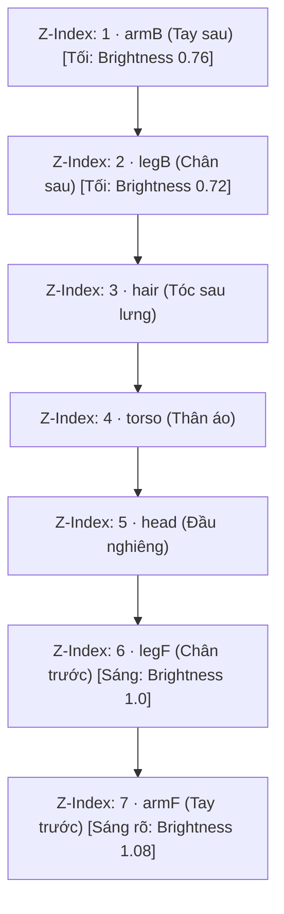

# 📜 HƯỚNG DẪN KỸ THUẬT: 2D MODULAR PUPPET ANIMATION CHO GAME CHIBI PIXEL

> **Tài liệu hướng dẫn quy trình, công thức tính toán và chuẩn hóa hoạt ảnh nhân vật cắt lớp (Cutout Puppet) cho Cổ Chân Nhân Game.**  
> *Áp dụng thành công cho Phương Nguyên (Chính diện & Góc nghiêng chiến đấu) — Dễ dàng nhân bản cho Điện Lang, Bạch Ngưng Băng và các đối thủ khác.*

---

## 1. TỔNG QUAN PHƯƠNG PHÁP

### 1.1. Bản chất kỹ thuật
Kỹ thuật **2D Modular Cutout Puppet (Rối cắt lớp 2D)** là phương pháp chia một nhân vật thành các bộ phận độc lập (`đầu`, `thân`, `tay trước/sau`, `chân trước/sau`, `tóc`) và điều khiển chuyển động của chúng thông qua **GPU Hardware Acceleration (CSS3 / Web Animations)** thay vì vẽ từng khung hình tĩnh (Frame-by-frame Sprite Sheet).

### 1.2. Bảng so sánh với các phương pháp khác

| Tiêu chí | Vẽ Frame Sprite Sheet | Spine 2D / DragonBones | 2D Modular Puppet (CSS/JS) |
| :--- | :--- | :--- | :--- |
| **Dung lượng tải** | Rất nặng (10–50 MB / nhân vật) | Trung bình (1–3 MB kèm JSON) | **Siêu nhẹ (< 500 KB / 7–8 PNG)** |
| **Công sức tạo** | Tốn hàng tuần vẽ từng frame | Phải học phần mềm gắn xương phức tạp | **Nhanh (AI tách lớp là dùng được ngay)** |
| **Tốc độ khung hình** | Bị khóa ở 8–12 FPS (giật nấc) | 60 FPS | **Mượt mà 60 FPS chuẩn GPU** |
| **Độ phụ thuộc Engine** | Không | Cần thư viện runtime Spine riêng | **Chạy Native 100% trên HTML/CSS/JS** |
| **Khả năng đổi trang bị/skin** | Phải vẽ lại toàn bộ sprite | Phải tạo skin slot | **Chỉ cần thay 1 file PNG lẻ (áo, vũ khí)** |

---

## 2. QUY CHUẨN ASSET & PIPELINE ĐỒ HỌA

### 2.1. Quy tắc Khung Canvas Đồng Bộ (Canvas Alignment)
- **Mấu chốt quan trọng nhất**: Mọi bộ phận của nhân vật **BẮT BUỘC** phải được xuất trên cùng một khung hình chữ nhật có kích thước bằng nhau (ví dụ: `1376 x 1824 px`) với nền trong suốt (PNG Transparent).
- **Lợi ích**: Khi đưa vào HTML/CSS, chỉ cần đặt `position: absolute; inset: 0;`, tất cả các mảnh sẽ tự động khớp vào đúng vị trí cơ thể mà **không cần phải căn tọa độ thủ công từng bộ phận**.

### 2.2. Danh sách Layer chuẩn

#### A. Góc Chính Diện (Front-View — 8 layers):
1. `hairL.png` & `hairR.png`: Tóc hai bên
2. `legL.png` & `legR.png`: Hai chân trái / phải
3. `torso.png`: Thân mình & áo
4. `head.png`: Đầu & khuôn mặt chính diện
5. `armL.png` & `armR.png`: Hai cánh tay

#### B. Góc Nghiêng Chiến Đấu (Side-View Profile — 7 layers):
1. `armB.png`: Cánh tay phía sau (Back Arm)
2. `legB.png`: Chân phía sau (Back Leg)
3. `hair.png`: Tóc dài xõa sau lưng
4. `torso.png`: Thân mình & vạt áo nghiêng
5. `head.png`: Đầu góc nghiêng (Profile / 3/4)
6. `legF.png`: Chân phía trước (Front Leg)
7. `armF.png`: Cánh tay phía trước (Front Arm)

---

## 3. THỨ TỰ XẾP LỚP (Z-INDEX) & TẠO CHIỀU SÂU KHÔNG GIAN

Trong góc nhìn nghiêng (Side-view), sự chênh lệch ánh sáng giữa bên trong bóng tối và bên ngoài sáng tạo nên cảm giác 3D sống động:



```css
/* Hiệu ứng phân tầng bóng tối cho các chi phía sau */
.s-arm-b { z-index: 1; filter: brightness(0.76); }
.s-leg-b { z-index: 2; filter: brightness(0.72); }
.s-hair  { z-index: 3; }
.s-torso { z-index: 4; }
.s-head  { z-index: 5; }
.s-leg-f { z-index: 6; filter: brightness(1.0); }
.s-arm-f { z-index: 7; filter: brightness(1.08); }
```

---

## 4. CÔNG THỨC ĐO ĐẠC TÂM XOAY NEO KHỚP (TRANSFORM-ORIGIN)

### 4.1. Tại sao tâm xoay lại quyết định thành bại?
Mặc định CSS xoay phần tử tại tâm `(50%, 50%)`. Nếu giữ mặc định:
- Khi vung tay, cánh tay sẽ xoay quanh... bắp tay hoặc cẳng tay, làm khớp vai bị rách toạc khỏi thân người.
- Khi xoay chân, chân sẽ xoay quanh đầu gối hoặc cổ chân, làm khớp háng bị văng ra ngoài.

$\Rightarrow$ **Bắt buộc phải đặt `transform-origin` chính xác tại điểm nối giải phẫu (Khớp vai, Khớp háng, Cổ, Cuống tóc).**

### 4.2. Bảng tọa độ Pivot chuẩn (Áp dụng cho Canvas 1376 x 1824 px):

| Bộ Phận | Vị trí Khớp Xương | Bounding Box Pixel | Tọa độ Pivot Pixel | Tỉ lệ % CSS (`X Y`) |
| :--- | :--- | :--- | :--- | :--- |
| **armF** (Tay trước) | Đỉnh chóp vai trước | `(660, 1300, 830, 1500)` | `x=740, y=1300` | `53.8% 71.3%` |
| **armB** (Tay sau) | Đỉnh chóp vai sau | `(950, 1300, 1008, 1416)` | `x=970, y=1300` | `70.5% 71.3%` |
| **legF** (Chân trước)| Đỉnh khớp háng trước | `(680, 1560, 890, 1763)` | `x=780, y=1560` | `56.7% 85.5%` |
| **legB** (Chân sau) | Đỉnh khớp háng sau | `(830, 1560, 999, 1763)` | `x=910, y=1560` | `66.1% 85.5%` |
| **hair** (Tóc dài)  | Điểm tóc mọc sau gáy | `(200, 850, 700, 1570)` | `x=450, y=850` | `32.7% 46.6%` |
| **head** (Đầu)      | Khớp đốt sống cổ | `(280, 67, 1082, 920)` | `x=600, y=900` | `43.6% 49.3%` |
| **torso** (Thân áo) | Trọng tâm rốn/thắt lưng | `(600, 900, 1008, 1620)` | `x=750, y=1250` | `54.5% 68.5%` |

### 4.3. Script Python tự động quét Bounding Box & Tính Pivot cho nhân vật mới:
```python
from PIL import Image
import os, glob

# Quét tất cả file png trong thư mục layer
files = sorted(glob.glob("assets/your_character/*.png"))
for f in files:
    im = Image.open(f)
    w, h = im.size
    bbox = im.getbbox()  # (left, upper, right, lower)
    if bbox:
        # Ví dụ tính pivot đỉnh trên cùng của bộ phận (cho vai/háng)
        pivot_x = (bbox[0] + bbox[2]) / 2.0
        pivot_y = bbox[1]
        pct_x = round(pivot_x / w * 100, 1)
        pct_y = round(pivot_y / h * 100, 1)
        print(f"{os.path.basename(f):10}: bbox={bbox} -> transform-origin: {pct_x}% {pct_y}%;")
```

---

## 5. THIẾT KẾ HOẠT ẢNH & BỘ KEYFRAMES CHUẨN

### 5.1. Hoạt ảnh Đứng Chờ (Idle - Nhịp Thở & Tóc Bay)
- **Quy tắc lệch pha**: Thân người thở nhịp 2.0s, nhưng tóc đung đưa theo chu kỳ 2.6s. Việc lệch chu kỳ ngăn nhân vật bị "đóng băng" theo kiểu robot lặp lại.
```css
/* Thân nhấp nhô nhẹ */
@keyframes animSideIdleTorso {
  0%, 100% { transform: translateY(0); }
  50% { transform: translateY(2.5px) scaleY(0.98); }
}
/* Tóc bay phất phơ ra sau */
@keyframes animSideIdleHair {
  0%   { transform: rotate(-3deg); }
  100% { transform: rotate(3deg); }
}
```

### 5.2. Hoạt ảnh Bước Đi (Side Walk - Kéo So Le 2D)
- Khi chân trước vung ra trước $+22^\circ$, chân sau đạp về sau $-22^\circ$.
- Tay đánh ngược hướng chân để giữ cân bằng động học.
- Toàn thân nhún nảy `translateY(-7px)` theo nhịp tiếp đất.
```css
@keyframes animSideWalkLegF {
  0%, 100% { transform: rotate(-22deg); }
  50%      { transform: rotate(18deg); }
}
@keyframes animSideWalkLegB {
  0%, 100% { transform: rotate(18deg); }
  50%      { transform: rotate(-22deg); }
}
@keyframes animSideWalkArmF {
  0%, 100% { transform: rotate(22deg); }
  50%      { transform: rotate(-26deg); }
}
@keyframes animSideWalkArmB {
  0%, 100% { transform: rotate(-24deg); }
  50%      { transform: rotate(20deg); }
}
```

### 5.3. Hoạt ảnh Tấn Công (Attack - Nguyên lý 3 thì)
1. **Thì 1 (Windup - 0% đến 30%)**: Co đà lùi lại `translateX(-20px)`, tay giương sau gáy `rotate(-45deg)`, tóc dạt về trước do quán tính.
2. **Thì 2 (Release - 30% đến 60%)**: Lao vọt sang phải `translateX(45px)`, vung tay chém cực mạnh `rotate(75deg)`, tóc bay giật ngược ra sau, Nguyệt Nhận (VFX) bay vút tới trước.
3. **Thì 3 (Recover - 60% đến 100%)**: Giảm tốc và thu người về thế thủ ban đầu.

```css
@keyframes animSideAttackLunge {
  0%   { transform: translateX(0); }
  30%  { transform: translateX(-20px) scale(0.96); }
  60%  { transform: translateX(45px) scale(1.05); }
  100% { transform: translateX(0); }
}
@keyframes animSideAttackSlash {
  0%   { transform: rotate(0); }
  30%  { transform: rotate(-45deg) translateY(-8px); }
  60%  { transform: rotate(75deg) translateY(4px); }
  100% { transform: rotate(0); }
}
```

### 5.4. Hoạt ảnh Dính Đòn (Hurt)
- Bị lực tác động đẩy giật lùi về sau `translateX(-35px)`, người ngửa ra sau `rotate(-8deg)`.
- Chớp đỏ toàn thân bằng bộ lọc: `filter: brightness(2) contrast(1.5) drop-shadow(0 0 20px #ef4444);`.

---

## 6. TÍCH HỢP VÀO GAME ENGINE / JAVASCRIPT

### 6.1. HTML Container
```html
<div class="chibi-puppet puppet-side is-idle" id="pyChibi">
  <div class="chibi-layer s-arm-b"></div>
  <div class="chibi-layer s-leg-b"></div>
  <div class="chibi-layer s-hair"></div>
  <div class="chibi-layer s-torso"></div>
  <div class="chibi-layer s-head"></div>
  <div class="chibi-layer s-leg-f"></div>
  <div class="chibi-layer s-arm-f"></div>
  <div class="slash-vfx"></div>
</div>
```

### 6.2. Module Điều Khiển JavaScript (ChibiController)
```javascript
const ChibiController = {
  el: document.getElementById('pyChibi'),

  play(animName, duration = 650) {
    if (!this.el) return;
    // Reset animation state
    this.el.className = 'chibi-puppet puppet-side';
    void this.el.offsetWidth; // Trigger DOM reflow ép trình duyệt nhận lại keyframe
    this.el.classList.add('is-' + animName);

    // Tự động hồi về Idle nếu là chiêu thức hoặc trúng đòn
    if (animName === 'attack' || animName === 'hurt') {
      setTimeout(() => {
        this.idle();
      }, duration);
    }
  },

  idle() { this.play('idle'); },
  walk() { this.play('walk'); },
  attack() { this.play('attack'); },
  hurt() { this.play('hurt'); }
};

// Sử dụng trong Battle Engine:
// Khi người chơi bấm chiêu Nguyệt Quang Cổ:
ChibiController.attack();

// Khi đối phương (Điện Lang) đánh trúng Phương Nguyên:
ChibiController.hurt();
```

---

## 7. CHECKLIST QUY TRÌNH KHI TẠO NHÂN VẬT MỚI (VÍ DỤ: ĐIỆN LANG / BOSS)

Khi cần làm thêm nhân vật quái thú hoặc boss mới, thực hiện đúng 5 bước sau:

1. **Bước 1**: Dùng AI (Midjourney / Stable Diffusion / Pixellab) tạo ảnh dáng nghiêng (Profile Side-view) với phong cách Pixel Chibi.
2. **Bước 2**: Tách các phần chuyển động độc lập:
   - Quái thú 4 chân: `thân`, `đầu`, `đuôi`, `2 chân trước`, `2 chân sau`.
   - Nhân vật hình người: `đầu`, `thân`, `tóc`, `2 tay`, `2 chân`.
3. **Bước 3**: Đặt tất cả các layer đã tách vào cùng 1 khung canvas Photoshop / GIMP / Python (độ phân giải bất kỳ, ví dụ `1000x1000 px`), xuất ra file PNG nền trong suốt.
4. **Bước 4**: Chạy script python ở mục `4.3` để lấy tọa độ `transform-origin` của từng khớp.
5. **Bước 5**: Sao chép bộ CSS keyframe từ Phương Nguyên, gắn class tương ứng và tận hưởng chuyển động 60 FPS mượt mà.

---
*Tài liệu được lưu trữ trực tiếp tại repository game: [HUONG_DAN_CHIBI_PUPPET_ANIMATION.md](HUONG_DAN_CHIBI_PUPPET_ANIMATION.md)*
