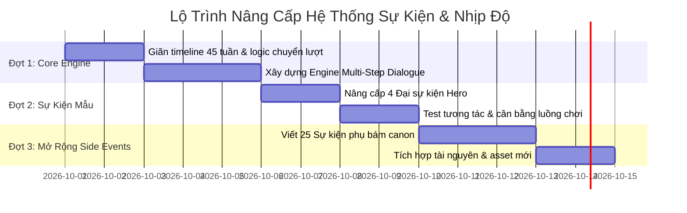

# Backlog và bàn giao các đợt cũ

Ngày gom tài liệu: 02/10/2026.

Các plan/bàn giao cũ được gộp theo lịch sử. Không triển khai lại phần đã có code chỉ vì checkbox cũ chưa được cập nhật. Ưu tiên plan hiện hành trong docs/README.md.

## Mục lục
- [KE_HOACH.md](#source-ke-hoach-md)
- [IMPLEMENTATION_PLAN.md](#source-implementation-plan-md)
- [BAN_GIAO.md](#source-ban-giao-md)
- [BAN_GIAO_2.md](#source-ban-giao-2-md)
- [TRIEN_KHAI.md](#source-trien-khai-md)
- [KE_HOACH_CHIEN_DAU.md](#source-ke-hoach-chien-dau-md)
- [KE_HOACH_CHI_TIET_NANG_CAP.md](#source-ke-hoach-chi-tiet-nang-cap-md)
- [KE_HOACH_DI_LECH.md](#source-ke-hoach-di-lech-md)
- [KE_HOACH_NANG_CAP_SU_KIEN.md](#source-ke-hoach-nang-cap-su-kien-md)
- [KE_HOACH_NHANH_TRUYEN.md](#source-ke-hoach-nhanh-truyen-md)
- [KE_HOACH_NHIP_TRUYEN.md](#source-ke-hoach-nhip-truyen-md)
- [KE_HOACH_Q1_CHUAN.md](#source-ke-hoach-q1-chuan-md)
- [KE_HOACH_Q1_IMPL.md](#source-ke-hoach-q1-impl-md)
- [KE_HOACH_Q2.md](#source-ke-hoach-q2-md)

---

<a id="source-ke-hoach-md"></a>

## KE_HOACH.md

**Trạng thái:** Chưa xác nhận hoàn tất toàn bộ; có phần đã làm. Giữ số đo, checkbox và ghi chú cũ như snapshot, không coi là trạng thái runtime hôm nay.

<a id="source-ke-hoach-md-thanh-mao-sơn-ký--kế-hoạch-cập-nhật"></a>
## Thanh Mao Sơn Ký · Kế hoạch cập nhật

Game tu luyện theo lượt lấy bối cảnh *Cổ Chân Nhân* quyển một (Thanh Mao Sơn).
Link chơi: https://claude.ai/artifact/JCxtbEtAKCESDM5jjCa6xM

<a id="source-ke-hoach-md-nguyên-tắc-thiết-kế"></a>
### Nguyên tắc thiết kế

1. **Cốt truyện được phép lệch nguyên tác thoải mái. Cơ chế thì phải theo nguyên tác:** nuôi cổ, chân nguyên, không khiếu, cảnh giới, luyện cổ thành hoặc bại, sát chiêu, Xuân Thu Thiền.
2. **Không thêm cơ chế nguyên tác không có.** Ví dụ phẩm chất cổ hạ/trung/thượng đã bị loại.
3. **Mỗi lần trùng sinh phải khác nhau.** Mệnh cách, thiên cơ, cánh bướm, bí tàng, chợ và sự kiện đều ngẫu nhiên lại mỗi kiếp.
4. **Chết là một phần của vòng chơi.** Mỗi cái chết để lại ký ức giúp kiếp sau.
5. **Mọi thay đổi độ khó phải kiểm tra bằng script tự chơi** (`node tools/sim.cjs 100 6`) trước khi đăng.
6. **Ảnh tải từ mạng (fan art, truyện tranh, phim) chỉ dùng trên máy**, để trong `assets/local/`, không đăng lên link.

---

<a id="source-ke-hoach-md-trạng-thái-hiện-tại-bản-13"></a>
### Trạng thái hiện tại (bản 13)

| Hệ thống | Đã có |
|---|---|
| Dòng thời gian | 27 tuần, 18 mốc nguyên tác, lịch có thể lệch theo thiên cơ |
| Sự kiện | Khoảng 90 sự kiện: mốc nguyên tác, 7 tuyến NPC, ngẫu nhiên theo nơi chốn, tử kiếp, 6 loại bí tàng |
| Chiến đấu | Đấu trường PixiJS: ý đồ của địch, hồi chiêu, thế thủ phản kích, 9 loại chiêu riêng của địch, thủ lĩnh giai đoạn 2, cuồng nộ, địch tinh anh, 32 loại địch, rơi cổ theo loại địch |
| Cổ trùng | 30 loại (thêm choáng, giảm lực địch), 8 công thức luyện, 9 sát chiêu phải tự ngộ ra, cổ đói thì yếu đi và tốn thêm chân nguyên |
| Trùng sinh | Xuân Thu Thiền, 22 ký ức mang qua các kiếp, 15 mệnh cách, 14 thiên cơ, 7 mốc có biến thể cánh bướm, bí tàng ngẫu nhiên |
| Minigame | Luyện cổ, mổ thạch (4 loại đá, tối đa 2 khối mỗi tuần), đột phá bích khiếu (đều có nút làm nhanh) |
| Giao diện | Màn mở đầu, bản đồ sống, mực loang khi chuyển cảnh, bảng nhân vật chia tab, xuất/nhập save |
| Tranh | Sơn thủy và chân dung cổ từ Met Museum (CC0); chân dung thú và cổ trùng từ Canva AI |
| Cân bằng | Khoảng 33% thắng trong 6 kiếp, kiếp đầu khoảng 2–5% (người chơi máy, 300 chiến dịch) |

---

<a id="source-ke-hoach-md-lộ-trình-tiếp-theo-từ-30092026"></a>
### Lộ trình tiếp theo (từ 30/09/2026)

> Lộ trình này thay cho các mục Đợt 5, Đợt 6, Đợt 7 và Kỹ thuật ở phía dưới. Các mục cũ giữ lại chỉ để tham khảo.

<a id="source-ke-hoach-md-vấn-đề-gốc"></a>
#### Vấn đề gốc

Đây là game vòng lặp thời gian, nhưng vòng lặp đang là điểm yếu chứ chưa phải điểm mạnh.

- **Người chơi phải chơi lại phần đầu quá nhiều.** Theo mô phỏng, trung bình chết ở tuần 13/27, kiếp đầu thắng khoảng 3%. Tháng 1–4 bị chơi lại 4–5 lần với cùng các lựa chọn.
- **Ký ức chủ yếu là cộng chỉ số** (+25% sát thương lên sói, +35% mổ đá...). Game vòng lặp hay làm ngược lại: mỗi lần chết cho biết thêm một điều, và điều đó mở ra việc mới để làm. Với Phương Nguyên, cảm giác đúng là "lần này ta biết hắn sẽ đi đường nào, nên ta phục sẵn".
- **Đầu tư đồ họa đang lệch chỗ.** Người chơi dành phần lớn thời gian đọc sự kiện và chọn trên bản đồ, nhưng thẻ sự kiện hiện chỉ là tranh nền và chữ.

Hiện trạng số liệu: 38 cổ trùng, 98 sự kiện, 33 loại địch. 22 cổ chưa gắn với sự kiện cốt truyện nào. 12/17 NPC chưa có chân dung. Đấu trường mới gắn xương cho 2 tranh (Phương Nguyên, Điện Lang).

<a id="source-ke-hoach-md-cách-làm"></a>
#### Cách làm

- Mỗi giai đoạn chia thành bước nhỏ. Mỗi bước kết thúc bằng một bản chơi được trên link để test trên điện thoại.
- Mỗi bước chỉ coi là xong khi: dữ liệu không tham chiếu tới cổ, địch, sự kiện không tồn tại; `node tools/sim.cjs 300 6` không có ca kẹt vòng lặp; chạy thử trong trình duyệt không có lỗi JS.
- Cân bằng đo bằng số liệu người chơi cảm nhận được: số kiếp tới lần thắng đầu, số tuần phải chơi lại. Tỉ lệ thắng của người chơi máy (mục tiêu 15–35%) chỉ là số phụ.

<a id="source-ke-hoach-md-luật-xuân-thu-thiền-theo-nguyên-tác-đã-làm"></a>
#### Luật Xuân Thu Thiền (theo nguyên tác, đã làm)
- Thiền cần 12 tuần để hồi phục. Đầu game Thiền đang kiệt sức (0%).
- Chết khi Thiền đã hồi phục: quang âm quay ngược 3 tuần. Mất những gì có được trong 3 tuần đó, ký ức giữ lại, Thiền kiệt sức lại.
- Chết khi Thiền chưa hồi phục: chết thật, chơi lại từ lễ khai khiếu. Ký ức vẫn giữ cho lần chơi sau (có thể đổi thành mất sạch nếu muốn khó hơn).
- Nút tự kích hoạt Thiền chỉ dùng được khi Thiền đã hồi phục, cũng chỉ quay ngược 3 tuần.
- Code: `js/cicada.js` (hằng số `CICADA_WEEKS`, `REWIND_WEEKS`). Mỗi đầu tuần lưu ảnh chụp trạng thái trong `S.snaps` (tối đa 4).
- Độ khó trận đánh tăng từ 1,15 lên 1,25 (`DIFF` trong `js/data.js`) để bù cho việc chết không còn là chơi lại từ đầu. Mô phỏng 250 chiến dịch: thắng 32,8% trong 6 lần chơi, lần đầu 4%.
- Tua nhanh bằng ký ức giờ dùng sau cái chết thật, lúc phải chơi lại từ đầu.

<a id="source-ke-hoach-md-giai-đoạn-1-sửa-vòng-lặp-ưu-tiên-cao-nhất"></a>
#### Giai đoạn 1: Sửa vòng lặp (ưu tiên cao nhất)
- [x] **1.1 Tua nhanh bằng ký ức.** (Đã làm: `js/ff.js`, kiểm tra bằng `node tools/ff_test.cjs 120`.) Đầu kiếp mới, cho chọn "đi lại con đường cũ": game tự áp lại các lựa chọn kiếp trước cho tới khi gặp điều khác đi (thiên cơ mới, cánh bướm, sự kiện chưa thấy). Người chơi dừng lại đúng chỗ muốn đổi.
- [ ] **1.2 Sổ ký ức** thay cho tab Ký ức hiện tại. Tự ghi lại những gì đã thấy: sự kiện nào xảy ra tuần nào, NPC hay ở đâu, bí mật nào đã biết, chết vì ai và ở đâu.
- [ ] **1.3 Ký ức mở lựa chọn mới thay vì cộng chỉ số.** Ví dụ: biết đường Giả Kim Sinh hay đi thì phục kích trước; biết ngày Bạch gia tập kích thì báo trước hoặc bán tin; biết lối vào động Hoa Tửu thì vào ngay tuần đầu. Lựa chọn mở nhờ ký ức có nhãn riêng.
- [ ] **1.4 Tâm nguyện mỗi kiếp.** Đầu kiếp chọn một mục tiêu cụ thể (lấy truyền thừa Hoa Tửu trước tháng 5, cứu Thanh Thư, giết Giả Kim Sinh không để lộ). Làm được thì ghi thêm ký ức. Mỗi kiếp có hướng đi rõ, không chỉ là sống lâu hơn kiếp trước.

<a id="source-ke-hoach-md-giai-đoạn-2-chiến-đấu-có-chiều-sâu-mà-không-kéo-dài"></a>
#### Giai đoạn 2: Chiến đấu có chiều sâu mà không kéo dài
- [ ] **2.1 Đánh nhanh cho trận dễ.** Trận với thú rừng, sơn tặc cho tự đánh bằng AI có sẵn trong script mô phỏng. Người chơi chỉ tự đánh trận khó và trùm.
- [ ] **2.2 Mỗi loại địch cần một cách đối phó riêng.** Giáp dày cần cổ xuyên giáp, Bạch gia phong ấn cổ thì cần cổ dự phòng, trùm hồi máu cần chảy máu. 38 cổ có vai trò khác nhau thay vì chỉ khác chỉ số, và việc chọn nuôi cổ nào có ý nghĩa.
- [ ] **2.3 Cân lại độ khó** theo số kiếp tới lần thắng đầu và số tuần phải chơi lại. Xem lại trận Giả Kim Sinh và hộ vệ Giả gia (hai nguyên nhân chết nhiều nhất).

<a id="source-ke-hoach-md-giai-đoạn-3-trình-bày-ở-chỗ-người-chơi-nhìn-nhiều-nhất"></a>
#### Giai đoạn 3: Trình bày ở chỗ người chơi nhìn nhiều nhất
- [ ] **3.1 Sự kiện thành cảnh hội thoại:** chân dung người nói (tranh sống, chớp mắt, đổi nét mặt), chữ hiện dần. Chân dung NPC chính vẽ bằng Canva AI theo thiết kế riêng, cùng phong cách thủy mặc với tranh hiện có.
- [ ] **3.2 Bản đồ sống:** ngày đêm theo tuần, thời tiết theo thiên cơ, trăng máu trước lang triều.
- [ ] **3.3 Cảnh chết và trùng sinh:** con ve vàng vỗ cánh, thời gian tua ngược. Đây là khoảnh khắc lặp lại nhiều nhất trong game.
- [ ] **3.4 Bố cục điện thoại** làm lại cho gọn.

<a id="source-ke-hoach-md-giai-đoạn-4-đấu-trường"></a>
#### Giai đoạn 4: Đấu trường
- [ ] Gắn xương cho các trùm: Bạch Ngưng Băng, Lôi Quan Lang Vương, Hắc Hùng, gia lão, Huyết Thủ ma tu.
- [ ] Hiệu ứng riêng theo nhóm cổ: nguyệt, băng, huyết, phong, kim, hộ thể.
- [ ] Cảnh cắt khi tung sát chiêu; địch chết tan thành mực.

<a id="source-ke-hoach-md-giai-đoạn-5-nội-dung"></a>
#### Giai đoạn 5: Nội dung
- [ ] Gắn 22 cổ chưa có cốt truyện vào sự kiện theo đúng chủ nhân trong nguyên tác (Hoa Tửu, Nhất Đại, Thanh Thư, Xích Sơn, Bạch gia).
- [ ] Thêm nhánh kết cục phụ thuộc vào những gì người chơi biết và đã làm qua nhiều kiếp.

<a id="source-ke-hoach-md-làm-xen-kẽ"></a>
#### Làm xen kẽ
- [ ] Kiểm tra dữ liệu và mô phỏng tự động sau mỗi lần sửa.
- [ ] Đánh số phiên bản save và viết hàm chuyển đổi khi đổi cấu trúc dữ liệu.
- [ ] Gỡ `assets/local/_scraped/` khỏi git và thêm vào `.gitignore`.

<a id="source-ke-hoach-md-hoãn-hoặc-bỏ"></a>
#### Hoãn hoặc bỏ
- **Quyển hai:** hoãn tới khi vòng lặp quyển một thật sự hay.
- **Minigame bắt cổ hoang:** bỏ.
- **Thành tựu:** bỏ, sổ ký ức làm tốt việc này hơn.
- **Chế độ khó:** để sau cùng.

---

<a id="source-ke-hoach-md-việc-đang-dở-làm-ngay"></a>
### Việc đang dở (làm ngay)

<a id="source-ke-hoach-md-a-ảnh-cá-nhân-chỉ-trên-máy"></a>
#### A. Ảnh cá nhân (chỉ trên máy)
- [x] Tạo `assets/local/` và file `assets/local/manifest.js`, ánh xạ ảnh gốc sang ảnh cá nhân, ví dụ `'art/p_hero.jpg' → 'local/art/p_hero.png'`.
- [x] Thêm hàm `asset(path)` trong `data.js`. Mọi chỗ dựng đường dẫn ảnh đều đi qua hàm này: `guImgUrl`, `loadTex` trong `battle.js`, `eventArt`, chân dung NPC, màn mở đầu, avatar trên thanh trạng thái.
- [x] `index.html` nạp `assets/local/manifest.js`. Trên link công khai file này không tồn tại, nên game tự dùng tranh mặc định.
- [x] Chọn và cắt những ảnh đã tải dùng được:
  - `fang_yuan_cn_1.png` (tranh thủy mặc, sạch) → chân dung Phương Nguyên.
  - `fang_yuan_cn_2.png` (áo đen, sạch) → phương án dự phòng (`p_hero_black.png`).
  - `fang_yuan_cn_1.jpg` (tranh truyện tranh) → cắt bỏ chữ ở cạnh trái và chân ảnh (`p_hero_manhua.jpg`).
  - `chun_qiu_chan_cn_1.jpg` → cắt riêng con ve, bỏ phần giao diện game (`local/gu/g_xuanthu.jpg`).
- [x] Bỏ các ảnh sai nhân vật hoặc sai truyện: `bai_ning_bing_cn_1`, cả 3 ảnh `tie_xue_leng_*` (là bìa *Thiết Huyết Thần Bổ*), `chun_qiu_chan_cn_3`, `shang_xin_ci_cn_1`.
- [x] Chuyển các file script đã ghi đè vào `assets/art` và `assets/gu` sang `assets/local/_scraped/`. Khôi phục `assets/gu/g_xuanthu.jpg` gốc từ bản đã đăng.
- [x] Ghi hướng dẫn chạy trên máy trong [README.md](../PROJECT_README.md): `cd ~/cochannhan_game && python3 -m http.server 8000`, rồi mở `http://localhost:8000`. Không mở trực tiếp file vì WebGL chặn ảnh từ `file://`.

<a id="source-ke-hoach-md-b-script-thu-thập-asset-hợp-lệ"></a>
#### B. Script thu thập asset hợp lệ
- [x] Viết `scripts/fetch_openaccess.cjs`, lấy từ các kho mở CC0:
  - Met Museum (`collectionapi.metmuseum.org`),
  - Cleveland Museum of Art (`openaccess-api.clevelandart.org`, tham số `cc0=1`).
- [x] Cấu hình theo chủ đề: tranh **thảo trùng** (ve sầu, bọ, dế, bướm) cho cổ trùng; chân dung (đạo sĩ, thư sinh, võ tướng) cho NPC; sơn thủy cho cảnh nền; thú (hổ, ngựa, chim ưng) cho kẻ địch.
- [x] Lưu vào `assets/openaccess/<chủ đề>/` kèm `manifest.json` ghi tên tranh, họa sĩ, năm, link gốc, giấy phép.
- [x] Không tự ghi đè asset của game. Khâu chọn ảnh làm bằng tay: ghép bảng xem trước rồi chọn.
- [ ] Thay tranh cổ trùng Canva bằng tranh thảo trùng cổ đã cắt và tách nền tối.
- [x] Hai script cũ (`fetch_pinterest_assets.cjs`, `fetch_chinese_assets.cjs`) chỉ dùng cho `assets/local/`. Sửa `mainDest` để không ghi đè file của game.

---

<a id="source-ke-hoach-md-bản-13-mở-rộng-nội-dung-đã-xong"></a>
### Bản 13: Mở rộng nội dung (đã xong)

Nguyên tắc: nhân vật và địa điểm lấy từ quyển một (Thanh Mao Sơn); sự kiện ngẫu nhiên viết tự do nhưng không lệch bối cảnh.

- [x] **Cổ trùng mới:** Thủy Tráo Cổ, Sinh Cơ Diệp, Đằng Mạn Cổ (choáng), Kim Châm Cổ (xuyên giáp), Băng Tiễn Cổ (giảm lực địch), Lang Hào Cổ, Thanh Ti Cổ, Tửu Nang Hoa, Bạch Ngân Xá Lợi Cổ.
- [x] **3 công thức luyện, 4 sát chiêu, 1 loại đá** mới (Hàn Ngọc Cổ Thạch).
- [x] **Địch mới:** Trúc Diệp Thanh, Kim Tiền Báo, bầy khỉ hầu nhi tửu, Hùng Lâm, Độc Nhãn sơn tặc vương, Bạch Mao Hùng Vương, sát thủ của Trầm Thúy, Phương Chính, Mạc Nhan. Địch rơi cổ theo loại (Bạch gia rơi Băng Tiễn, sói rơi Lang Hào...).
- [x] **Hoàn thiện tuyến NPC:** Phương Chính giai đoạn 5 (đồng minh hoặc làm chứng chống lại ngươi), Thanh Thư nhánh u uất, Bạch Ngưng Băng giai đoạn 4 (liên thủ trong trận cuối), Mạc gia và Xích gia theo kiếp (`xich_mac_route`), cậu mợ và Trầm Thúy theo `caumo_route` (tai mắt hoặc thuê sát thủ).
- [x] **Tuyến mới:** Thiết Nhược Nam, Hùng Lâm, Mạc Nhan. NPC mới: Mạc Nhan, Xích Sơn, Hùng Lâm, lão thợ săn.
- [x] **15 sự kiện ngẫu nhiên** chia theo học đường, sơn trại, núi, nhiệm vụ; 2 bí tàng mới.
- [x] **5 mệnh cách, 4 thiên cơ, 6 ký ức, 1 thương tích, 1 kết cục** (`bai_dong`: cùng Bạch Ngưng Băng xuống núi).
- [x] **Sửa quầy mổ thạch:** người thu mua từng trả tới ~158% giá gốc chỉ sau một nhát cắt, nên mua rồi bán lại là lãi chắc và lặp vô hạn. Giờ giá thu mua luôn dưới giá gốc (tối đa 90%), quầy chỉ bán 2 khối mỗi tuần, ngộ tính và ký ức giúp chọn đá tốt hơn. Kỳ vọng khi mổ hết: người mới −3% đến −15%, người có nhãn lực +2% đến +12%.
- [x] **Sửa lỗi:** cổ đói tốn thêm chân nguyên nhưng nút vẫn sáng, bấm không có tác dụng; nguyên thạch có thể âm làm kẹt bế quan (nguồn "kẹt vòng lặp" trong script tự chơi).

Việc tiếp theo cho nội dung: tranh cho cổ trùng và địch mới (đang dùng chữ thư pháp và tranh có sẵn), chân dung Mạc Nhan và Hùng Lâm.

---

<a id="source-ke-hoach-md-đợt-4-tuyến-truyện-npc"></a>
### Đợt 4: Tuyến truyện NPC

Mỗi tuyến 4–6 sự kiện nối nhau. Mỗi kiếp bốc ngẫu nhiên hướng rẽ.

| NPC | Nội dung | Ảnh hưởng |
|---|---|---|
| **Phương Chính** | Tiến bộ theo tháng (nhanh hơn khi có thiên cơ *Phương Chính khai ngộ*). Có sự kiện so tài, nhờ giúp đỡ, và bị gia tộc lợi dụng để kiềm chế ngươi. | Quan hệ cao: đồng minh trong lang triều. Quan hệ thấp: đứng về phía gia lão khi thẩm vấn. |
| **Cổ Nguyệt Thanh Thư** | Tiểu tổ, nhiệm vụ chung. Sự kiện hắn gặp nạn: cứu hay bỏ mặc. | Mở kết cục Chính đạo, giảm hiềm nghi. |
| **Bạch Ngưng Băng** | 3–4 lần chạm mặt: dò xét, giao đấu, trò chuyện về Bắc Minh Băng Phách Thể, cùng liên thủ. | Quyết định trận cuối: đồng hành, làm ngơ, hay là kẻ thù. |
| **Mạc gia và Xích gia** | Tranh ghế gia lão. Người chơi đứng về một phe, làm gián điệp hoặc cho hai bên cắn xé nhau. | Thay đổi trợ cấp, số người đứng sau ngươi, và ai chủ trì thẩm vấn. |
| **Cậu mợ, Trầm Thúy** | Tiếp nối chuyện gia sản: cậu mợ phản đòn, Trầm Thúy thành tai mắt hoặc kẻ phản bội. | Thu nhập tửu lâu, tin đồn. |

Tiêu chí hoàn thành:
- [x] Mỗi NPC có ít nhất 4 sự kiện và 2 hướng rẽ ngẫu nhiên theo kiếp.
- [x] Tab Nhân vật hiện tiến độ của từng tuyến.
- [x] Thêm ít nhất 2 kết cục mới gắn với tuyến NPC (`thanhthu_chinh`, `song_hung`).
- [x] Chạy script tự chơi: tỉ lệ thắng vẫn trong khoảng 15–35% (đo được ~31–40% tùy nhánh).

---

<a id="source-ke-hoach-md-đợt-5-meta-và-chơi-lại"></a>
### Đợt 5: Meta và chơi lại

- [ ] **Cây ký ức:** mỗi lần chết được điểm "quang âm". Dùng điểm mở nhánh:
  - *Biết trước*: gợi ý cánh bướm rõ hơn.
  - *Đạo tâm*: tu luyện nhanh hơn.
  - *Nhãn lực*: thấy tỉ lệ chính xác sớm hơn.
  - *Tàng thạch*: khởi đầu có thêm nguyên thạch.

  Ký ức cố định hiện có vẫn giữ nguyên.
- [ ] **Chế độ khó:** Cổ sư (hiện tại), Ma đầu (tài nguyên ít, địch mạnh hơn 25%), Nguyên tác (Thiền phải hồi phục, chết lúc Thiền chưa hồi phục là hết game).
- [ ] **Thành tựu** và **bảng tổng kết kiếp**: số lần chết, độ lệch nguyên tác, cổ thu được, tuần đạt từng cảnh giới.
- [ ] **Mệnh cách hiếm** mở khóa bằng thành tựu.
- [ ] Minigame **bắt cổ hoang**: kéo co ý niệm, thay cho việc thử chỉ số.

---

<a id="source-ke-hoach-md-đợt-6-trình-bày"></a>
### Đợt 6: Trình bày

- [ ] **Âm nhạc nền** theo cảnh (sơn trại, núi, chiến đấu, lang triều, trận cuối), dùng nhạc phạm vi công cộng hoặc tự tổng hợp bằng Web Audio.
- [ ] **Chân dung còn thiếu:** Phương Chính, Thanh Thư, Trầm Thúy, Giả Kim Sinh, Mạc Bắc (tranh cổ CC0, hoặc ảnh cá nhân trong `assets/local/`).
- [ ] **Tranh cổ trùng mới** từ tranh thảo trùng cổ (xem mục B).
- [ ] **Bộ khung giao diện** (giấy dó, khung chạm mây, dải lụa, con dấu son) nếu Canva hết giới hạn, hoặc lấy họa tiết từ đồ vật cổ CC0 (gương đồng, gấm, gốm).
- [ ] **Làm kỹ bản điện thoại:** bố cục một cột, thanh trạng thái gọn, vuốt để đổi tab, nút to hơn.

---

<a id="source-ke-hoach-md-đợt-7-quyển-hai-thương-gia-thành"></a>
### Đợt 7: Quyển hai, Thương gia thành

Chỉ làm khi quyển một đã ổn định và hay.

- [ ] Đường xuống núi cùng hoặc không cùng Bạch Ngưng Băng, theo kết cục quyển một.
- [ ] Thương gia thành: đổ thạch đúng nguyên tác (nâng cấp từ minigame mổ thạch), chợ lớn, đấu trường.
- [ ] Thiết gia truy sát (Thiết Huyết Lãnh).
- [ ] Tam Vương truyền thừa.
- [ ] Tứ chuyển, Ngũ chuyển; cổ và sát chiêu mới.

---

<a id="source-ke-hoach-md-kỹ-thuật"></a>
### Kỹ thuật

- [ ] Tách `sim.cjs` thành bộ kiểm tra tự động: chạy 200 chiến dịch, báo lỗi nếu tỉ lệ thắng ra ngoài 15–35% hoặc có kiếp bị kẹt vòng lặp.
- [ ] Đánh số phiên bản save và viết hàm chuyển đổi khi đổi cấu trúc dữ liệu.
- [ ] Dọn CSS trùng lặp trong `index.html` (nhiều đợt chồng lên nhau), tách ra `css/`.
- [ ] Làm rõ thư mục `thien_ngoai_chi_ma/`: đây có vẻ là một dự án khác dùng chung `assets/` qua symlink. Cần giữ riêng hay gộp vào?

---

<a id="source-ke-hoach-md-cần-bạn-xác-nhận-về-nguyên-tác"></a>
### Cần bạn xác nhận về nguyên tác

1. Thứ tự các mốc sau lang triều: Bạch Ngưng Băng, huyết động, Bạch gia tập kích.
2. Phần thưởng trong động phủ Hoa Tửu Hành Giả.
3. Nguồn gốc Huyết Nguyệt Cổ và Huyết Lô Cổ.
4. Diễn biến thật của Trầm Thúy, Thanh Thư, và vụ Giả Kim Sinh.
5. Tên nhân vật theo bản bạn đọc (convert hay bản dịch).

---

<a id="source-ke-hoach-md-đã-bổ-sung-cổ-trùng-từ-thư-viện-anime-chính-văn-cổ-chân-nhân"></a>
### Đã bổ sung Cổ Trùng từ Thư Viện Anime (Chính văn Cổ Chân Nhân)
- **16 Cổ trùng mới chuẩn nguyên tác**:
  - Nhất Chuyển: `Tiểu Quang Cổ` (phụ trợ nguyệt quang), `Toàn Phong Cổ` (phong đạo), `Đồng Bì Cổ` (kim/thổ cận chiến), `Thanh Ti Cổ` (mộc hộ thể).
  - Nhị Chuyển: `Nguyệt Toàn Cổ` (Thanh Thư - đường cong xuyên giáp), `Nguyệt Ngân Cổ` (bắn xa 20m), `Nguyệt Nghê Thường` (khăn lụa hộ thể), `Băng Đao Cổ` (Bạch Ngưng Băng - hàn khí làm chậm), `Thủy Tráo Cổ` (màn nước tiêu hao thấp), `Ẩn Lân Cổ` (Bạch gia trinh sát - tàng hình né phục kích), `Hỏa Lô Cổ` (Xích Sơn - chống lạnh phản hỏa), `Cửu Diệp Sinh Cơ Thảo` (Hoa Tửu - sinh Sinh Cơ Diệp linh dược mỗi tuần).
  - Tam Chuyển: `Cứ Xỉ Kim Ngô` (Hoa Tửu - rết răng cưa gây Chảy Máu), `Mộc Mị Cổ` (Cổ Nguyệt tộc cấm cổ - thụ tinh hộ thể), `Đao Sí Huyết Bức Cổ` (Nhất Đại Cổ Nguyệt - hút máu lifesteal), `Bạch Ngân Xá Lợi Cổ` (tiêu hao tăng 1 tiểu cảnh giới Tam chuyển).
- **8 Công thức hợp luyện mới**: Nguyệt Toàn, Nguyệt Ngân, Nguyệt Nghê Thường, Băng Đao, Thủy Tráo, Ẩn Lân, Cứ Xỉ Kim Ngô, Mộc Mị.
- **4 Sát chiêu combo mới**: Nguyệt Toàn Xuyên Kích, Băng Lam Thủy Thuẫn, Kim Ngô Phệ Thể, Huyết Bức Thực Khí.
- **Tương tác**: Cổ Đồ Giám tự động cập nhật, bế quan ngộ sát chiêu, chợ học đường & thương đội bày bán, mổ thạch Giả gia có xác suất xuất hiện cổ sống.

---

<a id="source-implementation-plan-md"></a>

## IMPLEMENTATION_PLAN.md

**Trạng thái:** Chưa xác nhận hoàn tất toàn bộ; có phần đã làm. Giữ số đo, checkbox và ghi chú cũ như snapshot, không coi là trạng thái runtime hôm nay.

<a id="source-implementation-plan-md-implementation-plan-nâng-cao-gameplay-bản-đã-review"></a>
## Implementation Plan: nâng cao gameplay (bản đã review)

> **Review 30/09/2026, đối chiếu code `main` tại `3b1ed7a`.** Mỗi mục có **Kết luận** (Giữ / Sửa / Bỏ) và **Vì sao**. Code mẫu đã sửa theo tên hàm và biến có thật trong repo; phần nào code gốc sai thì ghi rõ sai ở đâu.

---

<a id="source-implementation-plan-md-0-tóm-tắt"></a>
### 0. Tóm tắt

| # | Mục | Kết luận | Lý do chính |
|---|---|---|---|
| 1.1 | Giảm phạt đột phá thất bại | **Sửa** | Code gốc sửa nhầm chỗ: `levelUp()` chỉ là đường dự phòng; đột phá thật ở `breakEnd()` trong `minigame.js` |
| 1.2 | Tăng lên 4 việc mỗi tuần | **Bỏ** | Anh đã chốt 3 việc; độ khó 43,5% đã cân theo 3 |
| 1.3 | Giữ 1 cổ khi chết | **Bỏ** | Trái luật đã chốt: chết thật là mất hết (`d597273`) |
| 1.4 | Hệ thống "Mệnh lệnh" | **Sửa** | Dời vào Nhiệm vụ đường (nơi có trong truyện); bỏ thưởng ký ức ngẫu nhiên |
| 2.1 | Chỉnh tỉ lệ ý đồ địch | **Giữ, mức nhẹ** | Hợp lý, nhưng phải đo bằng sim |
| 2.2 | Ý đồ mới buff / debuff / heal | **Sửa** | Game đã có sẵn cơ chế tương đương (`sk`, `atkBuff`, `regen`, `suppress`); dùng lại thay vì tạo mới |
| 2.3 | Giảm hồi chiêu một nửa, nút "Tẩy chiêu" | **Bỏ** | Phá thiết kế chọn đòn; "Tẩy chiêu" là hệ thống bịa |
| 3.1 | Hiện ước tính trong minigame | **Sửa** | Tên biến sai; mổ đá đã hiện tỉ lệ nhìn đúng rồi |
| 3.2 | Phím tắt | **Sửa** | Sai class nút; Space mà bấm lựa chọn đầu tiên thì rất dễ chọn nhầm |
| 3.3 | Kho sự kiện cạn thì phát thưởng dự phòng | **Bỏ** | Làm mất trận đánh trên núi, rải nguyên thạch miễn phí; kho đã thêm 36 kỳ ngộ |
| 3.4 | Biến cố ngẫu nhiên khi luyện cổ | **Giữ, ưu tiên thấp** | Được, sửa tên biến và cập nhật bot |
| 4.1 | Ký ức "tiêu cực" | **Bỏ** | Ký ức là hiểu biết, không phải buff; các trường dùng trong code gốc không tồn tại |
| 4.2 | Thiên cơ tích cực | **Sửa** | `WORLD` đọc bằng `W(k)`, không có `ap()`; đã có `linhmach` +15% tu luyện |
| 4.3 | Cân lại cổ | **Phần lớn bỏ** | Số liệu trong bản gốc sai (Cường Thủ vốn choáng 1 lượt); Âm Dương là cổ Quyển 2 |
| 4.4 | Cân lại địch | **Bỏ** | Đám học trò đang là kẻ giết nhiều thứ hai; gia lão và ma tu đã có `noflee` |
| – | Mục tiêu tỉ lệ thắng 25–40% | **Sửa** | Anh đã chốt 40–45% |

---

<a id="source-implementation-plan-md-giai-đoạn-1-giữ-chân-người-chơi"></a>
### Giai đoạn 1: giữ chân người chơi

<a id="source-implementation-plan-md-11-giảm-phạt-đột-phá-thất-bại--sửa"></a>
#### 1.1 Giảm phạt đột phá thất bại · Sửa

**Vì sao sửa:** Bản gốc sửa `levelUp()` trong `engine.js`. Nhánh đó chỉ chạy khi không có minigame (`if(typeof startBreak==='function'){...startBreak();break}`), còn trong game thật luôn có `startBreak`. Phạt thật nằm ở `js/minigame.js`, hàm `breakEnd()`. Phạt hiện tại là mất 50% tu vi và 15% khí huyết, không phải 30% khí huyết như bản gốc ghi.

**File:** `js/minigame.js`, `breakEnd(ok)`, nhánh thất bại.

```js
// Trước
S.prog=Math.floor(need()*.5);S.hp=Math.max(1,S.hp-Math.round(maxHp()*.15));
// Sau: giữ 70% tu vi; mỗi lần thất bại liên tiếp cộng dồn kinh nghiệm xung kích (+5%, tối đa +15%)
S.prog=Math.floor(need()*.7);S.hp=Math.max(1,S.hp-Math.round(maxHp()*.15));
S.breakFail=Math.min(3,(S.breakFail||0)+1);
log(`Xung kích thất bại. Lần sau đã quen đường, bích khiếu dễ phá hơn (+${S.breakFail*5}%).`,'sys');
```
- Nhánh thành công: `S.breakFail=0;`
- Trong minigame đột phá, cộng `(S.breakFail||0)*.05` vào tỉ lệ hoặc sức phá.
- Làm thêm y hệt ở `levelUp()` cho đồng bộ.
- `S.breakFail` nằm trong `S`, nên chết thật là mất. Đúng luật.

**Vì sao đổi cách cộng:** Bản gốc cho +15% ngay khi đủ 3 lần thất bại. Như vậy có lợi khi cố tình thất bại để "nạp" tỉ lệ. Cộng dồn từng lần thì mượt hơn và không ai lợi dụng được.

<a id="source-implementation-plan-md-12-tăng-lên-4-việc-mỗi-tuần--bỏ"></a>
#### 1.2 Tăng lên 4 việc mỗi tuần · Bỏ

**Vì sao bỏ:**
- Anh đã chốt 3 việc mỗi tuần, cho cả Quyển 1 lẫn Quyển 2.
- `DIFF` 2.52 và đường cong độ khó theo tuần được cân cho 3 việc (bot thắng 43,5%). Lên 4 việc thì phải cân lại từ đầu.
- Khi gộp lang triều (kế hoạch nâng cấp, PR-4), số tuần trống sẽ tăng thêm. Đó mới là cách giãn nhịp đúng.

<a id="source-implementation-plan-md-13-giữ-1-cổ-khi-chết--bỏ"></a>
#### 1.3 Giữ 1 cổ khi chết · Bỏ

**Vì sao bỏ:**
- Anh đã chốt: chết khi Thiền chưa hồi là chết thật, mất hết, kể cả ký ức (`d597273`).
- Mang cổ qua kiếp thì trái trực tiếp luật đó. Nó cũng làm kiếp sau dễ dần theo số lần chết, đúng cái kiểu "chết nhiều thì thắng" mà luật mới muốn tránh.
- Code gốc còn gán `r` cho từng con cổ trong `S.gu`. Game không dùng trường này: hạng cổ lấy từ `GU[k].r`.

**Nếu muốn có động lực chơi lại**, dùng cái đã có: Cổ Đồ Giám (`META.codex`) và lịch sử kết cục (`META.wins`). Hai thứ này là thành tích, không phải sức mạnh.

<a id="source-implementation-plan-md-14-mục-tiêu-giữa-chừng--sửa-thành-lệnh-của-nhiệm-vụ-đường"></a>
#### 1.4 Mục tiêu giữa chừng · Sửa thành "Lệnh của Nhiệm vụ đường"

**Vì sao sửa:**
- "Mệnh lệnh" từ hư không là hệ thống bịa. Nhiệm vụ đường thì có trong truyện và đã có trên bản đồ, nên giao lệnh có hạn là hợp lý.
- Thưởng "1 ký ức ngẫu nhiên" phá nghĩa của ký ức. Ký ức là điều ngươi tự trải qua, và lựa chọn ký ức có thể phản tác dụng khi cánh bướm đổi biến thể. Phát ngẫu nhiên thì hai điều đó mất nghĩa.
- Code gốc có chỗ sai:
  - `S.f.killedBai`: không có cờ này. Bạch Ngưng Băng cũng không phải "thủ lĩnh Bạch gia".
  - `check` là hàm, mà `S` được lưu bằng JSON, nên tải lại save thì mất. Phải lưu `id` rồi tra bảng.
- Nên gộp với "tâm nguyện" (giai đoạn 1 của [TRIEN_KHAI.md](BACKLOG_VA_BAN_GIAO_CU.md#source-trien-khai-md), đang hoãn), để không có hai hệ thống mục tiêu song song.

```js
// js/events.js (dữ liệu). S.mission chỉ lưu {id, until}; hàm kiểm tra tra từ bảng nên lưu và tải được
const ORDERS={
  o_lang:   {n:'Diệt 3 con Điện Lang trước lang triều', from:8,  dur:6, ok:()=> (S.f.wolfKills||0)>=3, pay:()=>{S.stones+=25;S.danh+=6}},
  o_huyet:  {n:'Nộp 3 huyết khí cho gia lão',           from:4,  dur:4, ok:()=> S.blood>=3,           pay:()=>{S.blood-=3;S.stones+=20;S.danh+=4}},
  o_trunggiai:{n:'Đạt Nhất chuyển trung kỳ trước khảo hạch', from:2, dur:4, ok:()=> S.chuyen>1||S.giai>=1, pay:()=>{S.stones+=15;S.danh+=5}},
  o_bien:   {n:'Tuần biên giới Hùng gia 2 lần',          from:6,  dur:5, ok:()=> (S.f.tuanbien||0)>=2, pay:()=>{S.stones+=20;S.danh+=5}},
};
```
- Nhận lệnh ở Nhiệm vụ đường, tốn 1 việc. Mỗi lúc chỉ giữ 1 lệnh.
- Đầu tuần (`startTurn`) kiểm tra: đạt thì trả thưởng, quá hạn thì trừ danh vọng nhẹ.
- HUD hiện tên lệnh và số tuần còn lại (trong `renderHUD`, `js/ui.js`).
- Thưởng là nguyên thạch và danh vọng, **không** phát ký ức.
- Phải thêm cờ đếm (`wolfKills`, `tuanbien`) ở hàm `AFTER` và sự kiện tương ứng.

---

<a id="source-implementation-plan-md-giai-đoạn-2-chiều-sâu-chiến-đấu"></a>
### Giai đoạn 2: chiều sâu chiến đấu

<a id="source-implementation-plan-md-21-tỉ-lệ-ý-đồ-địch--giữ-mức-nhẹ"></a>
#### 2.1 Tỉ lệ ý đồ địch · Giữ, mức nhẹ

**File:** `js/engine.js`, `nextIntent()`. Hiện tại là `{atk:46, heavy:18, guard:14, skill:22}`.

```js
const w={atk:40,heavy:18+(c.phase2?8:0),guard:18,skill:c.sk?22+(c.phase2?10:0):0};
```

**Vì sao nhẹ hơn bản gốc (35/20):** thế thủ có phản đòn. Tăng mạnh thì trận kéo dài và bot hay chạy trốn hơn, nên tỉ lệ thắng tụt khó đoán. Đổi từng chút, rồi chạy `sim.cjs 300 6`. Nếu lệch khỏi 40–45% thì chỉnh `DIFF` bù.

<a id="source-implementation-plan-md-22-ý-đồ-đa-dạng-cho-tinh-anh-và-thủ-lĩnh--sửa"></a>
#### 2.2 Ý đồ đa dạng cho tinh anh và thủ lĩnh · Sửa

**Vì sao sửa:**
- Game đã có các kỹ năng `sk` (`regen`, `drain`, `freeze`, `suppress`…) và trường `c.atkBuff`, `c.suppress`. Thêm 3 ý đồ mới với cơ chế riêng (`S.debuffTurns`) là làm hai hệ thống trùng nhau.
- Code gốc dùng `c.maxHp`, nhưng máu tối đa của địch là `c.max`.

**Cách làm:** tinh anh chưa có `sk` thì rút ngẫu nhiên một kỹ năng hợp loại khi `fight()` tạo trận. Thú rút từ `regen`, `rage`, `howl`; người rút từ `drain`, `suppress`, `poison`.

```js
// js/engine.js, trong fight(), sau khi tạo S.combat
if(elite&&!S.combat.sk){S.combat.sk=pick(BEASTS.has(k)?['regen','rage','howl']:['drain','suppress','poison'])}
```
- Chỉ dùng tên kỹ năng đã có trong phần xử lý `skill` của `engine.js`: `charge`, `drain`, `freeze`, `howl`, `poison`, `rage`, `regen`, `suppress`, `thunder`.
- Hiện kỹ năng trên chip đặc tính địch (đã có sẵn khung chip).

<a id="source-implementation-plan-md-23-giảm-hồi-chiêu-một-nửa-nút-tẩy-chiêu--bỏ"></a>
#### 2.3 Giảm hồi chiêu một nửa, nút "Tẩy chiêu" · Bỏ

**Vì sao bỏ:**
- `c.cd[key]=(CD[key]??2)+1`: phần `+1` là do hồi chiêu bị trừ ngay cuối lượt vừa dùng, nên hồi chiêu thực tế vẫn đúng bằng `CD[key]`. Chia đôi thì phần lớn cổ dùng được mỗi lượt, mất hẳn việc tính xem lượt này dùng đòn nào.
- "Tẩy chiêu" không có trong truyện và cũng chẳng có điều kiện kích hoạt (`canReset` không ai bật).
- Nếu một con cổ cụ thể hồi chiêu quá lâu, chỉnh riêng `CD` của nó.

---

<a id="source-implementation-plan-md-giai-đoạn-3-minigame-và-giao-diện"></a>
### Giai đoạn 3: minigame và giao diện

<a id="source-implementation-plan-md-31-hiện-ước-tính-trong-minigame--sửa"></a>
#### 3.1 Hiện ước tính trong minigame · Sửa

**Vì sao sửa:**
- Code gốc dùng `S.refine.progress` và `S.refine.stability`, không tồn tại. Minigame lưu ở `S.mg` với `prog`, `stab`, `round`, `max`.
- Mổ đá **đã** hiện "Mắt ngươi nhìn trúng khoảng X%" (`stoneAccuracy()`, `minigame.js:190`), không cần thêm.
- Ước tính sát thương đột phá theo `S.chuyen*15*(1+số cổ*0.1)` là số bịa, không khớp công thức thật. Hiện một con số sai còn tệ hơn không hiện.

**Luyện cổ** (trong phần render refine):
```js
const m=S.mg,left=Math.max(0,100-m.prog),rounds=m.max-m.round+1;
info+=`<div class="dimt">Còn thiếu ${left} dung hợp · còn ${rounds} lượt · ổn định ${m.stab}</div>`;
```
Chỉ hiện số thật (còn thiếu bao nhiêu, còn mấy lượt), không đoán "khoảng mấy lượt nữa", vì mỗi hành động cho số khác nhau.

<a id="source-implementation-plan-md-32-phím-tắt--sửa"></a>
#### 3.2 Phím tắt · Sửa

**Vì sao sửa:**
- Nút lựa chọn có class `.choice`, không phải `.choice-btn`.
- `toggleMap()` không tồn tại.
- Space hoặc Enter mà bấm lựa chọn đầu tiên thì một cú gõ nhầm là quyết định sinh tử. Space/Enter chỉ nên hiện hết chữ đang chạy.
- Trong trận, phím 1–9 đã dùng cho kỹ năng (`battle.js:687`).

```js
// js/ui.js
document.addEventListener('keydown',e=>{
  if(!S||S.combat||e.metaKey||e.ctrlKey||e.altKey)return;
  if(e.key==='Escape'){closeModal();return}
  if(e.key===' '||e.key==='Enter'){const t=document.querySelector('.story-text.typing');if(t){t.click();e.preventDefault()}return}
  const n=parseInt(e.key,10);
  if(n>=1&&n<=9){const b=document.querySelectorAll('.choices .choice:not([disabled])')[n-1];if(b){e.preventDefault();b.click()}}
});
```
Lớp `.typing` cần gắn trong `typeStory()` (`present.js`) khi chữ đang chạy. Đặt tên cho khớp với code thật khi làm.

<a id="source-implementation-plan-md-33-phát-thưởng-dự-phòng-khi-kho-sự-kiện-cạn--bỏ"></a>
#### 3.3 Phát thưởng dự phòng khi kho sự kiện cạn · Bỏ

**Vì sao bỏ:**
- `randomEvent()` trả `false` là có chủ ý. Nơi gọi dựa vào đó để làm việc khác: lên núi không gặp chuyện thì **đánh thú**; dị số không có thì bỏ qua; sơn trại thì ghi "yên ả". Cho luôn trả `true` thì núi Thanh Mao hết trận đánh.
- Bốn phần thưởng dự phòng (tặng nguyên thạch, +1 ngộ tính…) là thưởng miễn phí, phá kinh tế.
- Nguyên nhân gốc là kho ít. Đã thêm 36 kỳ ngộ (`k_*`) trong `3b1ed7a`; kế hoạch nâng cấp còn thêm 6 chuỗi phụ.

<a id="source-implementation-plan-md-34-biến-cố-khi-luyện-cổ--giữ-ưu-tiên-thấp"></a>
#### 3.4 Biến cố khi luyện cổ · Giữ, ưu tiên thấp

**File:** `js/minigame.js`, sau mỗi hành động luyện (`mgAct` nhánh refine), dùng `m.prog` và `m.stab`:
```js
if(Math.random()<.12){
  const ev=pick([
    ['Lửa lò bùng lên, dung hợp +10.',()=>{m.prog+=10}],
    ['Cổ trùng giãy giụa, ổn định −10.',()=>{m.stab-=10}],
    ['Ý niệm của cổ lắng xuống, ổn định +10.',()=>{m.stab=Math.min(100,m.stab+10)}],
  ]);
  m.log.push(ev[0]);ev[1]();
}
```

**Vì sao sửa so với bản gốc:**
- Bỏ "dung hợp gấp đôi" (+20), vì quá mạnh.
- Ghi vào `m.log` của minigame cho người chơi thấy ngay, không ghi vào nhật ký chung.
- Kiểm tra `m.stab<=0` **sau** biến cố để lò nổ đúng luật.
- Chạy lại `sim.cjs`: bot luyện cổ theo ngưỡng ổn định, biến cố làm tỉ lệ luyện thành đổi.

---

<a id="source-implementation-plan-md-giai-đoạn-4-nội-dung-và-cân-bằng"></a>
### Giai đoạn 4: nội dung và cân bằng

<a id="source-implementation-plan-md-41-ký-ức-tiêu-cực--bỏ"></a>
#### 4.1 Ký ức "tiêu cực" · Bỏ

**Vì sao bỏ:**
- `MEM` là **hiểu biết** (biết lối vào động, biết điểm yếu của cậu), dùng để mở lựa chọn. Nó không có hàm `ap()` và không phải buff hay debuff.
- Các trường code gốc dùng (`S.mod.dmgDealt`, `S.mod.dmgTaken`) không tồn tại.
- Ký ức "có hại" đã có dạng đúng: lựa chọn ký ức **phản tác dụng** khi cánh bướm đổi biến thể. Ký ức từ cái chết thì đã có `DEATH_MEM`.

<a id="source-implementation-plan-md-42-thiên-cơ-tích-cực--sửa"></a>
#### 4.2 Thiên cơ tích cực · Sửa

**Vì sao sửa:**
- `WORLD` chỉ có `n`, `g`, `d`; tác dụng nằm rải rác qua `W('k')` ở chỗ dùng. Không có `ap()`, `S.mod.expGain`, `S.mod.stoneGain`.
- "Linh khí dày đặc +20% tu luyện" trùng với `linhmach` đã có (+15%).

**Nếu thêm**, viết theo đúng kiểu `W()`. Ví dụ `phongthu` (Được mùa trà): trợ cấp tháng +3, tửu lâu nộp thêm 1. Sửa ở chỗ tính trợ cấp trong `startTurn()`. Mỗi thiên cơ tốt nên có mặt trái nhỏ, như các thiên cơ hiện có.

<a id="source-implementation-plan-md-43-cân-lại-cổ--phần-lớn-bỏ"></a>
#### 4.3 Cân lại cổ · Phần lớn bỏ

| Cổ | Bản gốc | Thực tế trong `data.js` | Kết luận |
|---|---|---|---|
| `cuongthu` | "choáng 2 lượt, giảm xuống 1" | Đã là `stun:1`, `dmg:18`, `chill:.35` | Bỏ. Số liệu sai |
| `thachkhieu` | Thêm log hậu quả | Hậu quả nằm trong mô tả | **Giữ:** thêm một dòng log khi dùng |
| `amduong` | Hồi 90 → 70, hồi chiêu 4 → 5 | Là cổ Tứ chuyển nhận ở cuối Quyển 1 để sang Quyển 2 | Chỉ chỉnh nếu `sim2.cjs` cho thấy Quyển 2 quá dễ |
| `mokmi` | Phản 30→25%, hút 15→10% | Là cấm cổ đổi mạng (Thanh Thư chết vì nó) | Bỏ. Cái giá đắt là đúng truyện |

<a id="source-implementation-plan-md-44-cân-lại-địch--bỏ"></a>
#### 4.4 Cân lại địch · Bỏ

| Địch | Bản gốc | Thực tế | Kết luận |
|---|---|---|---|
| `hoctro` | "Quá yếu", tăng lên máu 60 | Đang là **kẻ giết nhiều thứ hai** (196/400 chiến dịch), vì đi thành bầy (`swarm`) và nhân `DIFF` 2.52 | Bỏ |
| `gialao` | Thêm `noflee` | Đã có `noflee:1` | Bỏ |
| `madutam` | "Boss cuối", thêm `noflee` | Đã có `noflee:1`. Đây là Huyết Thủ ma tu (tử kiếp), không phải boss cuối | Bỏ |
| `bai`, `phuongchinh` | Thêm `noflee` | Cố ý cho chạy: gặp Bạch Ngưng Băng là thử sức, đánh với em trai không nhất thiết sống chết | Bỏ |

---

<a id="source-implementation-plan-md-thứ-tự-làm-bản-review"></a>
### Thứ tự làm (bản review)

| # | Việc | Công | Ghi chú |
|---|---|---|---|
| 1 | 1.1 Phạt đột phá, sửa ở `breakEnd` | 20 phút | Chạy sim |
| 2 | 3.2 Phím tắt đã sửa | 20 phút | Làm cùng PR máy cảnh (hộp thoại cũng cần Space/Enter) |
| 3 | 2.1 Tỉ lệ ý đồ nhẹ | 5 phút | Chạy sim |
| 4 | 2.2 Kỹ năng cho tinh anh, dùng `sk` có sẵn | 30 phút | Chạy sim |
| 5 | 3.1 Hiện số thật trong luyện cổ | 15 phút | |
| 6 | 1.4 Lệnh Nhiệm vụ đường (gộp với tâm nguyện) | 1 buổi | Sau khi có máy cảnh để giao lệnh bằng hội thoại |
| 7 | 3.4 Biến cố luyện cổ | 20 phút | Tùy chọn |
| 8 | 4.2 Thiên cơ tốt, kiểu `W()` | 20 phút | Tùy chọn |
| 9 | 4.3 Log Thạch Khiếu | 5 phút | |

Đã bỏ: 1.2, 1.3, 2.3, 3.3, 4.1, 4.4 và phần lớn 4.3 (lý do ở từng mục).

---

<a id="source-implementation-plan-md-kiểm-tra-sau-mỗi-thay-đổi"></a>
### Kiểm tra sau mỗi thay đổi

```bash
node tools/check.cjs          # dữ liệu
node tools/sim.cjs 300 6      # Quyển 1
LECH=1 node tools/sim.cjs 300 6
node tools/sim2.cjs 100       # Quyển 2
```

**Chỉ số mục tiêu (sửa theo điều anh đã chốt):**
- Bot bám truyện thắng **40–45%** trong 6 kiếp (bản gốc ghi 25–40%).
- Thắng ngay kiếp đầu khoảng **10%** (bản gốc 2–5%; hiện đang 12%).
- Tuần chết trung bình **≥ 12** (hiện khoảng 10; bản gốc đòi 15–22, khó đạt khi chết thật là mất hết).
- Bot đi lệch **≥ 25%**.
- Không kẹt vòng lặp ở cả hai quyển.

**Vì sao đổi `preview_bot.cjs` thành `sim2.cjs`:** `preview_bot.cjs` chỉ chụp ảnh và chưa được commit. Quyển 2 có công cụ đo riêng, và mọi thay đổi chiến đấu đều ảnh hưởng cả Quyển 2.

<a id="source-implementation-plan-md-lưu-ý"></a>
### Lưu ý
Giữ nguyên các lưu ý của bản gốc: commit nhỏ, đo sau mỗi thay đổi, không sửa nhiều thứ một lúc. Thêm một điều: **mọi cơ chế mới phải có trong truyện hoặc dùng lại cơ chế đã có**. Đây là luật của dự án.

---

<a id="source-ban-giao-md"></a>

## BAN_GIAO.md

**Trạng thái:** Chưa xác nhận hoàn tất toàn bộ; có phần đã làm. Giữ số đo, checkbox và ghi chú cũ như snapshot, không coi là trạng thái runtime hôm nay.

<a id="source-ban-giao-md-bàn-giao-bước-tiếp-theo-12--sổ-ký-ức"></a>
## Bàn giao: bước tiếp theo 1.2 · Sổ ký ức

Tài liệu này dành cho người hoặc AI tiếp nhận dự án. Đọc hết trước khi sửa code. Lộ trình tổng thể nằm ở mục "Lộ trình tiếp theo" trong [KE_HOACH.md](BACKLOG_VA_BAN_GIAO_CU.md#source-ke-hoach-md).

---

<a id="source-ban-giao-md-1-dự-án-là-gì"></a>
### 1. Dự án là gì

**Thanh Mao Sơn Ký** là game tu luyện theo lượt, bối cảnh quyển một *Cổ Chân Nhân* (Thanh Mao Sơn). Phương Nguyên trùng sinh nhờ Xuân Thu Thiền, sống qua 27 tuần (9 tháng, mỗi tháng 3 tuần) cho tới khi Thanh Mao Sơn diệt vong.

- Chạy trên máy: `python3 -m http.server 8000` rồi mở `http://localhost:8000`. Không mở trực tiếp file `index.html`.
- Link chơi công khai: https://claude.ai/artifact/JCxtbEtAKCESDM5jjCa6xM (bản đăng bỏ dòng nạp `assets/local/manifest.js`).
- Nhánh làm việc: `claude/clever-curie-8nf9qj`. Nhánh `main` đã có bản 13 và phần cổ trùng nguyên tác.

<a id="source-ban-giao-md-nguyên-tắc-thiết-kế-bắt-buộc"></a>
#### Nguyên tắc thiết kế (bắt buộc)
1. Cốt truyện được lệch nguyên tác, **cơ chế thì phải theo nguyên tác** (nuôi cổ, chân nguyên, không khiếu, cảnh giới, luyện cổ, sát chiêu, Xuân Thu Thiền). Không thêm cơ chế nguyên tác không có.
2. Nhân vật và địa điểm lấy từ quyển một. Sự kiện ngẫu nhiên viết tự do nhưng không lệch bối cảnh.
3. **Vòng lặp thời gian là trọng tâm:** mỗi lần chết phải cho người chơi biết thêm điều gì đó, và điều đó mở ra việc mới để làm.
4. **Bản quyền:** không chép đoạn văn trong truyện; mọi đoạn văn sự kiện tự viết. Tranh đăng công khai chỉ dùng tranh có sẵn trong `assets/art`, `assets/gu`, `assets/npc` (Canva AI và tranh CC0). Tranh mới phải là thiết kế riêng, không vẽ lại tạo hình nhân vật của donghua hay manhua. Ảnh tải từ mạng chỉ để trong `assets/local/` và không bao giờ đăng lên link.
5. Văn phong trong game: tiếng Việt, câu ngắn, xưng "ngươi" với người chơi, gọi tên cổ trùng theo bản convert (Nguyệt Quang Cổ, Xuân Thu Thiền...).

---

<a id="source-ban-giao-md-2-kiến-trúc"></a>
### 2. Kiến trúc

Không dùng framework hay bundler. Các file JS nạp theo thứ tự trong `index.html`, dùng biến toàn cục:

| File | Vai trò |
|---|---|
| `js/data.js` | Dữ liệu tĩnh: `GU` (cổ trùng), `EN`/`EAI` (địch), `NPC`, `MEM` (ký ức), `TRAITS` (mệnh cách), `WORLD` (thiên cơ), `RECIPES`, `COMBOS`, `DIFF` (độ khó). |
| `js/events.js` | `EV` (sự kiện), `CANON` (lịch mốc nguyên tác theo tuần), `AFTER` (hàm chạy sau khi thắng trận), `ENDINGS`, `NPC_POOL`. |
| `js/living.js` | Tranh sống trong đấu trường: lưới uốn và xương. `RIGS` chứa tọa độ xương cho từng tranh. |
| `js/battle.js` | Đấu trường PixiJS. Engine đẩy hiệu ứng vào `FX.q(...)`. |
| `js/minigame.js` | Luyện cổ, mổ thạch, đột phá. |
| `js/ui.js` | Vẽ giao diện: thanh trạng thái, dòng thời gian, bảng nhân vật (4 tab), thẻ sự kiện, bản đồ. |
| `js/ff.js` | Tua nhanh bằng ký ức (bước 1.1, đã xong). |
| `js/cicada.js` | Luật Xuân Thu Thiền: hồi phục 12 tuần, quay ngược 3 tuần, ảnh chụp đầu tuần. |
| `js/engine.js` | Trạng thái và vòng đời: `newLife`, `startTurn`, `endTurn`, `choose`, `act`, `fight`, `playerAct`, `die`, `rebirth`, lưu trữ. Nạp cuối cùng và gọi `start()`. |

<a id="source-ban-giao-md-hai-biến-trạng-thái"></a>
#### Hai biến trạng thái
- `S`: trạng thái của lần chơi hiện tại (tuần, tu vi, cổ, quan hệ, cờ sự kiện `S.f`, biến thể cánh bướm `S.var`...). Lưu ở `localStorage['tms2-save']`. Khi quay ngược, `S` được thay bằng ảnh chụp cũ, trừ `S.log` và `S.snaps`.
- `META`: dữ liệu vượt qua các lần chơi (ký ức `META.mem`, các lần chết `META.deaths`, sự kiện đã thấy `META.seen`, lựa chọn gần nhất `META.choiceMem`/`META.choiceTag`, đường đi lần trước `META.lastPath`...). Lưu ở `localStorage['tms2-meta']`. **Không bị ảnh hưởng khi quay ngược.**

<a id="source-ban-giao-md-luật-xuân-thu-thiền-hiện-tại"></a>
#### Luật Xuân Thu Thiền hiện tại
- Chết khi Thiền hồi phục đủ (`cicadaReady()`): `S.over='rewind'`, người chơi bấm nút thì `rewindTime()` đưa về 3 tuần trước.
- Chết khi chưa hồi phục: `S.over='dead'`, bấm nút thì `rebirth()`: `META.life++`, chơi lại từ tuần 1, có thể tua nhanh.
- Mỗi lần chết đều ghi vào `META.deaths` dạng `{life, turn, cause, rewind}`.

<a id="source-ban-giao-md-sự-kiện"></a>
#### Sự kiện
Mỗi sự kiện trong `EV` có `title`, `text()` và `choices` (mảng hoặc hàm trả về mảng). Mỗi lựa chọn có dạng:
`{t:'nội dung', tag:'ma'|'chinh', canon:1, check:['tamco'|'satphat'|'ngo', độ khó], bonus(), req(), reqT, ok(), fail(), eff()}`.
Sự kiện ngẫu nhiên có thêm `loc` (`hocduong`, `trai`, `nui`, `nhiemvu`) và `w` (trọng số).

---

<a id="source-ban-giao-md-3-kiểm-tra-bắt-buộc-trước-khi-commit"></a>
### 3. Kiểm tra (bắt buộc trước khi commit)

```bash
node tools/sim.cjs 300 6     # cân bằng: thắng 15–35% trong 6 lần chơi, KHÔNG được có "kẹt vòng lặp"
node tools/ff_test.cjs 120   # tua nhanh: "lỗi: 0"
```

Kiểm tra dữ liệu không tham chiếu tới cổ hay sự kiện không tồn tại (xem cách làm trong lịch sử commit `6529fd4`). Sau đó mở game trong trình duyệt, mở Console (F12), chơi qua phần vừa sửa và bảo đảm không có lỗi JS. Save cũ phải tải được: trường mới trong `META` hoặc `S` phải có giá trị mặc định khi thiếu.

<a id="source-ban-giao-md-những-lỗi-đã-gặp-đừng-lặp-lại"></a>
#### Những lỗi đã gặp, đừng lặp lại
- **`assets/local/manifest.js` trên máy thay tranh bằng ảnh cá nhân.** Khi kiểm tra đồ họa, chặn file này để thấy đúng như bản đăng.
- **Đòn kết liễu chạy bất đồng bộ khi có đấu trường** (`win()` và `die()` chờ hoạt ảnh nếu tồn tại `#arena`). Script tự chơi trong trình duyệt phải đặt `S.ff` hoặc tránh dựng đấu trường, nếu không trận không kết thúc ngay.
- **Trong đấu trường, đừng `addChild` lại lớp lóe sáng (`E.flash`, `P.flash`)** của tranh sống: nó đã nằm trong vật chứa của tranh, kéo ra sẽ hiện ở kích thước gốc.
- **Nguyên thạch không được âm.** `choose()` và `cultivate()` đã chặn, sự kiện mới vẫn nên kiểm tra `req`.
- **Ghi lại đường đi cả trong lúc tua** (`ffRecord`), nếu không lần chơi sau không tua lại được đoạn đã tua.

---

<a id="source-ban-giao-md-4-việc-cần-làm-12-sổ-ký-ức"></a>
### 4. Việc cần làm: 1.2 Sổ ký ức

<a id="source-ban-giao-md-mục-tiêu"></a>
#### Mục tiêu
Thay tab **Ký ức** hiện tại (chỉ liệt kê tên ký ức và 5 lần chết gần nhất) bằng một **sổ ký ức** tự động ghi lại mọi điều người chơi đã biết qua các lần chơi và các lần quay ngược. Người chơi mở sổ để lên kế hoạch: "tuần 11 Giả Kim Sinh chặn đường", "lần trước chết ở tuần 19 dưới tay bầy Điện Lang", "vườn linh dược hoang ở hậu sơn khoảng tháng 3".

Sổ là nền cho bước 1.3 (ký ức mở lựa chọn mới), nên dữ liệu phải ghi đủ và có cấu trúc.

<a id="source-ban-giao-md-dữ-liệu-thêm-vào-meta-mặc-định--khi-thiếu"></a>
#### Dữ liệu (thêm vào `META`, mặc định `{}` khi thiếu)
`META.journal = { ev:{}, npc:{}, secret:{}, notes:[] }`

- **`ev[id]`**: `{title, first:tuần gặp sớm nhất, last:tuần gặp gần nhất, times:số lần gặp, picks:{nội dung lựa chọn: số lần chọn}, outcomes:[tối đa 3 kết quả gần nhất, rút gọn 120 ký tự]}`. Ghi trong `choose()` ngay sau khi có kết quả `txt`. Kết quả nên lưu kèm lựa chọn để người chơi thấy "chọn X thì ra Y".
- **`npc[k]`**: `{firstTurn, relMax, relMin, lastRel, notes:[]}`. Ghi trong `meet()` và `rel()`. `notes` nhận câu ngắn khi một cờ tuyến NPC đổi, ví dụ Phương Chính thành đồng minh (`S.f.pcAlly`) hoặc thù địch (`S.f.pcHate`), Thanh Thư sống hay chết (`qingshuAlive`/`qingshuDead`), Bạch Ngưng Băng liên thủ (`baiAlly`). Cách đơn giản: kiểm tra các cờ này ở cuối `choose()` và trong `win()`, ghi khi cờ vừa bật.
- **`secret[k]`**: ký ức trong `MEM` (đã có ở `META.mem`, chỉ cần hiển thị lại) cộng với bí tàng đã tìm thấy: `{kind, loc, from, to}` lấy từ `S.cache` khi sự kiện `x_cache` hoặc `r_tinbitang` chạy. Lưu ý mỗi lần chơi bí tàng được bốc lại ngẫu nhiên, nên sổ phải ghi rõ là "lần chơi thứ N".
- **Cái chết:** dùng lại `META.deaths` (đã có `life`, `turn`, `cause`, `rewind`). Không cần lưu thêm.

Giới hạn kích thước: `outcomes` tối đa 3, `notes` mỗi NPC tối đa 6, không lưu toàn bộ nhật ký. `localStorage` của mỗi artifact có hạn.

<a id="source-ban-giao-md-giao-diện"></a>
#### Giao diện
Tab **Ký ức** trong `renderSheet()` (`js/ui.js`) chia 4 mục con, giữ phần Sát chiêu và Lưu trữ đang có ở cuối tab:
1. **Lịch sự kiện:** danh sách theo tuần (tuần gặp sớm nhất), mỗi dòng: tuần, tên sự kiện, số lần gặp. Bấm vào thì mở ra các lựa chọn đã từng chọn và kết quả. Mốc nguyên tác lấy thêm biểu tượng từ `CANON_GLYPH`.
2. **Nhân vật:** mỗi NPC đã gặp: quan hệ cao nhất và thấp nhất từng có, các ghi chú tuyến truyện.
3. **Bí mật:** ký ức trong `META.mem` và bí tàng đã tìm thấy.
4. **Cái chết:** tất cả các lần chết, nhóm theo lần chơi, đánh dấu lần nào được Thiền cứu (quay ngược) và lần nào là chết thật.

Phong cách: dùng lại các lớp CSS có sẵn (`.mems`, `.row`, `.dimt`, `.label`, `.pill`). Trên điện thoại bảng nhân vật nằm dưới cùng nên nội dung phải gọn, mặc định thu gọn, bấm để mở.

<a id="source-ban-giao-md-tiêu-chí-hoàn-thành"></a>
#### Tiêu chí hoàn thành
- [ ] Chơi một lần qua tuần 5 rồi chết thật: lần chơi sau mở tab Ký ức thấy đủ sự kiện đã gặp, lựa chọn và kết quả.
- [ ] Quay ngược bằng Thiền không làm mất dữ liệu trong sổ (sổ nằm trong `META`).
- [ ] Save cũ không có `META.journal` vẫn tải được, sổ bắt đầu trống.
- [ ] `node tools/sim.cjs 300 6` không có ca kẹt vòng lặp, tỉ lệ thắng không đổi đáng kể (sổ không ảnh hưởng cân bằng).
- [ ] `node tools/ff_test.cjs 120` báo `lỗi: 0`.
- [ ] Không có lỗi JS trong trình duyệt khi mở cả 4 mục của sổ.
- [ ] Cập nhật [KE_HOACH.md](BACKLOG_VA_BAN_GIAO_CU.md#source-ke-hoach-md): đánh dấu 1.2 đã xong, ghi tên file và hàm đã thêm.

---

<a id="source-ban-giao-md-5-sau-12"></a>
### 5. Sau 1.2

- **1.3 Ký ức mở lựa chọn mới:** thêm vào lựa chọn trường `mem:'khóa ký ức'` (hoặc điều kiện theo `META.journal`) để chỉ hiện khi người chơi đã biết. Hiển thị nhãn riêng (ví dụ "Ký ức") trong `choiceBtn()` ở `js/ui.js`. Chuyển dần các ký ức đang chỉ cộng chỉ số (`langtrieu`, `doanthach`, `huyethai`...) sang mở lựa chọn. Ví dụ có sẵn để học theo: sự kiện `r_tukiep` và `x_giave` đã có lựa chọn chỉ hiện khi có ký ức.
- **1.4 Tâm nguyện mỗi lần chơi:** chọn một mục tiêu cụ thể ở màn mệnh cách, làm được thì ghi ký ức.
- **Chưa quyết:** chết thật hiện vẫn giữ ký ức cho lần chơi sau. Nếu chủ dự án muốn chết thật là mất sạch cả ký ức thì sửa `rebirth()` và ghi vào [KE_HOACH.md](BACKLOG_VA_BAN_GIAO_CU.md#source-ke-hoach-md).

---

<a id="source-ban-giao-2-md"></a>

## BAN_GIAO_2.md

**Trạng thái:** Chưa xác nhận hoàn tất toàn bộ; có phần đã làm. Giữ số đo, checkbox và ghi chú cũ như snapshot, không coi là trạng thái runtime hôm nay.

<a id="source-ban-giao-2-md-bàn-giao-2-thiên-cơ-lệch-dị-số-cảnh-nhiều-bước-hội-thoại-quyển-2"></a>
## Bàn giao 2: Thiên cơ lệch, dị số, cảnh nhiều bước, hội thoại, Quyển 2

Tài liệu này là kế hoạch làm tiếp, viết sau khi gộp commit `ff0356e update UI` của main. Nguyên tắc chung, luật bản quyền và các bẫy đã biết vẫn như trong [BAN_GIAO.md](BACKLOG_VA_BAN_GIAO_CU.md#source-ban-giao-md). Tiến độ của các giai đoạn 2–5 được ghi trong [TRIEN_KHAI.md](BACKLOG_VA_BAN_GIAO_CU.md#source-trien-khai-md).

<a id="source-ban-giao-2-md-0-hiện-trạng-đo-sau-khi-gộp-main"></a>
### 0. Hiện trạng (đo sau khi gộp main)

- `node tools/check.cjs`: không lỗi dữ liệu.
- `node tools/sim.cjs 200 6`:
  - Thắng **35,0%** trong 6 lần chơi, **5%** ngay lần đầu. Con số 35% đã chạm trần mục tiêu.
  - Chết nhiều nhất ở lang triều (Bầy Điện Lang) và dưới tay Giả Kim Sinh.
- Những thứ đã có sẵn để dùng lại:
  - `present.js`: người nói trong sự kiện (`evSpeaker`, `speakerHTML`) và chữ hiện dần (`typeStory`).
  - `auto.js`: `autoAct()`, dùng chung cho tua nhanh, bot mô phỏng và nút Tự đánh.
  - `S.var`: biến thể của 7 mốc nguyên tác, **hiện rút ngẫu nhiên** mỗi kiếp.
  - `S.canon` và `buildCanon()`: lịch mốc nguyên tác riêng cho từng kiếp. Hiện đã có sẵn chức năng dời mốc theo thiên cơ.
  - `S.canonHit`/`S.canonMiss`: đếm số lần chọn theo và không theo nguyên tác, hiện chỉ để hiển thị.
- Bước 1.2 Sổ ký ức chưa làm vì bên kia hoãn giai đoạn 1.

**Cổng kiểm tra cho mọi PR:**
- `node tools/check.cjs`: không lỗi.
- `node tools/sim.cjs 300 6`: thắng 15–35%, không kẹt vòng lặp.
- `node tools/ff_test.cjs 100`: 0 lỗi.
- Chơi thử trong trình duyệt tới tuần 12: không lỗi JS.

<a id="source-ban-giao-2-md-thứ-tự"></a>
### Thứ tự

| PR | Nội dung | Ước lượng |
|---|---|---|
| **1** | Chống trùng sự kiện ngẫu nhiên (A) | nửa buổi |
| **2** | **Thiên cơ lệch và cánh bướm** (D): phần cốt lõi | 2 buổi |
| **3** | **Sự kiện dị số và hậu quả trễ** (D) | 2 buổi |
| 4 | Cảnh nhiều bước (C) | 1–2 buổi |
| 5 | Hội thoại nhiều câu (B), xây trên `present.js` | 1 buổi |
| 6+ | Quyển 2: Tam Vương truyền thừa (E1–E6) | nhiều buổi |

PR 1 làm trước PR 2 và 3 vì pool dị số cần dùng hồi chiêu của PR 1.

---

<a id="source-ban-giao-2-md-pr-1-chống-trùng-sự-kiện-ngẫu-nhiên"></a>
### PR 1. Chống trùng sự kiện ngẫu nhiên

Sửa hàm `randomEvent(loc)` trong `js/engine.js`:
- **Hồi chiêu.** Lưu `S.evLast={id:tuần}`. Sự kiện vừa ra thì bị loại khỏi pool trong `e.cd||6` tuần.
- **Giảm theo số lần gặp.** Lưu `S.evSeen={id:n}`. Trọng số nhân `1/(1+n)`.
- **Ưu tiên sự kiện mới ở kiếp sau.** Sự kiện chưa có trong `META.seen` được trọng số ×1.5.
- **Nhiều bản câu chữ.** `text` được phép là mảng hàm. Lần gặp thứ n dùng bản `n % độ dài`. Thêm helper `evText(id)` và dùng ở `ui.js`.

**Nghiệm thu.** Mô phỏng 100 kiếp: không có sự kiện ngẫu nhiên nào lặp lại trong vòng 6 tuần.

---

<a id="source-ban-giao-2-md-pr-2-thiên-cơ-lệch-cánh-bướm-cốt-lõi"></a>
### PR 2. Thiên cơ lệch: cánh bướm cốt lõi

**Tinh thần.** Ký ức kiếp trước là lợi thế lớn nhất của Phương Nguyên. Mỗi lần hắn làm khác đi, thế giới lệch khỏi ký ức một chút. Lệch càng nhiều thì ký ức càng không đáng tin, và thế giới sinh ra những chuyện hắn chưa từng thấy.

**Thay đổi lớn nhất so với hiện tại:** biến thể không còn do tung xúc xắc, mà **do chính người chơi gây ra**.

<a id="source-ban-giao-2-md-21-file-mới-jsbutterflyjs"></a>
#### 2.1 File mới `js/butterfly.js`
Nạp sau `cicada.js`, trước `engine.js`. Nhớ thêm vào `index.html`, `tools/sim.cjs`, `tools/ff_test.cjs` và `tools/check.cjs`.

```js
S.drift          // 0–100: thiên cơ lệch
driftAdd(n, lý_do)  // cộng hoặc trừ, giới hạn 0–100, ghi log khi vượt ngưỡng 25/50/75
memB(k, n)       // thay cho mem(k)?n:0 → Math.round(n*(1-S.drift/150)) nếu có ký ức
memReliable()    // S.drift<60
```

<a id="source-ban-giao-2-md-22-nguồn-làm-lệch"></a>
#### 2.2 Nguồn làm lệch

| Hành động | Độ lệch |
|---|---|
| Chọn khác nguyên tác ở mốc có lựa chọn `canon` (chỗ `S.canonMiss++`) | +8 |
| Lựa chọn có trường mới `drift:N` (giết hoặc cứu người mà nguyên tác không làm, đổi phe...) | +N |
| Mỗi lần Xuân Thu Thiền quay ngược: quang âm bị khuấy động | +6 |
| Một hậu quả trễ nổ ra (PR 3) | +2 |
| Chọn đúng nguyên tác ở mốc có lựa chọn `canon` | −3 |

Độ lệch không bao giờ âm. Mỗi kiếp mới reset về 0, vì thế giới lại đúng như ký ức.

Việc gắn `drift:N` cho khoảng 15 lựa chọn "lệch lớn" trong `events.js` là việc chỉnh nội dung, làm trong PR này.

<a id="source-ban-giao-2-md-23-tác-dụng-của-độ-lệch"></a>
#### 2.3 Tác dụng của độ lệch

1. **Ký ức phai.** Đổi 24 chỗ `bonus:()=>mem('x')?N:0` trong `events.js`, cùng các chỗ ở `engine.js:400`, `engine.js:476` và `minigame.js`, sang `memB('x',N)`.
   - Lệch 0: ký ức giữ đủ sức.
   - Lệch 100: ký ức chỉ còn khoảng 1/3 sức.
   - Khi `!memReliable()`, các câu gợi nhắc ký ức trong `text` thêm đuôi "…nhưng lần này có gì đó không khớp."

2. **Biến thể do người chơi gây ra.** Sửa `newLife()`:
   - Đầu kiếp, mọi `S.var` lấy **bản mặc định theo nguyên tác** ('yeu', 'alone', 'thuong'...), đúng như ký ức.
   - Mỗi khi độ lệch vượt một ngưỡng (25, 50, 75), rút một mốc **chưa diễn ra** và đổi biến thể của nó sang bản khác.
   - Log kèm lời gợi ý mơ hồ, ví dụ: "Thiên cơ xoay chuyển. Ngươi có cảm giác chuyện của Giả gia sẽ không như ký ức." Người chơi có Tâm cơ ≥ 12 được nêu đích danh mốc bị đổi.
   - Thiên cơ `S.world` vẫn rút 2 cái mỗi kiếp như cũ, vì đó là nhiễu loạn từ việc trùng sinh.

3. **Lịch nguyên tác xê dịch.** Khi lệch ≥ 70, một mốc tương lai trong `S.canon` dời sớm hoặc muộn 1 tuần, và có log báo.
   - Không dời lang triều trong 3 tuần trước khi nó tới.
   - Không dời trận cuối (tuần 27).

4. **Giao diện.**
   - Thêm chip "Thiên cơ lệch N%" cạnh chip Xuân Thu Thiền trên HUD. Màu chuyển dần từ xanh ngọc sang đỏ son. Tooltip giải thích tác dụng.
   - Trong tab Thân, thay dòng "lệch nguyên tác %" hiện có bằng `S.drift`.

<a id="source-ban-giao-2-md-24-tua-nhanh"></a>
#### 2.4 Tua nhanh
- `FF_BUTTERFLY` vẫn dừng như cũ khi biến thể khác kiếp trước. Nay biến thể khác nhau là do người chơi, nên mỗi lần dừng đều có ý nghĩa.
- Thêm điều kiện dừng khi thế giới vừa xoay chuyển (vượt ngưỡng) trong lúc đang tua.

<a id="source-ban-giao-2-md-25-cân-bằng"></a>
#### 2.5 Cân bằng
Ba điểm có thể đẩy tỉ lệ thắng lên:
- Lần đầu ai cũng gặp bản mặc định, mà bản mặc định thường là bản dễ.
- Người chơi bám nguyên tác sẽ được lợi.
- Tỉ lệ thắng hiện đã ở 35%, sát trần.

Nếu sau PR này vượt 35% thì tăng `DIFF` lên khoảng 0,02, hoặc cho biến thể "khó" ra với xác suất nền 20% ngay cả khi độ lệch bằng 0. Mô phỏng phải in thêm độ lệch trung bình lúc chết và lúc thắng.

**Nghiệm thu.**
- Bot chọn toàn nguyên tác cho độ lệch dưới 20 ở tuần 27.
- Bot chọn ngược nguyên tác cho độ lệch trên 60, và thấy ít nhất 2 lần thế giới xoay chuyển.

---

<a id="source-ban-giao-2-md-pr-3-sự-kiện-dị-số-và-hậu-quả-trễ"></a>
### PR 3. Sự kiện dị số và hậu quả trễ

<a id="source-ban-giao-2-md-31-hậu-quả-trễ-gợn-sóng-trong-cùng-một-kiếp"></a>
#### 3.1 Hậu quả trễ (gợn sóng trong cùng một kiếp)
Thêm hàm trong `butterfly.js`:
```js
later(id, min, max, cond)  // S.later.push({t:S.turn+rand(min,max), id, cond})
```
- Trong `startTurn()`, ngay trước khi xét mốc nguyên tác, đẩy vào `evq` các mục đã đến hạn mà `cond` còn đúng. Mỗi lần như vậy cộng 2 độ lệch.
- `cond` lưu dưới dạng tên cờ, không phải hàm, để save được bằng JSON.
- Đợt đầu viết khoảng 10 cặp nhân–quả, ví dụ:

| Nhân | Quả (sau 3–8 tuần) |
|---|---|
| Tha thợ săn gặp nạn | Thợ săn báo chỗ có cổ hoang |
| Chặn cổng cướp thạch | Bạn học tụ tập phục kích |
| Chỉ điểm Phương Chính | Hắn đỡ cho ngươi một lần bị thẩm vấn |
| Bán tin cho chợ đen | Người của Bạch gia tìm đến mua thêm |
| Giết Giả Kim Sinh không sạch dấu | Giả gia gửi người điều tra sớm hơn |

<a id="source-ban-giao-2-md-32-sự-kiện-dị-số"></a>
#### 3.2 Sự kiện dị số
Đây là những chuyện **không có trong ký ức kiếp trước**, chỉ xuất hiện khi thế giới đã lệch.
- **Pool riêng.** Các sự kiện có `loc:'diso'`. Chúng không gắn với nơi chốn nào, và chen vào đầu tuần.
- **Tần suất.** Trong `startTurn()`, nếu tuần đó chưa có sự kiện nào, `S.drift>=40`, và `Math.random()<S.drift/250`, thì rút một sự kiện từ pool dị số, dùng hồi chiêu và trọng số của PR 1.
- **Giao diện.**
  - Nhãn "Dị số" thay cho "Kỳ ngộ".
  - Thẻ có viền mực tím, ảnh hơi nhòe.
  - Lần đầu gặp một dị số có dòng log: "Kiếp trước chưa từng có chuyện này."
- **Tua nhanh.** Luôn dừng khi gặp dị số (`ffMinor` trả `false`).
- **Vòng lặp ký ức.** Đã gặp dị số rồi thì kiếp sau (nếu thế giới lại lệch mà nó xuất hiện lần nữa) có ký ức về nó, nhận `learn('ds_…')` và thưởng `memB`. "Điều mới" dần trở thành kiến thức.
- **Đợt đầu 10 sự kiện**, cả họa lẫn cơ duyên. Tất cả là nhân vật và địa danh có sẵn trong nguyên tác, chỉ sự việc là mới.

| Sự kiện | Loại |
|---|---|
| Thiết Huyết Lãnh đi ngang trại sớm hơn ký ức | họa hoặc tin tức |
| Một thương nhân Giả gia không có trong ký ức, mang cổ lạ | cơ duyên |
| Bạch gia đổi đường tuần tra | họa |
| Trinh sát sói đầu đàn lảng vảng trước lang triều | họa |
| Phương Chính bất ngờ khai ngộ và nghi ngờ ca ca | quan hệ |
| Một hốc linh tuyền mới lộ ra sau sạt lở | cơ duyên |
| Hùng gia ngỏ ý liên minh | lựa chọn phe |
| Ma tu Huyết Thủ đổi mục tiêu | họa |
| Gia lão lạ mặt thẩm tra lại lễ khai khiếu | hiềm nghi |
| Tửu Trùng trong động phủ đã bị kẻ khác động vào | họa hoặc cơ duyên |

<a id="source-ban-giao-2-md-33-dư-âm-xuyên-kiếp-nhẹ"></a>
#### 3.3 Dư âm xuyên kiếp (nhẹ)
- Lưu `META.lastEchoes` với vài cờ lớn của kiếp trước: giết ai, cứu ai, kết cục.
- Kiếp sau, mỗi cờ có 20% cộng sẵn 5 độ lệch từ đầu kiếp, kèm log: "Có điều gì đó khác ký ức của ngươi."
- **NPC không nhớ gì.** Chỉ Phương Nguyên nhớ, đúng nguyên tác.

**Nghiệm thu.** Trong mô phỏng, bot lệch cao gặp trung bình 2–4 dị số mỗi kiếp, và bot bám nguyên tác gần như không gặp. `ff_test` vẫn tua được hơn 40% số tuần mục tiêu.

---

<a id="source-ban-giao-2-md-pr-4-cảnh-nhiều-bước"></a>
### PR 4. Cảnh nhiều bước

Sửa `choose()` và `choicesOf()` trong `engine.js`:

- **`stay:1`: lựa chọn phụ** như hỏi thêm, quan sát.
  - Chọn xong, cảnh vẫn mở và lựa chọn đó biến mất. Lưu ở `S.picked[id]`.
  - Mỗi cảnh có ngân sách `ev.budget||2` lượt phụ.
  - Không gọi `evq.shift()` khi lựa chọn có `stay`.
- **`go:'id'` / `goOk` / `goFail`: nhảy sang nút con.**
  - Sau khi xử lý kết quả, `S.evq.unshift(go)`.
  - Nút con là một mục `EV` không có `loc` hay `canon`. Trường `of:'id_gốc'` cho nó dùng chung ảnh, tiêu đề và người nói với cảnh gốc; sửa `evSpeaker` và `eventArt` để đọc trường này.
- **`hidden:'cờ'`: lựa chọn ẩn.** Chỉ hiện khi một lựa chọn `stay` trước đó đã bật cờ.
- **Các hệ khác.**
  - Tua nhanh bỏ qua lựa chọn `stay`.
  - `ffRememberChoice` hoạt động như cũ, vì mỗi nút con là một id riêng.
  - Bot trong `sim.cjs` né `stay` với xác suất 50%.
- **Làm lại 4 cảnh mẫu:** `c_kimsinh`, `c_bai`, `c_luancong`, `r_choden`.
- **Kết hợp với PR 2.** Lựa chọn phụ kiểu "dò xét" trong một mốc nguyên tác có thể **lộ ra biến thể hiện tại**. Nhờ đó người chơi có cách chủ động kiểm tra xem thế giới đã lệch khỏi ký ức chưa.

---

<a id="source-ban-giao-2-md-pr-5-hội-thoại-nhiều-câu"></a>
### PR 5. Hội thoại nhiều câu

`present.js` đã có người nói (mỗi thẻ một người) và chữ hiện dần. PR này mở rộng thành nhiều câu có người nói riêng:
- Thêm trường `talk`, là mảng hoặc hàm trả mảng `[[người_nói, câu], ...]`. Người nói là khóa `NPC`, `'hero'`, hoặc `null` cho lời dẫn.
- Hiện mỗi câu thành một bong bóng, dùng lại `speakerHTML` cho avatar.
- Bấm để hiện câu kế. Lưu tiến độ ở `S.talkI` để render lại không mất chỗ đang đọc.
- Các nút lựa chọn đang có lớp `.await` để ẩn trong lúc chữ chạy. Dùng lại lớp này cho tới khi hết thoại.
- Tua nhanh và `RM` (chế độ giảm chuyển động) hiện hết ngay.
- Mỗi câu thoại khoảng 120 ký tự trở xuống, tự viết, không chép truyện.
- Đợt đầu: các tuyến NPC hiện có, và 10 dị số của PR 3.

---

<a id="source-ban-giao-2-md-pr-6-quyển-2-tam-vương-truyền-thừa"></a>
### PR 6+. Quyển 2: Tam Vương truyền thừa

Giữ nguyên thiết kế ở phiên bản trước của file này. Tóm tắt:

- **Khung chương.**
  - Thêm `S.chap` và bảng `CHAPTERS` chứa lịch nguyên tác, hành động và mốc kết thúc của từng chương.
  - Các kết cục rời núi (`ma`, `bai_dong`, `huyetlo_bai`) mở cửa Quyển 2.
  - Lưu `META.q2Unlocked` để lần sau bắt đầu thẳng từ Quyển 2.
- **Tuyến nguyên tác.**
  1. Bạch Cốt Sơn.
  2. Thương gia thành: hộ tống Thương Tâm Từ.
  3. Tam Xoa Sơn: Tam Vương truyền thừa, có Thiết gia tứ lão; Bạch Ngưng Băng nhờ Tố Thủ Y Sư giải Độc Thệ Cổ rồi phản bội; Phương Nguyên phải dùng lại Xuân Thu Thiền.
- **Cảnh phản bội cần Thiền đã hồi phục.** Nếu Thiền chưa hồi phục thì đó là kết cục thua có chủ đích.
- **Minigame truyền thừa.** Vào theo lượt, chọn ải, dùng lệnh bài du hành để xem trước một ải.
- **Thiên cơ lệch ở Quyển 2.** Độ lệch mang sang từ Quyển 1, vì những gì làm ở Thanh Mao Sơn lan tới Quyển 2. Đây là chỗ cánh bướm có sức nặng lớn nhất.
- **Các PR con.**
  - E1: khung chương.
  - E2: Bạch Cốt Sơn và đường lữ hành.
  - E3: Thương gia thành.
  - E4: minigame truyền thừa.
  - E5: tuyến Bạch Ngưng Băng và kết cục.
  - E6: ảnh, âm thanh, cân bằng.
- **Nguồn nguyên tác.** Mới chỉ có tóm tắt trên mạng. Người biết truyện cần đối chiếu và ghi vào [NGUYEN_TAC_Q2.md](../reference/CHI_TIET_NGUYEN_TAC_Q2.md) trước khi viết E2–E5.

---

<a id="source-ban-giao-2-md-cần-chốt-trước-khi-làm-pr-2"></a>
### Cần chốt trước khi làm PR 2

| # | Câu hỏi | Mặc định đề xuất |
|---|---|---|
| 1 | Công thức lệch | Như bảng ở 2.2 |
| 2 | Lệch tối đa thì ký ức còn bao nhiêu | Khoảng 1/3 sức, không mất hẳn |
| 3 | Dị số chỉ gây khó, hay có cả cơ duyên | Có cả hai, khoảng 60% họa và 40% cơ duyên |
| 4 | Bám nguyên tác có kéo độ lệch giảm lại không | Có, −3 mỗi lần, để người chơi có lựa chọn "đi lại đúng truyện" |
| 5 | Biến thể mặc định ở kiếp đầu hay vẫn ngẫu nhiên | Mặc định, kèm 20% nền nếu mô phỏng cho thấy quá dễ |

---

<a id="source-ban-giao-2-md-đã-chốt-với-chủ-dự-án-30092026-và-đã-làm-pr-13"></a>
### Đã chốt với chủ dự án (30/09/2026) và đã làm PR 1–3

Những điểm dưới đây thay cho phần tương ứng ở trên.

1. **Không dùng `memB`, tức không cho ký ức phai theo hệ số.** Cánh bướm tác động lên *nội dung* ký ức.
   - Lựa chọn ký ức có trường `mem:'khóa'` và nhãn "憶 Ký ức". Lựa chọn này dựa trên bản nguyên tác của mốc.
   - Nếu mốc đã đổi biến thể (`varShifted(k)`), lựa chọn ký ức **phản tác dụng**.
   - Đã có ở 7 mốc: gia sản, cổng học đường, Giả Kim Sinh, Bạch gia lấn đất, Bạch Ngưng Băng, lang triều, lăng mộ.
   - Chết dưới tay ai thì nhận ký ức về kẻ đó (bảng `DEATH_MEM` trong `data.js`).
2. **Mỗi lần chơi lại, 2–3 mốc lệch sẵn** (`initVariants`); độ lệch do người chơi gây ra cộng thêm trên nền đó. Quay ngược 3 tuần thì giữ nguyên dòng thời gian.
3. **Không hiện số phần trăm.** `S.drift` là số ẩn. Thanh trạng thái chỉ hiện 3 mức: "Ký ức khớp", "Có chỗ lạ", "Tương lai mờ mịt" (`driftChip`). Không dùng chữ "Thiên cơ", để khỏi trùng với thiên cơ kiếp này (`S.world`).
4. **Không trừ độ lệch khi đi đúng nguyên tác.**
   - Nguồn làm lệch:
     - bỏ lựa chọn nguyên tác ở mốc có nguyên tác: +8;
     - lựa chọn có trường `drift:N`: +N;
     - mỗi lần Xuân Thu Thiền quay ngược: +6;
     - mỗi hậu quả trễ nổ ra: +2;
     - kết quả đổi thế cục lớn (`AFTER_DRIFT`): cộng theo bảng.
   - Dị số có cả họa lẫn cơ duyên, để đi lệch là một đánh đổi chứ không phải là sai.

<a id="source-ban-giao-2-md-đã-làm"></a>
#### Đã làm
- **PR 1** (`randomEvent`, `evText` trong `engine.js`):
  - Hồi chiêu bằng nửa cỡ kho, tối đa 6 tuần.
  - Trọng số chia cho `1+số lần đã gặp`.
  - Sự kiện chưa từng thấy ×1,5.
  - `text` được phép là mảng hàm; hiện có ở `r_giangbai` và `r_tuanbien`.
- **PR 2** (`js/butterfly.js`): `VARIANTS`, `initVariants`, `driftAdd`, `shiftVariant` (ở các ngưỡng 25/50/75), `shiftSchedule` (khi tới ngưỡng 75, một trong các mốc `MOVABLE` xê dịch một tuần).
  - Tua nhanh dừng khi thế giới xoay chuyển, và khi lựa chọn cũ là lựa chọn ký ức ở mốc đã đổi.
  - Dòng thời gian đọc lịch của kiếp này (`S.canon`).
- **PR 3:**
  - `later(id,min,max,cờ)` cùng 10 hậu quả trễ `q_*`.
  - 10 dị số `d_*` (`loc:'diso'`). Dị số xuất hiện khi lệch ≥ 25, xác suất lệch/120 mỗi tuần chưa có mốc; chen trước tuyến NPC.
  - Đã gặp thì thành ký ức `ds_<id>`.
  - Dư âm xuyên kiếp: `echoSave` và `echoApply`.

<a id="source-ban-giao-2-md-số-đo"></a>
#### Số đo
- `sim.cjs 400 6`: thắng 32%, lần đầu 1,5%.
  - Độ lệch trung bình: 18 lúc chết, 51 lúc thắng.
  - Lựa chọn ký ức: 247 lần đúng, 197 lần phản tác dụng.
  - `DIFF` 1,36.
- `LECH=1 sim.cjs`, người chơi máy cố tình bỏ lựa chọn nguyên tác ở mốc truyện:
  - mỗi lần chơi gặp 1,8 dị số và 2,2 lần thế giới xoay chuyển;
  - nhưng chỉ thắng 0,5%;
  - **tắt hẳn cơ chế lệch vẫn chỉ 0,5%**. Nguyên nhân là các lựa chọn khác nguyên tác ở mốc truyện vốn đã rất nguy hiểm (đánh Bạch Ngưng Băng, xông vào lang triều...), không phải cơ chế lệch. Cần chủ dự án quyết có làm mềm các nhánh này không.
- `ff_test.cjs 100`: 0 lỗi, tua tới khoảng 50% tuần mục tiêu.

---

<a id="source-trien-khai-md"></a>

## TRIEN_KHAI.md

**Trạng thái:** Chưa xác nhận hoàn tất toàn bộ; có phần đã làm. Giữ số đo, checkbox và ghi chú cũ như snapshot, không coi là trạng thái runtime hôm nay.

<a id="source-trien-khai-md-thanh-mao-sơn-ký--kế-hoạch-triển-khai"></a>
## Thanh Mao Sơn Ký · Kế hoạch triển khai

Tài liệu này biến "Lộ trình tiếp theo" (bản kế hoạch mới, 30/09/2026) thành các bước làm cụ thể: sửa file nào, thêm dữ liệu gì, kiểm tra ra sao. Thứ tự làm đi từ trên xuống.

---

<a id="source-trien-khai-md-0-hiện-trạng-code-đo-ngày-30092026"></a>
### 0. Hiện trạng code (đo ngày 30/09/2026)

**Nhánh làm việc:** `origin/claude/clever-curie-8nf9qj`, commit `f6c5a92`.
- Nhánh này có `js/cicada.js`, `js/ff.js`, `js/living.js`, `tools/ff_test.cjs` và [BAN_GIAO.md](BACKLOG_VA_BAN_GIAO_CU.md#source-ban-giao-md).
- `main` trên máy đang chậm 4 commit so với `origin/main`, và chưa có code của lộ trình mới.

**Mô phỏng trên nhánh:**

| Lệnh | Kết quả |
|---|---|
| `node tools/sim.cjs 200 6` | Thắng **14,5%** trong 6 lần chơi. Lần đầu 2%. Tuần chết trung bình 10,5. |
| `node tools/ff_test.cjs 60` | Lỗi 0. Tua tới đúng mục tiêu 26/58. |

Nguyên nhân chết nhiều nhất:

| Địch | Số lần |
|---|---|
| Giả Kim Sinh | 321 |
| Hộ vệ Giả gia | 202 |
| Đám học trò Nhất chuyển | 118 (mới xuất hiện) |
| Hắc Hùng | 54 |

**Lệch giữa tài liệu và code:**
- Kế hoạch ghi `DIFF` là 1,25 và tỉ lệ thắng 32,8%. Code hiện có `DIFF={hp:1.32,atk:1.32}`, và tỉ lệ thắng đo được 14,5%, dưới mức 15%. Cần chốt lại ở bước 2.3. Trước đó có thể hạ `DIFF` về 1,25 để có bản chơi được.
- Có 16 ký ức (`MEM`). Hầu hết chỉ cộng chỉ số. Chỉ `r_tukiep` và `x_giave` có lựa chọn mở bằng ký ức.

---

<a id="source-trien-khai-md-bước-0-chuẩn-bị-nửa-buổi"></a>
### Bước 0: Chuẩn bị (nửa buổi)

- [ ] **0.1 Đồng bộ.** Chuyển thư mục máy sang nhánh `claude/clever-curie-8nf9qj`. Máy đang có [TONG_QUAN.md](../reference/TONG_QUAN.md) và [KE_HOACH copy.md](BACKLOG_VA_BAN_GIAO_CU.md#source-ke-hoach-md) chưa commit, nên giữ lại hoặc bỏ tùy bạn. Từ giờ chỉ làm trên nhánh này, xong từng giai đoạn thì gộp vào `main`.
- [ ] **0.2 `tools/check.cjs`: kiểm tra dữ liệu.** Nạp `data.js` và `events.js` như `sim.cjs` đang làm, rồi báo lỗi khi có:
  - khóa cổ trong `RECIPES`, `COMBOS`, `drop` của địch, `shop`, `S.gu.push` không có trong `GU`;
  - sự kiện trong `CANON`, `AFTER`, `NPC_POOL`, `evq.push('…')` không có trong `EV`;
  - địch trong `fight('…')` không có trong `EN`;
  - ký ức trong `gainMem('…')` hoặc `hasMem('…')` không có trong `MEM`.

  Trả mã thoát khác 0 khi có lỗi.
- [ ] **0.3 Bổ sung số liệu cho `tools/sim.cjs`.** Thêm hai chỉ số người chơi cảm nhận được:
  - **Số lần chơi tới lần thắng đầu:** trung vị và phân vị 80.
  - **Số tuần phải chơi lại mỗi chiến dịch:** gồm tuần mất khi Thiền quay ngược (`REWIND_WEEKS`), cộng số tuần phải chơi lại sau mỗi lần chết thật. Tuần đi qua bằng tua nhanh thì không tính.

  Thêm tham số `--ff` để người chơi máy dùng `ff.js` sau khi chết thật, như người chơi thật.
- [ ] **0.4 `tools/verify.sh`** chạy lần lượt `check.cjs`, `sim.cjs 300 6` và `ff_test.cjs 120`, rồi in một bảng tóm tắt. Đây là cửa kiểm tra bắt buộc cho mọi bước bên dưới.

**Xong khi:** `verify.sh` chạy qua trên nhánh hiện tại, và có con số gốc cho hai chỉ số mới.

---

<a id="source-trien-khai-md-giai-đoạn-1-sửa-vòng-lặp"></a>
### Giai đoạn 1: Sửa vòng lặp

<a id="source-trien-khai-md-12-sổ-ký-ức-12-buổi"></a>
#### 1.2 Sổ ký ức (1–2 buổi)
Làm theo đặc tả trong [BAN_GIAO.md](BACKLOG_VA_BAN_GIAO_CU.md#source-ban-giao-md) mục 4. Tóm tắt:
- **Dữ liệu:** `META.journal={ev:{},npc:{},secret:{},notes:[]}`. Tạo mặc định trong `loadMeta()`.
- **Hàm ghi mới:** đặt trong file mới `js/journal.js`, nạp trước `engine.js`.
  - `jEvent(id,choice,txt)`: gọi trong `choose()`.
  - `jNpc(k)`: gọi trong `meet()` và `rel()`.
  - `jFlags()`: gọi cuối `choose()` và trong `win()`. Hàm dò các cờ tuyến NPC: `pcAlly`, `pcHate`, `qingshuAlive`, `qingshuDead`, `baiAlly`.
  - `jCache()`: gọi trong `x_cache` và `r_tinbitang`.
- **Thêm vào sổ, phục vụ 1.3 và 2.2:**
  - `journal.foe[enemyKey]={met, kills, deaths, seenSk:[]}`. Ghi mỗi chiêu riêng của địch mà người chơi đã thấy.
- **Giao diện:** tab Ký ức trong `renderSheet()` chia 4 mục (Lịch sự kiện, Nhân vật, Bí mật, Cái chết), mặc định thu gọn. Thêm mục thứ 5 là **Kẻ địch**: chiêu đã thấy, điểm yếu đã biết.
- **Giới hạn kích thước:** `outcomes` tối đa 3, `notes` tối đa 6. Kiểm tra `JSON.stringify(META).length` dưới 150 KB sau 20 lần chơi mô phỏng.

**Xong khi:** đạt đủ tiêu chí trong [BAN_GIAO.md](BACKLOG_VA_BAN_GIAO_CU.md#source-ban-giao-md), và `verify.sh` chạy qua.

<a id="source-trien-khai-md-13-ký-ức-mở-lựa-chọn-mới-23-buổi"></a>
#### 1.3 Ký ức mở lựa chọn mới (2–3 buổi)
**Khung chung:**
- Lựa chọn có thêm trường `mem:'khóa'`, hoặc `know:()=>điều kiện theo META.journal`.
- `choicesOf()` ẩn lựa chọn khi chưa biết. `choiceBtn()` hiện nhãn **憶 Ký ức** màu vàng.
- Hàm tiện ích: `seen(id)`, `seenAt(id)`, `diedTo(enemy)`, `knowsFoe(enemy,sk)`.

**Ký ức cũng đến từ cái chết.** Trong `die()`, chết dưới tay địch nào thì mở ký ức gắn với địch đó (bảng `DEATH_MEM` trong `data.js`):

| Chết vì | Nhận ký ức |
|---|---|
| Giả Kim Sinh | `jks` |
| bầy Điện Lang | `langtrieu` |
| huyết khôi | `huyethai` |
| … | … |

Đây chính là cảm giác "lần này ta biết hắn đi đường nào".

**Chuyển ký ức cộng chỉ số thành lựa chọn** (giữ một phần chỉ số nhỏ để không hụt cân bằng):

| Ký ức | Lựa chọn mới | Ở đâu |
|---|---|---|
| `jks` Thói quen Giả Kim Sinh | "Phục sẵn ở bờ sông trước khi hắn tới". Đánh trước một lượt, hắn vào trận đang choáng, hộ vệ không kịp theo. | `c_kimsinh` |
| `hoatuu` Đường vào động | "Đi thẳng vào khe đá": từ tuần 2 hậu sơn mở ngay tầng `hs_khe`. | hành động `hauson` |
| `langtrieu` Nhịp lang triều | "Chặn cửa tây từ trước": bớt một đợt sói, hoặc bán tin cho gia lão lấy nguyên thạch. | `c_lang1` |
| `huyethai` Cửa sinh | "Đi theo cửa sinh": bỏ qua một đợt huyết khôi. | `c_huyetdong` |
| `doanthach` Mổ thạch | Mỗi tuần nhìn thấu vân của một khối đá ở quầy. | minigame mổ thạch |
| Biết ngày Bạch gia tập kích (từ sổ: `seenAt('c_baigia')`) | Báo trước cho tộc (danh vọng lên, hiềm nghi xuống) hoặc bán tin cho Bạch gia (ma). | sự kiện mới `m_baotin`, tuần trước mốc |
| `tramthuy` Sợi dây đỏ | "Ra tay trước với sát thủ". | tuyến `caumo_route` |
| `tiexue` Thủ đoạn thần bổ | "Dựng sẵn chứng cớ ngoại phạm" trước khi bị tra hỏi. | `c_dieutra`, `c_thiet` |
| `hunglam`, `sontac`, `hauquan`, `bachmaon` | Mỗi ký ức một lối tắt hoặc một cách đánh trước. | sự kiện tương ứng |

**Tiêu chí:**
- Ít nhất 12 lựa chọn mở bằng ký ức. Mỗi mốc nguyên tác lớn có ít nhất một.
- `check.cjs` báo lỗi khi có khóa `mem` không có trong `MEM`.
- Sau khi cho người chơi máy dùng lựa chọn ký ức, tỉ lệ thắng từ lần chơi thứ hai trở đi phải tăng rõ, còn lần đầu thì không đổi.

<a id="source-trien-khai-md-14-tâm-nguyện-mỗi-lần-chơi-12-buổi"></a>
#### 1.4 Tâm nguyện mỗi lần chơi (1–2 buổi)
- **Dữ liệu:** `VOWS` trong `data.js`: `{id, n, d, ok(), mem}`.
  - `ok()` được kiểm tra cuối tuần và khi kết thúc lần chơi.
  - Tâm nguyện thành thì mở ký ức `mem`, hoặc ghi một bí mật vào sổ.
- **Kho khoảng 10 tâm nguyện**, mỗi lần chơi bốc 3. Chỉ bốc những tâm nguyện có liên quan tới điều đã biết trong sổ. Ví dụ:
  - lấy truyền thừa Hoa Tửu trước tháng 5;
  - cứu Thanh Thư;
  - giết Giả Kim Sinh mà hiềm nghi dưới 30;
  - lên Nhị chuyển trước lang triều;
  - sống qua lang triều không dùng Thiền;
  - đòi đủ gia sản trước tháng 2;
  - kết giao Bạch Ngưng Băng;
  - không tốn một nguyên thạch nào cho chợ.
- **Giao diện:** chọn ở màn mệnh cách (`pickTrait`). Tâm nguyện đang theo đuổi hiện trên thanh trạng thái. Khi thành, hiện thông báo vàng.
- **Tua nhanh:** `ff.js` phải dừng khi tâm nguyện mới cần rẽ khác đường cũ. Cách làm là thêm `vow.stopAt` là tuần cần dừng.

**Xong khi:** mô phỏng 100 chiến dịch cho thấy mỗi tâm nguyện đạt được ở ít nhất 5% số lần chơi. Tâm nguyện nào không ai đạt thì sửa hoặc bỏ.

---

<a id="source-trien-khai-md-giai-đoạn-2-chiến-đấu-có-chiều-sâu-mà-không-kéo-dài"></a>
### Giai đoạn 2: Chiến đấu có chiều sâu mà không kéo dài

<a id="source-trien-khai-md-21-đánh-nhanh-cho-trận-dễ-1-buổi"></a>
#### 2.1 Đánh nhanh cho trận dễ (1 buổi)
- Chuyển `botCombat()` từ `tools/sim.cjs` sang `js/auto.js`. Cả `ff.js` lẫn sim dùng chung, nên chỉ sửa AI một chỗ.
- **Nút "Tự đánh":** chỉ hiện khi địch không phải trùm (`!boss`), không phải tinh anh, và quyền năng địch nhỏ hơn 0,8 lần của người chơi.
  - Khi tự đánh, đấu trường tua nhanh gấp 4 lần. Bấm vào để dừng.
  - Tự động dừng khi khí huyết xuống dưới 40% để người chơi tự quyết.

**Xong khi:** trận thú rừng hoặc sơn tặc xong trong khoảng 3 giây, và không chết oan trong lúc tự đánh.

<a id="source-trien-khai-md-22-mỗi-loại-địch-một-cách-đối-phó-23-buổi"></a>
#### 2.2 Mỗi loại địch một cách đối phó (2–3 buổi)
Không thêm cơ chế lạ. Chỉ dùng những gì đã có hoặc có trong nguyên tác: giáp, hộ thể, choáng, chảy máu, hàn khí, hồi máu.
- **Thuộc tính mới trên `EN`:** `trait:['giap'|'hoimau'|'nhanh'|'bay'|'han'|'huyet']`.
- **Cổ khắc chế:** thêm `counter:['giap',…]` vào `GU`. Bảng khắc chế gợi ý:

| Tính chất địch | Cổ khắc chế | Ví dụ địch |
|---|---|---|
| Giáp dày | Kim Châm (xuyên giáp), Cứ Xỉ Kim Ngô | Hắc Hùng, Bạch Mao Hùng Vương, Tửu Khôi |
| Hồi máu, trùm dai | Chảy máu (Cứ Xỉ Kim Ngô), Đao Sí Huyết Bức | Huyết Cương, huyết khôi |
| Nhanh, né | Đằng Mạn (choáng), Thanh Ti | Kim Tiền Báo, Điện Lang |
| Hàn khí (Bạch gia) | Hỏa Lô, Thủy Tráo | Trinh sát và gia lão Bạch gia, Bạch Ngưng Băng |
| Đông người | Toàn Phong, Nguyệt Toàn | Bầy sói, đám học trò |

- **Hiệu lực:** dùng đúng cổ khắc chế thì sát thương ×1,5 hoặc hiệu ứng mạnh hơn. Không có cổ khắc chế thì trận vẫn thắng được, nhưng khó hơn nhiều.
- **Nối với vòng lặp:** người chơi chỉ thấy tính chất của địch khi `journal.foe` đã ghi, tức là đã gặp hoặc chết vì nó. Lần đầu gặp chỉ hiện "???".
- Lập bảng 38 cổ theo vai trò (đánh, thủ, hồi, khắc chế gì). Cổ nào trùng vai trò với cổ khác thì đổi `counter` để cổ nào cũng có lý do để nuôi.
- Người chơi máy chọn cổ khắc chế khi có. Đo xem chênh lệch tỉ lệ thắng giữa có và không có khắc chế là bao nhiêu.

<a id="source-trien-khai-md-23-cân-lại-độ-khó-1-buổi-làm-lại-sau-mỗi-giai-đoạn"></a>
#### 2.3 Cân lại độ khó (1 buổi, làm lại sau mỗi giai đoạn)
**Mục tiêu:**
- Trung vị số lần chơi tới lần thắng đầu: 3–5.
- Số tuần phải chơi lại mỗi chiến dịch không vượt quá khoảng 40.
- Tỉ lệ thắng của người chơi máy: 15–35%, chỉ là số phụ.

**Việc cần làm:**
- **Giả Kim Sinh và hộ vệ Giả gia:**
  - Kiểm tra quyền năng so với cảnh giới trung bình ở tuần 11 (khoảng 2,0).
  - Trận hộ vệ nên cho phép bỏ chạy hoặc tránh được bằng tâm cơ.
  - Ký ức `jks` (bước 1.3) là cách chính để vượt trận Giả Kim Sinh ở các lần chơi sau.
- **Đám học trò Nhất chuyển (118 lần chết):** kiểm tra lại, trận nhỏ không nên giết người chơi nhiều như vậy.
- **`DIFF`:** chốt con số cuối cùng rồi ghi vào [KE_HOACH.md](BACKLOG_VA_BAN_GIAO_CU.md#source-ke-hoach-md).

---

<a id="source-trien-khai-md-giai-đoạn-3-trình-bày-ở-chỗ-người-chơi-nhìn-nhiều-nhất"></a>
### Giai đoạn 3: Trình bày ở chỗ người chơi nhìn nhiều nhất

<a id="source-trien-khai-md-31-sự-kiện-thành-cảnh-hội-thoại-23-buổi"></a>
#### 3.1 Sự kiện thành cảnh hội thoại (2–3 buổi)
**Code:**
- Thêm `who:'npcKey'` vào `EV`. Có thể viết theo từng đoạn: `lines:[{who,t}]`.
- `renderEvent()` dựng chân dung người nói bằng `living.js` (lưới uốn): chớp mắt, thở. Hai nét mặt mặc định và giận đổi bằng cách uốn lưới vùng mắt và miệng (dò tọa độ trong `RIGS`).
- Chữ hiện dần, bấm để hiện hết.
- Gán `who` cho khoảng 60 sự kiện có NPC. Làm các mốc nguyên tác trước.

**Tranh:**
- Chân dung 12 NPC còn thiếu, vẽ bằng Canva AI theo thiết kế riêng, phong cách thủy mặc giống tranh hiện có.
- Canva giới hạn khoảng 10 ảnh mỗi phút, nên chia 3 đợt, mỗi đợt 4 nhân vật.
- Thứ tự: Phương Chính, Thanh Thư, Giả Kim Sinh, Thiết Huyết Lãnh, Thiết Nhược Nam, Trầm Thúy, Mạc Bắc, Mạc Nhan, Hùng Lâm, Xích Sơn, Thương Tâm, Xích Thành.
- Tranh để ở `assets/npc/n_<khóa>.jpg`. Không vẽ lại tạo hình trong donghua hay manhua.

<a id="source-trien-khai-md-32-bản-đồ-sống-1-buổi"></a>
#### 3.2 Bản đồ sống (1 buổi)
- Thêm lớp phủ CSS hoặc Pixi lên bản đồ. Ngày và đêm đổi theo tuần trong tháng: tuần 1 sáng, tuần 3 hoàng hôn.
- Thời tiết đọc từ `S.world` (thiên cơ): mưa dầm, hàn khí, đại hạn.
- Tuần 17–18 có trăng máu và mây đen. Sau lang triều có khói.
- Nơi đã có sự kiện trong sổ ký ức hiện một chấm vàng nhỏ.

<a id="source-trien-khai-md-33-cảnh-chết-và-trùng-sinh-1-buổi"></a>
#### 3.3 Cảnh chết và trùng sinh (1 buổi)
- Tạo lớp phủ Pixi riêng gồm: con ve vàng vỗ cánh, hạt quang âm bay ngược, số tuần trên dòng thời gian chạy lùi, và vài dòng nhật ký gần nhất cuộn ngược.
- Có hai bản:
  - **Quay ngược 3 tuần:** ngắn, khoảng 1,5 giây.
  - **Chết thật:** dài, khoảng 3 giây, sau đó mở màn chọn tâm nguyện.
- Bấm để bỏ qua. Chế độ đồ họa thấp chỉ làm mờ dần.

<a id="source-trien-khai-md-34-bố-cục-điện-thoại-1-buổi"></a>
#### 3.4 Bố cục điện thoại (1 buổi)
- Màn hình dưới 700px dùng một cột: thanh trạng thái gọn một dòng, thẻ sự kiện chiếm cả màn hình.
- Bảng nhân vật thành ngăn kéo dưới đáy màn hình. Vuốt để đổi tab. Nút bấm cao ít nhất 44px.
- Thử trên Chrome giả lập iPhone SE và Pixel 7.

---

<a id="source-trien-khai-md-giai-đoạn-4-đấu-trường-34-buổi"></a>
### Giai đoạn 4: Đấu trường (3–4 buổi)

- [ ] **Gắn xương cho trùm** trong `RIGS` của `living.js`: Bạch Ngưng Băng, Lôi Quan Lang Vương, Hắc Hùng, gia lão, Huyết Thủ ma tu. Mỗi tranh cần dò tọa độ đầu, mắt, tay hoặc hàm, dùng công cụ dò có sẵn hoặc viết thêm trang `tools/rig.html`.
- [ ] **Hiệu ứng theo nhóm cổ:**
  - Thêm trường `el` vào `GU`: `nguyet`, `bang`, `huyet`, `phong`, `kim`, `ho`.
  - `battle.js` chọn hàm vẽ theo `el` thay cho viên đạn chung.
  - Hình dạng từng nhóm: nguyệt là lưỡi trăng hoặc vòng cung, băng là mảnh băng, huyết là dơi, phong là lốc, kim là răng cưa, hộ thể là màn nước, tơ hoặc lửa.
- [ ] **Cảnh cắt khi tung sát chiêu:** màn mực phủ, chân dung trượt vào, tên chiêu viết từng nét (khoảng 1,2 giây, bấm để bỏ qua).
- [ ] **Địch chết tan thành mực:** hạt mực bay theo hướng đòn cuối.
- [ ] **Chế độ đồ họa thấp:** tự bật khi FPS dưới 40 trong 2 giây đầu. Chế độ này dùng lưới thưa hơn, ít hạt hơn, không bộ lọc.

---

<a id="source-trien-khai-md-giai-đoạn-5-nội-dung-34-buổi"></a>
### Giai đoạn 5: Nội dung (3–4 buổi)

**Gắn 22 cổ vào cốt truyện:** mỗi cổ có ít nhất một sự kiện nhận được, đúng chủ nhân trong nguyên tác.

| Nơi hoặc người | Cổ |
|---|---|
| Động Hoa Tửu (tầng sâu) | Cứ Xỉ Kim Ngô, Cửu Diệp Sinh Cơ Thảo, Sinh Cơ Diệp |
| Lăng mộ Nhất Đại | Đao Sí Huyết Bức, Huyết Lô (đã có), Bạch Ngân Xá Lợi |
| Thanh Thư | Nguyệt Toàn, Mộc Mị (gắn với cái chết của hắn) |
| Xích Sơn | Hỏa Lô |
| Bạch gia | Băng Đao, Ẩn Lân (rơi từ trinh sát hoặc gia lão) |
| Học đường, tộc | Tiểu Quang, Nguyệt Ngân, Nguyệt Nghê Thường, Đồng Bì, Thanh Ti |
| Núi, thú rừng | Toàn Phong, Lang Hào, các cổ còn lại |

`check.cjs` thêm một cảnh báo liệt kê những cổ chỉ có thể lấy từ chợ, lò luyện hoặc mổ đá.

**Kết cục theo hiểu biết qua nhiều lần chơi.** Các kết cục mới có điều kiện đọc từ `META.journal` và `META.mem`:
- biết bí mật Huyết Lô từ lần chơi trước, đoạt lò trước khi Nhất Đại tỉnh;
- biết ngày Bạch gia tập kích, dẫn Bạch gia vào tộc;
- đủ 5 tâm nguyện đã thành.

Mỗi kết cục cần 1 đoạn văn và 1 tranh nền.

---

<a id="source-trien-khai-md-làm-xen-kẽ"></a>
### Làm xen kẽ

- [ ] **Phiên bản save:**
  - Thêm `SAVE_VER` vào `S` và `META`.
  - `migrate(obj)` chạy lần lượt từng bước v1→v2→… Chuyển các đoạn lọc cổ đã bị bỏ trong `engine.js:807` vào đây.
  - Bước đầu tiên là thêm `journal`, `vows`, `cicada`, `snaps`.
  - Làm cùng bước 1.2, vì 1.2 là lần đầu đổi cấu trúc `META`.
- [ ] **Kiểm tra tự động:** chạy `tools/verify.sh` trước mỗi commit. Có thể gắn thành `git hook pre-commit`.
- [ ] **Đăng bản thử:** xong mỗi bước thì đăng lên link https://claude.ai/artifact/JCxtbEtAKCESDM5jjCa6xM để thử trên điện thoại.
  - Chỉ đăng `js/*.js` cùng tranh trong `assets/art`, `assets/gu`, `assets/npc`.
  - Bỏ dòng nạp `assets/local/manifest.js`.
  - Không bao giờ đăng `assets/local/`, `assets/chinese_sources/` hay ảnh tải từ mạng.

---

<a id="source-trien-khai-md-thứ-tự-và-thời-lượng-ước-tính"></a>
### Thứ tự và thời lượng ước tính

| # | Việc | Thời lượng | Phụ thuộc |
|---|---|---|---|
| 0 | Chuẩn bị: đồng bộ, check, sim, verify | ½ buổi | – |
| 1 | 1.2 Sổ ký ức và phiên bản save | 1–2 buổi | 0 |
| 2 | 1.3 Ký ức mở lựa chọn | 2–3 buổi | 1.2 |
| 3 | 2.3 Cân lần 1 (Giả Kim Sinh, `DIFF`) | 1 buổi | 1.3 |
| 4 | 1.4 Tâm nguyện | 1–2 buổi | 1.2 |
| 5 | 2.1 Đánh nhanh | 1 buổi | – |
| 6 | 2.2 Khắc chế địch | 2–3 buổi | 1.2 (sổ ghi địch) |
| 7 | 2.3 Cân lần 2 | 1 buổi | 2.2 |
| 8 | 3.3 Cảnh trùng sinh | 1 buổi | – |
| 9 | 3.1 Hội thoại và chân dung NPC | 2–3 buổi | Canva |
| 10 | 3.2 Bản đồ sống, 3.4 bố cục điện thoại | 2 buổi | – |
| 11 | Giai đoạn 4 Đấu trường | 3–4 buổi | 2.2 (trường `el`) |
| 12 | Giai đoạn 5 Nội dung | 3–4 buổi | 1.3, 2.2 |

Tổng cộng khoảng 20–27 buổi.

Mốc chơi thử lớn đầu tiên là sau bước 3, tức là xong 1.2, 1.3 và cân lần 1. Lúc đó vòng lặp đã khác hẳn: chết cho biết điều mới, và điều đó mở ra đường mới.

---

<a id="source-trien-khai-md-cần-bạn-quyết"></a>
### Cần bạn quyết

1. **Chết thật có mất ký ức không?** Hiện tại ký ức vẫn giữ.
2. **Hạ `DIFF` từ 1,32 về 1,25 ngay** để bản thử dễ thở hơn trong lúc làm 1.2 và 1.3, hay giữ nguyên tới bước 2.3?
3. **`main` và nhánh `claude/clever-curie-8nf9qj`:** làm tiếp trên nhánh rồi gộp sau mỗi giai đoạn, hay gộp ngay bây giờ?

---

<a id="source-trien-khai-md-tiến-độ-30092026"></a>
### Tiến độ (30/09/2026)

Giai đoạn 1 tạm hoãn theo yêu cầu. Đã làm giai đoạn 2 đến 5.

**Kiểm tra sau cùng:**
- `node tools/check.cjs`: không lỗi dữ liệu.
- `node tools/sim.cjs 400 6`: thắng 31,3%, lần đầu 3,5%.
- `node tools/ff_test.cjs 120`: lỗi 0.
- Chơi thử trong trình duyệt tới tuần 16: không có lỗi JS.

<a id="source-trien-khai-md-giai-đoạn-2"></a>
#### Giai đoạn 2
- [x] **2.1 Tự đánh** (`js/auto.js`, hàm `autoFight`, `autoAct`).
  - Nút "Tự đánh" chỉ hiện ở trận thường: địch không phải thủ lĩnh và còn đường lui.
  - Các lượt chạy liền một mạch. Tự dừng khi khí huyết dưới 40%.
  - Tua nhanh (`ff.js`) và người chơi máy (`sim.cjs`) dùng chung AI này.
- [x] **2.2 Tính chất địch** (`FOE_TR`), hiện thành nhãn trên bảng địch:

  | Tính chất | Hiệu ứng | Khắc chế |
  |---|---|---|
  | Giáp dày | Chặn bớt mỗi đòn | Xuyên giáp |
  | Nhanh nhẹn | Né 25% đòn đánh đơn | Choáng, hàn khí, diện rộng |
  | Cả bầy | Đòn đơn còn ×0,85 | Diện rộng ×1,4 |
  | Hàn khí | Băng phong cổ | Hộ thể Hỏa Lô chặn băng phong |
  | Tái tụ | Tự hồi máu | Đang chảy máu thì hồi còn 35% |

  Cổ đánh diện rộng: Toàn Phong, Nguyệt Toàn, Đao Sí Huyết Bức.
- [x] **2.3 Cân lại độ khó.**
  - `DIFF` 1,31.
  - Giảm máu của Giả Kim Sinh và đám học trò.
  - `sim.cjs` in thêm số lần chơi tới lần thắng đầu, số tuần phải chơi lại và kết cục.

<a id="source-trien-khai-md-giai-đoạn-3-jspresentjs"></a>
#### Giai đoạn 3 (`js/present.js`)
- [x] **3.1 Người nói:** chân dung hoặc ấn chữ của người nói, cùng tên, nằm góc thẻ sự kiện. Chữ hiện dần; bấm vào thẻ để hiện hết.
  - Chưa làm: chân dung mới cho 12 NPC.
- [x] **3.2 Bản đồ:** buổi sáng, chiều, đêm theo tuần; mưa, tuyết, nắng hạn và linh khí theo thiên cơ; trăng máu trước lang triều; khói sau lang triều; tàn lửa ở hai tuần cuối.
- [x] **3.3 Cảnh Xuân Thu Thiền:** con ve vàng vỗ cánh, số tuần chạy lùi, nhật ký trôi ngược. Quay ngược dài 1,7 giây, chết thật dài 3 giây. Bấm để bỏ qua.
- [x] **3.4 Điện thoại:** thanh trạng thái gọn và dính trên đầu màn hình, nút cao 44px, vuốt trên bảng nhân vật để đổi tab.
  - Chưa làm: ngăn kéo dưới đáy màn hình.

<a id="source-trien-khai-md-giai-đoạn-4-jsbattlejs-jslivingjs"></a>
#### Giai đoạn 4 (`js/battle.js`, `js/living.js`)
- [x] Xương cho 5 tranh trùm: `p_wolfking`, `p_bear`, `p_bai`, `p_gialao`, `p_madutam`.
- [x] Hiệu ứng theo nhóm cổ (`GU_EL`):

  | Nhóm | Hình dạng |
  |---|---|
  | Nguyệt | Nguyệt nhận |
  | Ngân | Bay thẳng, nhanh |
  | Nguyệt Toàn | Lượn vòng cung |
  | Huyết | Nguyệt nhận đỏ |
  | Băng | Loạt mảnh băng |
  | Phong | Lốc xoáy nổ thành nhiều vòng |
  | Kim | Răng cưa đôi |
  | Huyết Bức | Bầy dơi |

  Hộ thể cũng có màu và hạt riêng theo cổ.
- [x] Cảnh cắt khi tung sát chiêu: dải mực, chân dung trượt vào, tên chiêu hiện dần.
- [x] Địch chết tan thành mực.
- [x] Đòn trượt có hoạt ảnh né.
- [x] Chế độ đồ họa thấp: tự bật khi 2 giây đầu dưới 40 khung hình mỗi giây.

<a id="source-trien-khai-md-giai-đoạn-5"></a>
#### Giai đoạn 5
- [x] **Gắn cổ vào cốt truyện theo chủ nhân trong nguyên tác.** Số cổ chưa có sự kiện nhận giảm từ 22 xuống 13; số còn lại đến từ lò luyện hoặc rơi từ địch.

  | Nơi hoặc người | Cổ |
  |---|---|
  | Tầng sâu Hoa Tửu | Cửu Diệp, Cứ Xỉ Kim Ngô |
  | Lăng mộ Nhất Đại | Đao Sí Huyết Bức (cần ký ức `huyetlo`), Bạch Ngân Xá Lợi |
  | Cứu Thanh Thư | Nguyệt Toàn |
  | Cây Thanh Thư hóa thành | Mộc Mị |
  | Xích Sơn (sự kiện mới `r_xichson`) | Hỏa Lô |
  | Luận công | Nguyệt Nghê Thường |
  | Hùng Lâm | Hùng Lực |

- [x] **Hai kết cục mở bằng ký ức từ lần chơi trước:**
  - `tien_lo`: dẫn máu Huyết Cương vào lò trước khi hắn tỉnh.
  - `phan_toc`: bán đường vào trại cho Bạch gia.

<a id="source-trien-khai-md-công-cụ"></a>
#### Công cụ
- [x] `tools/check.cjs`: kiểm tra tham chiếu cổ, địch, sự kiện, ký ức, kết cục; liệt kê cổ chưa gắn cốt truyện.

<a id="source-trien-khai-md-còn-lại"></a>
#### Còn lại
- Giai đoạn 1: sổ ký ức, ký ức mở lựa chọn, tâm nguyện.
- Chân dung NPC.
- Đánh số phiên bản save.

---

<a id="source-ke-hoach-chien-dau-md"></a>

## KE_HOACH_CHIEN_DAU.md

**Trạng thái:** Chưa xác nhận hoàn tất toàn bộ; có phần đã làm. Giữ số đo, checkbox và ghi chú cũ như snapshot, không coi là trạng thái runtime hôm nay.

<a id="source-ke-hoach-chien-dau-md-kế-hoạch-nâng-cấp-chiến-đấu-lấy-yếu-đối-mạnh"></a>
## Kế hoạch nâng cấp chiến đấu: lấy yếu đối mạnh

**Vấn đề người chơi gặp:** chiến đấu quá đơn giản. Boss máu quá nhiều, không có cách thắng nào ngoài dồn sát thương.

**Nguyên tắc:**
- Cơ chế phải có trong truyện, hoặc dùng lại cơ chế đang có.
- Trong Cổ Chân Nhân, kẻ yếu thắng kẻ mạnh nhờ bốn thứ: **chân nguyên của đối phương có hạn**, **khắc chế giữa các con cổ**, **nắm đúng sơ hở**, và **không cần giết mới là thắng** (cầm chân, thoát thân, mượn tay người khác).

---

<a id="source-ke-hoach-chien-dau-md-1-hiện-trạng-đo-bằng-bot-200-chiến-dịch"></a>
### 1. Hiện trạng (đo bằng bot, 200 chiến dịch)

| Địch | Máu thật (sau DIFF) | Thắng | Được tha | Chết | Số lượt TB |
|---|---|---|---|---|---|
| Lôi Quan Lang (nhánh nguyên tác "dọn sói lẻ") | 884 | 43% | – | **57%** | 5,7 |
| Bạch Ngưng Băng | 805 | **0%** | 59% | 41% | 4,0 |
| Huyết Cương Nhất Đại | 1572 | 36% | 27% | 36% | 5,9 |
| Huyết Thủ ma tu (tử kiếp) | 890 | **0%** | – | **100%** | 4,0 |
| Hộ vệ Cổ gia | 324 | 31% | – | 69% | 6,2 |
| Gia lão Bạch gia (trận cuối) | 991 | 59% | – | 41% | 5,7 |

**Chẩn đoán:**
1. **Trận nào cũng là đua máu trong 4–7 lượt.** Địch có 4 ý đồ (đánh, dồn lực, thủ, kỹ năng) chọn ngẫu nhiên. Người chơi chỉ có một câu hỏi: đánh hay hộ thể.
2. **Không có cách thắng nào ngoài làm máu về 0.** Cầm chân, phá trận, thoát thân đều không có trong luật trận đánh; chúng chỉ nằm ở lựa chọn trước trận (`mod`, `spare`).
3. **Boss không có điểm yếu.** Khắc chế hiện chỉ có 3 cặp (hàn/hỏa, chảy máu/hồi máu, diện rộng/bầy).
4. **Cuồng nộ từ lượt 8** khiến kế hoạch đánh lâu (tiêu hao) luôn thua.
5. **Địch không bao giờ hết chân nguyên**, trong khi người chơi thì có.

---

<a id="source-ke-hoach-chien-dau-md-2-năm-cơ-chế-mới"></a>
### 2. Năm cơ chế mới

<a id="source-ke-hoach-chien-dau-md-21-chân-nguyên-của-địch-theo-truyện-cổ-sư-nào-cũng-giới-hạn-bởi-chân-nguyên"></a>
#### 2.1. Chân nguyên của địch (theo truyện: Cổ sư nào cũng giới hạn bởi chân nguyên)
- Địch là **Cổ sư** thì có thanh chân nguyên. Kỹ năng và đòn dồn lực tốn chân nguyên. Hết thì chỉ còn đánh thường hoặc thủ thế, và hiện chữ "Cạn chân nguyên".
- Có Tửu Trùng thì chân nguyên của ngươi tinh luyện hơn. Hút chân nguyên (`drain`) giờ chuyển được chân nguyên của địch sang ngươi.
- **Thú hoang** không có chân nguyên, thay bằng **thể lực**: sau 2 đòn dồn lực liên tiếp thì phải thở dốc một lượt.
- **Lấy yếu đối mạnh:** hộ thể đúng lúc địch dồn lực làm địch tiêu hao, rồi phản công khi địch cạn.

<a id="source-ke-hoach-chien-dau-md-22-thế-và-sơ-hở"></a>
#### 2.2. Thế và sơ hở
- Boss và tinh anh có thanh **thế** (hiện dưới thanh máu).
- Khi địch đang **dồn lực hoặc tụ kỹ năng**, đánh trúng bằng cổ có choáng, xuyên giáp hoặc khắc chế thì thế giảm mạnh. Đánh thường chỉ giảm ít.
- Thế về 0 thì địch **lộ sơ hở 2 lượt**: không hành động, nhận sát thương ×1,5. Đòn đang tụ bị hủy.
- **Lấy yếu đối mạnh:** đọc ý đồ, giữ đòn mạnh cho đúng lúc, không xả bừa.

<a id="source-ke-hoach-chien-dau-md-23-khắc-chế-và-điểm-yếu-của-từng-boss"></a>
#### 2.3. Khắc chế và điểm yếu của từng boss
Mỗi boss có 1–2 điểm yếu **theo truyện**. Dò xét trước trận (máy cảnh) hoặc có ký ức thì thấy điểm yếu trên chip đặc tính.

| Boss | Điểm yếu | Nguồn |
|---|---|---|
| Bạch Ngưng Băng | Hỏa Lô Cổ chặn hàn khí; sau mỗi đòn băng tiễn khựng nửa nhịp (đã có trong cảnh tuần 20) | Thể chất Bắc Minh Băng Phách tự hại |
| Lôi Quan Lang, Lang Vương | Cổ phòng ngự hành thổ (Cương Nham, Thiết Bì) giảm lôi bạo; chảy máu làm sói dừng tru gọi bầy | Lôi quan cần tích điện |
| Huyết khôi, Huyết Cương | Không hồi máu khi đang chảy máu (đã có); đánh vào vết nứt giữa ngực (cờ `soi_nd` của cảnh) → thế giảm gấp đôi | Cảnh tuần 26 |
| Huyết Thủ ma tu | Hút máu tự hồi: cổ trị liệu của ngươi chặn hút | Ma tu Tam chuyển |
| Cổ sư các nhà | Chân nguyên có hạn (2.1) | – |

<a id="source-ke-hoach-chien-dau-md-24-trận-có-điều-kiện-thắng-khác"></a>
#### 2.4. Trận có điều kiện thắng khác
Trận nào nguyên tác không có ai giết được đối thủ thì không đòi đánh máu về 0.

| Trận | Điều kiện thắng | Thua khi |
|---|---|---|
| Lang Vương (tuần 20) | **Cầm chân 6 lượt** cho gia lão tới; hoặc hạ nó | Khí huyết về 0 |
| Bạch Ngưng Băng (tuần 17, thử sức) | **Trụ 4 lượt**, hoặc làm hắn lộ sơ hở 1 lần: hắn thấy "thú vị" rồi bỏ đi | – |
| Thiết Huyết Lãnh (Ngũ chuyển) | **Thoát thân**: sống 5 lượt ở gần đường chạy, hoặc chạy được khi hắn lộ sơ hở | Khí huyết về 0 |
| Huyết Cương (tuần 26) | **Phá huyết hạch**: đánh vỡ 3 mạch máu (mỗi mạch một thanh máu nhỏ), hoặc cầm chân tới khi Hạc Tai giáng xuống (8 lượt) | Khí huyết về 0 |
| Trận cuối, gia lão Bạch gia | **Mở đường chạy**: giữ thanh "đường thoát" (tăng khi thủ hoặc đánh trúng, giảm khi trúng đòn) tới 100%; hoặc hạ gục | Khí huyết về 0 |
| Huyết Thủ ma tu (tử kiếp) | Hạ gục **hoặc** bắt hắn cạn chân nguyên rồi chạy | Khí huyết về 0 |

- Giao diện hiện **thanh mục tiêu** ngay trên thanh máu địch, ví dụ "Cầm chân: 3/6 lượt".
- Nhờ vậy, boss máu cao vẫn thắng được **mà không cần giảm máu**. Muốn hạ gục thật thì vẫn phải có đủ cảnh giới và đủ sát chiêu.
- **Bỏ cuồng nộ lượt 8** ở các trận có điều kiện thắng khác. Thời gian lúc đó đứng về phía người chơi, đúng tinh thần cầm chân.

<a id="source-ke-hoach-chien-dau-md-25-đồng-minh-trong-trận"></a>
#### 2.5. Đồng minh trong trận
Cảnh tuần 26 đã có "gọi đồng minh", nhưng hiện chỉ là giảm `mod`. Giờ đồng minh **ra tay mỗi lượt**, có chân dung nhỏ bên cạnh người chơi:

| Đồng minh | Mỗi lượt | Đặc biệt |
|---|---|---|
| Phương Chính | Nguyệt nhận, ~40% sức người chơi | Có thể chắn một đòn chí mạng cho ngươi, một lần |
| Thanh Thư | Dây leo: 30% cơ hội trói địch 1 lượt | Nếu Thanh Thư dưới 30% máu thì có thể tự dùng Mộc Mị Cổ (đúng truyện) |
| Thiết Huyết Lãnh (đồng minh) | Đánh mạnh; 2 lượt một lần khóa kỹ năng địch (Trấn Ma Thiết Tác) | Đi rồi thì không quay lại |
| Bạch Ngưng Băng (đồng minh) | Băng tiễn, làm địch chậm | Trụ không lâu: mỗi lượt tự mất máu (thể chất) |

- Địch đánh đồng minh hoặc người chơi theo tỉ lệ, nên trận có thêm lựa chọn "để bạn chịu đòn hay tự đỡ".

<a id="source-ke-hoach-chien-dau-md-26-chuẩn-bị-trước-trận"></a>
#### 2.6. Chuẩn bị trước trận
Các cờ đã có (dò xét trong cảnh, `wolfPrep`, ký ức, `hide`) giờ hiện ở đầu trận thành dòng **"Lợi thế:"**, ví dụ "Biết nhịp hàn khí (sơ hở đầu tiên tới sớm)" hoặc "Nghiên cứu cách săn của Điện Lang (+15% sát thương lên sói)". Người chơi thấy rõ việc chuẩn bị có tác dụng.

---

<a id="source-ke-hoach-chien-dau-md-3-giao-diện-trận"></a>
### 3. Giao diện trận

- Thanh máu địch: thêm thanh **thế** (vàng) và **chân nguyên** (xanh) nếu có.
- Dưới ý đồ: một dòng **gợi ý đối sách**, ví dụ "Dồn lực: hộ thể, hoặc dùng cổ có choáng để phá thế".
- **Thanh mục tiêu** cho các trận có điều kiện thắng khác.
- Khi địch lộ sơ hở: hiệu ứng rạn nứt, chữ "SƠ HỞ".
- Kết thúc trận: dùng **thẻ kết quả** (đã có).

---

<a id="source-ke-hoach-chien-dau-md-4-các-pr"></a>
### 4. Các PR

| PR | Nội dung | Kiểm tra |
|---|---|---|
| **B1** | Chân nguyên hoặc thể lực của địch, thế và sơ hở, gợi ý đối sách, giao diện thanh mới. Nút Tự đánh (`autoAct`) biết giữ đòn phá thế | sim bám truyện vẫn 40–45%; mỗi trận boss ≥ 6 lượt trung bình |
| **B2** | Điều kiện thắng khác và thanh mục tiêu cho 6 trận ở mục 2.4. Bỏ cuồng nộ ở các trận đó. Điểm yếu boss và chip "đã biết" | Tỉ lệ chết ở từng boss ≤ 50%; Bạch Ngưng Băng và Huyết Thủ ma tu không còn 0% thắng |
| **B3** | Đồng minh trong trận; dòng "Lợi thế:" đầu trận | Trận Huyết Cương có đồng minh dễ hơn rõ rệt; bot đi lệch ≥ 30% |
| **B4** | Cân lại `DIFF` và máu từng boss; `sim2.cjs` cho Quyển 2 | Cổng đầy đủ |

**Thứ tự:** B1 trước vì mọi thứ khác dựa trên thế và chân nguyên. B2 là phần giải quyết trực tiếp "boss máu quá nhiều".

---

<a id="source-ke-hoach-chien-dau-md-5-cần-anh-chốt"></a>
### 5. Cần anh chốt

1. **Điều kiện thắng khác ở mục 2.4.** Có trận nào anh muốn bắt buộc phải hạ gục không? Ví dụ Huyết Cương: trong truyện là Thiết Huyết Lãnh và Hạc Tai hạ, nên mình để "phá huyết hạch" hoặc "cầm chân".
2. **Đồng minh chỉ là máy tự đánh, hay cho người chơi ra lệnh** (tấn công hoặc che chắn)? Mình đề xuất tự đánh cho đơn giản.
3. **Bắt đầu B1 được chưa?**

---

<a id="source-ke-hoach-chien-dau-md-6-đã-làm-30092026-chiến-đấu-thời-gian-thực"></a>
### 6. Đã làm (30/09/2026): chiến đấu thời gian thực

Anh chốt "làm hết, không cần theo lượt". Đã làm cả 5 ý cùng cơ chế cổ bị thương và chết. Code nằm ở `js/rt.js`. Kiểu đánh theo lượt vẫn giữ, đổi ở nút **"Đánh: thời gian thực / theo lượt"** trên thanh trên cùng.

**Nhịp trận:**
- Địch chọn đòn rồi vận chiêu, có thanh vận chiêu và tên đòn. Thời gian vận chiêu: đánh thường 1,1 giây, dồn lực 1,8 giây, kỹ năng 2,2 giây, thủ thế 2 giây.
- Người chơi nghỉ 0,95 giây giữa hai hành động. Mỗi con cổ có thời gian hồi riêng, tính bằng giây.

**Hộ thể đúng khoảnh khắc:** kích cổ phòng ngự trong 0,45 giây cuối trước khi đòn trúng (nhãn "ĐỠ!") thì chỉ nhận 10% sát thương, và thế của địch vỡ nhiều.

**Thế và sơ hở:**
- Đánh trúng khi địch đang vận chiêu thì vỡ thế ×1,6.
- Cổ có choáng hoặc xuyên giáp vỡ thế nhiều hơn; cổ khắc chế vỡ ×2.
- Thế về 0 thì địch lộ sơ hở 2,6 giây: không ra tay, nhận thêm 50% sát thương, đòn đang tụ bị hủy.

**Chân nguyên và thể lực của địch:**
- Cổ sư có chân nguyên (thường 80, thủ lĩnh 160). Dồn lực và kỹ năng tốn chân nguyên; cạn thì chỉ còn đánh thường.
- Thú có 3 nấc thể lực, hồi mỗi 5 giây.
- Hút chân nguyên chuyển chân nguyên của ngươi sang địch.

**Khoảng cách:**
- Ba tầm: Gần, Trung, Xa. Thú áp sát dần; đòn cận chiến của thú hụt nếu ngươi ở xa, và hụt thì mất thế.
- Đánh tay và Cường Thủ Cổ cần áp sát.
- Bỏ chạy phải lùi ra Xa, rồi giữ 1,4 giây không trúng đòn.

**Địa hình:** rừng trúc (đổi tầm nhanh), tuyết (hàn khí rút chân nguyên, trừ khi có Hỏa Lô), tường trại (thú leo chậm), huyết trì (địch hồi máu, trừ khi đang chảy máu), biển lửa (cả hai mất máu), động đá (không lùi quá tầm trung), khe đá hẹp (kẻ to lớn ra đòn chậm; dùng ở các trận Kim Sinh).

**Phục kích:**
- Có Liễm Tức hoặc Ẩn Lân (hoặc nhánh phục kích Kim Sinh) thì trận mở bằng pha lẻn tới gần. Bấm "Lẻn tới" khi ánh mắt địch nằm ngoài vùng tối; đủ 3 bước là ám sát (22% máu, địch lộ sơ hở).
- Bị phát hiện thì địch cảnh giác 15 giây.

**Trận có cách thắng riêng:**

| Trận | Mục tiêu |
|---|---|
| Lang Vương | Trụ 40 giây |
| Lôi Quan Lang | Trụ 30 giây |
| Bạch Ngưng Băng | Trụ 25 giây, hoặc làm hắn lộ sơ hở một lần |
| Thiết Huyết Lãnh | Lấp đầy thanh đường thoát (tăng nhanh ở tầm Xa khi không trúng đòn) |
| Huyết Cương | Phá 3 mạch máu, hoặc trụ 32 giây tới khi Hạc Tai giáng xuống |
| Gia lão Bạch gia (trận cuối) | Mở đường thoát |
| Huyết Thủ ma tu | Hạ gục, hoặc ép cạn chân nguyên rồi bỏ chạy |

Các trận này không bị cuồng nộ.

**Điểm yếu:** hiện thành chip 弱 khi đã dò xét hoặc có ký ức. Ví dụ: Hỏa Lô với Bạch Ngưng Băng; giáp hành thổ đỡ lôi bạo của sói; chảy máu làm sói ngừng tru gọi bầy; cổ trị liệu chặn đòn hút máu của Huyết Thủ ma tu.

**Đồng minh:**
- Phương Chính: nguyệt nhận mỗi 3 giây.
- Thanh Thư: dây leo trói địch.
- Thiết Huyết Lãnh: chém, và khóa kỹ năng địch.
- Bạch Ngưng Băng: băng tiễn làm địch chậm.
- Đã nối vào trận Huyết Cương, trận cuối (Song Hùng, Thanh Thư, cùng Bạch Ngưng Băng) và các trận Quyển 2 có Bạch Ngưng Băng đi cùng.

**Độ bền cổ (theo nguyên tác):**
- Mỗi con cổ có độ bền 100.
- Làm cổ mất độ bền:
  - Đỡ đòn: mất theo lượng sát thương đã chặn. Địch cao chuyển hơn thì mất nhiều hơn; đỡ đúng khoảnh khắc chỉ mất 30%.
  - Bị đánh xuyên hộ thể: mất 15.
  - Dùng cổ tấn công: mất 1,5 mỗi lần.
  - Sát chiêu: mỗi con tham gia mất 10.
  - Bị hàn khí băng phong: mất 8.
  - Cổ đang đói: mọi mức mất ×1,8.
- Dưới 35 là trọng thương: sức còn 6 phần. Về 0 thì cổ chết.
- Hồi phục: nuôi no thì mỗi tuần hồi 35; tĩnh dưỡng hồi thêm 25.
- Tab Cổ trùng hiện thanh độ bền.

**Phím tắt:** 1–9 dùng cổ, Space hộ thể bằng cổ phòng ngự tốt nhất, A áp sát, D lùi, P tạm dừng. Có nút "Tốc độ: thong thả" (chậm còn 55%). Rời tab thì trận tự dừng; tải lại giữa trận cũng dừng sẵn.

**Bot và cân bằng:**
- `rtBot()` phản xạ như người: 55% đỡ đúng khoảnh khắc, 30% đỡ sớm, 15% quên đỡ.
- `sim.cjs 400 6`: **41,3%**, kiếp đầu 6,5%.
- `LECH=1`: khoảng 44% (đo ở sức đánh ×1,7).
- `sim2.cjs`: lần thử đầu 55%.
- Hệ số riêng cho thời gian thực: máu địch ×2,2, sức đánh ×1,8. `DIFF.q2` 0.75 → 0.62.

**Chưa làm / cần anh thử:**
- Bố cục trên điện thoại mới chỉnh cơ bản.
- Tuần chết trung bình khoảng 7, đầu game còn gắt. Nếu anh thấy khó quá thì hạ `atkMul` hoặc chỉnh đường cong theo tuần.

---

<a id="source-ke-hoach-chi-tiet-nang-cap-md"></a>

## KE_HOACH_CHI_TIET_NANG_CAP.md

**Trạng thái:** Chưa xác nhận hoàn tất toàn bộ; có phần đã làm. Giữ số đo, checkbox và ghi chú cũ như snapshot, không coi là trạng thái runtime hôm nay.

<a id="source-ke-hoach-chi-tiet-nang-cap-md-kế-hoạch-nâng-cấp-máy-cảnh-hội-thoại-mốc-chính-nhiều-bước-chuỗi-chuyện-phụ"></a>
## Kế hoạch nâng cấp: máy cảnh hội thoại, mốc chính nhiều bước, chuỗi chuyện phụ
<a id="source-ke-hoach-chi-tiet-nang-cap-md-cổ-chân-nhân-quyển-1-thanh-mao-sơn-ký"></a>
#### Cổ Chân Nhân, Quyển 1 (Thanh Mao Sơn Ký)
**Ngày lập:** 30/09/2026 · **Bản đã review:** 30/09/2026, đối chiếu code `main` tại `3b1ed7a`

> **Cách đọc bản review.** Nội dung giữ theo bản gốc ở những chỗ hợp lý. Chỗ nào sửa có khối "**Vì sao chỉnh**" ngay bên dưới. Mục 0 tóm tắt các thay đổi lớn.

---

<a id="source-ke-hoach-chi-tiet-nang-cap-md-0-tóm-tắt-các-chỉnh-sửa"></a>
### 0. Tóm tắt các chỉnh sửa

| # | Bản gốc | Bản review | Lý do ngắn |
|---|---|---|---|
| 1 | PR-1 là "asset + gắn 16 cổ còn thiếu", làm trước máy cảnh | Bỏ việc gắn 16 cổ. Asset gộp vào PR đầu, không thành một giai đoạn riêng | Trong 16 cổ có 13 con đã có nguồn; `check.cjs` báo sai (mục 5.2) |
| 2 | Cổng kiểm tra: bot bám truyện thắng 20–35% | **40–45%**, kiếp đầu khoảng 10% | Anh đã chốt mức 40–45%; `DIFF` 2.52 hiện cho 43,5% |
| 3 | Có yêu cầu tua nhanh qua cảnh (`ff.js`) | Bỏ | Từ `d597273`, chết thật là mất hết, `S.ffOffer=false`; tua nhanh không còn đường vào |
| 4 | "12 tuần trống" | **9 tuần trống** | Hiện 20/27 tuần có mốc; gộp lang triều và thương đội chỉ bớt được 2 |
| 5 | Tuần các mốc: khảo hạch 8, Bạch Ngưng Băng 15 | Theo `CANON` thật: khảo hạch **6**, Bạch Ngưng Băng **17** | Sai tuần thì bot, lịch và biến thể cánh bướm lệch nhau |
| 6 | Mã mốc `c_robgate` | `c_conghocduong` | `robgate` là hành động trên bản đồ, không phải mốc |
| 7 | Các chuỗi phụ viết mới hoàn toàn | Nối vào tuyến đã có (Trầm Thúy, Xích–Mạc, nguyệt lan, sói) | Code đã có cờ và sự kiện; viết mới sẽ trùng và mâu thuẫn |
| 8 | Có "thú đan", "nuôi Nguyệt Quang miễn phí cả đời", bán tửu lâu 300 thạch | Bỏ hoặc hạ xuống | Thế giới Cổ Chân Nhân không có đan dược; thưởng quá lớn phá kinh tế đã cân |
| 9 | Cảnh mẫu Giả Kim Sinh dẫn thẳng tới giết | Có đường không giết | Mọi nhánh đều về giết thì lại là "đọc lại truyện", thứ anh không muốn |
| 10 | Cờ hiển thị BNB nữ `S.q >= 2` | `S.book === 2` | Code không có biến `S.q` |

---

<a id="source-ke-hoach-chi-tiet-nang-cap-md-1-tổng-quan-và-tôn-chỉ"></a>
### 1. Tổng quan và tôn chỉ

<a id="source-ke-hoach-chi-tiet-nang-cap-md-11-mục-tiêu-cốt-lõi"></a>
#### 1.1. Mục tiêu cốt lõi
1. **Không còn cảm giác đọc lướt.** Sự kiện có hội thoại qua lại, có lượt dò xét, có lựa chọn ẩn chỉ mở khi dò đúng.
2. **Có chỗ thở.** Mỗi tuần 3 việc (đã có từ `3b1ed7a`). Gộp mốc dồn dập để có thêm tuần trống.
3. **Hình ảnh.** Dùng chân dung mới (Bạch Ngưng Băng nữ, Nhất Đại, Thanh Thư, Phương Chính, Thiết Nhược Nam) và các tranh cổ mới.
4. **Đi lệch mà vẫn qua được** (theo [KE_HOACH_DI_LECH.md](BACKLOG_VA_BAN_GIAO_CU.md#source-ke-hoach-di-lech-md)). Mỗi mốc lớn có ít nhất một chuỗi lựa chọn khác truyện mà vẫn sống và có lợi.

> **Vì sao chỉnh:** thêm mục 4. Anh đã nói rõ lý do có hội thoại nhiều bước là để "chọn đúng thì đi lệch mà vẫn qua chương". Bản gốc chỉ làm cảnh dài hơn nhưng vẫn đi đúng một đường nguyên tác.

<a id="source-ke-hoach-chi-tiet-nang-cap-md-12-ràng-buộc"></a>
#### 1.2. Ràng buộc
- **Giữ 27 tuần** (`FINAL_TURN = 27`): Xuân Thu Thiền quay 3 tuần, cánh bướm và lịch mốc đều tính theo tuần.
- **Bám địa điểm, thời gian, NPC và cơ chế của truyện. Cốt truyện viết tự do.** Không thêm hệ thống không có trong truyện, như đan dược hay phẩm chất cổ.
- **Cổng kiểm tra** (chạy ở mọi PR):
  - `node tools/check.cjs`: 0 lỗi (sau khi sửa công cụ ở PR-1, xem mục 5.2).
  - `node tools/sim.cjs 300 6`: bot bám truyện thắng **40–45%** trong 6 kiếp, kiếp đầu khoảng 10%.
  - `LECH=1 node tools/sim.cjs 300 6`: bot đi lệch thắng **≥ 25%**.
  - `node tools/sim2.cjs 100`: Quyển 2 chạy hết, không kẹt vòng lặp.
  - Trình duyệt: không lỗi JS; hội thoại dùng được trên điện thoại và máy tính.

> **Vì sao chỉnh:**
> - **Tỉ lệ thắng.** 20–35% là cổng cũ, lúc 1 việc mỗi tuần và `DIFF` 1.55. Anh đã chốt 40–45%, và code hiện đạt 43,5%.
> - **Bot đi lệch.** Nâng từ ≥ 10% lên ≥ 25%, tức khoảng một nửa bot bám truyện. Nếu đi lệch khó hơn quá nhiều thì người chơi sẽ lại chọn y truyện.
> - **Bỏ `ff_test.cjs`.** Chết thật giờ mất hết nên không còn tua nhanh.
> - **Bỏ "86 cổ đều có nguồn trong game".** Có con thuộc giai đoạn sau Quyển 2 (Nô Lệ Cổ), ép vào Quyển 1 là sai truyện.

---

<a id="source-ke-hoach-chi-tiet-nang-cap-md-2-máy-cảnh-hội-thoại-nhiều-bước-n2"></a>
### 2. Máy cảnh hội thoại nhiều bước (N2)

<a id="source-ke-hoach-chi-tiet-nang-cap-md-21-dữ-liệu-một-cảnh"></a>
#### 2.1. Dữ liệu một cảnh
Sự kiện cũ (một đoạn, một lượt chọn) vẫn chạy như bình thường. Sự kiện có trường `scene` thì chạy bằng máy cảnh.

```javascript
c_kimsinh: {
  canon: 1, title: 'Khe đá bờ sông', loc: 'trai', who: 'kimsinh',
  scene: {
    start: 'gap', budget: 3,
    nodes: {
      gap: {
        talk: [
          ['kimsinh', 'Phương Nguyên! Nghe nói ngươi vừa đòi được tửu lâu từ tay cậu mợ?'],
          ['', 'Hắn cười khẩy, nhưng mắt cứ liếc về phía lùm trúc sau lưng.'],
          ['kimsinh', 'Ta có mối làm ăn. Ra khe đá nói chuyện riêng.']
        ],
        choices: [
          { t: 'Hỏi: "Làm ăn chuyện gì?"', stay: 1, flag: 'no',
            talk: [['kimsinh', '...Ta thiếu sòng bạc một khoản. Đại ca mà biết thì ta chết.']] },
          { t: 'Liếc về rừng trúc', stay: 1, check: ['tamco', 10], flag: 'phuc',
            say: 'Hai gia đinh Cổ gia nấp sau bụi trúc.' },
          { t: 'Đi theo hắn ra khe đá', go: 'khe', canon: 1 },
          { t: 'Vạch mặt hai kẻ nấp sau bụi trúc', hidden: 'phuc', go: 'lat' },
          { t: 'Nhắc tới món nợ và đại ca hắn', hidden: 'no', go: 'ep' },
          { t: 'Theo ký ức: hắn sợ Cổ Phú hơn sợ ngươi', mem: 'kimsinh', go: 'ep' }
        ]
      },
      khe: { talk: [...], fight: { foe: 'kimsinh', win: 'giet', flee: 'chay' } },
      giet: { talk: [...], eff: () => { S.stones += 40; S.susp += 15; S.f.killedJKS = 1 } },
      ep:   { talk: [...], choices: [ /* ép hắn làm tai mắt trong Cổ gia: không án mạng, mỗi tháng có tin và nguyên thạch */ ] },
      lat:  { talk: [...], tense: 1, choices: [ /* hắn chối, căng thẳng tăng; lỡ lời thì thành đánh nhau */ ] }
    }
  }
}
```

> **Vì sao chỉnh so với cảnh mẫu gốc:**
> - **Có nút `ep`: ép Kim Sinh làm tai mắt, không giết.** Ở bản gốc, mọi nhánh đều dẫn tới `node_kill`. Đó chính là "chọn y chang nguyên tác", thứ anh chê.
> - **"Đại ca", không phải "phụ thân".** Kim Sinh là em của Cổ Phú (commit `77a114d` đã sửa tên).
> - **Bỏ `gainGu('diathinh')` khi giết.** Địa Thính Nhục Nhĩ Thảo lấy ở tầng ba hậu sơn (`hs_ngam`); rơi ở đây là sai truyện và trùng nguồn.
> - **Tiền giảm từ 80 xuống 40.** 80 thạch ở tuần 11 gần bằng 10 tuần trợ cấp, phá kinh tế đã cân.
> - **Lựa chọn ký ức dùng `mem:'kimsinh'`, không dùng `hidden:'mem_kimsinh'`.** Hệ thống ký ức đã có sẵn (`mem()`, nhãn 憶, phản tác dụng khi cánh bướm đổi biến thể). Làm một cờ riêng sẽ bỏ qua cơ chế phản tác dụng đó.
> - **Trận giữa cảnh có `win` và `flee`, không có `lose`.** Thua đã có luật chung: Thiền quay ngược, hoặc chết thật.

<a id="source-ke-hoach-chi-tiet-nang-cap-md-22-các-thành-phần"></a>
#### 2.2. Các thành phần

| Thuộc tính | Ý nghĩa |
|---|---|
| `talk` | Chuỗi câu thoại `[người nói, lời]`. Người nói rỗng là lời dẫn. Có người nói thì hiện chân dung (dùng `speakerHTML` sẵn có). |
| `stay` | Hỏi hoặc quan sát thêm: hiện câu trả lời mà vẫn ở lại nút hiện tại. |
| `budget` | Số lượt `stay` tối đa của cả cảnh. Hết lượt thì các lựa chọn `stay` biến mất, phải quyết. |
| `flag` / `hidden` | Hỏi đúng thì bật cờ riêng của cảnh (`S.sc[id]`), mở lựa chọn ẩn (nhãn 察). |
| `mem` | Lựa chọn nhờ ký ức (nhãn 憶). Theo luật cánh bướm hiện có, mốc đã đổi biến thể thì lựa chọn này phản tác dụng. |
| `rel` | Lựa chọn chỉ mở khi quan hệ đủ (nhãn 情), ví dụ `rel:['thanhthu',30]`. |
| `go` | Sang nút khác. |
| `fight` | Đánh giữa cảnh. Thắng hoặc chạy thì sang nút tương ứng. Thua theo luật Thiền và chết thật. |
| `tense` | Độ căng 0–3. Đạt 3 thì cảnh nổ thành đánh nhau, hoặc rẽ về kết quả nguyên tác. |
| `wait` | Hẹn ngày: cảnh dừng và tiếp tục sau N việc hoặc N tuần (dùng `later()` sẵn có). |

> **Vì sao chỉnh:**
> - **Thêm `mem`, `rel`, `wait`.** Nhãn 情 trong bản gốc không có thuộc tính nào điều khiển. `wait` cần cho những cảnh kéo dài nhiều tuần như lang triều hay tra án.
> - **Nêu rõ cờ lưu ở `S.sc`.** Cảnh phải lưu được giữa chừng: tải lại trang, hay Thiền quay ngược rồi chơi lại cảnh, đều cần trạng thái cảnh nằm trong `S`.

<a id="source-ke-hoach-chi-tiet-nang-cap-md-23-giao-diện"></a>
#### 2.3. Giao diện
- Hộp thoại chữ chạy (dùng lại `typeStory`). Bấm màn hình hoặc phím Space/Enter để hiện hết câu hoặc sang câu sau. Có nút "Bỏ qua thoại".
- Chân dung người nói ở góc; viền đổi màu theo độ căng của cảnh.
- **Màn "Kết quả"** sau mỗi cảnh: tóm tắt được gì, mất gì, rồi mới về bản đồ.
- Bot `sim.cjs` và `sim2.cjs` phải chơi được cảnh: chọn `stay` ngẫu nhiên trong phạm vi `budget`, ưu tiên lựa chọn ẩn khi đã mở.

> **Vì sao chỉnh:**
> - **Bỏ "tua nhanh ghi nhớ node".** Tua nhanh đã không còn đường vào (xem mục 0, dòng 3).
> - **Thêm yêu cầu cho bot.** Không có bot chơi cảnh thì mọi con số cân bằng ở mục 1.2 đều vô nghĩa.
> - **Viền đổi màu theo `tense`, thay cho "hào quang cảm xúc".** Như vậy màu có ý nghĩa trong luật chơi, không chỉ để trang trí.

---

<a id="source-ke-hoach-chi-tiet-nang-cap-md-3-tám-mốc-chính-viết-lại-thành-cảnh"></a>
### 3. Tám mốc chính viết lại thành cảnh

Tuần lấy theo `CANON` trong `js/events.js`.

| Tuần | Mốc | Nơi | Nhân vật | Nhánh chính | Đường lệch vẫn qua được |
|:-:|---|---|---|---|---|
| 1 | Lễ khai khiếu (`c_khaikhieu`) | Biển hoa, học đường | Gia lão, Phương Chính | Bính đẳng 44%, bị cười nhạo; dò xét ai đang để ý ngươi | Kết thân sớm với Phương Chính, hoặc đe dọa nó ngay từ đầu (mở tuyến NPC khác) |
| 3 | Đòi gia sản (`c_giasan`) | Nhà cậu mợ | Cậu Đống Thổ, mợ, Trầm Thúy | Nói chuyện với từng người; tìm khế ước; ép, kiện hoặc nhịn | Mua chuộc Trầm Thúy ngay trong cảnh thì biết mợ giấu khế ước ở đâu, lấy trọn tửu lâu mà không mang tiếng |
| 4 | Cổng học đường (`c_conghocduong`) | Cổng học đường | Bạn học, Mạc Bắc, gia lão | Ba đợt chặn cổng như bản gốc | Không cướp mà "bảo kê": thu phí đám học trò nghèo để che chở chúng khỏi Mạc Bắc |
| 6 | Khảo hạch (`c_khaohach`) | Học đường | Gia lão, Phương Chính, Mạc Bắc, Xích Thành | Tranh hạng nhất, thưởng Thanh Đồng Xá Lợi Cổ | Giấu thực lực, rồi đêm đó đổi tin với kẻ thắng để lấy cổ |
| 11 | Khe đá bờ sông (`c_kimsinh`) | Sơn trại, khe đá | Cổ Kim Sinh | Như mục 2.1 | Ép làm tai mắt, không án mạng |
| 17 | Gặp Bạch Ngưng Băng (`c_bai`) | Núi Thanh Mao | Bạch Ngưng Băng | Đấu khẩu về sinh tử; thử ba chiêu | Quan sát hàn khí làm hắn run, đưa Hỏa Lô Cổ hoặc Sinh Cơ Diệp cho thử: kết giao sớm |
| 19–20 | Lang triều (`c_lang1`–`c_lang3`, gộp thành 2 tuần) | Tường trại | Bầy Điện Lang, Thanh Thư | Tuần 19 giữ tường; tuần 20 Lang Vương phá cổng, Thanh Thư dùng Mộc Mị Cổ | Báo trước cho Thanh Thư về Mộc Mị, hoặc đánh vào chỗ hàn khí yếu: Thanh Thư sống |
| 25–27 | Trận cuối (`c_thietvay`, `c_nhatdai`, `c_final`) | Động Huyết Hồ | Nhất Đại, Thiên Hạc Thượng Nhân, Bạch Ngưng Băng | **Đã có trên main** (Hạc Tai, Thiền lần hai, Âm Dương Chuyển Thân, `huyetlo_bai`). Chỉ chuyển sang dạng cảnh, không viết lại cốt truyện | Gom liên minh (thần bổ, tộc trưởng, Phương Chính, Thanh Thư, ai còn sống và thân với ngươi) để trận dễ hơn |

> **Vì sao chỉnh:**
> - **Tuần và mã mốc.** Sửa khảo hạch 8→6, Bạch Ngưng Băng 15→17, `c_robgate`→`c_conghocduong` cho khớp code.
> - **Thêm cột "Đường lệch".** Thiếu cột này thì 8 cảnh vẫn chỉ là nguyên tác dài hơn.
> - **Trận cuối chỉ chuyển dạng.** Commit `9343ced` đã làm Hạc Tai, Thiền lần hai và Âm Dương Chuyển Thân. Viết lại từ đầu vừa tốn công vừa dễ làm gãy lối vào Quyển 2.
> - **Lang triều gộp 3 tuần thành 2, không xóa mốc.** Gộp phải cập nhật cả `VARIANTS.lang`, `S.tideT`, `URGENT` và hậu quả trễ (`AFTER`). Nội dung của 3 mốc cũ ghép thành các nút của một cảnh.
> - **Nguồn Thạch Khiếu và Cường Thủ.** Bản gốc cho lấy từ xác Hùng Chiên ở tuần 20. Main đã có nguồn cho hai cổ này (`e79d56d`), nên giữ nguồn cũ, không nhân đôi.
> - **"Dòng sông Hoa Cúc" đổi thành "biển hoa".** Cho khớp văn bản đang có trong game.

---

<a id="source-ke-hoach-chi-tiet-nang-cap-md-4-sáu-chuỗi-chuyện-phụ"></a>
### 4. Sáu chuỗi chuyện phụ

Mỗi chuỗi 3 phần, rải qua nhiều tuần. Khung thời gian: phần sau tới bằng `later()` sau 2–4 tuần, hoặc khi người chơi quay lại đúng nơi đó.

| Chuỗi | Nơi, từ tuần | Đã có trong code | Việc cần làm |
|---|---|---|---|
| **Tửu lâu** | Sơn trại, sau `c_giasan` | `S.f.tuulau`, `r_tuulau` | 3 phần: chưởng quầy ăn bớt, khách trả nguyên thạch pha tạp, Thương đội gạ mua. Bán thì được **100 thạch** và mất thu nhập hàng tuần |
| **Trầm Thúy** | Nhà, từ tuần 8 (`c_tramthuy`) | `c_tramthuy`, `tramthuySpy`, `r_tramthuytin`, `q_tramthuyhan` | Nối thành 3 phần có thoại. Canon: sau khai khiếu nàng ngả sang Phương Chính. Người chơi chọn dùng, đuổi hoặc giữ nàng |
| **Xích và Mạc** | Sơn trại, học đường, từ tuần 6 | Tuyến NPC `xich_mac`, `r_phephai`, `k_hd_gialaosay2` | Thêm "đưa thư hai đầu" và "ăn cả hai phe". Bị lộ thì hiềm nghi tăng mạnh |
| **Bãi nguyệt lan** | Núi, từ tuần 5 | `r_nguyetlan`, `r_thunguyetlan`, `freeMoon` | 3 phần: phát hiện, Hùng gia giành, giữ hay chia. Thưởng tối đa: **Nguyệt Quang ăn miễn phí 1 tuần mỗi tháng** |
| **Học trò cổng** | Cổng học đường, từ tuần 5 | Hành động `robgate`, `k_hd_hocngheo` | 3 phần: bị phục thù, bắt quy phục, lập mạng lưới tin. Mạng lưới làm hiềm nghi giảm nhanh hơn, không cho tiền hàng tuần |
| **Săn Lôi Quan Lang** | Núi, tuần 14–18 | `r_dausoi`, `k_nui_soicon`, cờ `wolfPrep` | 3 phần: dấu vết, hang đá, hạ sói tinh anh. Thưởng: `wolfPrep` (**+15% sát thương lên sói**), huyết khí, da sói bán |

> **Vì sao chỉnh:**
> - **Nối vào cái đã có.** Trầm Thúy, Xích–Mạc, nguyệt lan và dấu sói đều đã có cờ và sự kiện. Viết mới theo mã `s_*` sẽ cho hai tuyến song song, có thể mâu thuẫn nhau (ví dụ Trầm Thúy vừa làm gián điệp vừa đã bị đuổi).
> - **Bỏ "thú đan".** Cổ Chân Nhân không có đan dược; thú săn cho huyết khí, da và có khi cổ hoang.
> - **Sửa tác dụng của `wolfPrep`.** Trong code nó là +15% sát thương gây lên sói (`engine.js`), không phải giảm 15% sát thương nhận vào.
> - **Hạ các phần thưởng quá lớn:**
>   - Bán tửu lâu: 300 → 100 thạch. Tửu lâu chỉ nộp 3–6 thạch mỗi tuần; một lần 300 thạch ở giữa game là đủ mua mọi cổ trong chợ.
>   - Nguyệt Quang ăn miễn phí "cả đời" → 1 tuần mỗi tháng (giống thế giới `thuhoach` đang có).
>   - Mạng lưới học trò không cho tiền hàng tuần, vì tiền hàng tuần cộng dồn 20 tuần là quá nhiều.
> - **Bỏ sơ đồ mermaid.** Bảng đã đủ, và mermaid không hiện trong nhiều trình xem .md.

---

<a id="source-ke-hoach-chi-tiet-nang-cap-md-5-asset-và-nguồn-cổ"></a>
### 5. Asset và nguồn cổ

<a id="source-ke-hoach-chi-tiet-nang-cap-md-51-chân-dung-nhân-vật"></a>
#### 5.1. Chân dung nhân vật
Các ảnh `assets/art/p_*.jpg`, `assets/npc/n_*.jpg` và `assets/gu/g_*.jpg` đang **chưa commit**; `js/battle.js`, `js/present.js`, `js/living.js` đang có thay đổi chưa commit dùng các ảnh này. Anh đã cho phép dùng và public, nên commit chung trong PR-1.

| Nhân vật | File | Hiển thị |
|---|---|---|
| Bạch Ngưng Băng (nữ) | `art/p_bai_female.jpg`, `npc/n_bai_nu.jpg` | Khi `S.f.bai_nu` hoặc **`S.book === 2`** |
| Bạch Ngưng Băng (nam) | `art/p_bai.jpg`, `npc/n_bai.jpg` | Mặc định ở Quyển 1 |
| Cổ Nguyệt Nhất Đại | `art/p_nhatdai.jpg`, `npc/n_nhatdai.jpg` | Trận cuối Quyển 1 |
| Thanh Thư | `art/p_thanhthu.jpg`, `npc/n_thanhthu.jpg` | Tuyến Thanh Thư, lang triều |
| Phương Chính | `art/p_phuongchinh.jpg`, `npc/n_phuongchinh.jpg` | Khai khiếu, học đường, tuyến Phương Chính |
| Thiết Nhược Nam | `art/p_thietnhuocnam.jpg`, `npc/n_thietnhuocnam.jpg` | Tra án của Thiết Huyết Lãnh |

> **Vì sao chỉnh:** code hiện kiểm tra `S.q >= 2`, nhưng không có biến `S.q`; Quyển 2 dùng `S.book === 2`. Để nguyên thì Bạch Ngưng Băng không bao giờ đổi sang chân dung nữ ở Quyển 2.

<a id="source-ke-hoach-chi-tiet-nang-cap-md-52-16-cổ-còn-thiếu-phần-lớn-là-báo-sai-của-công-cụ"></a>
#### 5.2. "16 cổ còn thiếu" phần lớn là báo sai của công cụ

`check.cjs` chỉ quét `events.js`, `engine.js`, `data.js`, `minigame.js`, `auto.js`. Nó tìm đúng mẫu `gainGu('x'`, và bỏ qua công thức luyện, `pick([...])` và toàn bộ thư mục `js/q2/`. Đối chiếu với code thật:

| Cổ | Nguồn thật | Việc cần làm |
|---|---|---|
| `tuvi` (**Tứ Vị Tửu Trùng**, không phải "Tử Vi Cổ") | Công thức: Tửu Trùng + tứ vị tửu | Không cần |
| `nguyetmang` | Công thức: Nguyệt Quang + U Quang | Không cần |
| `bachngoc` | Công thức: Ngọc Bì + Bạch Thỉ; hậu sơn tầng hai | Không cần |
| `uguang` | Ẩn sĩ đánh cờ (`k_nui_ansi2`, qua `pick`) | Không cần |
| `bangdao`, `thuytrao` | Dị số trong `events.js` (rút qua `pick([...])`) | Không cần |
| `khieukhieu`, `thanhnhiet`, `maluc`, `quyluc`, `tuongluc`, `mangluc`, `tulucsinh`, `kimcuong`, `trucxung` | Các chương Quyển 2 (`js/q2/ch4`–`ch8`) | Không cần. **Không** đưa vào Quyển 1: lực đạo là nội dung Thương gia thành ở Quyển 2 |
| `nole` (Nô Lệ Cổ, Tứ chuyển) | Chưa có nguồn | Để lại cho phần truyện sau Quyển 2. Tứ chuyển xuất hiện ở Quyển 1 là sai cảnh giới |

**Việc thật cần làm:** sửa `check.cjs` cho đúng:
- Quét cả `js/q2/*.js`.
- Tính nguồn từ `RECIPES`, `pick([...])`, `SHOP`, `CARAVAN`, `WILD`, `DROP_POOL`.
- Cho khai báo cổ "để dành" (ví dụ `later:1` trong `GU`) để không báo lỗi.

> **Vì sao chỉnh:** gắn nguồn giả chỉ để công cụ hết cảnh báo sẽ đặt cổ Quyển 2, thậm chí cổ Tứ chuyển, vào Quyển 1. Làm vậy phạm luật "cơ chế và cảnh giới theo truyện", và làm Quyển 1 dễ đi. Bản gốc còn ghi sai tên (`tuvi` là Tứ Vị Tửu Trùng) và đề xuất nguồn cho những con đã có công thức luyện.

---

<a id="source-ke-hoach-chi-tiet-nang-cap-md-6-lộ-trình"></a>
### 6. Lộ trình

```
PR-1 Máy cảnh + asset + sửa check.cjs
  └─> PR-2 4 mốc đầu (tuần 1–6)
        └─> PR-3 3 chuỗi phụ (Tửu lâu, Trầm Thúy, Học trò cổng)
              └─> PR-4 4 mốc sau + gộp lang triều
                    └─> PR-5 3 chuỗi phụ còn lại + thế giới phản ứng + cân bằng
```

> **Vì sao chỉnh:**
> - **Từ 6 PR còn 5.** Asset gộp vào PR-1; nó chỉ là commit ảnh và vài dòng hiển thị.
> - **Máy cảnh làm đầu tiên.** Mọi PR sau đều cần nó.
> - **Mốc và chuỗi phụ xen kẽ, không dồn 6 chuỗi vào một PR.** Mỗi PR chơi thử được ngay và cân bằng dần. Nếu dồn, một PR thêm 18 sự kiện và 4 cảnh sẽ làm tỉ lệ thắng nhảy mạnh, khó biết nguyên nhân.

<a id="source-ke-hoach-chi-tiet-nang-cap-md-pr-1-máy-cảnh-asset-sửa-công-cụ"></a>
#### PR-1: Máy cảnh, asset, sửa công cụ
- `scene` trong `engine.js`: `talk`, `stay`, `budget`, `flag`, `hidden`, `mem`, `rel`, `go`, `fight`, `tense`, `wait`. Trạng thái lưu ở `S.sc`.
- Hộp thoại, màn "Kết quả" và bỏ qua thoại trong `ui.js`.
- Bot `sim.cjs` và `sim2.cjs` chơi được cảnh.
- `check.cjs`: kiểm tra `go` và `fight.win`/`fight.flee` trỏ tới nút tồn tại, không có nút mồ côi; sửa báo sai ở mục 5.2.
- Commit ảnh, sửa `S.q` thành `S.book`.
- Chuyển thử 2 sự kiện cũ sang dạng cảnh: `k_nui_ansi` và `k_hd_gialaosay` (đang là chuỗi 2 thẻ nối bằng `thenEv`).
- **Nghiệm thu:** chơi 2 cảnh trên điện thoại và máy tính; `check.cjs` 0 lỗi.

<a id="source-ke-hoach-chi-tiet-nang-cap-md-pr-2-bốn-mốc-đầu"></a>
#### PR-2: Bốn mốc đầu
- Khai khiếu, gia sản, cổng học đường, khảo hạch, mỗi mốc có đường lệch như mục 3.
- **Nghiệm thu:** chơi 10 tuần đầu; bot bám truyện vẫn 40–45%.

<a id="source-ke-hoach-chi-tiet-nang-cap-md-pr-3-ba-chuỗi-phụ-đầu"></a>
#### PR-3: Ba chuỗi phụ đầu
- Tửu lâu, Trầm Thúy, học trò cổng, nối vào cờ đã có.
- **Nghiệm thu:** mỗi đời bot gặp ≥ 25 chuyện phụ khác nhau; không chuyện nào lặp trong vòng 3 tuần.

<a id="source-ke-hoach-chi-tiet-nang-cap-md-pr-4-bốn-mốc-sau-và-gộp-lang-triều"></a>
#### PR-4: Bốn mốc sau và gộp lang triều
- Kim Sinh, Bạch Ngưng Băng, lang triều (2 tuần), chuyển trận cuối sang dạng cảnh.
- Cập nhật `CANON`, `VARIANTS.lang`, `S.tideT`, `URGENT`.
- **Nghiệm thu:** bot đi lệch ≥ 25%; kết cục `huyetlo_bai` vẫn đạt được; `sim2.cjs` vào Quyển 2 bình thường.

<a id="source-ke-hoach-chi-tiet-nang-cap-md-pr-5-ba-chuỗi-còn-lại-thế-giới-phản-ứng-cân-bằng"></a>
#### PR-5: Ba chuỗi còn lại, thế giới phản ứng, cân bằng
- Xích–Mạc, nguyệt lan, săn Lôi Quan Lang.
- NPC nhắc lại việc ngươi đã làm (bằng `cond` và câu thoại thay thế).
- Cân lại `DIFF` nếu lệch khỏi cổng. Hiện độ khó đã tăng dần theo tuần (×0,8 → ×1,2) để đầu game không chết oan; chỉ chỉnh thêm nếu số đo yêu cầu.

> **Vì sao chỉnh PR-5:** bản gốc có bước "giảm sát thương quái đầu game". Việc này đã làm bằng đường cong độ khó theo tuần trong `3b1ed7a`. Giảm thêm nữa sẽ làm kiếp đầu quá dễ.

---

<a id="source-ke-hoach-chi-tiet-nang-cap-md-7-cần-anh-chốt"></a>
### 7. Cần anh chốt

1. **Đường lệch ở mục 3** (cột cuối): có mốc nào anh muốn hướng lệch khác không?
2. **Cổng bot đi lệch ≥ 25%**: cao quá hay vừa?
3. **Bắt đầu PR-1** (máy cảnh, asset, sửa `check.cjs`) được chưa?

---

<a id="source-ke-hoach-di-lech-md"></a>

## KE_HOACH_DI_LECH.md

**Trạng thái:** Chưa xác nhận hoàn tất toàn bộ; có phần đã làm. Giữ số đo, checkbox và ghi chú cũ như snapshot, không coi là trạng thái runtime hôm nay.

<a id="source-ke-hoach-di-lech-md-kế-hoạch-đi-lệch-nguyên-tác-mà-vẫn-qua-chương"></a>
## Kế hoạch: đi lệch nguyên tác mà vẫn qua chương

**Ý chủ dự án.** Chọn y chang nguyên tác thì chẳng khác gì đọc lại truyện. Cảnh nhiều bước và hội thoại có mặt chính là để người chơi **chọn đúng mà đi lệch**: không cần giết Giả Kim Sinh, không để Thanh Thư chết, không đi xuống lăng mộ một mình, mà vẫn qua được chương.

**Nguyên tắc:**
- Đi lệch thành công nhờ **đọc tình huống và chọn khéo**: dò xét, dùng điều đã biết, dùng quan hệ, dùng đúng con cổ. Không phải nhờ chỉ số to hơn.
- Chọn sai thì có hậu quả, và câu chuyện thường rẽ về kết quả nguyên tác. Không phải lúc nào cũng chết.
- Cơ chế vẫn theo nguyên tác. Đây là thiết kế nội dung, không thêm hệ thống lạ.

---

<a id="source-ke-hoach-di-lech-md-1-chẩn-đoán-30092026"></a>
### 1. Chẩn đoán (30/09/2026)

Người chơi máy luôn bỏ lựa chọn nguyên tác ở mốc truyện (`LECH=1`): thắng **0,3%**; tắt hẳn cơ chế lệch vẫn 0,5%. Nguyên nhân nằm ở nội dung.

**Lỗ hổng 1: mỗi mốc chỉ có một lượt chọn.** Nhánh lệch gần như luôn là "đánh trực diện", như đánh Bạch Ngưng Băng, xông vào lang triều hay liều với Lang Vương. Người chơi không có cách nào tìm ra lối khác bằng sự khéo léo.

**Lỗ hổng 2: phần thưởng lớn chỉ nằm trên đường nguyên tác.** Huyết Lô, lối thoát ngầm và trận cuối dễ nhất (hồi đầy, độ khó ×0,7) đều đòi đi đúng truyện.

**Lỗ hổng 3: ký ức phản tác dụng mà không có cảnh báo.** Người đi lệch dính 599 lần phản tác dụng, so với 178 lần đúng.

---

<a id="source-ke-hoach-di-lech-md-2-cốt-lõi-cảnh-nhiều-bước-và-hội-thoại-pr-4-và-pr-5-trong-ban_giao_2"></a>
### 2. Cốt lõi: cảnh nhiều bước và hội thoại (PR 4 và PR 5 trong BAN_GIAO_2)

<a id="source-ke-hoach-di-lech-md-21-máy-của-cảnh"></a>
#### 2.1 Máy của cảnh

| Thành phần | Tác dụng |
|---|---|
| `talk` | Chuỗi câu thoại, mỗi câu một người nói (dùng lại `speakerHTML`). Manh mối nằm trong lời thoại. |
| `stay:1` | Hành động phụ: dò xét, hỏi thêm, quan sát. Cảnh vẫn mở. Mỗi cảnh có `budget` 2–3 lượt, nên phải chọn hỏi gì. |
| `flag:'x'` | Hành động phụ bật một cờ riêng của cảnh (`S.sc[id].x`). |
| `hidden:'x'` | Lựa chọn chỉ hiện khi cờ `x` đã bật: tức là ngươi đã phát hiện ra điều gì đó. |
| `go:'id'` / `goOk` / `goFail` | Chuyển sang nút con của cảnh. |
| `tense` | Độ căng của cảnh, từ 0 đến 3. Chọn vụng thì tăng; lên tới 3 thì cảnh nổ (thường là trận đánh, hoặc rẽ về kết quả nguyên tác). |
| Nhãn lựa chọn | Lựa chọn mở nhờ ký ức: "憶". Mở nhờ dò xét: "察". Mở nhờ quan hệ: "情". |

Manh mối đến từ 4 nguồn, và chính là phần thưởng của vòng lặp:
- **Lời thoại trong chính cảnh đó.** Đọc kỹ thì thấy.
- **Hành động phụ `stay`.** Tốn lượt của cảnh.
- **Ký ức kiếp trước, kể cả cái chết.** Ví dụ: chết dưới tay Bạch Ngưng Băng thì biết thể chất đang giết hắn.
- **Quan hệ và việc đã làm ở cảnh trước.** Ví dụ: đã cứu Nhược Nam thì nàng nói thật.

Nhờ vậy, lần đầu gặp một cảnh thường thất bại; lần sau ngươi biết hỏi gì. Đó mới là "lần này ta biết hắn đi đường nào".

<a id="source-ke-hoach-di-lech-md-22-tám-cảnh-đi-lệch"></a>
#### 2.2 Tám cảnh đi lệch

Mỗi cảnh có ít nhất một chuỗi lựa chọn đi lệch mà vẫn qua được. Nhiều cảnh có hai chuỗi: một chính đạo, một ma đạo.

| Mốc | Nguyên tác | Đường lệch thành công (chuỗi chọn đúng) | Chọn sai |
|---|---|---|---|
| **Giả Kim Sinh** (tuần 11) | Dụ ra bờ sông, giết | Dò xét, phát hiện hắn đang nợ sòng bạc Thương gia và sợ anh trai. Ép hắn thành tai mắt trong Giả gia: không án mạng, không bị điều tra, mỗi tháng nhận tin và nguyên thạch. | Hắn nhận ra bị ép, về mách anh: bị điều tra như đã giết người, mà không được gì. |
| **Bạch Ngưng Băng** (tuần 17) | Nói về cái chết và tự do | Quan sát thấy hàn khí làm tay hắn run. Hỏi về Bắc Minh Băng Phách Thể. Đưa Hỏa Lô Cổ hoặc Sinh Cơ Diệp cho hắn thử. Kết giao sớm (`baiAlly` sớm), mở kết cục cùng xuống núi. | Hắn thấy bị thương hại: trận thử sức (xem 3.1). |
| **Hàn khí giữa lang triều** (tuần 20) | Đứng xem, Thanh Thư chết | Ba cách, cách nào cũng đòi đã biết hoặc đã dò ra từ trước: báo trước cho Thanh Thư về Mộc Mị Cổ (từ cảnh tuyến Thanh Thư); đánh vào chỗ hàn khí yếu (đã quan sát ở tuần 17); rủ Phương Chính cùng chặn. Thanh Thư sống, không cần đánh tay đôi với Bạch Ngưng Băng. | Thanh Thư vẫn dùng Mộc Mị và chết (kết quả nguyên tác). Ngươi bị thương. |
| **Lang Vương** (tuần 21) | Dọn sói lẻ | Thuyết phục gia lão dựng trận theo nhịp sấm của Lang Vương (từ ký ức hoặc dò xét). Cùng đánh, thắng thì được danh vọng lớn, thưởng, và một cổ Lôi Quan. | Gia lão không nghe: trận có gia lão cứu (xem 3.1). |
| **Lăng mộ** (tuần 24) | Một mình xuống mộ | Báo tộc trưởng nhưng mặc cả trước: đòi quyền vào mộ cùng, chia một phần chiến lợi phẩm, được biết lối thoát ngầm. Đường chính đạo lấy được Huyết Nguyệt và lối thoát; không có Huyết Lô. | Tộc phong tỏa, ngươi trắng tay (như hiện tại). |
| **Vòng vây của thần bổ** (tuần 25) | Để lộ lăng mộ cho hắn | Qua Thiết Nhược Nam, cho Thiết Huyết Lãnh bằng chứng về huyết đạo của Nhất Đại. Hắn chuyển mục tiêu, và có thể thành đồng minh ở tuần 26. | Hắn rút đao. Được phép chạy, không còn là chết chắc. |
| **Huyết Cương** (tuần 26) | Để thần bổ và Huyết Cương cùng chết | Hội thoại gom liên minh: thần bổ, tộc trưởng, Phương Chính, Thanh Thư (ai còn sống và thân với ngươi). Càng đông, trận càng dễ; đồng minh cùng ra đòn. | Chỉ còn mình ngươi, như hiện tại. |
| **Trận cuối** (tuần 27) | Tế Huyết Lô | Chính đạo: kêu gọi tộc nhân, cần danh vọng cùng các việc đã làm ở cảnh trước. Ma đạo: đổi đường sống với Bạch gia, hoặc cùng Bạch Ngưng Băng. Tộc nhân yểm trợ thì hồi khí huyết trước trận, thay cho hệ số dễ ×0,7 chỉ dành cho nguyên tác. | Đánh một mình. |

Các cảnh nối vào nhau: điều dò ra ở cảnh trước mở lựa chọn ở cảnh sau. Đi lệch sớm mà khéo thì càng về sau càng có nhiều cửa.

<a id="source-ke-hoach-di-lech-md-23-hội-thoại-làm-manh-mối"></a>
#### 2.3 Hội thoại làm manh mối
- Mỗi cảnh trên có 3–6 câu thoại trước lượt chọn đầu, khoảng 120 ký tự mỗi câu, tự viết.
- Manh mối cài vào lời nói. Ví dụ: Giả Kim Sinh buột miệng nhắc "sòng bạc", Bạch Ngưng Băng khẽ nắm cổ tay.
- Người chơi đọc kỹ thì biết nên dò gì; tâm cơ cao thì game tô đậm manh mối.
- Tua nhanh và chế độ giảm chuyển động hiện hết ngay. Đã gặp cảnh ở lần chơi trước thì bấm để bỏ qua.

---

<a id="source-ke-hoach-di-lech-md-3-lưới-an-toàn-chọn-sai-không-có-nghĩa-là-chết"></a>
### 3. Lưới an toàn: chọn sai không có nghĩa là chết

<a id="source-ke-hoach-di-lech-md-31-trận-thử-sức-và-trận-được-cứu"></a>
#### 3.1 Trận thử sức và trận được cứu
- **`spar`, thử sức.** Khí huyết người chơi còn dưới 25% thì trận dừng. Thua thì mất ít nguyên thạch hoặc bị thương tích; thắng thì phần thưởng lớn. Dùng cho Bạch Ngưng Băng lần đầu, Hùng Lâm, và trinh sát Bạch gia khi đi tuần cùng tiểu tổ.
- **`rescue`, được cứu.** Có đồng minh đứng cạnh. Khí huyết dưới 25% thì đồng minh kéo ngươi ra, và truyện rẽ về kết quả nguyên tác. Dùng cho Thanh Thư lúc lang triều, gia lão khi đánh Lang Vương.
- Trận sinh tử thật chỉ còn ở: trận cuối, Huyết Cương, thẩm vấn, sát thủ, Giả Kim Sinh ở bờ sông.

<a id="source-ke-hoach-di-lech-md-32-đồng-minh-trong-trận"></a>
#### 3.2 Đồng minh trong trận
- `fight(k,{allies:[...]})`: mỗi lượt đồng minh tự đánh một đòn hoặc đỡ một đòn.
- Đồng minh hiện thành ấn chữ nhỏ trên đấu trường.
- Nguồn đồng minh là kết quả của các cảnh ở mục 2.2. Hội thoại khéo thì trận dễ hơn: ngoại giao đổi ra sức chiến đấu.

<a id="source-ke-hoach-di-lech-md-33-cảnh-báo-ký-ức"></a>
#### 3.3 Cảnh báo ký ức
- Mức "Có chỗ lạ" trở lên: nhãn đổi thành "憶 Ký ức · không chắc".
- Tâm cơ ≥ 12: mốc đã đổi thì nhãn đỏ "憶 · đã sai".
- Hành động phụ dò xét ở mốc truyện có thể **lộ ra biến thể hiện tại**. Đây là cách chủ động kiểm tra thế giới đã lệch chưa.

---

<a id="source-ke-hoach-di-lech-md-4-phụ-trợ-làm-sau-khi-các-cảnh-đã-chạy"></a>
### 4. Phụ trợ, làm sau khi các cảnh đã chạy
- **Tàng khố gia tộc:** danh vọng mở kho của tộc (xá lợi, cổ Nhị và Tam chuyển), để đường chính đạo có nguồn sức mạnh.
- **Nguyên tuyền:** mỗi tháng 1 lần khi danh vọng ≥ 30.
- **Dị số theo đạo tâm:** lệch càng cao thì tỉ lệ cơ duyên càng lớn.

---

<a id="source-ke-hoach-di-lech-md-5-đo-bằng-4-kiểu-người-chơi-máy"></a>
### 5. Đo bằng 4 kiểu người chơi máy
`BOT=nguyentac | chinh | ma | khotu` trong `tools/sim.cjs`.
- Người chơi máy đi lệch có "trí nhớ" đơn giản: đã thấy cờ manh mối hoặc đã có ký ức thì chọn lựa chọn `hidden` tương ứng.
- Muốn đi đúng chuỗi, người chơi máy cũng phải học qua các lần chơi, giống người thật.

**Nghiệm thu:**
- Mỗi bot thắng 15–35% trong 6 lần chơi.
- Chênh lệch giữa các bot ≤ 12 điểm.
- Bot đi lệch lần đầu thắng ít (chưa biết chuỗi), các lần sau tăng rõ.

---

<a id="source-ke-hoach-di-lech-md-6-thứ-tự"></a>
### 6. Thứ tự

| PR | Nội dung | Ước lượng |
|---|---|---|
| L1 | 4 bot mô phỏng, số đo gốc | nửa buổi |
| L2 | Máy của cảnh: `stay`, `flag`, `hidden`, `go`, `tense`, `talk`; giao diện bong bóng thoại; tua nhanh và bot hiểu cảnh | 1,5 buổi |
| L3 | Trận thử sức, trận được cứu, đồng minh trong trận | 1 buổi |
| L4 | 4 cảnh đầu: Giả Kim Sinh, Bạch Ngưng Băng, Hàn khí lang triều, Lang Vương | 1,5 buổi |
| L5 | 4 cảnh sau: Lăng mộ, Thần bổ, Huyết Cương, Trận cuối; cảnh báo ký ức | 1,5 buổi |
| L6 | Cân lại bằng 4 bot; tàng khố và nguyên tuyền nếu đường chính đạo còn yếu | nửa đến 1 buổi |

---

<a id="source-ke-hoach-di-lech-md-7-cần-bạn-chốt"></a>
### 7. Cần bạn chốt
1. Tám cảnh ở mục 2.2 và hướng đi lệch của từng cảnh có đúng ý bạn không? Có mốc nào bạn muốn một hướng lệch khác?
2. Lần đầu gặp cảnh thì thường thất bại (chưa biết chuỗi), phải học qua các lần chơi. Được không, hay muốn người đọc kỹ có thể qua ngay lần đầu?
3. Chọn sai thì rẽ về kết quả nguyên tác thay vì chết (Thanh Thư vẫn chết, ngươi sống). Được không?

---

<a id="source-ke-hoach-nang-cap-su-kien-md"></a>

## KE_HOACH_NANG_CAP_SU_KIEN.md

**Trạng thái:** Chưa xác nhận hoàn tất toàn bộ; có phần đã làm. Giữ số đo, checkbox và ghi chú cũ như snapshot, không coi là trạng thái runtime hôm nay.

<a id="source-ke-hoach-nang-cap-su-kien-md-kế-hoạch-nâng-cấp-toàn-diện-nhịp-độ-dòng-thời-gian-hội-thoại-đa-tầng--hệ-thống-sự-kiện-phụ"></a>
## KẾ HOẠCH NÂNG CẤP TOÀN DIỆN: NHỊP ĐỘ DÒNG THỜI GIAN, HỘI THOẠI ĐA TẦNG & HỆ THỐNG SỰ KIỆN PHỤ
<a id="source-ke-hoach-nang-cap-su-kien-md-bối-cảnh-thanh-mao-sơn-ký-cổ-chân-nhân---quyển-1"></a>
#### Bối cảnh: *Thanh Mao Sơn Ký (Cổ Chân Nhân - Quyển 1)*

> **Mục tiêu tài liệu**: Kế hoạch chi tiết này giải quyết triệt để 3 vấn đề người chơi phản hồi:
> 1. *Sự kiện chính xảy ra quá nhanh, thiếu khoảng thở để tu luyện và chuẩn bị.*
> 2. *Vừa nhấn vào sự kiện phụ, chưa kịp làm gì đã bị ép chuyển tuần nhảy sang sự kiện chính.*
> 3. *Sự kiện quá đơn điệu (chỉ 1 đoạn văn ngắn + click 1 nút là đóng sập lại), thiếu đối thoại tương tác qua lại và chiều sâu ma đạo.*

---

<a id="source-ke-hoach-nang-cap-su-kien-md-mục-lục"></a>
### MỤC LỤC
1. [Phân Tích Hiện Trạng & Điểm Nghẽn Kỹ Thuật](#source-ke-hoach-nang-cap-su-kien-md-1-phân-tích-hiện-trạng--điểm-nghẽn-kỹ-thuật)
2. [Trụ Cột 1: Giãn Dòng Thời Gian & Kiểm Soát Nhịp Độ (27 Tuần ➔ 45 Tuần)](#source-ke-hoach-nang-cap-su-kien-md-2-trụ-cột-1-giãn-dòng-thời-gian--kiểm-soát-nhịp-độ)
3. [Trụ Cột 2: Kiến Trúc Engine Hội Thoại Đa Tầng (Multi-Step Interactive Dialogue)](#source-ke-hoach-nang-cap-su-kien-md-3-trụ-cột-2-kiến-trúc-engine-hội-thoại-đa-tầng)
4. [Trụ Cột 3: Bộ Danh Mục 25+ Sự Kiện Phụ Mới Đậm Chất Nguyên Tác](#source-ke-hoach-nang-cap-su-kien-md-4-trụ-cột-3-bộ-danh-mục-25-sự-kiện-phụ-mới)
5. [Trụ Cột 4: Kịch Bản Chi Tiết 4 Đại Sự Kiện Làm Mẫu (Hero Event Specs)](#source-ke-hoach-nang-cap-su-kien-md-5-trụ-cột-4-kịch-bản-chi-tiết-4-đại-sự-kiện-làm-mẫu)
6. [Lộ Trình Triển Khai & Tiêu Chí Đánh Giá (Milestones & Acceptance Criteria)](#source-ke-hoach-nang-cap-su-kien-md-6-lộ-trình-triển-khai--tiêu-chí-đánh-giá)

---

<a id="source-ke-hoach-nang-cap-su-kien-md-1-phân-tích-hiện-trạng--điểm-nghẽn-kỹ-thuật"></a>
### 1. PHÂN TÍCH HIỆN TRẠNG & ĐIỂM NGHẼN KỸ THUẬT

<a id="source-ke-hoach-nang-cap-su-kien-md-11-hiện-trạng-timeline"></a>
#### 1.1. Hiện Trạng Timeline
- Hiện tại toàn bộ 206 chương Quyển 1 được nén vào **27 tuần** (`FINAL_TURN = 27`, tương đương 9 tháng, mỗi tháng 3 tuần: Thượng, Trung, Hạ tuần).
- Trong 27 tuần này có tới **19 mốc canon bắt buộc** (`CANON = {1, 3, 4, 6, 8, 10, 11, 13, 15, 16, 17, 19, 20, 21, 22, 23, 24, 25, 26, 27}`).
- **Hậu quả**:
  - Giai đoạn cao trào (từ tuần 19 đến tuần 27) diễn ra liên tục 9 tuần không có lấy 1 tuần trống để nghỉ ngơi.
  - Người chơi bị cuốn theo cốt truyện một cách bị động, không có đủ lượt để bế quan tăng chân nguyên, không kịp nuôi cổ, và không có thời gian tích lũy ngân lượng mổ đá.

<a id="source-ke-hoach-nang-cap-su-kien-md-12-hiện-trạng-cơ-chế-chuyển-tuần"></a>
#### 1.2. Hiện Trạng Cơ Chế Chuyển Tuần
- Trong [js/engine.js](../../js/engine.js):
  - Mỗi tuần có 3 việc (`VIỆC 1/3`, `2/3`, `3/3`).
  - Khi người chơi chọn 1 hành động bản đồ (ví dụ: *Học đường* hay *Dạo sơn trại*), nếu có sự kiện phụ xuất hiện, người chơi nhấn chọn 1 phương án -> sự kiện biến mất ngay lập tức.
  - Sau khi hoàn thành việc 3/3, hàm `advance()` tự động gọi `endTurn()` -> `startTurn()` -> `S.turn++`.
  - Hàm `startTurn()` lập tức quét `CANON[S.turn]` hoặc tự động lấy sự kiện trong `NPC_POOL` đẩy vào `S.evq`.
  - **Hậu quả**: Người chơi vừa bấm xong sự kiện phụ ở cuối tuần, tuần mới lập tức nổ ra sự kiện chính đè lên màn hình mà người chơi chưa kịp nhìn thấy số liệu nhân vật thay đổi ra sao.

<a id="source-ke-hoach-nang-cap-su-kien-md-13-hiện-trạng-chiều-sâu-sự-kiện"></a>
#### 1.3. Hiện Trạng Chiều Sâu Sự Kiện
- Mỗi sự kiện hiện tại chỉ là một cấu trúc phẳng:
  `{ title: '...', text: () => '...', choices: [ {t: '...', eff: ...} ] }`
- Người chơi đọc 2 câu mô tả, bấm 1 trong 3 nút, popup đóng sập lại và chỉ để lại 1 dòng chữ nhỏ trong khung nhật ký bên dưới.
- Không có hội thoại đối đáp (A nói -> B cãi lại -> A đe dọa -> B rút kiếm), làm mất đi 80% sức hấp dẫn của ma đạo đấu trí trong nguyên tác Cổ Chân Nhân.

---

<a id="source-ke-hoach-nang-cap-su-kien-md-2-trụ-cột-1-giãn-dòng-thời-gian--kiểm-soát-nhịp-độ"></a>
### 2. TRỤ CỘT 1: GIÃN DÒNG THỜI GIAN & KIỂM SOÁT NHỊP ĐỘ

<a id="source-ke-hoach-nang-cap-su-kien-md-21-mở-rộng-từ-27-tuần-lên-45-tuần"></a>
#### 2.1. Mở Rộng Từ 27 Tuần Lên 45 Tuần
Dòng thời gian được tái cấu trúc thành 15 tháng (mỗi tháng 3 tuần = 45 tuần), tạo ra các **"Tuần Đệm Tự Do" (Open Buffer Weeks)**:

| Giai Đoạn Cốt Truyện | Tuần Cũ (27) | Tuần Mới (45) | Số Tuần Đệm Tự Do | Trọng Tâm Trải Nghiệm Của Người Chơi |
| :--- | :---: | :---: | :---: | :--- |
| **I. Khai Khiếu & Học Đường** | Tuần 1 – 6 | **Tuần 1 – 10** | **4 tuần tự do** | Thích nghi không khiếu, luyện Nguyệt Quang Cổ, chặn cổng cướp thạch, đi học nghe giảng, bế quan tăng chân nguyên. |
| **II. Mật Thất Hoa Tửu & Di Sản** | Tuần 7 – 9 | **Tuần 11 – 18** | **4 tuần tự do** | Tìm cửa hang Đào Hoa Tửu, bắt Tửu Trùng, đòi lại quán rượu của cậu mợ, mổ đá tại quầy buôn. |
| **III. Thương Đội & Giả Kim Sinh** | Tuần 10 – 14 | **Tuần 19 – 26** | **4 tuần tự do** | Chợ phiên Giả gia sầm uất, mâu thuẫn với Giả Kim Sinh, dụ ra bờ sông ám sát, đối mặt Giả Phú điều tra. |
| **IV. Tiểu Tổ Thanh Thư & Tầng 2** | Tuần 15 – 18 | **Tuần 27 – 34** | **4 tuần tự do** | Gia nhập tiểu tổ tinh anh, săn thú ngoài trại, phá bẫy tầng 2 đoạt Bạch Thỉ Cổ & Ngọc Bì Cổ, chạm trán Bạch Ngưng Băng lần đầu. |
| **V. Huyết Chiến Lang Triều** | Tuần 19 – 22 | **Tuần 35 – 39** | **2 tuần tự do** | Tam gia liên minh, sói điện vây thành, cấy Địa Thính Nhục Nhĩ Thảo, diệt Hùng gia đoạt Hắc Thỉ Cổ (Song Trư Lực). |
| **VI. Thần Bổ Dò Án & Đại Kết Cục** | Tuần 23 – 27 | **Tuần 40 – 45** | **1 tuần tự do** | Thiết Huyết Lãnh tra án gắt gao, khám phá động Huyết Hồ, Nhất Đại hồi sinh Huyết Mạc Thiên Hoa, Bạch Ngưng Băng tự bạo, Xuân Thu Thiền lần 2. |

<a id="source-ke-hoach-nang-cap-su-kien-md-22-cơ-chế-điều-khiển-tuần-rõ-ràng-player-controlled-pacing"></a>
#### 2.2. Cơ Chế Điều Khiển Tuần Rõ Ràng (Player-Controlled Pacing)
1. **Trả quyền điều khiển về bản đồ sau mỗi sự kiện phụ**:
   - Khi giải quyết xong sự kiện phụ ở lượt 1 hoặc 2, giao diện hiển thị thông báo kết quả rõ ràng (Toast/Popup thông báo), cập nhật tài nguyên (khí huyết, chân nguyên, nguyên thạch) ngay trước mắt người chơi.
2. **Nút "Sang Tuần Mới" (End Week Button)**:
   - Khi người chơi đã thực hiện đủ 3 việc trong tuần (`VIỆC 3/3`), game sẽ **không tự động nhảy tuần ngay**.
   - Bản đồ sẽ hiện nút nổi bật: **`[Sang Tuần Mới ➔]`** kèm bản tóm tắt tình trạng tuần tới (ví dụ: *Dự báo tuần sau: Thương đội sắp tới / Sương mù dày đặc*).
   - Người chơi hoàn toàn chủ động bấm sang tuần mới khi đã sẵn sàng tinh thần.

---

<a id="source-ke-hoach-nang-cap-su-kien-md-3-trụ-cột-2-kiến-trúc-engine-hội-thoại-đa-tầng"></a>
### 3. TRỤ CỘT 2: KIẾN TRÚC ENGINE HỘI THOẠI ĐA TẦNG

<a id="source-ke-hoach-nang-cap-su-kien-md-31-cấu-trúc-dữ-liệu-node-based-cho-sự-kiện"></a>
#### 3.1. Cấu Trúc Dữ Liệu Node-Based Cho Sự Kiện
Thay vì mảng `choices` phẳng, sự kiện hỗ trợ cấu trúc cây phân nhánh (`steps` hoặc `nodes`):

```javascript
c_sample_event: {
  title: 'Tiêu Đề Sự Kiện',
  loc: 'trai',
  canon: true,
  startNode: 'intro',
  nodes: {
    intro: {
      speaker: 'npc_key',          // Hiển thị avatar & tên người nói
      mood: 'angry' | 'smirk' | 'cold', // Biểu cảm
      text: 'Lời thoại mở đầu của NPC hoặc mô tả tình thế...',
      choices: [
        { 
          text: 'Câu thoại đáp lại số 1 (Ma đạo)', 
          tag: 'ma', 
          nextNode: 'node_threat' 
        },
        { 
          text: 'Câu thoại đáp lại số 2 (Đàm phán)', 
          tag: 'chinh', 
          check: ['tamco', 12],
          onSuccess: 'node_negotiate_ok',
          onFail: 'node_negotiate_fail'
        }
      ]
    },
    node_threat: {
      speaker: 'narrator',
      text: 'NPC sầm mặt, sát khí bùng nổ...',
      choices: [
        { text: 'Rút đao tấn công', eff: () => fight('npc_enemy') },
        { text: 'Lùi bước giấu nghề', nextNode: 'resolution_retreat' }
      ]
    },
    resolution_retreat: {
      type: 'resolution', // Màn hình tổng kết kết quả
      title: 'Tạm Thời Lùi Bước',
      text: 'Ngươi lặng lẽ biến mất sau màn sương. Danh vọng -5, nhưng bảo toàn được bí mật.',
      rewardText: '+2 Tâm cơ, -5 Danh vọng',
      choices: [
        { text: 'Trở lại bản đồ', close: true }
      ]
    }
  }
}
```

<a id="source-ke-hoach-nang-cap-su-kien-md-32-màn-hình-tổng-kết-sự-kiện-resolution-card"></a>
#### 3.2. Màn Hình Tổng Kết Sự Kiện (Resolution Card)
- Loại bỏ hoàn toàn tình trạng "click là biến mất".
- Mọi chuỗi sự kiện đều kết thúc bằng một **Thẻ Tổng Kết (Resolution Card)**:
  - Hiển thị tóm tắt hậu quả: Nhân vật nào tăng/giảm hảo cảm, nhận được bao nhiêu nguyên thạch, tổn thương hay tu vi tăng thêm.
  - Người chơi bấm nút `[Xác Nhận / Tiếp Tục]` để đóng thẻ và quay lại giao diện chơi.

---

<a id="source-ke-hoach-nang-cap-su-kien-md-4-trụ-cột-3-bộ-danh-mục-25-sự-kiện-phụ-mới"></a>
### 4. TRỤ CỘT 3: BỘ DANH MỤC 25+ SỰ KIỆN PHỤ MỚI

Các sự kiện phụ được phân bố theo 4 địa danh chính, kích hoạt dựa trên cảnh giới và thời điểm:

<a id="source-ke-hoach-nang-cap-su-kien-md-khu-vực-1-học-đường-gia-tộc-7-sự-kiện"></a>
#### Khu Vực 1: Học Đường Gia Tộc (7 Sự Kiện)
| Mã Sự Kiện | Tên Sự Kiện | Điều Kiện | Nội Dung Canon | Phân Nhánh & Thưởng/Phạt |
| :--- | :--- | :---: | :--- | :--- |
| `r_macbac_phuckich` | **Mạc Bắc Phục Kích** | Tuần 3–8 | Mạc Bắc cay cú vì bị cướp thạch, dẫn 3 đệ tử chặn ngõ tối. | 1. Đập gãy tay Mạc Bắc (+20 Thạch, Mạc gia thù địch).<br>2. Dùng lời kích động nội bộ chúng.<br>3. Trèo tường né tránh. |
| `r_xichthanh_duoc` | **Bí Mật Thuốc Dưỡng Khiếu** | Tuần 5–12 | Bắt gặp Xích Thành lén uống canh sâm bồi bổ không khiếu sau giờ học. | 1. Tống tiền gia lão Xích Luyện (+15 Thạch/tuần).<br>2. Giả vờ không thấy.<br>3. Mách lẻo Mạc gia gây hỗn loạn. |
| `r_giangnha_comoi` | **Giang Nha Gạ Bán Cổ** | Tuần 4–15 | Giang Nha rủ rê ngươi tuồn lá trà và thảo dược học đường ra ngoài bán. | 1. Hợp tác kiếm lời (+25 Thạch, tăng Hiềm nghi).<br>2. Báo cáo gia lão lập công.<br>3. Cướp luôn hàng của hắn. |
| `r_khaohach_biahinh` | **Bắn Bia Nguyệt Nhận Cải Biên** | Tuần 2–10 | Gia lão dạy kỹ thuật bắn Nguyệt Nhận hình xoắn ốc xuyên giáp. | 1. Thể hiện xuất sắc (Thưởng 10 Thạch, lộ tu vi).<br>2. Bắn trúng vừa đủ (Tăng Tâm cơ). |
| `r_phuongchinh_khoe` | **Phương Chính Khoe Cổ Mới** | Tuần 4–14 | Phương Chính được Tộc trưởng ban thưởng cổ Nhất chuyển quý, trước mặt bạn học liếc nhìn ngươi. | 1. Lạnh lùng chỉ điểm sơ hở của cổ.<br>2. Chúc mừng lấy lòng.<br>3. Bỏ đi coi như không khí. |
| `r_dongmon_khieuchien` | **Lôi Đài Đồng Môn** | Tuần 6–16 | Một đệ tử Ất đẳng thách đấu cược 10 nguyên thạch. | 1. Lên đài hạ gục trong 1 chiêu (+10 Thạch).<br>2. Từ chối thi đấu giữ sức. |
| `r_gialao_canhcao` | **Gia Lão Học Đường Răn Đe** | Hiềm nghi > 30 | Học đường gia lão gọi ngươi vào phòng riêng thẩm vấn về việc cướp thạch. | 1. Dùng môn quy đối đáp sắc sảo.<br>2. Hối lỗi nộp phạt 5 thạch.<br>3. Tỏ vẻ ngoan ngoãn giả tạo. |

<a id="source-ke-hoach-nang-cap-su-kien-md-khu-vực-2-sơn-trại--tửu-quán-6-sự-kiện"></a>
#### Khu Vực 2: Sơn Trại & Tửu Quán (6 Sự Kiện)
| Mã Sự Kiện | Tên Sự Kiện | Điều Kiện | Nội Dung Canon | Phân Nhánh & Thưởng/Phạt |
| :--- | :--- | :---: | :--- | :--- |
| `r_tuuquan_hoatuu` | **Chuyện Cũ Lão Ma Đầu** | Tuần 2–15 | Lão Cổ sư say rượu kể về trận đánh với Hoa Tửu Hành Giả năm xưa. | 1. Mua thêm rượu ngon chuốc say moi tin (Mở manh mối hang động).<br>2. Nghe lỏm rồi rời đi. |
| `r_caumo_doi_nha` | **Cậu Mợ Gây Sức Ép** | Tuần 5–18 | Cậu Đống Thổ sai gia nhân đến đòi lại chìa khóa quán rượu cha mẹ. | 1. Kích hoạt Ngọc Bì Cổ đánh gãy chân gia nhân.<br>2. Nhượng bộ chia 20% lợi nhuận.<br>3. Nhờ gia tộc can thiệp. |
| `r_choden_thieuthach` | **Thương Nhân Chợ Đen** | Đạo tâm ma | Một Cổ sư lang bạt chào bán tàn quyển bí phương hợp luyện Nhị chuyển. | 1. Bỏ 40 thạch mua bí phương.<br>2. Đánh úp cướp đồ trong hẻm tối.<br>3. Bỏ qua. |
| `r_phamnhan_oanuc` | **Tiếng Khóc Dưới Chân Tường** | Bất kỳ | Một phàm nhân bị Cổ sư Mạc gia đánh đập dã man van xin ngươi cứu giúp. | 1. Lạnh lùng bước qua (Tâm cơ +1).<br>2. Ra tay cứu đổi lấy tin tức nội bộ Mạc gia.<br>3. Đòi tiền chuộc mạng. |
| `r_tramthuy_matthu` | **Mật Thư Của Trầm Thúy** | Có cờ Trầm Thúy | Trầm Thúy lén gửi thư báo Phương Chính sắp được bế quan suối nguyên tuyền. | 1. Tận dụng thời cơ đột nhập trộm tài nguyên.<br>2. Tăng cường phòng bị.<br>3. Hủy thư giữ kín. |
| `r_ruou_ngon_thanhmao` | **Mẻ Rượu Bách Hoa** | Có quán rượu | Quán rượu nhà ngươi ủ thành công mẻ rượu quý hiếm. | 1. Đem bán thu 50 nguyên thạch.<br>2. Giữ lại làm mồi nhử bẫy Tửu Trùng và dã cổ. |

<a id="source-ke-hoach-nang-cap-su-kien-md-khu-vực-3-hậu-sơn--rừng-trúc-thanh-mâu-6-sự-kiện"></a>
#### Khu Vực 3: Hậu Sơn & Rừng Trúc Thanh Mâu (6 Sự Kiện)
| Mã Sự Kiện | Tên Sự Kiện | Điều Kiện | Nội Dung Canon | Phân Nhánh & Thưởng/Phạt |
| :--- | :--- | :---: | :--- | :--- |
| `r_khi_hau_nhi` | **Đàn Khỉ Trộm Rượu Hầu Nhi** | Tuần 3–15 | Bắt gặp bầy khỉ hoang đang say sưa bên hốc cây chứa rượu thơm nồng. | 1. Dùng Nguyệt Nhận xua đuổi cướp rượu Hầu Nhi.<br>2. Đặt bẫy bắt khỉ chúa.<br>3. Rút lui an toàn. |
| `r_bai_nguyetlan` | **Bãi Hoa Nguyệt Lan Dại** | Tuần 2–18 | Phát hiện cánh đồng hoa lan ăn cánh trăng nở rộ dưới ánh trăng rằm. | 1. Hái trọn vẹn hoa tươi (Miễn phí nuôi Nguyệt Quang Cổ 5 tuần).<br>2. Đào cả gốc mang về trồng. |
| `r_khe_da_channguyen` | **Mạch Nước Ngầm Tinh Khiết** | Tuần 6–22 | Tìm thấy mạch nước ngầm rò rỉ từ suối nguyên tuyền trong vách đá. | 1. Ngồi thiền hấp thu hồi phục 100% Chân nguyên.<br>2. Đánh dấu vị trí làm điểm bế quan bí mật. |
| `r_bay_thu_hoang` | **Bẫy Gai Rừng Trúc** | Tuần 10–25 | Dẫm phải bẫy săn thú của Cổ sư thợ săn Hùng gia. | 1. Dùng Ngọc Bì Cổ chống đỡ giáp sắt.<br>2. Phá bẫy truy vết kẻ đặt bẫy.<br>3. Bị thương nhẹ. |
| `r_dong_da_phatquang` | **Cửa Động Lân Tinh** | Tuần 8–20 | Một khe nứt phát ra ánh lân tinh xanh biếc, nghi là dấu vết dã cổ. | 1. Thò tay vào bắt dã cổ (Test Thể lực).<br>2. Dùng khói hun hang.<br>3. Bỏ qua vì sợ độc trùng. |
| `r_di_hai_co_su` | **Thi Thể Cổ Sư Vô Danh** | Tuần 12–30 | Phát hiện xác một Cổ sư bị thú cắn chết khô trong bụi rậm. | 1. Lục soát thi thể (+15 Thạch, nhận 1 linh dược).<br>2. Chôn cất tử tế (Tăng Danh vọng).<br>3. Cắt thịt bẫy thú. |

<a id="source-ke-hoach-nang-cap-su-kien-md-khu-vực-4-điểm-tuần-tra--thương-đội-6-sự-kiện"></a>
#### Khu Vực 4: Điểm Tuần Tra & Thương Đội (6 Sự Kiện)
| Mã Sự Kiện | Tên Sự Kiện | Điều Kiện | Nội Dung Canon | Phân Nhánh & Thưởng/Phạt |
| :--- | :--- | :---: | :--- | :--- |
| `r_thachdau_doanthach` | **Cược Mổ Đá Tay Đôi** | Có thương đội | Cổ sư Giả gia thách đấu ngươi cược 30 thạch xem ai mổ ra cổ sống. | 1. Chấp nhận thách cược (Dựa vào ký ức kiếp trước thắng 60 thạch).<br>2. Từ chối giữ vốn. |
| `r_soi_trinhsat` | **Vết Chân Điện Lang Lẻ Loi** | Tuần 25–34 | Đi tuần phát hiện xác hươu rừng bị lôi điện thiêu cháy, dấu chân sói lớn. | 1. Báo cáo gia tộc sớm (+20 Chiến công).<br>2. Lần theo dấu vết săn sói đơn độc.<br>3. Giữ kín thông tin. |
| `r_bachgia_lam_ranh` | **Cổ Sư Bạch Gia Lấn Ranh** | Tuần 15–30 | Chạm trán tiểu tổ Bạch gia đang bí mật đo đạc cắm cọc gần suối Cổ Nguyệt. | 1. Tấn công phủ đầu đuổi đi.<br>2. Dò xét mục đích của chúng.<br>3. Nhượng bộ tránh xung đột. |
| `r_thuongnhan_luatsu` | **Thương Nhân Bán Cấm Thư** | Có thương đội | Gã lái buôn lén lút chào mời sách chép bí mật về các cổ phái Nam Cương. | 1. Mua sách (Mở khóa tri thức cổ).<br>2. Dọa báo quan để ép giá rẻ.<br>3. Bỏ đi. |
| `r_cuu_vien_nongdan` | **Đàn Heo Rừng Tấn Công Thôn Làng** | Tuần 8–24 | Phàm nhân nông trang chạy lên cầu cứu Cổ sư tiểu tổ. | 1. Xuống núi diệt heo rừng (Nhận thịt tươi nuôi Bạch Thỉ Cổ).<br>2. Đòi thôn làng trả thù lao 20 thạch.<br>3. Bỏ mặc. |
| `r_ho_ve_say_ruou` | **Hộ Vệ Giả Gia Gây Rối** | Có thương đội | Một tên hộ vệ Tam chuyển uống say đập phá quán rượu đòi quỵt tiền. | 1. Vận dụng danh tiếng Cổ Nguyệt tộc dọa hắn.<br>2. Chuốc thêm rượu độc.<br>3. Nhờ Giả Phú phân xử. |

---

<a id="source-ke-hoach-nang-cap-su-kien-md-5-trụ-cột-4-kịch-bản-chi-tiết-4-đại-sự-kiện-làm-mẫu"></a>
### 5. TRỤ CỘT 4: KỊCH BẢN CHI TIẾT 4 ĐẠI SỰ KIỆN LÀM MẪU

Dưới đây là thiết kế chi tiết dạng kịch bản tương tác đa tầng cho 4 sự kiện cốt lõi:

<a id="source-ke-hoach-nang-cap-su-kien-md-1-c_khaikhieu--lễ-khai-khiếu-tuần-1"></a>
#### 1. `c_khaikhieu` – Lễ Khai Khiếu (Tuần 1)
- **Node 1 (Mở màn)**: 
  - *Speaker*: Học đường gia lão.
  - *Text*: “Cổ Nguyệt Phương Chính, Giáp đẳng! Biển chân nguyên tám mươi bốn phần!” Cả hang suối ngầm rung chuyển vì tiếng hoan hô. Phương Chính bước ra, mặt đỏ bừng vì tự hào, ánh mắt ngập tràn kiêu hãnh nhìn về phía ngươi.
  - *Choices*:
    - [A]: *"Lặng lẽ quan sát, tâm như mặt nước hồ thu."* ➔ Sang Node 2A.
    - [B]: *"Mỉm cười bước lên chúc mừng đệ đệ trước mặt tộc trưởng."* ➔ Sang Node 2B.
- **Node 2 (Tới lượt Phương Nguyên)**:
  - *Speaker*: Gia lão.
  - *Text*: “Cổ Nguyệt Phương Nguyên, Bính đẳng! Biển chân nguyên bốn mươi bốn phần!” Tiếng reo hò im bặt, thay vào đó là tiếng cười khúc khích, thương hại và khinh bỉ. Cậu mợ đứng đằng xa lập tức quay mặt đi chỗ khác.
  - *Choices*:
    - [A]: *"Năm trăm năm ma đạo dạy ta: lời đàm tiếu phàm nhân chẳng đáng một viên nguyên thạch." (Ma đạo)* ➔ Tâm cơ +2, nhận buff `Nhẫn Nại`.
    - [B]: *"Nắm chặt nắm đấm, mắt lóe lên một tia sắc lạnh nhìn quanh."* ➔ Sát phạt +1, Mạc gia để ý.
- **Resolution**: Gia lão phát Nguyệt Quang Cổ. Ngươi thức trắng một đêm dùng uy áp Xuân Thu Thiền ép dã cổ quy phục, nhận thưởng 100 thạch hạng nhất.

---

<a id="source-ke-hoach-nang-cap-su-kien-md-2-c_giasan--đòi-lại-di-sản-cậu-mợ-tuần-12"></a>
#### 2. `c_giasan` – Đòi Lại Di Sản Cậu Mợ (Tuần 12)
- **Node 1**: 
  - *Speaker*: Cậu Đống Thổ.
  - *Text*: “Phương Nguyên à, cháu mới Nhất chuyển, tu vi chưa vững, giữ quán rượu làm sao nổi? Chi bằng giao lại cho cậu mợ trông nom, mỗi tháng cậu cho cháu 2 khối nguyên thạch tiêu vặt!”
  - *Choices*:
    - [A]: *Cười nhạt đập gia quy lên bàn: “Gia quy điều 7: Học viên thành nhân có quyền thu hồi toàn bộ gia sản. Cậu muốn lên Hình Đường đối chất không?”* ➔ Sang Node 2A (Cứng rắn).
    - [B]: *Giả vờ mềm mỏng: “Cậu nói cũng có lý, nhưng cháu cần tiền mua thức ăn cho cổ trùng...”* ➔ Sang Node 2B (Thương lượng).
- **Node 2A**:
  - *Speaker*: Mợ.
  - *Text*: Mợ ngươi từ sau rèm bước ra, the the giọng: “Đồ vong ân bội nghĩa! Nuôi cháu mười năm, giờ cháu định đuổi cậu mợ ra đường sao?” Ba tên gia đinh Cổ sư Nhất chuyển rút đao tiến lại gần.
  - *Choices*:
    - [A]: *Kích hoạt Ngọc Bì Cổ, tay không bẻ gãy đao chém gãy chân gia đinh! (Cần Ngọc Bì Cổ)* ➔ Thu trọn vẹn quán rượu (+10 thạch/tuần, mở khóa di sản).
    - [B]: *Dọa báo cáo gia lão Mạc Trần chuyện cậu mợ lén bán đất công.* ➔ Thu được 8 thạch/tuần.
- **Resolution**: Lấy lại hợp đồng quán rượu, mợ uất ức phái Trầm Thúy sang làm tỳ nữ để dò xét.

---

<a id="source-ke-hoach-nang-cap-su-kien-md-3-c_kimsinh--giả-kim-sinh--bờ-sông-án-mạng-tuần-20"></a>
#### 3. `c_kimsinh` – Giả Kim Sinh & Bờ Sông Án Mạng (Tuần 20)
- **Node 1 (Chặn đường)**:
  - *Speaker*: Giả Kim Sinh.
  - *Text*: “Tiểu tử! Trên người ngươi sao lại có mùi Đào Hoa Tửu nồng thế này? Thứ rượu này đã biến mất mấy trăm năm... Khai mau, ngươi giấu Tửu Trùng ở đâu? Bán lại cho ta 30 nguyên thạch, bằng không ta báo gia tộc bắt giam ngươi vì tội trộm cắp!”
  - *Choices*:
    - [A]: *Giả ngốc: “Ngươi nhầm rồi, ta chỉ uống rượu gạo bình thường thôi.”* ➔ Giả Kim Sinh bám đuôi đe dọa gắt hơn.
    - [B]: *Đấu trí dụ địch: “Nơi này đông người qua lại... Giờ Tý đêm nay, mang 180 thạch ra bờ sông vắng, ta giao Tửu Trùng cho ngươi.”* ➔ Sang Node 2 (Bẫy bờ sông).
    - [C]: *Lạnh lùng nhìn thẳng: “Cút.”* ➔ Giả Kim Sinh tức tối thuê sát thủ phục kích.
- **Node 2 (Đêm bờ sông tĩnh mịch)**:
  - *Speaker*: Giả Kim Sinh.
  - *Text*: Giữa đêm đen tĩnh mịch ven sông, Giả Kim Sinh một mình mò tới, mắt sáng rực vì lòng tham: “Tiền đây! Mau đưa Tửu Trùng ra!”
  - *Choices*:
    - [A]: *Không nói nửa lời, vung Nguyệt Nhận chém đứt yết hầu! (Canon diệt khẩu)* ➔ Vào trận chiến ám sát Giả Kim Sinh.
    - [B]: *Nhận tiền rồi bỏ chạy.* (Lệch nguyên tác).
- **Resolution**: Giết chết Giả Kim Sinh, lục đoạt 120 nguyên thạch và túi trữ vật, chặt xác chôn sâu dưới cát sỏi ven sông, kích hoạt bão ngầm Giả Phú điều tra.

---

<a id="source-ke-hoach-nang-cap-su-kien-md-4-c_bai--chạm-trán-quái-kiệt-bạch-ngưng-băng-rừng-tuyết-tuần-34"></a>
#### 4. `c_bai` – Chạm Trán Quái Kiệt Bạch Ngưng Băng Rừng Tuyết (Tuần 34)
- **Node 1 (Xuất hiện)**:
  - *Speaker*: Bạch Ngưng Băng (Nam).
  - *Text*: Giữa bão tuyết mịt mù, một thiếu niên áo trắng tuấn mỹ như ngọc, tóc trắng tung bay, chân giẫm trên xác gấu tuyết khổng lồ. Hắn quay đầu, đôi mắt xanh biếc nhìn ngươi với nụ cười điên loạn: “Cổ Nguyệt Phương Nguyên? Nghe nói ngươi là kẻ thú vị nhất Cổ Nguyệt trại. Hãy cho ta một trận sinh tử rực rỡ!”
  - *Choices*:
    - [A]: *Bình thản đón nhận: “Kẻ muốn chết thì khắp nơi đều là mồ chôn, cần gì phải vội?” (Đấu khẩu triết lý)* ➔ Sang Node 2A.
    - [B]: *Kích hoạt Song Trư Lực và Cứ Xỉ Kim Ngô vào thế nghênh chiến.* ➔ Sang Node 2B (Giao đấu).
    - [C]: *Quay đầu bỏ chạy vào rừng trúc.* ➔ Bị Bạch Ngưng Băng cười khinh bỉ phóng băng tiễn bắn rách áo.
- **Node 2A (Đấu khẩu sinh tử)**:
  - *Speaker*: Bạch Ngưng Băng.
  - *Text*: Bạch Ngưng Băng sững người, nụ cười trên môi tắt ngấm, ánh mắt lóe lên tia kinh ngạc: “Ngươi biết thể chất Bắc Minh Băng Phách của ta sắp nổ tung? Ngươi không sợ chết sao?”
  - *Choices*:
    - [A]: *“Sống trên đời, ai chẳng hướng về cái chết? Sợ hãi hay điên cuồng đều là chấp niệm phàm phu.”* ➔ Bạch Ngưng Băng rung động tâm can, coi ngươi là tri kỷ sinh tử duy nhất!
    - [B]: *“Muốn đánh thì đánh, nói nhảm làm gì?”* ➔ Bùng nổ trận chiến cầm hòa trong tuyết.
- **Resolution**: Hai bên giao đấu bất phân thắng bại, Bạch Ngưng Băng thu hồi băng đao, hẹn ngày tái đấu trên đỉnh lôi đài Tam gia.

---

<a id="source-ke-hoach-nang-cap-su-kien-md-6-lộ-trình-triển-khai--tiêu-chí-đánh-giá"></a>
### 6. LỘ TRÌNH TRIỂN KHAI & TIÊU CHÍ ĐÁNH GIÁ



<a id="source-ke-hoach-nang-cap-su-kien-md-tiêu-chí-nghiệm-thu-acceptance-criteria"></a>
#### Tiêu Chí Nghiệm Thu (Acceptance Criteria):
1. **Kiểm soát nhịp độ**: Mỗi tuần cho phép làm trọn vẹn 3 việc; sau khi xong việc không tự ý đè sự kiện chính lên mặt người chơi.
2. **Hội thoại hấp dẫn**: Sự kiện chính có ít nhất 2–3 nhịp thoại tương tác, người chơi được lựa chọn câu thoại ma đạo và nhìn thấy phản ứng NPC.
3. **Màn hình kết quả**: Mọi sự kiện đều có thẻ tổng kết rõ ràng (+/- thạch, chân nguyên, hảo cảm) kèm nút tiếp tục.
4. **Không lỗi script**: Toàn bộ codebase vượt qua `node -c` và không bị treo vòng lặp vô tận khi kiểm tra bằng test bot.

---

*Tài liệu này được lưu tại [KE_HOACH_NANG_CAP_SU_KIEN.md](BACKLOG_VA_BAN_GIAO_CU.md#source-ke-hoach-nang-cap-su-kien-md) để người dùng rà soát và phê duyệt trước khi tiến hành code.*

---

<a id="source-ke-hoach-nhanh-truyen-md"></a>

## KE_HOACH_NHANH_TRUYEN.md

**Trạng thái:** Chưa xác nhận hoàn tất toàn bộ; có phần đã làm. Giữ số đo, checkbox và ghi chú cũ như snapshot, không coi là trạng thái runtime hôm nay.

<a id="source-ke-hoach-nhanh-truyen-md-kế-hoạch-rà-soát-và-làm-giàu-các-nhánh-truyện-quyển-1"></a>
## Kế hoạch rà soát và làm giàu các nhánh truyện Quyển 1

**Lý do:** anh không giết Cổ Kim Sinh mà Thiết Nhược Nam vẫn hỏi "Ngươi có giết Cổ Kim Sinh không?". Nghĩa là lời thoại sau này chưa đi theo lựa chọn trước đó. Bản này rà hết các tuyến, liệt kê lỗi, đề xuất cách sửa, và thêm một công cụ tự bắt loại lỗi này.

**Nguyên tắc (anh đã chốt):**
- Bám địa điểm, thời gian, NPC và cơ chế của truyện; cốt truyện viết tự do.
- **Đại sự bắt buộc** luôn xảy ra. **Nhân quả**: có nhân mới có quả.
- Mọi câu thoại nhắc tới một việc đã xảy ra (ai chết, ai sống, ai đang giữ gì) phải được **kiểm tra bằng cờ**. Không cờ thì không được nói.

---

<a id="source-ke-hoach-nhanh-truyen-md-1-kết-quả-rà-soát-30092026-156-sự-kiện"></a>
### 1. Kết quả rà soát (30/09/2026, 156 sự kiện)

<a id="source-ke-hoach-nhanh-truyen-md-11-lỗi-phá-luồng-làm-mất-nhánh-hoặc-kết-cục"></a>
#### 1.1. Lỗi phá luồng (làm mất nhánh hoặc kết cục)

| # | Chỗ | Lỗi | Hậu quả |
|---|---|---|---|
| A1 | `npc_pc_3` (Phương Chính gặp nạn trong lang triều) | Chỉ chạy tuần 20–22 khi `!tideDone`. Sau khi gộp lang triều ở PR-5, lang triều xong ngay tuần 20, mà tuần 20 lại bận mốc Thanh Thư, và sự kiện NPC chỉ chạy khi tuần trống | **Không bao giờ xảy ra.** Không bật được `pcAlly`/`pcHate`, nên mất kết cục Song Hùng, mất Phương Chính ở trận Huyết Cương, mất `npc_pc_4` |
| A2 | `c_kimsinh` | Đang gắn điều kiện "có Tửu Trùng". Theo nguyên tác, Kim Sinh chặn đường vì **mổ thạch ra cổ quý**; không có thì vẫn chặn vì lý do khác | Không có Tửu Trùng thì cả chuỗi Kim Sinh, Cổ Phú, thần bổ truy án biến mất |

<a id="source-ke-hoach-nhanh-truyen-md-12-lời-thoại-sai-với-lựa-chọn-trước"></a>
#### 1.2. Lời thoại sai với lựa chọn trước

| # | Chỗ | Câu sai | Đúng ra phải xét |
|---|---|---|---|
| B1 | `npc_nn_1` (Nhược Nam ở học đường) | Luôn hỏi "Ngươi có giết Cổ Kim Sinh không?" | Kim Sinh chết, hay chạy thoát và tố cáo, hay còn sống bình thường |
| B2 | `npc_xm_4` (phe cánh ở từ đường) | "Trước cuộc thẩm vấn vụ án Cổ Kim Sinh…" | Chỉ nói vậy khi Kim Sinh đã chết |
| B3 | `npc_pc_4` (Phương Chính thân) | "Gia lão đang gom chứng cứ về vụ Cổ Kim Sinh" | Như B2 |
| B4 | `npc_pc_2` | "mang bình thảo dược **tới tửu lâu** tìm ngươi" | Có tửu lâu (`S.f.tuulau`) hay không |
| B5 | `x_tramthuy` | "vừa khóa cửa **tửu lâu**" | Như B4 |
| B6 | `c_tramthuy` (tuần 8) | Trầm Thúy "đổi khác, sang phòng nhị thiếu gia", dù đã bị mua chuộc ở vụ gia sản | Đã là tai mắt (`tramthuySpy`) thì cảnh phải khác: nàng báo tin, hoặc bắt đầu chơi hai mang |
| B7 | `npc_cm_4` | Trầm Thúy quỳ xin ngươi mua nàng, hoặc thuê sát thủ, dù đã là tai mắt trung thành | Có `tramthuySpy` thì bỏ hai nhánh này; thay bằng "nàng bị cậu mợ phát hiện làm gián điệp" |
| B8 | `r_tramthuytin` | Vẫn "ghé tai kể chuyện" sau khi Trầm Thúy chết hoặc rời trại | Thêm `!tramthuyGone` |
| B9 | `c_thietvay` | "lần tới đúng khe đá nơi Cổ Kim Sinh bỏ mạng" | Đúng khi có `tieHunt` (chỉ bật khi đã giết). Giữ, nhưng phải nhất quán với A2 |
| B10 | `c_thiet` | Nhánh "Kim Sinh chạy thoát và tố cáo" (`jksEscaped`) bị coi như "không liên quan" | Kim Sinh còn sống và tố ngươi phục kích: thần bổ tra hỏi theo kiểu khác (xem 2.3) |

<a id="source-ke-hoach-nhanh-truyen-md-13-nhánh-cụt-chọn-xong-thì-không-có-gì-theo-sau"></a>
#### 1.3. Nhánh cụt (chọn xong thì không có gì theo sau)

| Lựa chọn | Hiện tại | Nên có |
|---|---|---|
| Nộp tiền hoặc bán cổ cho Kim Sinh (`nhuong_bo`) | Hết chuyện | Kim Sinh được nước làm tới: vài tuần sau quay lại đòi thêm. Hoặc khoe khắp chợ, và thần bổ nghe được |
| Dọa Kim Sinh bằng đám học trò bảo kê | Chỉ bật `jksHate` | Cổ Phú sai hộ vệ tới dằn mặt (dùng lại `giave`) |
| Báo tộc trưởng vụ Kim Sinh | Có `q_jksthu` | Được, giữ |
| Để Trầm Thúy làm tai mắt | Chỉ có `r_tramthuytin` (lặp lại) | Một cảnh ở tuần 20–24: nàng mang tin về vụ phản bội hoặc Bạch gia |
| Thanh Thư sống (`qingshuAlive`) | `npc_tt_4`, kết cục riêng | Thêm cảnh sau lang triều: Thanh Thư nghi ngờ vì sao ngươi biết trước Mộc Mị Cổ |

---

<a id="source-ke-hoach-nhanh-truyen-md-2-làm-lại-chuỗi-cổ-kim-sinh-theo-nguyên-tác"></a>
### 2. Làm lại chuỗi Cổ Kim Sinh (theo nguyên tác)

<a id="source-ke-hoach-nhanh-truyen-md-21-nhân-vì-sao-hắn-chặn-ngươi"></a>
#### 2.1. Nhân: vì sao hắn chặn ngươi
Kim Sinh là **đại sự bắt buộc**: luôn xảy ra khi thương đội còn trên núi. Lời mở và thứ hắn đòi thay đổi theo nhân:

| Ưu tiên | Nhân | Hắn đòi | Cờ mới |
|---|---|---|---|
| 1 | **Mổ thạch ra cổ quý** ở quầy Cổ gia (cổ Nhị chuyển trở lên, hoặc giá ≥ 100). Đúng nguyên tác | Con cổ đó ("đá của Cổ gia thì cổ cũng là của Cổ gia") | `S.f.stoneGu = mã cổ`, bật trong `stoneOpen()` |
| 2 | Mổ thạch ra tinh thạch lớn | Nửa số nguyên thạch | `S.f.stoneWin` |
| 3 | Có Tửu Trùng | Tửu Trùng (ngửi mùi hầu nhi tửu) | – |
| 4 | Không có gì | Tiền mãi lộ: ngươi va vào hắn ở chợ, hắn muốn làm nhục một học trò Bính đẳng | – |

Cảnh (`c_kimsinh`) giữ các nhánh đang có: hẹn ra khe đá, phục kích theo ký ức, nhượng bộ, báo tộc trưởng, gọi đám học trò bảo kê. Nhánh nhượng bộ đưa đúng thứ hắn đòi.

<a id="source-ke-hoach-nhanh-truyen-md-22-quả-một-cờ-kết-cục-cho-cả-chuỗi"></a>
#### 2.2. Quả: một cờ kết cục cho cả chuỗi
Thay cho nhiều cờ rời (`killedJKS`, `jksEscaped`, `jksHate`), mọi cảnh sau đọc chung **`S.f.jks`**:

| Giá trị | Nghĩa |
|---|---|
| `dead` | Đã giết, xác ở khe đá |
| `escaped` | Phục kích hỏng, hắn chạy về kể với Cổ Phú |
| `paid` | Ngươi nộp của, hắn đắc ý |
| `reported` | Tộc trưởng can thiệp, hắn bị mắng, thù ngươi |
| `scared` | Bị đám học trò dọa, bỏ đi, thù ngươi |

`killedJKS` giữ làm cờ phụ để không phá code cũ.

<a id="source-ke-hoach-nhanh-truyen-md-23-thoại-về-sau-theo-từng-quả"></a>
#### 2.3. Thoại về sau theo từng quả

| Cảnh | `dead` | `escaped` | `paid` | `reported` / `scared` |
|---|---|---|---|---|
| Cổ Phú điều tra (tuần 13) | Như hiện tại | Cổ Phú **tố ngươi phục kích em hắn** trước tộc trưởng. Chối, đền tiền, hoặc đánh hộ vệ | Không có | Không có. Thay bằng `q_jksthu`: Kim Sinh thuê sơn tặc |
| Thương đội rời đi (tuần 15) | "Hắn sẽ quay lại, không đi một mình" | Kim Sinh ngoái lại, cười nham hiểm | Kim Sinh khoe món đồ ép được của ngươi | Kim Sinh nhổ nước bọt về phía trại |
| Thần bổ lên núi (tuần 23) | Truy án: `tieHunt` | Kim Sinh đi cùng thương đội, chỉ mặt ngươi. Thần bổ tra hỏi nhưng không có án mạng: hiềm nghi tăng vừa, không có vòng vây | Thần bổ không để ý ngươi | Như `paid` |
| Nhược Nam ở học đường | "Ngươi có giết Cổ Kim Sinh không?" | "Cổ Kim Sinh nói ngươi phục kích hắn. Ta muốn nghe ngươi nói" | **Hỏi về dấu vết huyết đạo** trên núi (việc thật của cha nàng); nhờ ngươi dẫn đường hậu sơn | Như `paid` |
| Phe cánh ở từ đường, Phương Chính (B2, B3) | Nhắc vụ án | Nhắc "lời tố của Cổ gia" | Nhắc "phân chia công trạng lang triều" | Như `paid` |

---

<a id="source-ke-hoach-nhanh-truyen-md-3-sửa-các-tuyến-npc"></a>
### 3. Sửa các tuyến NPC

<a id="source-ke-hoach-nhanh-truyen-md-31-phương-chính-sửa-a1"></a>
#### 3.1. Phương Chính (sửa A1)
- `npc_pc_3` thành **sự kiện đi kèm lang triều**: đẩy vào ngay sau `c_lang1` (tuần 19, bằng `post`), không chờ tuần trống.
- Thời gian 19–20, điều kiện `npc_pc_2` như cũ.
- `npc_pc_4` (tuần 24–26): lời thoại theo `S.f.jks` (xem 2.3).

<a id="source-ke-hoach-nhanh-truyen-md-32-trầm-thúy-và-cậu-mợ-sửa-b6-b7-b8"></a>
#### 3.2. Trầm Thúy và cậu mợ (sửa B6, B7, B8)
Mọi cảnh về Trầm Thúy đọc một cờ **`S.f.tt`**:

| Giá trị | Nghĩa |
|---|---|
| (chưa có) | Tỳ nữ nhà cậu |
| `spy` | Tai mắt của ngươi |
| `hate` | Bị ngươi làm nhục, thù ngươi |
| `pc` | Ngả sang Phương Chính (nguyên tác) |
| `gone` | Bị bán, chết, hoặc rời trại |

- `c_tramthuy` (tuần 8): có `spy` thì thành cảnh "nàng báo tin nhà cậu định kiện ngươi". Mở trước cho `npc_cm_2`: có chứng cứ sẵn, thắng kiện dễ.
- `npc_cm_4`: có `spy` thì "cậu mợ phát hiện nàng làm gián điệp, định bán nàng". Cứu nàng thì nàng trung thành tuyệt đối; bỏ mặc thì `gone`.
- `r_tramthuytin`, `x_tramthuy`: chặn khi `gone`. `x_tramthuy` đổi "tửu lâu" theo `tuulau`.

<a id="source-ke-hoach-nhanh-truyen-md-33-thiết-nhược-nam-sửa-b1"></a>
#### 3.3. Thiết Nhược Nam (sửa B1)
Tách `npc_nn_1` làm hai theo `S.f.jks` (xem 2.3). Thêm `npc_nn_2` (tuần 24–25) khi `rel.nhuocnam ≥ 15`: nàng nhờ dẫn đường hậu sơn, dẫn tới lối vào lăng mộ. Đây là đường vào nhánh "thần bổ thành đồng minh" mà không cần tội danh nào.

<a id="source-ke-hoach-nhanh-truyen-md-34-thanh-thư-bạch-ngưng-băng-xíchmạc-hùng-lâm"></a>
#### 3.4. Thanh Thư, Bạch Ngưng Băng, Xích–Mạc, Hùng Lâm
- **Thanh Thư:** thêm cảnh nghi ngờ khi còn sống (1.3). `npc_tt_5` (tuần 18–19) giữ nguyên.
- **Bạch Ngưng Băng:** `npc_bai_2` (tuần 22–23) nói "sau lang triều". Đúng lịch mới. Nếu ngươi đã kết giao ở tuần 17 (`baiAlly` sớm) thì đổi lời: "Ngươi còn giữ lời hứa chứ?"
- **Xích–Mạc:** `npc_xm_4` sửa như B2.
- **Hùng Lâm:** chưa thấy lỗi.

---

<a id="source-ke-hoach-nhanh-truyen-md-4-làm-giàu-thế-giới-nhớ-việc-ngươi-làm"></a>
### 4. Làm giàu: thế giới nhớ việc ngươi làm

Rẻ mà hiệu quả nhất: **câu thoại phản ứng** ở các chuyện phụ thường gặp. Không thêm sự kiện mới.
- Hàm `remark()` trả một câu theo trạng thái. Chèn vào `text` của các kỳ ngộ ở sơn trại, tửu quán, học đường.
- Ví dụ: `jks:'dead'` thì "Người ta vẫn bàn về thiếu gia Cổ gia mất tích"; `qingshuDead` thì "Tộc trưởng già đi trông thấy"; `tt:'spy'` thì Trầm Thúy liếc ngươi, khẽ gật đầu; `pcHate` thì Phương Chính quay mặt đi khi gặp ngươi.
- Mỗi trạng thái lớn 2–3 câu, rút ngẫu nhiên. Khoảng 30 câu cho cả Quyển 1.

---

<a id="source-ke-hoach-nhanh-truyen-md-5-công-cụ-tự-bắt-lỗi-nhất-quán"></a>
### 5. Công cụ tự bắt lỗi nhất quán

1. **Luật truyện trong `tools/check.cjs`:** một bảng luật "nhắc X thì phải kiểm tra cờ Y".
   - Ví dụ: nhắc "giết Cổ Kim Sinh", "vụ án Cổ Kim Sinh" thì phải có `jks` hoặc `killedJKS` trong cùng sự kiện; nhắc "tửu lâu" thì phải có `tuulau`.
   - Máy quét thử trong lần rà này đã bắt được B1, B2, B4.
2. **Kiểm tra lúc chạy trong `tools/sim.cjs`:** mỗi lần hiện một sự kiện, lấy chữ thật đã hiện rồi so với trạng thái. Ví dụ hiện "giết Cổ Kim Sinh" mà `jks` khác `dead` thì báo lỗi kèm mã sự kiện.
   - Cách này bắt được cả lỗi nằm trong nhánh `? :` mà quét chữ tĩnh không thấy.
3. **Báo cáo độ phủ nhánh:** sim đếm mỗi sự kiện và mỗi nút cảnh đã chạy bao nhiêu lần. Nhánh 0 lần trong 300 chiến dịch là **nhánh chết**, như A1. Có cái này thì đã bắt được A1 ngay khi gộp lang triều.

---

<a id="source-ke-hoach-nhanh-truyen-md-6-các-pr"></a>
### 6. Các PR

| PR | Nội dung | Nghiệm thu |
|---|---|---|
| **T1: Công cụ** | Luật truyện trong `check.cjs`; kiểm tra lúc chạy và độ phủ nhánh trong `sim.cjs` | Công cụ tìm lại được A1, B1–B8 trên code hiện tại |
| **T2: Lỗi phá luồng** | Sửa A1 (Phương Chính theo lang triều) và A2 (Kim Sinh bắt buộc, nhân theo mục 2.1, `stoneGu`) | `song_hung` xuất hiện trong sim; chuỗi Kim Sinh chạy ở 100% số đời |
| **T3: Chuỗi Kim Sinh** | Cờ `S.f.jks`, thoại theo quả (mục 2.3) ở 6 cảnh | Không còn lỗi thoại loại B trong sim |
| **T4: Trầm Thúy và cậu mợ** | Cờ `S.f.tt`, sửa B6–B8 | Như trên |
| **T5: Nhánh cụt và làm giàu** | Mục 1.3; `npc_nn_2`; câu phản ứng `remark()` | Mỗi nhánh cụt có ít nhất một hệ quả; độ phủ nhánh không còn 0 |

T1 làm trước, vì các PR sau dùng nó để chứng minh đã sửa hết.

---

<a id="source-ke-hoach-nhanh-truyen-md-7-cần-anh-chốt"></a>
### 7. Cần anh chốt

1. **Nhân của Kim Sinh ở mục 2.1**: đồng ý thứ tự ưu tiên (cổ quý từ đá, rồi tinh thạch, rồi Tửu Trùng, rồi tiền mãi lộ) chứ?
2. **Kim Sinh chạy thoát và tố cáo** (`escaped`): thần bổ tra hỏi nhưng không có vòng vây. Được không, hay anh muốn vẫn bị vây?
3. **Trầm Thúy làm tai mắt**: khi cậu mợ phát hiện, cho ngươi cứu nàng như mục 3.2 được không?
4. Làm theo thứ tự T1 → T5?

---

<a id="source-ke-hoach-nhip-truyen-md"></a>

## KE_HOACH_NHIP_TRUYEN.md

**Trạng thái:** Chưa xác nhận hoàn tất toàn bộ; có phần đã làm. Giữ số đo, checkbox và ghi chú cũ như snapshot, không coi là trạng thái runtime hôm nay.

<a id="source-ke-hoach-nhip-truyen-md-kế-hoạch-giãn-nhịp-truyện-thêm-sự-kiện-phụ-sự-kiện-có-hội-thoại-nhiều-bước"></a>
## Kế hoạch: giãn nhịp truyện, thêm sự kiện phụ, sự kiện có hội thoại nhiều bước

**Vấn đề người chơi gặp:** chơi như đang lướt qua cốt truyện chính. Mốc chính tới quá nhanh. Bấm vào một sự kiện phụ, chưa kịp làm gì thì đã sang mốc chính. Sự kiện nào cũng chỉ chọn một lần là xong.

---

<a id="source-ke-hoach-nhip-truyen-md-1-kiểm-tra-bản-hiện-tại-30092026"></a>
### 1. Kiểm tra bản hiện tại (30/09/2026)

| Đo | Số liệu | Hệ quả |
|---|---|---|
| Mốc chính trên lịch | **20 trong 27 tuần** (`CANON`, `js/events.js:5`) | Chỉ có 7 tuần trống cho chuyện phụ |
| Số việc mỗi tuần | **1** (`act()` gán `S.acted=true` rồi gọi `advance()` → `endTurn()` ngay, `js/engine.js:333`) | Cả một đời chỉ có khoảng 27 lần tự làm gì đó |
| Sau một việc | `startTurn()` đẩy mốc tuần sau vào hàng đợi ngay | Đây chính là cảm giác "vừa bấm sự kiện phụ đã tới sự kiện chính" |
| Sự kiện phụ theo nơi | học đường 9, sơn trại 15, núi 16, nhiệm vụ 7, hậu sơn 5, NPC 23, dị số 10 | Chỉ lọt vào 7 tuần trống, nên phần lớn không bao giờ thấy |
| Độ dài | Mốc chính trung bình **35 chữ** và 2,9 lựa chọn; sự kiện phụ **14–17 chữ** và khoảng 2 lựa chọn | Một đoạn, một lần chọn, hết |
| Sự kiện nhiều bước | Hầu như không có. Chỉ hậu sơn (`hs_*`) và tuyến NPC nối qua nhiều tuần | Không có hội thoại qua lại, không có dò xét, không có cảnh leo thang |

**Kết luận:** vấn đề không nằm ở số lượng sự kiện, mà ở **nhịp**: một tuần một việc, và mốc chính gần như tuần nào cũng có. Nếu chỉ thêm sự kiện phụ mà không sửa nhịp, người chơi vẫn không có chỗ để gặp chúng.

---

<a id="source-ke-hoach-nhip-truyen-md-2-nhịp-mới-một-tuần-nhiều-việc-mốc-chính-không-tự-bật-lên"></a>
### 2. Nhịp mới: một tuần nhiều việc, mốc chính không tự bật lên

<a id="source-ke-hoach-nhip-truyen-md-21-ba-việc-mỗi-tuần"></a>
#### 2.1 Ba việc mỗi tuần

- Mỗi tuần (10 ngày) có **3 việc**: thượng, trung, hạ.
- Đi núi, lên học đường, dạo sơn trại, làm nhiệm vụ, nghỉ ngơi: mỗi việc tốn 1.
- **Bế quan tốn cả 3.** Trong truyện, bế quan là mười ngày nên cả tuần đi tu luyện. Chân nguyên vẫn hồi theo tuần như hiện tại, nên không thể bế quan 3 lần để tu vi tăng gấp 3.
- Thanh trên cùng hiện `Tuần 5 · việc 2/3`.
- Nút "Qua tuần" cho phép bỏ các việc còn lại.

<a id="source-ke-hoach-nhip-truyen-md-22-mốc-chính-chờ-người-chơi"></a>
#### 2.2 Mốc chính chờ người chơi

- Mốc chính **không bật ra đầu tuần** nữa. Nó hiện trong ô **"Sắp tới"** ở bản đồ, ví dụ "Giả Kim Sinh ra bờ sông (hạ tuần)".
- Mốc chính diễn ra theo một trong hai cách:
  1. Người chơi tự bấm vào mốc, bất cứ lúc nào trong tuần.
  2. Hết việc thứ 3 thì mốc tự tới. Đại sự có quán tính: không trốn được.
- Một vài mốc **ập tới giữa tuần** vì trong truyện chúng đến bất ngờ: lang triều, Thiết Huyết Lãnh vây, Huyết Cương. Những mốc này báo trước 1 tuần bằng điềm ("tiếng sói tru gần hơn" đã có sẵn).
- **Mốc gắn với nơi chốn:** ví dụ Giả Kim Sinh chỉ gặp khi ra sơn trại hay bờ sông. Nếu tới việc 3 mà người chơi chưa đi, hắn tự tìm tới, nhưng người chơi mất lợi thế chuẩn bị. Mốc nào gắn nơi nào sẽ ghi ở bảng mục 4.

<a id="source-ke-hoach-nhip-truyen-md-23-giãn-lịch-mốc"></a>
#### 2.3 Giãn lịch mốc

Giữ 27 tuần, vì Thiền, tua nhanh và cánh bướm đều tính theo tuần. Chỉ dời vài mốc để **giữa hai mốc lớn luôn có ít nhất 1 tuần trống**.

- Hiện tại các tuần 19–27 có mốc liền nhau.
- Gộp những mốc cùng một chuyện thành **một cảnh nhiều bước**, không để mỗi mốc chiếm một tuần:
  - `c_lang1/2/3` (3 tuần lang triều) thành cảnh lang triều 2 tuần.
  - `c_thuongdoi` và `c_thuongdoiroi` thành một chuỗi.
- Mục tiêu: 20 mốc còn khoảng 15 tuần có mốc, 12 tuần trống. Cộng với 3 việc mỗi tuần, người chơi có khoảng **70–80 việc mỗi đời** (hiện tại khoảng 27).

<a id="source-ke-hoach-nhip-truyen-md-24-kinh-tế-phải-chỉnh-lại"></a>
#### 2.4 Kinh tế phải chỉnh lại

Số việc tăng gấp 3 thì đánh nhau, tiền và rơi cổ cũng tăng.

- Nuôi cổ và trợ cấp vẫn tính theo tuần.
- Phần thưởng mỗi lần đi núi hoặc làm nhiệm vụ giảm khoảng 1/2.
- Rơi cổ khi đi núi giảm; cổ ngon dời sang chuỗi sự kiện phụ (mục 3.3).
- Hồi khí huyết chuyển sang theo việc (một phần nhỏ), còn hồi mạnh chỉ khi nghỉ.
- Cân lại bằng `sim.cjs` (mục 6).

---

<a id="source-ke-hoach-nhip-truyen-md-3-sự-kiện-thành-cảnh-hội-thoại-và-nhiều-bước"></a>
### 3. Sự kiện thành cảnh: hội thoại và nhiều bước

Máy cảnh này chính là L2 trong [KE_HOACH_DI_LECH.md](BACKLOG_VA_BAN_GIAO_CU.md#source-ke-hoach-di-lech-md), dùng chung cho mốc chính và chuyện phụ. Ở đây chỉ ghi phần mở rộng.

<a id="source-ke-hoach-nhip-truyen-md-31-cấu-trúc-một-cảnh"></a>
#### 3.1 Cấu trúc một cảnh

```js
c_kimsinh:{canon:1,title:'Bờ sông',scene:{
  start:'gap',budget:3,           // 3 lượt dò xét trước khi phải quyết
  nodes:{
    gap:{talk:[
        ['kimsinh','Phương Nguyên! Nghe nói ngươi mới đòi được tửu lâu?'],
        ['','Hắn cười, nhưng mắt cứ liếc về phía rừng trúc.'],
        ['kimsinh','Ta có món làm ăn. Ra bờ sông nói chuyện.']],
      choices:[
        {t:'Hỏi làm ăn gì',stay:1,talk:[['kimsinh','...nợ sòng bạc Thương gia...']],flag:'no'},
        {t:'Liếc về rừng trúc',stay:1,check:['tamco',12],flag:'phuc',say:'Có hai bóng người nấp sau rừng trúc.'},
        {t:'Đi theo hắn ra sông',go:'song',canon:1},
        {t:'[察] Hỏi về hai kẻ trong rừng trúc',hidden:'phuc',go:'lat'},
        {t:'[察] Nhắc tới món nợ',hidden:'no',go:'ep'}]},
    song:{...}, lat:{...}, ep:{...}
  }}}
```

| Thành phần | Tác dụng |
|---|---|
| `talk` | Chuỗi câu thoại. Mỗi câu một người nói, có chân dung. Bấm để sang câu sau. |
| `stay` + `budget` | Hỏi thêm hoặc quan sát mà cảnh chưa kết thúc. Mỗi cảnh chỉ có 2–3 lượt, nên phải chọn hỏi gì. |
| `flag` / `hidden` | Hỏi đúng thì mở lựa chọn ẩn (nhãn 察, 憶, 情). |
| `go` | Sang bước tiếp theo trong cảnh. Có thể mở trận đánh giữa chừng, đánh xong quay lại cảnh. |
| `tense` | Chọn vụng thì tăng độ căng. Lên tới 3 thì cảnh nổ thành đánh nhau, hoặc rẽ về kết quả nguyên tác. |
| `wait` | Cảnh chia ra nhiều việc hoặc nhiều tuần, ví dụ "hẹn ba ngày sau trả lời". |

<a id="source-ke-hoach-nhip-truyen-md-32-độ-dài-mục-tiêu"></a>
#### 3.2 Độ dài mục tiêu

| Loại | Hiện tại | Mục tiêu |
|---|---|---|
| Mốc chính | 1 đoạn 35 chữ, 1 lần chọn | 3–6 bước, 6–15 câu thoại, 2–3 lượt dò xét, ít nhất 2 kết cục cảnh |
| Chuyện phụ ngắn | 1 đoạn 15 chữ | 2–3 bước, 3–6 câu thoại |
| Chuỗi chuyện phụ | Gần như không có | 3–5 phần, trải qua nhiều tuần, có phần thưởng cuối đáng giá |

<a id="source-ke-hoach-nhip-truyen-md-33-chuỗi-chuyện-phụ-mỗi-chuỗi-35-phần"></a>
#### 3.3 Chuỗi chuyện phụ (mỗi chuỗi 3–5 phần)

Chỉ bám **địa điểm, thời gian, NPC** của nguyên tác; cốt truyện của chuyện phụ được viết tự do.

| Chuỗi | Nơi | Tóm tắt | Phần thưởng cuối |
|---|---|---|---|
| **Tửu lâu** | Tửu lâu (mở sau khi đòi gia sản) | Chưởng quầy ăn bớt; khách lạ trả bằng nguyên thạch giả; Thương đội muốn mua lại. | Thêm thu nhập, hoặc bán đi để lấy vốn lớn |
| **Trầm Thúy** | Nhà | Tỳ nữ mợ gửi sang: dò la cho mợ hay thật lòng? Dùng làm tai mắt, đuổi đi, hoặc giữ lại. | Tin tức về nhà cậu và Mạc gia |
| **Xích và Mạc** | Sơn trại | Hai phe gia lão Xích Luyện và Mạc Trần tranh nhau; ngươi đưa tin hai đầu. | Phe chu cấp, cổ, có thể trừ hiềm nghi |
| **Bãi nguyệt lan hoang** | Núi | Tìm bãi hoang (đã có `freeMoon`); bị Hùng gia giành; giữ hay chia. | Nuôi Nguyệt Quang miễn phí lâu dài |
| **Học trò giữ cổng** | Học đường | Chuyện cướp nguyên thạch ở cổng kéo dài: bọn bị cướp liên kết trả thù, rồi một đứa xin theo ngươi. | Thủ hạ, hoặc hiềm nghi |
| **Săn Lôi Quan Lang** | Núi | Lần theo dấu một con sói đầu đàn trước lang triều. | Điềm báo lang triều sớm, da sói bán giá cao |
| **Thương đội Giả gia** | Sơn trại | Buôn cổ với đoàn buôn: mặc cả, bị lừa, tìm lại hàng. | Cổ hiếm trong CARAVAN, giá rẻ |
| **Hậu sơn** (đã có `hs_*`) | Hậu sơn | Mở rộng mỗi phần thành cảnh có dò xét. | Như hiện tại, rõ hơn |

Kèm khoảng **30 chuyện phụ ngắn mới** (mỗi nơi 6–8) để một đời 70–80 việc không lặp lại nhiều.

<a id="source-ke-hoach-nhip-truyen-md-34-thế-giới-phản-ứng"></a>
#### 3.4 Thế giới phản ứng

Những gì ngươi đã làm ở mốc chính hiện lại trong chuyện phụ: câu nói của NPC, giá chợ, ai chào, ai tránh. Đây là loại sự kiện rẻ nhất để viết, mà làm thế giới có cảm giác sống.

Ví dụ:
- Đã giết Giả Kim Sinh: tuần sau ở sơn trại nghe người ta bàn tán.
- Đã cứu Thanh Thư: nàng ghé học đường tìm ngươi.

Làm bằng `cond` cộng câu thoại thay thế, không cần hệ thống mới.

---

<a id="source-ke-hoach-nhip-truyen-md-4-tám-mốc-chính-viết-lại-thành-cảnh-đầu-tiên"></a>
### 4. Tám mốc chính viết lại thành cảnh đầu tiên

Chọn những mốc mà người chơi hay nói là "chọn một cái là xong". Các mốc ở tuần 11–27 trùng với 8 cảnh đi lệch trong [KE_HOACH_DI_LECH.md](BACKLOG_VA_BAN_GIAO_CU.md#source-ke-hoach-di-lech-md), nên sẽ làm chung.

| Mốc | Gắn nơi | Bước chính |
|---|---|---|
| Khai khiếu | – | Thoại gia lão, Phương Chính, tiếng cười; dò xét ai đang để ý ngươi |
| Đòi gia sản | Nhà | Nói chuyện với cậu, mợ, Trầm Thúy; tìm khế ước; ép, kiện, hay nhịn |
| Cổng học đường | Học đường | Nhiều lượt: chọn ai để cướp, ai đứng xem, gia lão tới |
| Khảo hạch | Học đường | Nhiều vòng thi; chọn giấu hay lộ thực lực |
| Giả Kim Sinh | Sơn trại / bờ sông | Như ví dụ mục 3.1 |
| Bạch Ngưng Băng | Núi | Quan sát hàn khí, hỏi chuyện, thử sức |
| Lang triều | – (ập tới) | Hai tuần: chuẩn bị, tường thành, đêm thứ hai, Thanh Thư |
| Lăng mộ Hoa Tửu / Huyết Hải | Hậu sơn | Nhiều sảnh, dò bẫy, chọn đường |

---

<a id="source-ke-hoach-nhip-truyen-md-5-các-pr"></a>
### 5. Các PR

| PR | Nội dung | Kiểm tra |
|---|---|---|
| **N1: Nhịp tuần** | 3 việc/tuần, bế quan tốn 3, ô "Sắp tới", mốc chờ tới việc 3 hoặc bấm tay, gộp và dời lịch mốc, chỉnh kinh tế. Sửa `ff.js` (ghi và phát lại theo việc), `sim.cjs` (bot làm 3 việc), `cicada.js` (ảnh chụp vẫn theo tuần). | sim bám truyện 15–35%, ff_test 0 lỗi |
| **N2: Máy cảnh + UI thoại** | `scene`/`nodes`/`talk`/`stay`/`budget`/`flag`/`hidden`/`go`/`tense`/`wait`; hộp thoại bấm từng câu (dùng lại `speakerHTML` và typewriter); lưu giữa cảnh; trận giữa cảnh rồi quay lại. Chuyển thử 2 sự kiện cũ sang dạng mới. `check.cjs` kiểm tra `go` trỏ tới nút tồn tại. | Chơi thử 2 cảnh trong trình duyệt |
| **N3: Mốc chính đợt 1** | Khai khiếu, gia sản, cổng học đường, khảo hạch (tuần 1–10) | Như trên, thêm tua nhanh qua cảnh (nhớ cả chuỗi lựa chọn) |
| **N4: Chuỗi phụ đợt 1** | Tửu lâu, Trầm Thúy, Xích và Mạc, học trò giữ cổng, cùng 15 chuyện ngắn | Một đời bot gặp ≥ 25 chuyện phụ khác nhau, lặp ≤ 20% |
| **N5: Mốc chính đợt 2** | Giả Kim Sinh, Bạch Ngưng Băng, lang triều, lăng mộ (làm chung với L4–L5 của `KE_HOACH_DI_LECH`) | Bot lệch thắng ≥ 12% |
| **N6: Chuỗi phụ đợt 2 + phản ứng** | Bãi nguyệt lan, săn sói, thương đội, hậu sơn, 15 chuyện ngắn, sự kiện phản ứng. Cân lại toàn bộ | Cổng đầy đủ ở mục 6 |

Thứ tự này có lý do: **N1 phải làm trước.** Không sửa nhịp thì nội dung mới không có chỗ để hiện ra. N2 là nền cho mọi thứ sau.

---

<a id="source-ke-hoach-nhip-truyen-md-6-cổng-kiểm-tra-mới"></a>
### 6. Cổng kiểm tra mới

- `node tools/check.cjs`: không lỗi, kể cả nút cảnh.
- `node tools/sim.cjs 300 6`: bám truyện thắng 15–35% trong 6 đời.
- `LECH=1 node tools/sim.cjs 300 6`: thắng ≥ 12%.
- Số đo mới:
  - Số việc mỗi đời 70–80.
  - Số chuyện phụ khác nhau gặp trong một đời ≥ 25.
  - Tỉ lệ tuần có mốc chính ≤ 60%.
- `node tools/ff_test.cjs`: 0 lỗi.
- Chơi thử trong trình duyệt 10 tuần đầu, không lỗi JS.

---

<a id="source-ke-hoach-nhip-truyen-md-7-cần-anh-chốt"></a>
### 7. Cần anh chốt

1. **3 việc mỗi tuần, bế quan tốn cả tuần.** Được không, hay muốn 2 việc cho nhanh hơn?
2. **Gộp lang triều 3 tuần thành 2** và gộp hai mốc thương đội, để có thêm tuần trống. Có ổn với nguyên tác không?
3. Làm N1 và N2 trước (khoảng 2 buổi), rồi mới viết nội dung. Đồng ý chứ?

---

<a id="source-ke-hoach-nhip-truyen-md-tiến-độ"></a>
### Tiến độ

**30/09/2026 — đã chốt:** 3 việc mỗi tuần; chỉ bám địa điểm, thời gian, NPC và cơ chế, cốt truyện viết tự do; asset dùng thoải mái.

**N1 (xong phần lõi):**
- `AP_WEEK=3`, `S.ap`, `S.pend`, `URGENT` trong `engine.js`. Mốc thường chờ ở nút "Đối mặt"; hết việc thì tự tới; khai khiếu, lang triều, Thiết vây, Nhất Đại, trận cuối vẫn ập tới đầu tuần.
- Nút "Qua tuần" (`endWeek`). Bế quan dùng hết việc còn lại, ít ngày thì kém hiệu quả (×0,6 / ×0,8 / ×1).
- Hậu sơn: mỗi tuần xuống sâu tối đa một tầng; lần đi thứ hai gặp chuyện quanh cửa động (`loc:'hauson'`).
- `ff.js` ghi và phát lại theo chuỗi việc trong tuần (act, pend, skip). Save cũ vẫn tải được.
- Sửa lỗi kẹt: đóng quầy đổ thạch khi tuần đã hết việc thì không sang tuần.
- Chưa làm: gộp mốc lang triều, mốc gắn nơi chốn.

**Kỳ ngộ theo nơi chốn:** thêm 36 sự kiện (`k_*`), trong đó 8 chuyện nhiều bước (`thenEv()` hoặc `later()`, cờ `chain:1`): gia lão say rượu, đề thi bị lộ, học trò nghèo, lão bán bí phương, lữ khách áo xám, sói con, ẩn sĩ đánh cờ, học trò mất tích. Nhiều con cổ trước chỉ có ở chợ nay bắt được ngoài núi: Toàn Phong, Thanh Ti, Đồng Bì, Tiểu Quang, Ẩn Lân, Liễm Tức, U Quang.

**Số đo:** bám truyện thắng 29,0% trong 6 kiếp (trước 40%), kiếp đầu 2,5%; bot lệch 3,3%; ff_test 0 lỗi; check.cjs không lỗi. Chết nhiều nhất: Tửu Khôi (hậu sơn) và đám học trò ở cổng học đường.

---

<a id="source-ke-hoach-q1-chuan-md"></a>

## KE_HOACH_Q1_CHUAN.md

**Trạng thái:** Chưa xác nhận hoàn tất toàn bộ; có phần đã làm. Giữ số đo, checkbox và ghi chú cũ như snapshot, không coi là trạng thái runtime hôm nay.

<a id="source-ke-hoach-q1-chuan-md-kế-hoạch-chỉnh-quyển-1-theo-nguyên-tác-và-nối-cổ-trùng-sang-quyển-2"></a>
## Kế hoạch: chỉnh Quyển 1 theo nguyên tác và nối cổ trùng sang Quyển 2

Viết ngày 30/09/2026. Mục tiêu:
1. Quyển 1 đúng nguyên tác hơn: mốc, thời điểm, nhân vật, cổ trùng.
2. Kho cổ của Phương Nguyên lúc hết Quyển 1 khớp với kho cổ đầu Quyển 2 trong truyện, để Quyển 2 không phải "phát cổ" từ trên trời xuống.

<a id="source-ke-hoach-q1-chuan-md-1-kho-cổ-đầu-quyển-2-theo-truyện-và-nguồn-trong-game-hiện-tại"></a>
### 1. Kho cổ đầu Quyển 2 theo truyện và nguồn trong game hiện tại

Truyện VN 207–210: Phương Nguyên có 12 con cổ, cộng Thiên Nguyên Bảo Liên.

| Cổ | Trong game hiện tại | Việc cần làm |
|---|---|---|
| Xuân Thu Thiền | Có từ đầu | Không |
| Tửu trùng (4 con, bốn loại ánh sáng; bản dịch không rõ là Tứ Vị hay Tửu Trùng thường) | Tửu Trùng mua hoặc lấy ở động Hoa Tửu; Tứ Vị có công thức luyện | Cần xác nhận loại và số lượng |
| Ẩn Lân cổ (Ly Ngư Hóa Thạch) | Có, rơi từ Bạch gia | Cần nguồn canon |
| Cường Thủ cổ (giáp trùng kìm đen) | **Chưa có** | Thêm cổ và nguồn |
| Dương cổ (nửa của Âm Dương Chuyển Thân) | **Chưa có**; Quyển 2 đang coi như có | Thêm vào mộ Nhất Đại (VN 202–205) |
| Huyết Lô | Có, ở mộ Nhất Đại và trận cuối | Soát lại thời điểm |
| Huyết Nguyệt (ấn Hồng Nguyệt Nha trong lòng bàn tay) | Có, là công thức luyện từ Nguyệt Quang | Soát lại nguồn |
| Thính Nhục Nhĩ Thảo | Có tên Địa Thính Nhục Nhĩ Thảo | Soát tên và nguồn |
| Đâu Suất Hoa | **Chưa có**; Quyển 2 đang phát sẵn | Thêm nguồn ở Quyển 1 |
| Thiên Bồng cổ | **Chỉ có dữ liệu, không sự kiện nào cho**; Quyển 2 đang phát sẵn | Thêm nguồn ở Quyển 1 |
| Rết Vàng Răng Cưa (Cứ Xỉ Kim Ngô) | Có, nhưng là lựa chọn phụ ở hậu sơn tầng 5 (cần Nhị chuyển và tứ vị tửu), dễ bỏ lỡ | Đưa vào mạch chính theo canon |
| Thiên Nguyên Bảo Liên | **Chưa có**; Quyển 2 đang phát sẵn | Thêm: PN phế nguyên tuyền Cổ Nguyệt để luyện (VN 209) |

Cổ canon có ở cuối Quyển 1 nhưng không mang sang: Thạch Khiếu cổ (xung đột Huyết Lô, VN 204), Thiên Lý Địa Lang Tri (nhện Ngũ chuyển, bỏ lại, VN 190–192), Âm cổ (dùng cho BNB).

**Sau khi sửa:** Quyển 2 lấy đúng kho cổ người chơi có lúc hết Quyển 1, bỏ việc phát sẵn. Chỉ các cổ canon bắt buộc (Thiên Nguyên Bảo Liên, Dương cổ, Huyết Lô) được đảm bảo qua sự kiện trận cuối Quyển 1. Thiếu cổ nào thì Quyển 2 có nhánh bù (khó hơn), không kẹt.

<a id="source-ke-hoach-q1-chuan-md-2-soát-mốc-quyển-1"></a>
### 2. Soát mốc Quyển 1

Game hiện có 27 tuần, 18 mốc (`CANON` trong `js/events.js`). Ghi chép nguyên tác hiện chỉ có đoạn cuối Quyển 1 (VN 190–206), nên phần đầu cần bạn cung cấp. Những chỗ đã biết lệch:

- **Hạc Tai và Thiên Hạc Thượng Nhân** (VN 193–206) chưa có. Đây là biến cố chính của trận cuối.
- **Xuân Thu Thiền lần hai** (VN 201): canon dùng khi Thiền chưa hồi phục hẳn, dưới 10% thành công, chỉ quay ngược một đoạn ngắn. Nên thành cảnh trận cuối.
- **BNB tự bạo rồi sống lại thành nữ nhờ Âm cổ** (VN 200–205): chưa có. Kết `bai_dong` và `huyetlo_bai` nên dẫn đúng về đây.
- **Phương Chính được Thiên Hạc mang về Trung Châu**: tuyến PC nên kết ở "mất tích", không chết hẳn.
- **Thiết Huyết Lãnh gắn Trấn Ma lên Nhất Đại trước khi chết** (VN 196).
- **Tư chất**: Bính 4 thành → 3 (Nhân Thú Táng Sinh) → Ất → Giáp 9 thành nhờ Huyết Lô (VN 204).

<a id="source-ke-hoach-q1-chuan-md-3-cần-bạn-cung-cấp"></a>
### 3. Cần bạn cung cấp

Gửi dạng ngắn, mỗi dòng một ý, có số chương VN nếu được. Không cần chép văn bản truyện.

**A. Nguồn cổ (quan trọng nhất)**, mỗi con: chương, lấy ở đâu, từ ai, chuyển số, tác dụng, thức ăn:
1. Thiên Nguyên Bảo Liên
2. Đâu Suất Hoa
3. Thiên Bồng cổ
4. Rết Vàng Răng Cưa (Cứ Xỉ Kim Ngô)
5. Cường Thủ cổ
6. Ẩn Lân cổ (Ly Ngư Hóa Thạch)
7. Thính Nhục Nhĩ Thảo
8. Tửu trùng: bốn con lúc cuối Quyển 1 là loại gì
9. Huyết Nguyệt cổ
10. Thạch Khiếu cổ
11. Âm Dương Chuyển Thân cổ
12. Bạch Thỉ, Hắc Thỉ (Song Trư lực): lấy ở đâu

**B. Mốc Quyển 1** (VN 1–190): tên mốc, chương, Phương Nguyên đang ở cảnh giới nào. Nhất là:
- Động phủ Hoa Tửu Hành Giả: vào khi nào, mấy tầng, trong đó có gì.
- Giả Kim Sinh, Giả Phú, thương đội.
- Lang triều: thời điểm, diễn biến chính.
- Thiết Huyết Lãnh: tới khi nào, điều tra ra sao, chết thế nào.
- Bạch gia, Hùng gia: các trận lớn.
- Lăng mộ Nhất Đại: phát hiện khi nào.

**C. Mô tả hiệu ứng cổ**: danh sách đã gửi trong chat trước (Nhất tới Lục chuyển, và các cổ chưa có trong game).

<a id="source-ke-hoach-q1-chuan-md-4-các-bước-làm-khi-có-dữ-liệu"></a>
### 4. Các bước làm khi có dữ liệu

1. Thêm các cổ còn thiếu (Cường Thủ, Dương cổ, Âm cổ, Thạch Khiếu, Đâu Suất Hoa, Thiên Nguyên Bảo Liên) và gắn nguồn canon trong Quyển 1.
2. Đưa Rết Vàng, Thiên Bồng, Đâu Suất Hoa vào mạch chính Quyển 1 theo đúng chương.
3. Soát lại 18 mốc Quyển 1 theo mục 2B: dời tuần, sửa nội dung, thêm Hạc Tai và Thiên Hạc.
4. Viết lại trận cuối Quyển 1: Nhất Đại, Hạc Tai, BNB tự bạo, Xuân Thu Thiền lần hai, Âm cổ, và các kết cục dẫn sang Quyển 2.
5. Đổi `startQ2()`: bỏ phát sẵn cổ, lấy kho thật; thêm nhánh bù khi thiếu.
6. Chỉnh chỉ số cổ theo mô tả bạn gửi (mục 3C).
7. Kiểm tra: `check.cjs`, `sim.cjs`, `sim2.cjs` bắt đầu từ kho Quyển 1 thật, trình duyệt.

---

<a id="source-ke-hoach-q1-impl-md"></a>

## KE_HOACH_Q1_IMPL.md

**Trạng thái:** Chưa xác nhận hoàn tất toàn bộ; có phần đã làm. Giữ số đo, checkbox và ghi chú cũ như snapshot, không coi là trạng thái runtime hôm nay.

<a id="source-ke-hoach-q1-impl-md-kế-hoạch-triển-khai-quyển-1-theo-nguyên-tác"></a>
## Kế hoạch triển khai: Quyển 1 theo nguyên tác

Nguồn chuẩn: [NGUYEN_TAC_Q1.md](../reference/NGUYEN_TAC_Q1_DOI_CHIEU_CU.md#source-nguyen-tac-q1-md) (đã đối chiếu bản gốc). Làm theo thứ tự. Xong bước nào thì đánh `[x]` và ghi commit.
Hết token giữa chừng thì phiên sau đọc file này, làm tiếp từ ô `[ ]` đầu tiên.

Nguyên tắc: không đổi số tuần (27) và bảng `CANON`. Chỉ sửa nội dung, nguồn cổ và trận cuối. Cân bằng để sau.

<a id="source-ke-hoach-q1-impl-md-gđ1-sửa-tên-và-chi-tiết-sai"></a>
### GĐ1. Sửa tên và chi tiết sai
- [x] 1.1 "Giả Kim Sinh / Giả Phú / Giả gia" → "Cổ Kim Sinh / Cổ Phú / Cổ gia" trong text (giữ key `kimsinh`, `giaphu`, `giave`).
- [x] 1.2 Chỗ giết Kim Sinh: "bờ sông" → "khe đá" (ch 46–47).

<a id="source-ke-hoach-q1-impl-md-gđ2-thêm-cổ-còn-thiếu-jsdatajs"></a>
### GĐ2. Thêm cổ còn thiếu (`js/data.js`)
- [x] 2.1 `cuongthu` Cường Thủ Cổ: bọ cánh cứng đen, càng sắt; cưỡng đoạt cổ trên người địch (ch 131–138).
- [x] 2.2 `thachkhieu` Thạch Khiếu Cổ: viên xúc xắc xám trắng; dùng một lần, không khiếu hóa vách đá, tu vi tăng mạnh nhưng khó lên Tứ chuyển (ch 143, 188).
- [x] 2.3 `amduong` Âm Dương Chuyển Thân Cổ (Tứ chuyển, trị liệu): cổ của Nhất Đại (ch 197–205). Sang Quyển 2 tách thành Dương cổ.

<a id="source-ke-hoach-q1-impl-md-gđ3-nguồn-cổ-đúng-nguyên-tác-trong-quyển-1"></a>
### GĐ3. Nguồn cổ đúng nguyên tác trong Quyển 1
- [x] 3.1 Động Hoa Tửu tầng hai: cho Bạch Thỉ (giấu dưới đất, ch 63) thay vì Bạch Ngọc.
- [x] 3.2 Bạch Ngọc = Ngọc Bì + Bạch Thỉ (hợp luyện, ch 100).
- [x] 3.3 Thiên Bồng = Bạch Ngọc + Thủy Tráo (hợp luyện, ch 155).
- [x] 3.4 Rết Vàng: bỏ điều kiện tứ vị tửu, cần Địa Thính (lời khắc "kim ngô… địa thính", ch 128–129); đánh dấu nguyên tác.
- [x] 3.5 Thạch Khiếu: nhặt sau trận Thanh Thư đấu BNB (lang triều, ch 143).
- [x] 3.6 Cường Thủ: nhặt từ xác Hùng Chiên sau trận Lang Vương (ch 138).
- [x] 3.7 Đâu Suất Hoa: lựa chọn nguyên tác ở phần thưởng sau lang triều (ch 160).
- [x] 3.8 Thiên Nguyên Bảo Liên: sự kiện mới "Bảo Liên dưới nguyên tuyền" sau lang triều: đổ nguyên thạch nuôi rồi đoạt (ch 162–189).

- [x] 3.9 (thêm) Sự kiện `c_kimngo` (ch 128–129) và `c_muon` (ch 155, mượn khố phòng hợp luyện Thiên Bồng) để mạch nguyên tác chắc chắn có Rết Vàng và Thiên Bồng.

<a id="source-ke-hoach-q1-impl-md-gđ4-trận-cuối-theo-nguyên-tác"></a>
### GĐ4. Trận cuối theo nguyên tác
- [x] 4.1 `c_nhatdai`: thêm Thiên Hạc Thượng Nhân (Hạc Tai, ch 193–198) và hậu thủ Trấn Ma của Thiết Huyết Lãnh.
- [x] 4.2 `c_final`: lựa chọn nguyên tác mới "Xuân Thu Thiền lần hai" (ch 201–205): ném Nhất Đại ra lồng máu, nhặt Huyết Lô + Âm Dương Chuyển Thân, dùng Âm cổ cứu BNB. Kết `huyetlo_bai`.
- [x] 4.3 Thạch Khiếu xung đột Huyết Lô: có cả hai thì mất Thạch Khiếu (ch 204).

<a id="source-ke-hoach-q1-impl-md-gđ5-nối-sang-quyển-2"></a>
### GĐ5. Nối sang Quyển 2
- [x] 5.1 `startQ2()`: bỏ phát sẵn. Lấy từ kho Quyển 1: Thiên Nguyên, Đâu Suất, Tửu Trùng/Tứ Vị, Thiên Bồng, Huyết Nguyệt, Rết Vàng, Âm Dương → Dương cổ, Cường Thủ, Địa Thính.
- [x] 5.2 Thiếu cổ nào: có nhánh bù (vào thẳng Quyển 2 từ menu vẫn được phát như cũ).

<a id="source-ke-hoach-q1-impl-md-gđ6-kiểm-tra-và-phát-hành"></a>
### GĐ6. Kiểm tra và phát hành
- [x] 6.1 `tools/check.cjs`, `tools/sim.cjs` (canon + LECH), `tools/sim2.cjs`.
- [x] 6.2 Thử trình duyệt (Playwright), không lỗi JS.
- [x] 6.3 Cập nhật bản test trên artifact.
- [x] 6.4 Commit, push nhánh, đưa lên `main`.

<a id="source-ke-hoach-q1-impl-md-kết-quả-30092026"></a>
### Kết quả (30/09/2026)
- Bot nguyên tác Quyển 1 (`sim.cjs 100`): thắng trong 8 kiếp ~92–98%. Lúc thắng thường có Cường Thủ, Huyết Lô, Thiên Nguyên, Rết Vàng, Đâu Suất, Thạch Khiếu, Thiên Bồng. Kết `huyetlo_bai` chỉ ~15–25% (bot chọn ngẫu nhiên). Khó/dễ để cân bằng sau.
- Bot lệch nguyên tác (`LECH=1`): ~83%.
- Quyển 2 từ kho đầy đủ: 40/40 tới chương cuối. Từ kho tối thiểu: 37/40 (khó hơn, không kẹt).
- Trình duyệt: các sự kiện mới, trận cuối "Xuân Thu Thiền lần hai" và nút sang Quyển 2 chạy, không lỗi JS.

<a id="source-ke-hoach-q1-impl-md-việc-còn-lại-chưa-làm"></a>
### Việc còn lại (chưa làm)
- Cân bằng (DIFF 1.7, Quyển 1 hiện dễ).
- Huyết Lô vẫn lấy được sớm ở lăng mộ (tuần 24); nguyên tác là cuối trận. Giữ làm nhánh game.
- Chưa có cảnh Thiên Lý Địa Lang (ch 190), Lôi Dực, Chiếu Ảnh (không mang sang Quyển 2 nên để sau).

<a id="source-ke-hoach-q1-impl-md-đợt-2-luật-chết-và-cân-bằng"></a>
### Đợt 2: luật chết và cân bằng
- [x] Ký ức chỉ sống trong một đời (`S.mem`, `S.combos`). Xuân Thu Thiền quay ngược thì mang theo; chết khi Thiền chưa hồi phục là chết thật, chơi lại từ lễ khai khiếu, không còn ký ức, không lựa chọn "theo ký ức", không tua nhanh theo đời trước, không cộng tu luyện theo số kiếp.
- [x] Quyển 2: chết thật thì chơi lại từ đầu Quyển 2 (kho cổ nhận từ Quyển 1), không còn làm lại từng chương. Thiền lần ba (chương cuối) vẫn quay về đầu chương như nguyên tác.
- [x] Cân bằng: `DIFF` 1.7 → 1.55, thêm `DIFF.q2=1.2` cho Quyển 2.
  - Quyển 1, tỉ lệ thắng mỗi đời: bot nguyên tác ~40%, bot lệch ~20%.
  - Quyển 2 (kho đầy đủ), mỗi lần thử: ~45%.

---

<a id="source-ke-hoach-q2-md"></a>

## KE_HOACH_Q2.md

**Trạng thái:** Chưa xác nhận hoàn tất toàn bộ; có phần đã làm. Giữ số đo, checkbox và ghi chú cũ như snapshot, không coi là trạng thái runtime hôm nay.

<a id="source-ke-hoach-q2-md-kế-hoạch-sửa-lối-chơi-lệch-nguyên-tác-rồi-triển-khai-quyển-2"></a>
## Kế hoạch: sửa lối chơi lệch nguyên tác, rồi triển khai Quyển 2

Viết ngày 30/09/2026, sau khi PR 1–3 của [BAN_GIAO_2.md](BACKLOG_VA_BAN_GIAO_CU.md#source-ban-giao-2-md) đã lên main (commit `54287fd`).
Nguồn canon: [NGUYEN_TAC_Q2.md](../reference/CHI_TIET_NGUYEN_TAC_Q2.md), đã đủ toàn bộ Quyển 2 (VN 190–517).

Thứ tự: Phần 0 (đã làm), rồi Phần 1.

---

<a id="source-ke-hoach-q2-md-phần-0-đi-lệch-nguyên-tác-gần-như-không-qua-nổi-ưu-tiên-cao-nhất"></a>
### Phần 0. Đi lệch nguyên tác gần như không qua nổi (ưu tiên cao nhất)

<a id="source-ke-hoach-q2-md-trạng-thái-đã-làm-commit-22c6874-còn-nợ-phần-cân-bằng"></a>
#### Trạng thái: đã làm (commit `22c6874`), còn nợ phần cân bằng

- Đã làm hết các mục trong "Cách sửa" bên dưới, thêm "địch thử tay" (`spare`): Bạch Ngưng Băng lúc tò mò, Lang Vương, Huyết Cương dừng tay thay vì giết.
- Mô phỏng 300 chiến dịch × 6 kiếp, `DIFF` 1.38: **bám truyện 44%, đi lệch 13–15%** (trước: 34% / 0%).
- Người chơi chốt: tạm chấp nhận đi lệch khoảng 15%. **Nợ lại:** kéo bot bám truyện về dưới 35%. Chỗ lệch lớn nhất còn lại là trận cuối: nhánh Huyết Lô (nguyên tác) hồi đầy máu và giảm 30% sức địch, các nhánh khác không có.

<a id="source-ke-hoach-q2-md-số-đo-sau-54287fd-200-chiến-dịch--6-kiếp"></a>
#### Số đo (sau `54287fd`, 200 chiến dịch × 6 kiếp)

| | Bot bám nguyên tác (`node tools/sim.cjs 200 6`) | Bot cố tình lệch (`LECH=1 node tools/sim.cjs 200 6`) |
|---|---|---|
| Thắng trong 6 kiếp | ~34% (69/200) | **0%** |
| Tới được tuần 27 | 80 lần | 2 lần |
| Độ lệch trung bình lúc chết | 18 | 63 |
| Lựa chọn ký ức: đúng / phản tác dụng | 116 / 83 | 130 / **383** |
| Tuần phải chơi lại mỗi chiến dịch | 76 | 92 |
| Chết nhiều nhất | Lang triều, Giả Kim Sinh | **Trinh sát Bạch gia (242), Bạch Ngưng Băng (221), Hùng gia (145)** |

Người chơi test tay thấy đúng như số đo: rẽ khác truyện là chết liên tục.

<a id="source-ke-hoach-q2-md-nguyên-nhân"></a>
#### Nguyên nhân

1. **Lệch chỉ có phạt, không có thưởng.** Nhánh lệch hầu hết dẫn vào trận khó hơn (`mod:1.35–1.4`, `flee:false`) mà không cho gì thêm. Ví dụ `c_baigia` (events.js:115, 117), `c_bai` (126, 133), `c_lang2` (153). Nguyên tắc số 1 của [KE_HOACH.md](BACKLOG_VA_BAN_GIAO_CU.md#source-ke-hoach-md) là "cốt truyện được lệch thoải mái", nhưng hiện lệch là con đường chắc chắn thua.
2. **Vòng xoáy lệch.** Chết → Thiền quay ngược → +6 lệch → ký ức sai → chết tiếp → +6. Thêm +8 mỗi lần chọn khác nguyên tác và dư âm kiếp trước. Bot lệch chạm ngưỡng 75 rất sớm, cả lịch mốc cũng xê dịch.
3. **Ký ức sai bị phạt gấp đôi.** Khi mốc đã đổi, lựa chọn ký ức không chỉ mất lợi thế mà còn đưa vào trận ×1.4 không được chạy. Người chơi không có cách biết trước ngoài nhãn mơ hồ trên thanh trạng thái.
4. **Độ khó chỉ cân theo bot bám truyện.** `DIFF` đã lên 1.36 dựa trên bot bám truyện. Cổng kiểm tra không có ca "đi lệch".
5. **Dị số thiên về họa.** Chúng chen vào đúng lúc người chơi đã yếu vì lệch.

<a id="source-ke-hoach-q2-md-đối-chiếu-với-bản-review-của-ai-khác-về-pr-2-của-ban_giao_2"></a>
#### Đối chiếu với bản review của AI khác (về PR 2 của `BAN_GIAO_2`)

Code hiện tại đã theo phần lớn bản review đó:

| Ý review | Trong code sau `54287fd` |
|---|---|
| Không dùng `memB` nhân hệ số; ký ức sai thì **phản tác dụng thật** | Đã làm: `varShifted(k)` đổi kết quả lựa chọn ký ức. Không có `memB` |
| Mỗi lần chơi lại, 1–2 mốc lệch sẵn; quay ngược giữ biến thể | Đã làm: `initVariants()` lệch 2–3 mốc; ảnh chụp tuần giữ `S.var` |
| Không hiện số phần trăm, chỉ 3 mức chữ; tâm cơ ≥ 12 thì nêu tên mốc | Đã làm: `driftChip()`, `shiftVariant()` |
| Không trừ độ lệch khi đi đúng nguyên tác | Đã làm: không có −3 |
| Lệch chỉ tính theo `drift:N` ở lựa chọn thật sự đổi thế cục, không tính mọi lựa chọn khác `canon` | **Chưa làm:** vẫn +8 mỗi lần chọn khác `canon` (`engine.js:238`) |
| Bù cho người đi lệch bằng dị số cơ duyên | Có tỉ lệ, nhưng chưa đủ bù (số đo ở trên) |
| Hồi chiêu sự kiện theo cỡ kho | Đã làm |

Mình đồng ý với hướng của review: ký ức sai phải có hậu quả thật, và không được ngầm đẩy người chơi đi lại đúng truyện. Số đo cho thấy vấn đề không nằm ở hướng này mà ở **liều lượng**: hậu quả quá nặng, cộng dồn quá nhanh, và không có cách phát hiện trước.

<a id="source-ke-hoach-q2-md-cách-sửa-pr-0-khoảng-1-buổi"></a>
#### Cách sửa (PR 0, khoảng 1 buổi)

- **Làm nốt ý review: chỉ `drift:N` mới làm lệch.** Bỏ +8 cho mọi lựa chọn khác `canon`. Gắn `drift:N` cho khoảng 15 lựa chọn thật sự đổi thế cục: giết hoặc cứu người, đổi phe, bán tin. Chọn một câu thoại khác truyện thì không làm lệch.
- **Ký ức sai vẫn phản tác dụng, nhưng sống sót được.**
  - Trận do ký ức sai: `mod` tối đa 1.15 (hiện 1.35–1.4), vẫn cho chạy.
  - Có dấu hiệu trước khi rơi vào bẫy: một câu dẫn lạ ("bờ sông yên tĩnh hơn ngươi nhớ"), để người chơi tinh ý còn kịp rút.
- **Lệch là đánh đổi, không phải sai.** Mỗi lựa chọn có `drift:N` phải có phần được ngay: cổ của đối thủ, quan hệ, tin tức, hoặc tránh được một trận nguyên tác nguy hiểm về sau. Ở mức "Tương lai mờ mịt", dị số rút 50% cơ duyên / 50% họa.
- **Hãm vòng xoáy do chết.** Không đẩy người chơi về nguyên tác, chỉ hãm phần lệch không do họ chọn:
  - Thiền quay ngược: +6 → +3.
  - Lệch từ quay ngược, hậu quả trễ và dư âm cộng lại không vượt quá 50. Chỉ lựa chọn của người chơi mới đẩy lên 75+.
- **Dò trước khi liều.** Làm sớm một phần PR 4: lựa chọn phụ "dò xét" ở 7 mốc có biến thể, cho biết mốc đó còn như ký ức không. Tốn 1 tâm cơ hoặc 1 lượt.
- **Cổng kiểm tra mới.** Thêm vào cổng của mọi PR: `LECH=1 node tools/sim.cjs 300 6` thắng ≥ 12% và không ca kẹt vòng lặp. Bot bám truyện vẫn trong 15–35%.

Nghiệm thu: hai con số trên đạt, nguyên nhân chết của bot lệch không dồn vào một trận nào quá 20%.

---

<a id="source-ke-hoach-q2-md-phần-1-triển-khai-quyển-2-vn-207517"></a>
### Phần 1. Triển khai Quyển 2 (VN 207–517)

Bản này thay mục "PR 6+" của [BAN_GIAO_2.md](BACKLOG_VA_BAN_GIAO_CU.md#source-ban-giao-2-md) và Đợt 7 của [KE_HOACH.md](BACKLOG_VA_BAN_GIAO_CU.md#source-ke-hoach-md). Nguồn canon là [NGUYEN_TAC_Q2.md](../reference/CHI_TIET_NGUYEN_TAC_Q2.md). Mỗi sự kiện ghi số chương VN để đối chiếu.

<a id="source-ke-hoach-q2-md-11-mạch-chính-và-vì-sao-quyển-2-hợp-với-game-này"></a>
#### 1.1 Mạch chính và vì sao Quyển 2 hợp với game này

Quyển 2 kết thúc bằng đúng cơ chế cốt lõi của game: **chết vì bị phản bội, dùng Xuân Thu Thiền quay lại, đổi kế hoạch và thắng** (VN 486–517). Toàn bộ Quyển 2 nên dựng để dồn về khoảnh khắc đó:
- **Thiền là tài nguyên cả quyển.** Đầu Quyển 2, Thiền kiệt sức (vừa dùng lần 2 ở Thanh Mao). Nó hồi dần qua các chương. Quay ngược vì chết vặt ở giữa quyển sẽ tiêu Thiền và làm nó chưa kịp hồi cho cảnh phản bội.
- **Cảnh phản bội là "vòng lặp nhỏ" có chủ đích.** Lần đầu vào điện luyện cổ, người chơi gần như chắc chắn bị Bạch Ngưng Băng bán và bị Vô Cực Sưu Tỏa khóa. Nếu Thiền đã hồi, quay ngược sẽ mở nhánh ký ức mới: biết Định Tinh cổ nằm ở tay trái, biết phúc địa không giữ nổi, và mở lựa chọn luyện **Định Tiên Du**. Nếu Thiền chưa hồi thì đó là kết cục thua có chủ đích.
- **Cánh bướm ở Quyển 2 lấy từ canon:** đá Tinh Thần rỗng (VN 329) là "ký ức sai" đầu tiên, mốc lớn thì có quán tính (Tam Vương mở đúng ngày), còn Phương Chính vẫn sống là "dị số" mà Phương Nguyên không biết.

<a id="source-ke-hoach-q2-md-12-khởi-đầu-quyển-2"></a>
#### 1.2 Khởi đầu Quyển 2

- **Cửa vào:** thắng Quyển 1 bằng các kết `ma`, `bai_dong`, `huyetlo`, `huyetlo_bai`, `tien_lo`, `phan_toc`. Kết `chinh`, `thanhthu_chinh` và `song_hung` là Phương Nguyên ở lại chính đạo, không hợp canon Quyển 2; các kết này chỉ mở Quyển 2 sau khi đã có `META.q2Unlocked` từ một lần thắng khác.
- **Trạng thái đầu, theo canon VN 207–210:**
  - Nhất chuyển sơ kỳ.
  - Tư chất lấy theo kết Quyển 1: có Huyết Lô thì Giáp 9 thành, không có thì Ất.
  - Cổ còn lại: Xuân Thu Thiền (kiệt), Thiên Nguyên Bảo Liên, Đâu Suất Hoa, Tửu trùng. Các cổ khác từ Quyển 1 đi cùng nhưng chết đói dần trong chương 2.1.
- **Bạch Ngưng Băng:** canon là nữ, đi cùng vì Dương cổ. Nếu kết Quyển 1 không có nàng (`ma`, `tien_lo`, `phan_toc`) thì gặp lại ở bờ sông Hoàng Long, nửa sống nửa chết. Không viết nhánh không có nàng.
- **Dư âm từ Quyển 1:** chỉ mang cờ lớn (`META.lastEchoes`), không mang con số độ lệch. Ví dụ Thanh Thư còn sống thì Quyển 2 có tin đồn về hắn, Phương Chính chết hay mất tích thì đổi cảnh xen ở Trung Châu.

<a id="source-ke-hoach-q2-md-13-kiến-trúc"></a>
#### 1.3 Kiến trúc

Quyển 1 đang cứng hóa: `CANON`, `FINAL_TURN`, `ACTS`, `LOC_NAME`. Quyển 2 cần bảng dữ liệu theo chương:

```js
S.book       // 1 | 2
S.chap       // khóa chương hiện tại, ví dụ 'q2_hoanglong'
CHAPTERS[k] = {
  title, unit:'tuần'|'tháng', turns:N,   // độ dài chương
  canon:{t:'evId'},                      // lịch mốc trong chương
  acts:[...], locs:{id:tên},             // hành động và nơi chốn
  start(), end:()=>bool, next:'khóa',    // vào chương, điều kiện hết chương
}
```

- `engine.js` đọc qua `curCanon()`, `curActs()`, `curLocs()`, `curFinal()` thay cho hằng số. Quyển 1 thành một mục trong `CHAPTERS`, hành vi không đổi.
- File mới, nạp sau `butterfly.js`, và thêm vào `index.html`, `tools/sim.cjs`, `tools/ff_test.cjs`, `tools/check.cjs`:
  - `js/q2/data2.js`: cổ, địch, công thức, NPC, ký ức của Quyển 2.
  - `js/q2/events2.js`: sự kiện theo chương.
  - `js/q2/luc.js`: hệ lực đạo.
  - `js/q2/city.js`: Thương gia thành.
  - `js/q2/truyenthua.js`: minigame ải.
  - `js/q2/bai.js`: tuyến Bạch Ngưng Băng.
- **Save:** thêm `S.ver`, hàm chuyển đổi save cũ. Đầu mỗi chương lưu một mốc `META.chapSave[k]`.
- **Chết thật ở Quyển 2** (Thiền chưa hồi): chơi lại từ đầu chương, không về lễ khai khiếu. Ký ức vẫn giữ.
- **Quay ngược không vượt qua đầu chương** (vì đầu chương là mốc lưu).

<a id="source-ke-hoach-q2-md-14-hệ-thống-mới"></a>
#### 1.4 Hệ thống mới

| Hệ | Nội dung | Dùng lại |
|---|---|---|
| **Lực đạo** (`luc.js`) | Mỗi cổ lực cho một **hư ảnh thú** (Trư, Hùng, Ngạc, Ngưu, Mã, Quy, Tượng, Mãng, Lôi Trư, Nham Ngạc). **Toàn Lực Ứng Phó**: đòn đánh chắc chắn hiện hư ảnh. **Khổ Lực**: sức đánh tăng theo khí huyết đã mất. **Khí Lực**: hư ảnh thành thực thể, đánh xa. **Tự Lực Cánh Sinh**: hồi máu theo lực, dùng quá tay tự rách cơ. Hư ảnh vĩnh viễn trả bằng tuổi thọ (canon VN 351–352). | Chiêu và hồi chiêu của đấu trường |
| **Bay** | Cốt Dực: trong trận có thế "bay". Địch cận chiến không với tới, chỉ địch có cổ viễn chiến đánh được. Phá cổ viễn chiến của địch trước thì thắng thế (canon VN 444). | Ý đồ địch, `EAI` |
| **Trận nhiều người** | Đấu trường chỉ có một địch mỗi trận. Trận "một đối bảy" làm thành chuỗi trận nối tiếp, giữ khí huyết và chân nguyên, giữa các lượt có lựa chọn (bay lên, đuổi kẻ chạy, hồi thạch). | `fight` + `after` |
| **Địch thử tay / tha mạng** | `spare` đã có từ Phần 0: dùng cho diễn võ trường (đối thủ nhận thua) và các cường giả chưa muốn giết. | Có sẵn |
| **Bạch Ngưng Băng đồng hành** (`bai.js`) | Chỉ số **tin phục** và **Thề Độc** hai chiều. Nàng mạnh lên theo chương (Băng Tinh, Băng Bạo). Tin phục thấp, hoặc Phương Nguyên bỏ mặc nàng (canon VN 438: bị Thiết gia vây) thì phản bội sớm hơn và chắc hơn. Không có đường "không phản bội": đó là tính cách canon. | `NPC`, `rel` |
| **Thương gia thành** (`city.js`) | Chợ theo khu (5 khu, lệnh bài 9 cấp mở khu), **đổ thạch** thật (nâng từ minigame mổ thạch), **đấu giá** (Khổ Lực, Phong Khí), **diễn võ trường xếp hạng** (nội thành 5 lên 3, 18 trận giữ đài, đối thủ có tên: Thang Hùng, Lý Hảo, Chu Bát, Viêm Đột, Cự Khai Bi). | Mổ thạch, đấu trường |
| **Truyền thừa theo ải** (`truyenthua.js`) | **Khuyển Vương**: bầy chó tự đánh, chọn hướng thưởng, thu thú vương, rút lui giữa chừng. **Tín Vương**: luyện cổ đấu người lông (nịnh để họ luyện hỏng, nguyên liệu tích lũy qua ải, từ ải 40 được dùng một cổ luyện đạo của mình). **Bạo Vương**: chỉ làm nền, người chơi không vào (canon: Thiết Mộ Bạch vào). Mỗi lần mở, mỗi truyền thừa chỉ vào được một lần. | Minigame luyện cổ |
| **Phúc địa và Địa linh** | Chương Bá Quy: trong phúc địa, Địa linh khóa cổ và chân nguyên của một cự đầu Ngũ chuyển rồi truyền tống người chơi tới sau lưng họ. Trận ám sát có giới hạn lượt: hết lượt thì cổ địch được mở khóa. | `fight` + `mod`, số lượt |
| **Tiên cổ** | Định Tiên Du: truyền tống theo cảnh đã nhớ. Đệ Nhị Không Khiếu: chỉ xuất hiện ở dạng phôi, không bao giờ luyện xong (canon). | Luyện cổ |

<a id="source-ke-hoach-q2-md-15-chương-và-pr"></a>
#### 1.5 Chương và PR

| PR | Chương | VN | Nội dung chính | Mốc cố định |
|---|---|---|---|---|
| **E1** | Khung | – | `S.book`, `CHAPTERS`, các hàm `cur*()`, save theo chương, cửa vào từ kết Quyển 1, bot mô phỏng bắt đầu ở Quyển 2. Chưa có nội dung, chỉ một chương thử 3 tuần. | – |
| **E2** | 2.1 Sông Hoàng Long | 207–227 | Cổ chết đói, thuốc cạn, BNB chưa quen thân nữ. Thú: cá Toa Tiễn, cá sấu vương 6 chân, cá sấu dung nham, Hiên Viên Thần Kê (nên chạy), đàn ong. **Trần Thúy Hoa**. Bắt đầu tin phục và Thề Độc. | Tới Bạch Cốt Sơn |
| **E3** | 2.2 Bạch Cốt Sơn | 228–250 | Mạo danh "Cổ Nguyệt Phương Chính", đại săn 7 ngày, đấu săn theo đội. Dungeon **Hôi Cốt Tài Tử**: sảnh sữa, chọn 1 trong 3 cổ, sảnh giả, gõ răng, kim tự tháp sư hổ. Hiến tế Bách Sinh và Bách Hoa để luyện **Cốt Nhục Đoàn Viên** (canon) hoặc đường khác. Bẫy Thổ Đậu giết đoàn Thiết gia. Trốn bằng Vô Túc Điểu. | Rơi xuống Tử U |
| **E4** | 2.3 Thương đội | 251–294 | Tên giả Hắc Thổ và Bạch Vân. Gia nô, Sấu Hầu, Cường ca. Kết giao **Thương Tâm Từ**. Vật tay Phỉ Hầu. Buôn cỏ Kim gia. Dụ thú đánh thương đội. Giết Trương Trụ, Âu Phi, Âu Dương Công. **Đinh Hạo** và cương thi. | Tới núi Thương Lượng |
| **E5a** | 2.4a Thương gia thành | 295–324 | Bán bí phương, gia yến, Tố Thủ y sư, lệnh bài, Thề Độc với BNB, Bảo Giới, chọn **Lực đạo**, đổ thạch (đá Tinh Thần rỗng), Nói Không Giữ Lời cổ. | – |
| **E5b** | 2.4b Diễn võ trường | 325–390 | Lý Nhiên và Toàn Lực Ứng Phó. Leo hạng diễn võ. Ép Bách gia 300 vạn. Thiết Nhược Nam tới thành. Đấu giá Khổ Lực và Phong Khí, luyện Khí Lực. Hạ bệ Thương Nhai Tí. Trận Viêm Đột, Cự Khai Bi. | Tin Tam Vương |
| **E6** | 2.5 Thiếu chủ | 391–406 | Chọn phe thiếu chủ. Thu người cho Tâm Từ: anh em Hùng (lệnh bài "Cơm"), Vệ Đức Hinh, Chu Toàn. Mua trước Ngự Khuyển, Chỉ Hạc, Bạo Đản. Lên Tứ chuyển. | Ngày Tam Vương mở |
| **E7** | 2.6 Tam Xoa: Khuyển Vương | 407–438 | Lập hung danh (Hoành Mi, Kim Thành Ân, Tiết Tam Tứ). Hồ Mị Nhi, Lý Nhàn, 4 Tứ đỉnh, Dịch Hỏa. Minigame Khuyển Vương. BNB bị Tứ lão Thiết gia vây. | BNB bị vây |
| **E8** | 2.7 Tín Vương và Thiết gia | 439–449 | Minigame Tín Vương, Hoàng Kim Xá Lợi, luyện **Cốt Dực**. Trận "lấy một đối bảy" (chuỗi trận, bay). Thiết Bá Tu chết che cho Nhược Nam. Cứu BNB. Danh chấn Nam Cương. | Bá Tu chết |
| **E9** | 2.8 Ngũ chuyển giáng lâm | 450–465 | Thiết Mộ Bạch quét Tam Xoa, Ô Cật, Khổ Mặc, Cừu Cửu, Tiêu Mang. Người chơi ẩn nhẫn: sự kiện quan sát, tránh mặt, gom nguyên thạch. Cảnh xen Trung Châu: Phương Chính và Phượng Kim Hoàng leo Đãng Hồn. Nhược Nam lột xác. | Phúc địa suy bại |
| **E10** | 2.9 Địa linh Bá Quy | 466–485 | Bá Quy lộ diện và đề nghị luyện Đệ Nhị Không Khiếu. Ám sát theo thứ tự: Lý Nhàn, Thiết Mộ Bạch, Ô Cật, Khổ Mặc. Bắt sống Cừu Cửu (Sinh Tử Môn). Nô Lệ cổ lên Phong Thiên Ngữ. Gom 3000 vạn nguyên thạch. | Đủ nguyên liệu |
| **E11** | 2.10 Phản bội và Định Tiên Du | 486–517 | Luyện Đệ Nhị Không Khiếu. **BNB phản bội**: Định Tinh cổ, Vô Cực Sưu Tỏa. **Thiền lần 3.** Kiếp quay lại: đổi sang **Định Tiên Du** (Thần Du cổ, ánh sáng của Tiêu Mang, Phong Thiên Ngữ hiến tế, bài thơ). Truyền tống tới Đãng Hồn Sơn, tát Phượng Kim Hoàng, nhận Tiểu Hồ Tiên. Kết Quyển 2. | Kết quyển |

Ước lượng: mỗi PR 1–2 buổi; E5b và E11 lớn nhất. Làm lần lượt, mỗi PR xong là chơi được tới hết chương đó, cuối chương hiện "còn tiếp".

<a id="source-ke-hoach-q2-md-16-chi-tiết-cảnh-cao-trào-e11"></a>
#### 1.6 Chi tiết cảnh cao trào (E11)

1. Vào điện luyện cổ. BNB đứng trận nhãn truyền chân nguyên.
2. **Lần đầu:** không có lựa chọn nào tránh được. BNB ngừng truyền, Định Tinh cổ phát sáng, Vô Cực Sưu Tỏa khóa người chơi, liên quân tràn vào, Nhược Nam kể tội. Chỉ còn 2 lựa chọn: "Chịu trói" (kết thua `tran_ma_thap`) hoặc "Tự bạo, đẩy Xuân Thu Thiền vào Quang Âm Chi Hà" (chỉ bấm được khi Thiền đã hồi).
3. **Quay ngược:** khác với quay ngược 3 tuần thông thường, cảnh này quay về đầu cảnh luyện cổ và học ký ức `q2_phanboi`. Ký ức mở các lựa chọn:
   - Cắt Định Tinh cổ khỏi tay trái trước khi luyện.
   - Bỏ Đệ Nhị Không Khiếu, chuyển sang Định Tiên Du (canon).
   - Giết BNB trước (lệch lớn, `drift`; vẫn phải thoát trước khi phúc địa sập).
4. Nhánh canon: thu nguyên liệu Định Tiên Du trong số lượt giới hạn, chờ ánh sáng của Tiêu Mang, rồi đọc thơ. Luyện thành: Định Tiên Du chọn cảnh đã nhớ. Canon là Đãng Hồn Sơn; nếu người chơi chưa "nhớ" cảnh nào khác thì chỉ có lựa chọn đó.
5. Đãng Hồn Sơn: tát Phượng Kim Hoàng, chạm Tiểu Hồ Tiên, kết `ho_tien`. Bản thắng của Quyển 2 dẫn sang Quyển 3 (Trung Châu), hiện chưa làm.

<a id="source-ke-hoach-q2-md-17-nguyên-tắc-lệch-ở-quyển-2"></a>
#### 1.7 Nguyên tắc lệch ở Quyển 2

- **Mốc lớn giữ ngày:** Tam Vương mở, Thiết gia tới, Ngũ chuyển giáng lâm, phúc địa sụp. Canon nói rõ đại sự có quán tính.
- **Giữa các mốc là tự do,** và mỗi chương có ít nhất một đường lệch thắng được. Áp dụng luật Phần 0: chỉ `drift:N` làm lệch, ký ức sai thì mất lợi thế và có câu dẫn báo trước.
- **Không mang nguyên độ lệch từ Quyển 1.**

<a id="source-ke-hoach-q2-md-18-nội-dung"></a>
#### 1.8 Nội dung

- Giữ đủ các cảnh tàn nhẫn và 18+ của canon, diễn tả bằng chữ, không gắn nhãn: hiến tế, tự rạch mình để lừa, giết người lập uy, xé xác đội Thiết gia, ám sát Ngũ chuyển, phản bội. Game dùng cá nhân.
- Câu chữ tự viết, không chép truyện. Bài thơ ở VN 510 dùng bản Hán Việt đã có trong [NGUYEN_TAC_Q2.md](../reference/CHI_TIET_NGUYEN_TAC_Q2.md).
- Tranh: NPC chính mới (Thương Tâm Từ, Thương Yến Phi, Thiết Nhược Nam, Thiết Bá Tu, Thiết Mộ Bạch, Bá Quy, Tiểu Hồ Tiên, Phượng Kim Hoàng, BNB bản nữ) vẽ mới bằng Canva AI cùng phong cách thủy mặc. Ảnh tải từ mạng chỉ để trong `assets/local/`.
- Phần canon VN 447–517 trong [NGUYEN_TAC_Q2.md](../reference/CHI_TIET_NGUYEN_TAC_Q2.md) được bổ sung sau. Khi viết sự kiện cho E8–E11, đối chiếu lại số chương và chi tiết với bản truyện.

<a id="source-ke-hoach-q2-md-19-cổng-kiểm-tra"></a>
#### 1.9 Cổng kiểm tra

- `node tools/check.cjs`: kiểm thêm bảng `CHAPTERS` (mốc, sự kiện, địch, cổ tồn tại).
- Bot Quyển 2 trong `sim.cjs` (tham số `Q2=chương`): mỗi chương không kẹt vòng lặp, bot bám truyện và bot lệch đều qua được chương. **Tỉ lệ để cân sau**, như Quyển 1.
- `node tools/ff_test.cjs 100`: 0 lỗi.
- Chơi thử trong trình duyệt hết chương vừa làm, không lỗi JS.

---

<a id="source-ke-hoach-q2-md-việc-cần-người-chơi-chốt"></a>
### Việc cần người chơi chốt

| # | Câu hỏi | Mặc định đề xuất |
|---|---|---|
| 1 | Chết thật ở Quyển 2 thì chơi lại từ đâu | Từ đầu chương |
| 2 | Một lượt Quyển 2 là bao lâu | Đi đường tính theo tuần; Thương gia thành và Tam Xoa tính theo tháng |
| 3 | Kết Quyển 1 kiểu chính đạo có mở Quyển 2 không | Không, trừ khi đã có `META.q2Unlocked` |
| 4 | Bắt đầu thẳng Quyển 2 từ màn mở đầu | Có, khi đã có `META.q2Unlocked` |
| 5 | Làm E1 ngay, hay trả nợ cân bằng Phần 0 trước | Làm E1 ngay |
