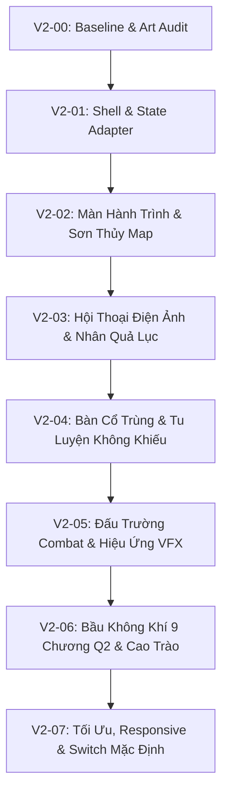

# UI V2 — Hướng đã dừng

Ngày gom tài liệu: 02/10/2026.

Undone/đã dừng không phải done. Giữ thiết kế, mô tả PR và kết quả thử prototype để tham khảo; hướng UI hiện hành là giữ khung và polish.

## Mục lục
- [KE_HOACH_THUC_THI_UI_V2.md](#source-ke-hoach-thuc-thi-ui-v2-md)
- [08_UI_ART_DIRECTION_V2.md](#source-docs-big-update-q1-q2-08-ui-art-direction-v2-md)
- [README.md](#source-previews-nghich-menh-readme-md)
- [PR_DESCRIPTION.md](#source-previews-nghich-menh-pr-description-md)

---

<a id="source-ke-hoach-thuc-thi-ui-v2-md"></a>

## KE_HOACH_THUC_THI_UI_V2.md

**Trạng thái:** Đã dừng hướng thay khung theo yêu cầu người dùng; có prototype, chưa hoàn tất tích hợp. Không tự triển khai tiếp.

<a id="source-ke-hoach-thuc-thi-ui-v2-md-kế-hoạch-thực-thi-ui-v2--sân-khấu-sơn-thủy-hành-trình-nghịch-mệnh"></a>
## Kế Hoạch Thực Thi UI V2 — Sân Khấu Sơn Thủy, Hành Trình Nghịch Mệnh

> **Căn cứ thiết kế:** [[docs/big-update-q1-q2/08_UI_ART_DIRECTION_V2.md](UI_V2_DA_DUNG.md#source-docs-big-update-q1-q2-08-ui-art-direction-v2-md)](UI_V2_DA_DUNG.md#source-docs-big-update-q1-q2-08-ui-art-direction-v2-md)  
> **Kế thừa kỹ thuật:** [[02_UI_UX.md](big-update-q1-q2/01_THIET_KE_GAMEPLAY_UI_CONTENT.md#source-docs-undone-big-update-q1-q2-02-ui-ux-md)](big-update-q1-q2/01_THIET_KE_GAMEPLAY_UI_CONTENT.md#source-docs-undone-big-update-q1-q2-02-ui-ux-md), [[03_EFFECT_AUDIO.md](big-update-q1-q2/01_THIET_KE_GAMEPLAY_UI_CONTENT.md#source-docs-undone-big-update-q1-q2-03-effect-audio-md)](big-update-q1-q2/01_THIET_KE_GAMEPLAY_UI_CONTENT.md#source-docs-undone-big-update-q1-q2-03-effect-audio-md), [[CANON_MAP.md](../reference/CANON_MAP.md)](../reference/CANON_MAP.md)  
> **Nguyên tắc bất biến:**
> 1. **Zero Gameplay Regression:** Không phá vỡ bất kỳ logic gameplay, state `S`, RNG hay test harness nào (`check.cjs`, `story_test.cjs`, `sim.cjs`, `sim2.cjs` phải luôn PASS 100%).
> 2. **DOM Hook Contract:** Giữ tương thích ngược toàn bộ DOM listener/IDs cần thiết (`hud`, `stage`, `sheet`, `modalContainer`...) thông qua Adapter Pattern.
> 3. **Dual-Mode Switch:** Hỗ trợ toggle bật/tắt UI V2 trong Settings/Dev mode trong suốt quá trình xây dựng trước khi chuyển mặc định ở đợt nghiệm thu cuối.

---

<a id="source-ke-hoach-thuc-thi-ui-v2-md--lộ-trình-triển-khai-8-giai-đoạn-v2-00-rightarrow-v2-07"></a>
### 🗺️ Lộ Trình Triển Khai (8 Giai Đoạn: V2-00 $\rightarrow$ V2-07)



---

<a id="source-ke-hoach-thuc-thi-ui-v2-md--chi-tiết-từng-giai-đoạn-thực-thi"></a>
### 📌 Chi Tiết Từng Giai Đoạn Thực Thi

<a id="source-ke-hoach-thuc-thi-ui-v2-md--v2-00-baseline-audit-design-tokens--mock-saves"></a>
#### 🔹 V2-00: Baseline Audit, Design Tokens & Mock Saves
* **Mục tiêu:** Rà soát toàn bộ DOM hooks, kiểm kê kho asset thực tế, thiết lập bộ design token CSS và tạo các save profile mẫu để test nhanh các màn.
- [x] **DOM Contract Map:** Lập danh sách toàn bộ ID và class mà `js/engine.js`, `js/battle.js`, `js/rt.js`, `js/ui.js`, `js/story.js` đang truy vấn (`hud`, `mainPanel`, `stage`, `sheet`, `log`, `modalContainer`, `titleLayer`...). *(Hoàn thành 01/10/2026)*
- [x] **Asset & Font Audit:** Kiểm kê đường dẫn ảnh thực qua hàm `asset()`, kiểm tra tương thích font Google `Ma Shan Zheng`, `Be Vietnam Pro`, `Cormorant Garamond` (kiểm tra hiển thị dấu tiếng Việt đầy đủ). *(Hoàn thành 01/10/2026)*
- [x] **Design Tokens (`css/ui-v2/tokens.css`):** Đã tạo tệp định nghĩa đầy đủ bảng màu Mực sâu, Giấy ngà, Ngọc trầm, Đồng cổ, Chu sa, Lam lạnh, Aura cảnh giới và Typography. *(Hoàn thành 01/10/2026)*
- [x] **Save Mẫu (Mock Saves `js/ui-v2/mock_data.js`):** Tạo 3 mock state (`q1_early`, `q1_mid`, `q2_thanh`) phục vụ preview sandbox độc lập. *(Hoàn thành 01/10/2026)*
- [x] **Sandbox Preview Độc Lập (`ui_v2_preview.html`):** Xây dựng trang preview độc lập tách biệt khỏi main game để User trực tiếp mở trình duyệt kiểm tra và phê duyệt. *(Hoàn thành 01/10/2026)*

---

<a id="source-ke-hoach-thuc-thi-ui-v2-md--v2-01-prototype-bốn-chế-độ-sandbox-chưa-nối-engine"></a>
#### 🔹 V2-01: Prototype bốn chế độ (sandbox, chưa nối engine)
* **Mục tiêu:** Cho duyệt thiết kế: bản đồ, thoại, combat, kho cổ; một biến thể Q2; bấm chuyển màn bằng dữ liệu mẫu. Prototype ghi rõ chưa nối gameplay. (Theo mục V2-01 trong [08_UI_ART_DIRECTION_V2.md](UI_V2_DA_DUNG.md#source-docs-big-update-q1-q2-08-ui-art-direction-v2-md).)
- [x] **Presentation Adapter (`js/ui-v2/adapter.js`):** `getPresentationState(source)` đọc mock; cùng hình dạng sẽ gắn `S` ở V2-02. Không phát thưởng, không tiêu AP, không RNG.
- [x] **Shell Layout (`css/ui-v2/shell.css` + `modes.css`):** Viewport-centric; bốn chế độ Hành trình / Câu chuyện / Chiến đấu / overlay Chuẩn bị.
- [x] **Overlay & Focus:** Kho cổ, nhân vật, nhân quả, cài đặt; Escape đóng; stack `pauseReason` trên thanh review.
- [ ] **Toggle V1 ↔ V2 trong game thật:** để đợt V2-02 khi gắn engine.
- [x] **Sandbox `ui_v2_preview.html`:** save mẫu Q1 sơn trại, Q1 lang triều, Q2 thương thành; khung 1440 / 768 / 390.

---

<a id="source-ke-hoach-thuc-thi-ui-v2-md--v2-02-màn-hành-trình-journey--sơn-thủy-map-stage"></a>
#### 🔹 V2-02: Màn Hành Trình (Journey & Sơn Thủy Map Stage)
* **Mục tiêu:** Biến bản đồ thành một sân khấu sơn thủy sống động, hiển thị pin địa điểm thông minh, HUD tài nguyên tối giản và thanh điều hướng đáy.
- [ ] **HUD Tinh Gọn (Top Bar 56–72px):** Hiển thị cảnh giới, sinh mệnh, chân nguyên, nguyên thạch, trạng thái Xuân Thu Thiền; tích hợp nút Menu & Nhật ký.
- [ ] **Sân Khấu Bản Đồ (Map Stage):**
  - Tranh phong cảnh nền chiếm phần lớn màn hình với hiệu ứng sương khói / bụi chuyển động chậm theo theme vùng.
  - Pin địa điểm với 4 trạng thái trực quan: *Bình thường, Điểm đang chọn, Biến cố mới, Bị phong tỏa/nguy hiểm*.
  - Hỗ trợ cả 2 chế độ: Click trực tiếp trên bản đồ hoặc danh sách điểm đến bên dưới (tối ưu cho mobile không bị che/cắt).
- [ ] **Biến Cố Đang Chờ (Pending Banner):** Hiển thị 1 câu tóm tắt biến cố then chốt và nút "Đi tới" rõ ràng, không che khuất cảnh.
- [ ] **Thanh Điều Hướng Đáy (Bottom Nav 64–80px):** 4 nút điều hướng lớn có nhãn rõ ràng: `Hành trình`, `Cổ trùng`, `Nhân vật`, `Nhân quả` cùng nút `Qua tuần / Qua ngày`.

---

<a id="source-ke-hoach-thuc-thi-ui-v2-md--v2-03-màn-hội-thoại-điện-ảnh--nhân-quả-lục-story-stage"></a>
#### 🔹 V2-03: Màn Hội Thoại Điện Ảnh & Nhân Quả Lục (Story Stage)
* **Mục tiêu:** Dàn cảnh đối thoại đậm chất điện ảnh mỹ thuật xianxia, trình bày rõ ràng cái giá và rủi ro của quyết định, biên nhận kết quả lưu vết vào Nhân Quả Lục.
- [ ] **Bố Cục Hội Thoại Điện Ảnh:**
  - Tranh đại cảnh 16:9 sắc nét ở trên kết hợp chân dung nhân vật bán thân/avatar đặt trang trọng.
  - Khối văn bản lời thoại trên nền ngà mực sâu ổn định, chữ to rõ (17–18px, line-height 1.7), chống mỏi mắt.
  - Typewriter mượt mà: click lần 1 hiện hết chữ ngay, click lần 2 chuyển đoạn; có tùy chọn tắt typewriter và nút xem lại lịch sử thoại.
- [ ] **Trình Bày Lựa Chọn & Chi Phí (Decision Cards):**
  - Phân tách rõ ràng: *Hành động canon*, *Chi phí chắc chắn* (nguyên thạch, AP), *Điều kiện thiếu* (ổ khóa đỏ), *Nguy cơ/Ký ức báo trước*.
  - Lựa chọn trên mobile tự động co giãn dòng, không bị cắt cụt chữ.
- [ ] **Biên Nhận Hệ Quả (Consequence Receipt):** Kết quả lựa chọn quan trọng được ghim lại dưới dạng thẻ ấn triện cho tới khi người chơi chủ động bấm tiếp tục.
- [ ] **Nhân Quả Lục Visual Modal:** Hiển thị cây nhân quả nguyên nhân $\rightarrow$ kết quả đã xảy ra, mốc bí mật chưa mở được ẩn tên để kích thích khám phá.

---

<a id="source-ke-hoach-thuc-thi-ui-v2-md--v2-04-màn-bàn-cổ-trùng--tu-luyện-không-khiếu"></a>
#### 🔹 V2-04: Màn Bàn Cổ Trùng & Tu Luyện Không Khiếu
* **Mục tiêu:** Đem lại cảm giác sở hữu cổ trùng chân thực như sinh vật sống, không khiếu tu luyện trực quan và quy trình hợp luyện minh bạch.
- [ ] **Bàn Cổ Trùng (Gu Inventory):**
  - Hiển thị dạng lưới thẻ bài cổ trùng sống động (ảnh Canva AI chuẩn + Hán tự thư pháp dự phòng).
  - Phân loại rõ ràng: Chuyển (Nhất $\rightarrow$ Lục), Lưu phái, Thức ăn hàng tuần, Tình trạng đói/no, và Hiệu ứng chiến đấu.
  - Thao tác một chạm: Cho ăn, Kích hoạt nội tại, hoặc Ghim công thức hợp luyện làm mục tiêu.
- [ ] **Không Khiếu Tu Luyện (Cultivation Stage):**
  - Hoạt cảnh Không Khiếu ở trung tâm tỏa sáng theo màu chân nguyên chân thực (`Thanh Đồng`, `Xích Thiết`, `Bạch Ngân`, `Hoàng Kim`).
  - Dự báo trực quan lượng chân nguyên tăng và chi phí trước khi bấm tu luyện.
  - Nút "Xung kích bích khiếu" bừng sáng khi chân nguyên viên mãn, hoạt cảnh thăng cấp tiểu cảnh giới uy lực và dứt khoát.
- [ ] **Bàn Luyện Cổ Minh Bạch:**
  - Trình bày trực quan: Nguyên liệu gốc + Nguyên liệu phụ $\rightarrow$ Cổ mục tiêu + Tỉ lệ thành công.
  - Tích hợp mượt mà với minigame luyện cổ hiện có, bảo toàn state khi reload.

---

<a id="source-ke-hoach-thuc-thi-ui-v2-md--v2-05-đấu-trường-combat--hiệu-ứng-vfx-chiến-thuật"></a>
#### 🔹 V2-05: Đấu Trường Combat & Hiệu Ứng VFX Chiến Thuật
* **Mục tiêu:** Tái thiết kế giao diện chiến đấu thành đấu trường sơn thủy rộng mở, chỉ thị ý đồ địch rõ ràng, kỹ năng có lực và tương thích cả Turn-based lẫn Realtime.
- [ ] **Đấu Trường Sơn Thủy (Arena Stage):**
  - Kẻ địch và người chơi đối mặt trên nền phong cảnh đại chiến (rừng trúc, huyết động, tường thành lang triều, tam vương phúc địa).
  - Thước đo 3 cự ly chiến đấu (*Cận chiến - Tầm trung - Tầm xa*) hiển thị rõ ràng.
- [ ] **Chỉ Thị Ý Đồ Địch (Intent Banners):** Hiển thị rõ đòn đánh tới của đối phương (*Công kích, Trọng kích, Thủ thế, Chuẩn bị đại chiêu*) giúp người chơi tính toán đối sách phá thế.
- [ ] **Thanh Kỹ Năng Ấn Triện:**
  - Nút chiêu thức lớn, nổi bật Hán tự thư pháp chuẩn của từng cổ, hiển thị rõ tiêu hao chân nguyên và lượt hồi chiêu (`CD`).
  - Nút combo sát chiêu bừng sáng viền kim khi đủ điều kiện thi triển.
- [ ] **Lớp Hiệu Ứng VFX Độc Lập:** Chùm tia nguyệt nhận, đao băng tuyết, sóng âm, lửa thiêu đốt render qua canvas riêng biệt, không giật lag DOM chính.
- [ ] **Pause & Modal Isolation:** Đảm bảo khi mở bất kỳ menu/journal nào trong trận, thời gian và animation lập tức dừng tuyệt đối, không có tình trạng mất máu ngầm.

---

<a id="source-ke-hoach-thuc-thi-ui-v2-md--v2-06-bầu-không-khí-9-chương-quyển-2--hoạt-cảnh-cao-trào"></a>
#### 🔹 V2-06: Bầu Không Khí 9 Chương Quyển 2 & Hoạt Cảnh Cao Trào
* **Mục tiêu:** Thể hiện trọn vẹn 9 sắc thái không gian của Quyển 2 và các hoạt cảnh mang tính bước ngoặt của toàn bộ cốt truyện.
- [ ] **Theme Động 9 Vùng Đất Quyển 2:**
  - *Sông Hoàng Long:* Sóng nước đục ngầu, bè trôi lạnh lẽo.
  - *Bạch Cốt Sơn:* Xương trắng nhô khỏi sương mù, ánh lân tinh.
  - *Thương Đội:* Lều bạt, đuốc ấm giữa đường núi hiểm trở.
  - *Thương Gia Thành:* Đô thị phồn hoa ngọc bích nhiều tầng rực rỡ.
  - *Diễn Võ Trường:* Cột đá đen sừng sững, tiếng reo hò ma tu.
  - *Tam Xoa Sơn:* Ba cột sáng đỏ/vàng/lam vút thẳng trời cao.
  - *Bá Quy Phúc Địa:* Vạc luyện cổ sôi sục, địa linh rùa rêu phong.
- [ ] **Màn Mở Đầu & Chọn Mệnh Cách:** Tái thiết kế 3 thẻ mệnh cách như 3 bức họa cuộn thư pháp cổ.
- [ ] **Hoạt Cảnh Trọng Đại (Cinematic Moments):**
  - Tự bạo kích hoạt Xuân Thu Thiền quay ngược thời gian (hiệu ứng quang âm nghịch chuyển).
  - Luyện Tiên Cổ Định Tiên Du và truyền tống đến đỉnh Đãng Hồn Sơn Trung Châu.
  - Trang Tổng Kết Cuối Quyển (Epilogue Scroll) vinh danh chiến tích người chơi.

---

<a id="source-ke-hoach-thuc-thi-ui-v2-md--v2-07-tối-ưu-hóa-toàn-diện-responsive--nghiệm-thu-phát-hành"></a>
#### 🔹 V2-07: Tối Ưu Hóa Toàn Diện, Responsive & Nghiệm Thu Phát Hành
* **Mục tiêu:** Đảm bảo giao diện mượt mà 60 FPS desktop / 30+ FPS mobile, không lỗi layout ở mọi độ phân giải và chuyển UI V2 thành giao diện chính thức.
- [ ] **Kiểm Thử Responsive:**
  - Mobile màn hình nhỏ: 360px, 390px $\times$ 844px.
  - Tablet: 768px $\times$ 1024px.
  - Desktop: 1440px $\times$ 900px, 1920px $\times$ 1080px.
  - Kiểm tra zoom trình duyệt 200%, không bị vỡ hoặc che mất nút bấm quan trọng.
- [ ] **Tối Ưu Tài Nguyên & Tốc Độ Tải:**
  - Áp dụng lazy-loading tranh cảnh, nén ảnh webp/jpg tối ưu dung lượng.
  - Dọn dẹp listener và ticker khi đổi màn, đảm bảo bộ nhớ không bị rò rỉ.
- [ ] **Chạy Bộ Test Harness Toàn Diện:**
  - `node tools/check.cjs` $\rightarrow$ 0 lỗi dữ liệu.
  - `node tools/story_test.cjs` $\rightarrow$ 57/57 tests PASS 100%.
  - `node tools/sim.cjs 100 6` $\rightarrow$ Winrate chuẩn 45% - 55%.
  - `node tools/sim2.cjs 100 5` $\rightarrow$ Vượt qua đủ 9 chương Q2.
- [ ] **Kích Hoạt Mặc Định:** Chuyển UI V2 thành giao diện mặc định của trò chơi, lưu trữ module UI cũ làm phương án dự phòng.

---

<a id="source-ke-hoach-thuc-thi-ui-v2-md--bảng-theo-dõi-tiến-độ-thực-thi"></a>
### 📊 Bảng Theo Dõi Tiến Độ Thực Thi

| Giai đoạn | Mô tả hạng mục | File can thiệp chính | Trạng thái | Ngày hoàn thành |
| :---: | :--- | :--- | :---: | :---: |
| **V2-00** | Baseline Audit, Tokens & Mock Saves | `css/ui-v2/tokens.css`, `js/ui-v2/mock_data.js`, `ui_v2_preview.html` | ✅ Hoàn thành | 01/10/2026 |
| **V2-01** | Prototype 4 màn + adapter mock | `ui_v2_preview.html`, `css/ui-v2/*`, `js/ui-v2/*` | ✅ Sandbox | 01/10/2026 |
| **V2-02** | Màn Hành Trình & Sơn Thủy Map | `js/ui_journey.js`, `css/ui-v2/journey.css` | ⏳ Đang chờ | — |
| **V2-03** | Hội Thoại Điện Ảnh & Nhân Quả Lục | `js/ui_story.js`, `css/ui-v2/story.css` | ⏳ Đang chờ | — |
| **V2-04** | Bàn Cổ Trùng & Tu Luyện Không Khiếu | `js/ui_inventory.js`, `css/ui-v2/inventory.css` | ⏳ Đang chờ | — |
| **V2-05** | Đấu Trường Combat & Hiệu Ứng VFX | `js/ui_combat.js`, `css/ui-v2/combat.css` | ⏳ Đang chờ | — |
| **V2-06** | Bầu Không Khí 9 Chương & Cao Trào | `js/present.js`, `css/ui-v2/themes.css` | ⏳ Đang chờ | — |
| **V2-07** | Tối Ưu, Responsive & Switch Mặc Định | Toàn bộ codebase | ⏳ Đang chờ | — |

---

> **Nguyên tắc hành động:** Bắt đầu tuần tự từ **V2-00** $\rightarrow$ **V2-01** $\rightarrow$ **V2-02**; kiểm thử tự động sau mỗi bước để đảm bảo tính ổn định tuyệt đối trước khi bước sang giai đoạn tiếp theo.

---

<a id="source-docs-big-update-q1-q2-08-ui-art-direction-v2-md"></a>

## 08_UI_ART_DIRECTION_V2.md

**Trạng thái:** Đã dừng hướng thay khung theo yêu cầu người dùng; có prototype, chưa hoàn tất tích hợp. Không tự triển khai tiếp.

<a id="source-docs-big-update-q1-q2-08-ui-art-direction-v2-md-ui-v2--sân-khấu-sơn-thủy-hành-trình-nghịch-mệnh"></a>
## UI V2 — Sân khấu sơn thủy, hành trình nghịch mệnh

> **Đã dừng theo phản hồi người dùng.** Không tiếp tục hướng thay khung hoặc prototype Nghịch Mệnh. Kế hoạch hiện hành: [09 — Giữ khung hiện tại, polish UI](big-update-q1-q2/09_UI_POLISH_GIU_KHUNG_HIEN_TAI.md). Nội dung bên dưới chỉ lưu lại lịch sử đề xuất.

Ngày: 01/10/2026. **Trạng thái: kế hoạch thiết kế; chưa triển khai UI V2.**

Đề xuất thay bố cục ba cột hiện tại bằng giao diện lấy cảnh và hành động làm trung tâm. Bản này thay định hướng bố cục ở [02_UI_UX.md](big-update-q1-q2/01_THIET_KE_GAMEPLAY_UI_CONTENT.md#source-docs-undone-big-update-q1-q2-02-ui-ux-md); tiếp tục dùng các yêu cầu về tính dễ hiểu, mobile và accessibility của tài liệu đó, cùng nguyên tắc hiệu ứng ở [03_EFFECT_AUDIO.md](big-update-q1-q2/01_THIET_KE_GAMEPLAY_UI_CONTENT.md#source-docs-undone-big-update-q1-q2-03-effect-audio-md).

Content tiếp tục lấy chuẩn từ [CHI_TIET_NGUYEN_TAC_Q1.md](../reference/CHI_TIET_NGUYEN_TAC_Q1.md) và [CHI_TIET_NGUYEN_TAC_Q2.md](../reference/CHI_TIET_NGUYEN_TAC_Q2.md). Đổi cách kể và trình bày phải phản ánh trạng thái thật; không thêm động cơ nhân vật, lệnh bài, thời hạn hay phần thưởng chỉ để làm đẹp màn hình.

<a id="source-docs-big-update-q1-q2-08-ui-art-direction-v2-md-1-chọn-hướng-nào"></a>
### 1. Chọn hướng nào?

| Hướng | Người chơi cảm nhận | Phạm vi | Đánh giá |
|---|---|---|---|
| Làm mới khung hiện tại | Quen thuộc hơn, chữ và thẻ đẹp hơn | Màu, khoảng cách, ảnh, nút | Ít rủi ro nhưng mức thay đổi cảm giác chơi hạn chế |
| **Sân khấu sơn thủy + hội thoại điện ảnh + bàn cổ trùng** | Đang sống trong một hành trình có không khí, nhân vật và biến cố | Thay shell, điều hướng và các màn chính; dùng lại engine | **Đề xuất chọn**: tận dụng thế mạnh truyện, tranh và chiến đấu sẵn có |
| Thế giới có nhân vật đi lại trực tiếp | Khám phá không gian bằng avatar | Thêm di chuyển, va chạm, camera, tương tác thế giới và nhiều asset | Là một đợt đổi gameplay lớn; chưa phù hợp làm bước UI tiếp theo |

Hướng được chọn có ba điểm nhận diện: **sơn thủy nhiều lớp, ấn triện tiết chế, cổ trùng hiện diện như sinh vật**. Cảnh đẹp kéo người chơi vào; hành động rõ giữ nhịp chơi; thay đổi của thế giới làm họ muốn xem tiếp.

<a id="source-docs-big-update-q1-q2-08-ui-art-direction-v2-md-2-những-điểm-đang-làm-trải-nghiệm-bị-chia-nhỏ"></a>
### 2. Những điểm đang làm trải nghiệm bị chia nhỏ

Khảo sát lần này đọc code và xem hai asset mẫu; chưa chạy browser để kết luận về layout thực tế hoặc FPS.

| Hiện trạng có trong repo | Ảnh hưởng dự kiến | Thay đổi V2 |
|---|---|---|
| `index.html`: khung tối đa 1400px; `.layout` có hai cột cố định 300px + 290px | Nhân vật và log chiếm nhiều chỗ dù người chơi đang đọc truyện hoặc đánh nhau | Bỏ hai cột thường trực; mở thành bảng theo nhu cầu |
| `.story-art` chỉ cao 180–280px | Tranh thường trở thành banner đầu bài, ít đất để dàn cảnh | Cảnh chiếm vùng chính, có bố cục riêng cho thoại và hành động |
| HUD, timeline, sheet, log cùng được dựng ở `render()` | Nhiều khối tranh sự chú ý; thay toàn DOM dễ mất focus/scroll | HUD gọn; dựng theo chế độ; cập nhật phần thay đổi |
| Kết quả nhỏ chủ yếu đi qua toast tự tắt | Người đọc chậm có thể bỏ lỡ hệ quả quan trọng | Biên nhận giữ lại đến hành động tiếp theo; có đường đọc lại |
| Hai mẫu đã xem: tranh `scene_qingshu_vs_bai.png` có nét cọ mạnh; chân dung `n_shangxinci.jpg` mịn và sáng | Chuyển giữa các loại ảnh có thể thiếu thống nhất | Audit art đang được dùng, rồi thống nhất crop, tông màu và vật liệu trước khi sản xuất thêm |
| Menu phụ dùng chung `modalContainer`; combat RT có luồng cập nhật riêng | UI mới cần xử lý lớp phủ, pause và focus nhất quán | Một bộ quản lý lớp phủ dùng chung cho kho cổ, nhật ký và cài đặt |

Hai asset mẫu không đại diện cho toàn bộ kho tranh. Cần xem contact sheet của ảnh thực sự được `asset()` chọn, gồm cả fallback khi thiếu manifest cá nhân.

<a id="source-docs-big-update-q1-q2-08-ui-art-direction-v2-md-3-mỹ-thuật-đẹp-từ-bố-cục-và-chất-liệu"></a>
### 3. Mỹ thuật: đẹp từ bố cục và chất liệu

<a id="source-docs-big-update-q1-q2-08-ui-art-direction-v2-md-31-bảng-màu-nền-tảng"></a>
#### 3.1. Bảng màu nền tảng

| Vai trò | Màu gợi ý | Cách dùng |
|---|---|---|
| Mực sâu | `#0B1115` | Nền đọc chữ, lớp phủ |
| Giấy ngà | `#E8DDC7` | Chữ chính, tiêu đề, trang ký sự |
| Ngọc trầm | `#75B69A` | Chân nguyên, hồi phục, tu luyện |
| Đồng cổ | `#CBA968` | Điểm nhấn tương tác, viền chọn, dấu mốc |
| Chu sa | `#C35B50` | Nguy hiểm, thương tổn, huyết đạo |
| Lam lạnh | `#91B9CB` | Băng đạo, không khí lạnh |

Đây là token khởi điểm; từng cặp chữ/nền phải được kiểm tra tương phản. Cảnh được phép sáng và nhiều màu; vùng đọc chữ có nền đủ ổn định. Mỗi màn chỉ có một điểm nhấn thị giác mạnh.

- Giảm viền hộp lặp lại. Dùng khoảng cách, bóng nền và lớp sáng tối để chia nội dung.
- Nút chính như một dải giấy/ấn lệnh; nút phụ nhỏ và nhẹ hơn; hành động nguy hiểm có chữ giải thích.
- Dùng lại `Be Vietnam Pro` cho thân bài; thử `Cormorant Garamond` hiện có ở tiêu đề lớn. Kiểm tra dấu tiếng Việt trước khi chốt font hoặc thay thế.
- Cỡ thân bài khởi điểm 17–18px, line-height 1.65–1.8, chiều dài dòng khoảng 45–65 ký tự. Tiêu đề desktop 36–52px; mobile 26–34px.
- Chữ Hán làm họa tiết phụ; tên thao tác luôn có tiếng Việt. Giảm emoji pha phong cách; icon chức năng dùng SVG thống nhất.
- Asset vuông giữ dạng chân dung trong khung trang trí. Chỉ dựng nhân vật đứng bán thân khi có ảnh phù hợp; không phóng ảnh avatar thành ảnh toàn thân.

<a id="source-docs-big-update-q1-q2-08-ui-art-direction-v2-md-32-mỗi-vùng-có-một-dấu-ấn"></a>
#### 3.2. Mỗi vùng có một dấu ấn

| Vùng | Cảnh, ánh sáng và chất liệu | Chuyển động nền |
|---|---|---|
| Q1: Sơn trại | Trúc xanh, núi ẩm, đèn vàng; khoảng trời rộng | Sương chậm, bóng lá ở rìa |
| Q1: Hoa Tửu | Đá ướt, bóng tối, ánh lưu ảnh | Nước nhỏ, bụi trong khe sáng |
| Q1: Lang triều | Tường trại, trời nặng, đuốc đỏ | Bóng sói xa, bụi; chỉ tăng khi sự kiện thực sự tới |
| Q1: Hồi kết | Huyết sắc và băng trắng theo cảnh | Đóng băng hoặc dòng huyết theo đúng nhánh |
| Q2: Hoàng Long | Nước đục, bè, đường chân trời lạnh | Mặt nước và vệt trôi chậm |
| Q2: Bạch Cốt | Đá trắng ngà, hốc tối, cột sáng hẹp | Bụi xương nhẹ |
| Q2: Thương đội | Vải lều, đèn ấm, đường núi | Đèn đung đưa, bóng đoàn xe |
| Q2: Thương gia thành | Kiến trúc nhiều tầng, ánh ngọc trong núi | Chiều sâu phố; điểm sáng ở nơi tương tác |
| Q2: Thiếu chủ | Bàn sổ sách, thư tín, ấn tín | Ánh đèn; nhịp cảnh tĩnh hơn |
| Q2: Tam Xoa | Ba lối truyền thừa, địa hình dựng đứng | Các cột sáng có hình dạng phân biệt |
| Q2: Ngũ chuyển | Quy mô nhân vật và bầu trời áp đảo | Gió mạnh ở lớp xa |
| Q2: Bá Quy | Đá cổ, vết rạn, vạc luyện | Lửa và dao động tiên nguyên theo state |
| Q2: Điện luyện cổ | Không gian bó hẹp rồi mở rộng ở cao trào | Ve/bướm, ánh ngọc theo kết quả đã xảy ra |

Không đổi màu ngẫu nhiên theo lượt. Bộ theme lấy từ book, chapter, event và trạng thái cảnh; Q2 không dùng quy tắc thời tiết/lang triều Q1.

<a id="source-docs-big-update-q1-q2-08-ui-art-direction-v2-md-4-bỏ-ba-cột-tổ-chức-thành-bốn-chế-độ"></a>
### 4. Bỏ ba cột, tổ chức thành bốn chế độ

1. **Hành trình:** bản đồ lớn, điểm đến, việc còn lại, biến cố đang chờ.
2. **Câu chuyện:** tranh, người nói, lời thoại và lựa chọn.
3. **Chiến đấu:** đấu trường, ý đồ địch, tài nguyên và kỹ năng.
4. **Chuẩn bị:** kho cổ, luyện cổ, nhân vật, nhân quả; mở thành bảng rộng hoặc trang riêng trên mobile.

Luồng chính: **chọn nơi đến → gặp chuyện → quyết định/chiến đấu → thấy kết quả → trở lại thế giới đã thay đổi**. Cảnh nào cũng có một hành động tiếp theo rõ ràng; nội dung đọc thêm nằm sau nút mở rộng.

<a id="source-docs-big-update-q1-q2-08-ui-art-direction-v2-md-desktop-màn-hành-trình"></a>
#### Desktop: màn Hành trình

```text
┌─────────────────────────────────────────────────────────────────────┐
│ Q1 · Thanh Mao Sơn     [HP] [Chân nguyên] [Thạch]    [Thiền] [Menu]   │
│                                                                     │
│  NÚI THANH MAO                  Tranh bản đồ chiếm phần lớn màn hình │
│  Tháng … · Tuần …                                                   │
│                 ◇ Hậu sơn                                           │
│       ◇ Học đường                         ◇ Núi rừng                 │
│                                                                     │
│  Biến cố đang chờ                      ◇ Chợ thương đội              │
│  Thương đội vừa đến                                                 │
│  [Đến gặp]                    Điểm đang chọn · Chi phí · [Đi tới]    │
│                                                                     │
│ [Hành trình] [Cổ trùng] [Nhân vật] [Nhân quả]    ● ● ○  [Qua tuần]    │
└─────────────────────────────────────────────────────────────────────┘
```

Đây là wireframe chức năng, không phải screenshot. Sân khấu tận dụng viewport nhưng không bắt người dùng bật chế độ fullscreen của trình duyệt.

- Thanh tài nguyên cao khoảng 56–72px; thanh dưới khoảng 64–80px. Kích thước cuối điều chỉnh qua prototype.
- Mốc đang chờ hiển thị một câu và một nút; không biến thành danh sách nhiệm vụ dài che cảnh.
- Click điểm bản đồ: hiện thông tin gọn và nút đi; người chơi biết chi phí trước khi tiêu việc. Các thao tác quen dùng có phím tắt khi phù hợp.
- Có chế độ danh sách điểm đến, dùng cùng dữ liệu và điều kiện với pin bản đồ.
- Timeline nằm trong Hành trình mở rộng; chỉ phóng lớn các mốc đã biết. Mốc bí mật chưa khám phá không lộ tên hoặc hình ảnh.

<a id="source-docs-big-update-q1-q2-08-ui-art-direction-v2-md-mobile"></a>
#### Mobile

- Dọc một cột; HUD hai hàng ngắn, bản đồ khoảng 40–50dvh khi đủ chỗ, chi tiết điểm đến bên dưới.
- Thanh đáy bốn mục có chữ: Hành trình, Cổ trùng, Nhân vật, Nhân quả; cài đặt ở nút menu.
- Màn thoại ưu tiên tranh khoảng 30–38dvh rồi văn bản/lựa chọn cuộn tự nhiên. Chữ phóng lớn thì giảm phần tranh trước.
- Bảng chi tiết mở từ đáy; kho cổ nhiều nội dung mở thành trang. Chỉ một lớp phủ tương tác tại một thời điểm.
- Pin không đè nhau hoặc bị cắt khi crop tranh; dùng vị trí riêng cho mobile hoặc chuyển sang danh sách. Không thu nhỏ nguyên bản đồ desktop.
- Dùng safe-area, chiều cao viewport động, vùng chạm ít nhất 44px, mục tiêu 48px cho nút chính. Không khóa trang ở 100vh khiến mất lựa chọn khi xoay màn hình.

<a id="source-docs-big-update-q1-q2-08-ui-art-direction-v2-md-5-các-màn-cần-làm-lại"></a>
### 5. Các màn cần làm lại

| Màn | Thiết kế mới | Điều khiến người chơi muốn tương tác tiếp |
|---|---|---|
| Mở đầu | Tranh lớn, Phương Nguyên, tiêu đề gọn; Tiếp tục là nút chính nếu có save; mô tả một câu nơi đang dở | Nhận ra ngay hành trình của mình đang ở đâu |
| Chọn mệnh cách | Ba thẻ lớn có hình tượng riêng; cái được/cái mất dễ so | Cảm giác bắt đầu một kiếp có tính cách riêng |
| Hành trình | Bản đồ như một địa điểm sống; pin mới/phong tỏa/đang chọn phân biệt bằng hình và chữ | Thấy cơ hội và thay đổi sau mỗi mốc |
| Hội thoại | Cảnh lớn, tên người nói rõ; 1–2 khối thoại mỗi nhịp; lựa chọn trên nền tối ổn định | Nhịp đọc có khoảng lặng và cao trào |
| Kho cổ | Lưới ảnh cổ lớn; chọn mở chi tiết, trạng thái nuôi và công dụng; lọc nhanh | Nhận ra bộ cổ đang mạnh ở đâu và thiếu gì |
| Tu luyện | Không khiếu ở giữa; chân nguyên, tiến độ và chi phí sát hành động | Thấy sự tiến bộ trước/sau một lần tu luyện |
| Luyện cổ | Trình bày nguyên liệu → sản phẩm, rồi chuyển sang minigame hiện có | Hiểu cái giá trước khi bỏ nguyên liệu |
| Chiến đấu | Đấu trường rộng, ý đồ địch ở trên, thanh kỹ năng ở dưới | Quan sát, phản ứng, nhận phản hồi rõ sau đòn |
| Nhân quả | Dòng sự kiện có liên kết nguyên nhân → hậu quả đã biết; một mục là một chuyện | Thấy lựa chọn để lại dấu vết, có điều đáng chờ |
| Quan hệ | Chân dung, thái độ biểu hiện, sự việc gần nhất; chỉ người đã gặp | Nhớ câu chuyện với nhân vật, không chỉ nhìn điểm số |
| Cuối quyển | Một trang hồi cố: kết cục, quyết định lớn, số phận đã xác nhận, hành trang mang theo | Có một kết thúc đáng nhớ và động lực bước tiếp |

<a id="source-docs-big-update-q1-q2-08-ui-art-direction-v2-md-hội-thoại-dàn-cảnh-thay-vì-nối-hộp-văn-bản"></a>
#### Hội thoại: dàn cảnh thay vì nối hộp văn bản

- Cảnh nói chuyện có thể đặt chân dung bên phải và văn bản bên trái; cảnh hành động dùng tranh rộng với lời kể ở dưới. Chọn theo ảnh và event, không ép mọi cảnh chung một template.
- Nhấn để hiện hết đoạn đang chạy chữ; nhấn tiếp mới sang đoạn. Có tắt typewriter và lịch sử thoại.
- Lựa chọn thường xuyên đọc được trên mobile; phương án dài được xuống dòng, không cắt mất ý.
- Cái giá chắc chắn, điều kiện thiếu và nguy cơ đã biết được trình bày riêng. Không tự suy phần thưởng từ tên event.
- Nhãn ký ức/nguyên tác tuân cùng quy tắc khám phá ở cả `choiceBtn()` và `scChoiceBtn()`; cần rà sự khác biệt hiện có trước khi chuyển UI.
- Hệ quả quan trọng có biên nhận còn lại đến hành động tiếp theo và được đọc lại trong nhật ký. Thay đổi nhỏ dùng chip ngắn, không bắt xác nhận từng đồng thạch.

<a id="source-docs-big-update-q1-q2-08-ui-art-direction-v2-md-kho-cổ-và-tu-luyện-hai-màn-tạo-cảm-giác-sở-hữu"></a>
#### Kho cổ và tu luyện: hai màn tạo cảm giác sở hữu

- Ảnh cổ là điểm nhìn chính; chuyển, công dụng và tình trạng có vị trí cố định. Dùng chuyển thật, không thêm phẩm chất thường/hiếm/huyền thoại.
- Chi tiết ưu tiên: cổ làm gì, tốn gì, đang bị gì, dùng/luyện được chưa. Phần mô tả dài mở rộng sau.
- Cho pin công thức làm mục tiêu; đây là tính năng UI mới cần lưu tùy chọn riêng, không giả vờ engine đã có.
- Nếu engine chưa có giới hạn trang bị/loadout, UI không dựng ô trang bị giả. Thanh kỹ năng lấy từ những cổ thực sự dùng được.
- Tu luyện hiện trước tác động của lựa chọn từ hàm tính thực tế. Viên mãn mở “Xung kích bích khiếu”; trần chương giải thích điều kiện tiến tiếp.
- Đột phá thành công: hình không khiếu đổi, âm ngắn, nhãn cảnh giới mới. Lần xem lại được rút gọn/bỏ qua.

<a id="source-docs-big-update-q1-q2-08-ui-art-direction-v2-md-chiến-đấu-kỹ-năng-phải-có-lực-và-dễ-đọc"></a>
#### Chiến đấu: kỹ năng phải có lực và dễ đọc

- Ý đồ địch và mục tiêu trận có vị trí cố định; tín hiệu báo trước nằm trên lớp trang trí.
- Ba tầm chiến đấu được biểu diễn rõ trong đấu trường; nút di chuyển ghi đích đến.
- Kỹ năng có icon cổ, tên ngắn, phí chân nguyên, cooldown và lý do khóa. Mobile có nút xem chi tiết riêng, không phụ thuộc hover.
- Đỡ chuẩn, ngắt chiêu, sơ hở có phản hồi khác nhau. Hạt/bóng không che thanh vận chiêu hoặc vùng bấm.
- RT và theo lượt dùng cùng thứ bậc thông tin, nhưng nút điều khiển phù hợp từng chế độ.
- Dừng hình lúc va đòn chỉ thuộc lớp trình bày; nếu muốn dừng cả mô phỏng phải có quyết định gameplay riêng và kiểm tra công bằng. Không làm lệch cửa sổ đỡ/ngắt bằng animation.

<a id="source-docs-big-update-q1-q2-08-ui-art-direction-v2-md-6-cuốn-hút-đến-từ-nhịp-phản-hồi"></a>
### 6. “Cuốn hút” đến từ nhịp phản hồi

Ba lớp chuyển động, với ngân sách thử nghiệm:

| Lớp | Ví dụ | Nhịp đề xuất |
|---|---|---|
| Phản hồi thao tác | Nút nhấn, điểm đến được chọn, số thạch thay đổi | 100–180ms; phản hồi xuất hiện ngay |
| Chuyển ngữ cảnh | Mở kho cổ, vào cuộc thoại, trở lại bản đồ | 180–300ms; không phát lại mỗi render |
| Khoảnh khắc lớn | Khai khiếu, đạt cảnh giới, Thiền, kết quyển | 2–4 giây ở lần đầu; có bỏ qua và giảm chuyển động |

- Môi trường bình thường chuyển động chậm và thưa; cảnh căng thẳng thay ánh sáng/âm thanh trước khi tăng hạt.
- Âm thanh chia môi trường, UI và chiến đấu; crossfade khi đổi nơi. Nút mute vẫn dễ tìm trên mobile.
- Sau biến cố, pin/NPC/khung cảnh thay đổi nếu state có bằng chứng: quầy thương đội mở, địa điểm bị phong tỏa, quan hệ có chuyện mới.
- Nhận cổ mới: nhấn mạnh hình, tên và công dụng; cổ đã biết dùng biên nhận gọn.
- Khi quay lại game: một câu tóm tắt mốc đang chờ và nguy cơ thật, không chế deadline giả.
- Không làm mọi nút phát sáng hoặc mọi cổ trôi liên tục. Điểm nhìn chủ động chỉ dành cho chuyện quan trọng nhất lúc đó.
- Reduced motion vẫn giữ đủ thông tin; có tùy chọn giảm rung và chớp riêng.

<a id="source-docs-big-update-q1-q2-08-ui-art-direction-v2-md-7-gói-art-cần-chuẩn-bị"></a>
### 7. Gói art cần chuẩn bị

Làm một bộ mẫu trước: **Sơn trại → một cảnh có lựa chọn → một trận → nhận cổ → mở kho cổ**, rồi áp cùng hệ UI cho một cảnh Thương gia thành. Dùng save mẫu để không phải chơi lại nhiều giờ mỗi lần duyệt bố cục.

1. **Audit và moodboard:** ảnh nào đang dùng, nguồn/license, kích thước, khung hình, màu chủ đạo, nhân vật/giai đoạn; đánh dấu ảnh cần thay, crop được, hoặc dùng nguyên.
2. **Art cho bộ mẫu:** nền Q1 và Thành; tranh sự kiện; chân dung Phương Nguyên và nhân vật trong cảnh; ảnh 6 cổ đại diện. Chọn từ kho hiện có trước, chỉ làm mới phần thiếu.
3. **Bộ UI:** icon chức năng SVG, pin bản đồ bốn trạng thái, viền ấn triện, vật liệu nền đọc chữ. Sinh trực tiếp bằng code/vector khi phù hợp.
4. **Mở rộng:** theme chín chương, chân dung còn thiếu, tranh các cao trào; giữ cùng quy tắc màu/crop/chất liệu.

Mỗi ảnh cảnh có điểm lấy nét cho desktop/mobile và vùng an toàn để đặt chữ. Nếu không có các lớp ảnh độc lập thì dùng một nền tĩnh tốt; chỉ thêm parallax khi crop và độ sâu thực sự phù hợp.

Không trỏ runtime thẳng vào ảnh master lớn. Xuất bản tối ưu qua cơ chế `asset()` hiện có, giữ fallback; ghi nguồn và quyền sử dụng vào manifest asset. AI có thể hỗ trợ tranh/cutout ở đợt sản xuất, không dùng ảnh sinh để thay chữ/nút tương tác.

<a id="source-docs-big-update-q1-q2-08-ui-art-direction-v2-md-8-cách-triển-khai-vào-project"></a>
### 8. Cách triển khai vào project

Tiếp tục dùng JavaScript/CSS hiện tại; thay framework không phải điều kiện để đạt thiết kế này. Chia lớp trình bày rõ để mỗi đợt có thể chạy và so sánh.

| Vùng code | Việc cần làm |
|---|---|
| `index.html` | Shell mới; tách CSS khỏi style lớn thành `css/ui-v2/`; giữ các DOM hook đang còn consumer trong giai đoạn chuyển |
| `js/ui.js` | Tách điều hướng, HUD, story, inventory; giữ binding `data-a`, `data-ch`, `data-sc-*` hoặc có adapter rõ ràng |
| `js/present.js` | Theme/crop theo book/chapter/event; chỉ chạy transition khi đổi view; giữ lịch sử thoại và bỏ qua |
| `js/q2/core.js` | Đưa dữ liệu bản đồ Q2 vào renderer chung; đơn vị ngày/tuần/tháng lấy từ chương |
| `js/rt.js`, `js/battle.js` | DOM combat ổn định, cập nhật số/cooldown có mục tiêu; lớp VFX riêng; giữ pause/tốc độ/chế độ lượt |
| `js/aperture.js`, `js/minigame.js` | Không khiếu thành phần trung tâm của màn tu luyện; bảo toàn input và state minigame |
| `js/sound.js` | Bổ sung âm UI/chuyển vùng; mute, suspend/resume nhất quán |
| `js/story.js`, `js/cicada.js` | UI đọc schema story đã sửa; cảnh quay ngược theo snapshot thật; không áp effect từ animation |

<a id="source-docs-big-update-q1-q2-08-ui-art-direction-v2-md-hợp-đồng-kỹ-thuật-bắt-buộc"></a>
#### Hợp đồng kỹ thuật bắt buộc

- Trước đổi shell, lập danh sách consumer của `hud`, `timeline`, `sheet`, `mainPanel`, `stage`, `log`, `modalContainer`, `titleLayer`. Không bỏ DOM ID mà renderer/listener vẫn gọi.
- Tạo bộ dữ liệu dành cho trình bày từ `S`: mode, theme, tài nguyên, thời gian, việc còn lại, biến cố đang chờ và địa điểm. Bộ đọc này không phát thưởng, không tiêu AP, không đổi RNG.
- Hàm render hiện có còn một số tác dụng phụ như khởi tạo scene và xóa kết quả. Di chuyển từng phần sang xử lý vào/ra cảnh với test tương ứng; không tạo vòng render thứ hai vô tình chạy effect hai lần.
- Trạng thái UI tạm thời: tab đang mở, scroll, focus, bảng chi tiết. Trạng thái game vẫn ở `S/META`; tùy chọn hiển thị lưu theo cơ chế settings của repo.
- Mỗi lớp phủ có lý do pause riêng. Đóng journal không được tự chạy tiếp trận vốn đã do người chơi pause; đổi tab trình duyệt cũng không xóa lý do pause còn lại. Pause áp dụng cả trong lúc lớp phủ xuất hiện/biến mất.
- Lớp phủ giữ focus, đóng Escape, trả focus về nút mở; phím tắt cảnh phía sau bị vô hiệu khi đang gõ hoặc đọc modal. Không để Space vừa cuộn nhật ký vừa tiến thoại.
- Mở/đóng màn không nhân listener/ticker/audio. Chỉ màn đang hiển thị nhận cập nhật; tránh thay `innerHTML` toàn shell mỗi tick combat.
- Animation đọc kết quả đã xác nhận. Skip, reduced motion và reload không áp phần thưởng/đổi chương lần nữa.
- Bắt đầu bằng tùy chọn UI V2 cho build thử. Khi đạt nghiệm thu thì chuyển mặc định và gỡ renderer cũ trong một đợt riêng; không duy trì hai UI vô thời hạn.

<a id="source-docs-big-update-q1-q2-08-ui-art-direction-v2-md-9-lộ-trình-có-sản-phẩm-bàn-giao"></a>
### 9. Lộ trình có sản phẩm bàn giao

| Đợt | Sản phẩm cụ thể | Điều kiện hoàn tất |
|---|---|---|
| V2-00: baseline và art direction | Screenshot UI hiện tại trên desktop/mobile; contact sheet; palette; wireframe bốn chế độ; save mẫu | Biết ảnh thật được dùng và điểm cần sửa; không dùng cảm giác thay số đo |
| V2-01: prototype tương tác | 4 màn: bản đồ, thoại, combat, kho cổ; một biến thể Q2; bấm được chuyển màn bằng dữ liệu mẫu | Xem được chiều dài chữ thật, nút thật, mobile thật; prototype được ghi rõ chưa nối gameplay |
| V2-02: shell + hành trình | HUD gọn, điều hướng, map renderer, bảng chi tiết, quản lý overlay/focus | Chơi một vòng Q1 bằng engine thật; save/load và nút qua lượt đúng |
| V2-03: hội thoại + hệ quả | Scene mới, lời thoại, lựa chọn, biên nhận, Nhân Quả Lục | Chọn mọi nhánh trong save mẫu được; lý do khóa đúng; không lộ mốc bí mật |
| V2-04: cổ trùng + tu luyện | Kho cổ, công thức, không khiếu, đột phá và minigame cùng visual system | Mua/bán/dùng/luyện có cùng kết quả với engine; reload giữa minigame được |
| V2-05: combat + audio/VFX | Đấu trường, thanh kỹ năng, ý đồ, hiệu ứng và pause lớp phủ | RT/theo lượt, touch/bàn phím đều chơi được; overlay không gây mất máu |
| V2-06: Q2 và cao trào | Theme chín chương, màn đầu/cuối, Thiền, cảnh nổi bật theo nhánh | Chuyển chương và kết cục đúng; không sai thân phận/giới tính/trạng thái nhân vật |
| V2-07: tối ưu và chuyển mặc định | Nén/lazy-load ảnh, kiểm tra thiết bị, đối chiếu save; gỡ CSS/renderer thừa | Đạt ma trận bên dưới; báo cáo lỗi còn lại rõ ràng |

Ưu tiên thực hiện **V2-00 → V2-01 → V2-02 → V2-03** trước: đây là phần thay đổi cảm nhận mạnh nhất ở gần như mọi lượt chơi. Tối ưu một đoạn chơi mẫu trước khi phủ art toàn Q1–Q2. Thời gian thực tế phụ thuộc số ảnh cần làm lại; chỉ ước lượng sau audit asset và prototype.

<a id="source-docs-big-update-q1-q2-08-ui-art-direction-v2-md-10-nghiệm-thu-đẹp-chơi-được-và-có-bằng-chứng"></a>
### 10. Nghiệm thu: đẹp, chơi được và có bằng chứng

<a id="source-docs-big-update-q1-q2-08-ui-art-direction-v2-md-trực-quan-và-thao-tác"></a>
#### Trực quan và thao tác

- Screenshot các màn chính ở 390×844, 768×1024 và 1440×900; thêm kiểm tra tràn ngang ở 360px và zoom 200%.
- Trong khoảng 5 giây ở màn Hành trình, người mới tìm được việc còn lại, nguy cơ thật, biến cố chờ và cách đi tiếp. Đây là mục tiêu playtest, chưa phải số đo.
- Đường đọc rõ: cảnh/nhân vật → lời thoại → quyết định. Chữ không đặt trên vùng tranh gây mất tương phản.
- Mobile không có tooltip chỉ-hover; nút cuối không bị thanh đáy che. Chữ dài, tên cổ dài và ảnh lỗi có fallback.
- Mở kho cổ/nhật ký bằng bàn phím; đóng xong trở về đúng chỗ; combat giữ pause đúng ý người chơi.

<a id="source-docs-big-update-q1-q2-08-ui-art-direction-v2-md-logic-và-hiệu-năng"></a>
#### Logic và hiệu năng

- Chạy `check.cjs`, `story_test.cjs`, `regression_test.cjs` khi thay luồng đọc state/action; `ff_test.cjs` khi thay render/transition liên quan tua. Smoke Q1/Q2 khi nối từng màn vào engine.
- Browser flow thật: menu → mệnh cách → khai khiếu → bản đồ → thoại → trận → kết quả → kho cổ; save mẫu Q2 kiểm tra chuyển chương, pending và kết cục.
- Cùng save/seed và hành động, bật/tắt/skip VFX cho cùng kết quả. Chỉ tuyên bố phép so tái lập sau khi có seed/harness phù hợp.
- Mục tiêu thử nghiệm: khoảng 60 FPS desktop, ít nhất 30 FPS ở cấu hình mobile được ghi rõ; không preload cả hai quyển; UI phản hồi trước khi ảnh lớn tải xong. Đo trên thiết bị thật trước khi chốt ngân sách ảnh/hạt.
- Mở/đóng kho, scene và combat 20 lần: không tăng đều số ticker/listener; tab ẩn không chạy combat ngoài ý muốn.

<a id="source-docs-big-update-q1-q2-08-ui-art-direction-v2-md-đánh-giá-độ-cuốn-hút"></a>
#### Đánh giá độ cuốn hút

Playtest ngắn 15–20 phút với khoảng 3–5 người để tìm vấn đề định tính. Hỏi họ nhớ quyết định nào, biết vì sao nhận/mất gì, và muốn làm gì tiếp theo. Ghi số lần phải hỏi cách chơi, nơi bỏ lỡ nút, đoạn đọc bị cắt nhịp. Không coi số người ít này là bằng chứng thống kê về retention.

**Mốc duyệt thiết kế đầu tiên:** đặt prototype của bốn màn cạnh UI hiện tại, cùng content/save mẫu và cùng kích thước màn hình. Chỉ mở rộng sản xuất art khi cả cảm giác thị giác lẫn đường thao tác đã tốt hơn qua kiểm chứng.

---

<a id="source-previews-nghich-menh-readme-md"></a>

## README.md

**Trạng thái:** Đã dừng hướng thay khung theo yêu cầu người dùng; có prototype, chưa hoàn tất tích hợp. Không tự triển khai tiếp.

<a id="source-previews-nghich-menh-readme-md-nghịch-mệnh--bản-b--pr-01"></a>
## Nghịch Mệnh — Bản B / PR-01

> **Đã dừng theo yêu cầu người dùng; không triển khai tiếp và không mở PR cho hướng này.** Giữ thư mục để tham khảo. Plan thay thế: [giữ khung hiện tại và polish UI](big-update-q1-q2/09_UI_POLISH_GIU_KHUNG_HIEN_TAI.md).

Prototype độc lập để so sánh trực quan trước khi chọn hướng UI cho game. Toàn bộ HTML/CSS/JS được viết riêng trong thư mục này; không import, kế thừa hoặc sửa `ui_v2_preview.html`, `css/ui-v2/` hay `js/ui-v2/` của bản A.

<a id="source-previews-nghich-menh-readme-md-mở-preview"></a>
### Mở preview

Từ thư mục gốc project:

```sh
python3 -m http.server 8097 --bind 127.0.0.1
```

- Bản B toàn màn: <http://localhost:8097/previews/nghich-menh/>
- So sánh A/B trực tiếp: <http://localhost:8097/previews/nghich-menh/compare.html>
- Bản A được tham chiếu nguyên trạng: `/ui_v2_preview.html`.

Trang so sánh chỉ nhúng hai URL bằng iframe. Cả hai có link mở toàn màn riêng để xem đúng bố cục desktop; khung chia đôi là kích thước tablet, không phải ảnh desktop bị thu nhỏ. Có chế độ khung rộng 390px để thử mobile.

<a id="source-previews-nghich-menh-readme-md-hướng-thiết-kế-b"></a>
### Hướng thiết kế B

**Giấy ngà / mực xanh / ấn đỏ.** Bản đồ dùng tranh sơn thủy rộng và chữ lớn với khoảng trống; hội thoại, kho cổ, chiến đấu chuyển sang nền mực xanh để nhấn nhân vật và hành động. Thanh điều hướng nổi thay bố cục ba cột thường trực.

Không dùng backend hoặc framework. Art dùng lại trực tiếp từ `assets/art/` và `assets/gu/` đã có, không gọi manifest cá nhân và không dùng asset mới đang được AI khác tạo. Typography có Google Fonts và fallback serif/system khi offline.

<a id="source-previews-nghich-menh-readme-md-những-gì-bấm-thử-được"></a>
### Những gì bấm thử được

| Màn | Tương tác PR-01 |
|---|---|
| Hành trình | Chọn địa điểm, xem thông tin, mở cảnh/kho/trận; học đường thay tài nguyên mẫu; đổi bối cảnh Q1/Q2; qua lượt bằng modal |
| Câu chuyện | Hai lựa chọn có kết quả khác nhau; thăm dò trừ 1 việc, ghi lại Nhân Quả Lục; không trừ tiếp khi đã chọn |
| Cổ trùng | 6 cổ mẫu, lọc công dụng, chọn xem chi tiết; công kích/phòng ngự dẫn tới trận mẫu |
| Chiến đấu | Combat theo lượt đơn giản: công kích, đỡ, hồi chân nguyên, ý đồ địch, thắng/thua và reset |
| Nhân quả | Các lựa chọn trong phiên xuất hiện trước mốc minh họa; mở lại câu chuyện |
| Tùy chọn | Giảm chuyển động, đóng modal bằng Escape, trả focus, mở bản A |

Chỉ là phiên mô phỏng để đánh giá UI. Chưa nối engine, chưa cân bằng, chưa xử lý timeline nguyên tác đầy đủ, chưa có âm thanh. Sáu cổ là bộ dữ liệu trưng bày, không khẳng định nhân vật sở hữu đồng thời ở tuần mẫu. Lời dẫn scene là chuyển thể minh họa; hai tài liệu [CHI_TIET_NGUYEN_TAC_Q1.md](../reference/CHI_TIET_NGUYEN_TAC_Q1.md) và [CHI_TIET_NGUYEN_TAC_Q2.md](../reference/CHI_TIET_NGUYEN_TAC_Q2.md) vẫn là chuẩn khi nối production.

Không đọc/ghi localStorage, không truy cập `S/META`, không ảnh hưởng save game. Tải lại trang đặt lại dữ liệu demo. Chế độ giảm chuyển động chỉ áp dụng trong phiên.

<a id="source-previews-nghich-menh-readme-md-chia-pr-riêng"></a>
### Chia PR riêng

| PR | Phạm vi | Nghiệm thu | Trạng thái |
|---|---|---|---|
| **B-01 — Prototype Nghịch Mệnh** | 5 màn, Q1/Q2 theme mẫu, A/B compare, browser checks và screenshot | Bấm được luồng mẫu; desktop/mobile không tràn; save production không đổi | **Đã làm bản mẫu** |
| B-02 — Shell và Hành trình với engine | Adapter riêng lấy state thật, HUD, vị trí, việc, nguy cơ, chuyển cảnh; có cờ thử nghiệm | Load save Q1/Q2; các action thật đúng chi phí; không thay engine khi chỉ render | Chờ chọn thiết kế |
| B-03 — Câu chuyện và Nhân quả | Scene engine, choice requirements, ký ức, kết quả, pending/journal, focus/overlay | Mọi nhánh mẫu đi được; không lặp effect, không lộ thông tin chưa biết | Kế hoạch |
| B-04 — Cổ trùng và tu luyện | Kho thật, mua/bán/dùng, công thức, không khiếu, minigame đột phá | Chi phí/điều kiện đúng; reload giữa minigame; giữ giới hạn chương | Kế hoạch |
| B-05 — Combat production | RT và theo lượt, ba tầm, ý đồ, kỹ năng, audio/VFX, pause theo lớp phủ | Không mất máu khi đọc modal; không đổi logic do animation; touch/bàn phím | Kế hoạch |
| B-06 — Art Q1/Q2 và hoàn thiện | Chín theme Q2, cao trào, nhân vật, kết cục, asset tối ưu, reduced motion | Ma trận save/browser/mobile, hiệu năng có số đo; chuyển mặc định sau duyệt | Kế hoạch |

Chỉ PR B-01 nằm trong bản bàn giao này. Chưa phát triển tiếp bản A; chưa triển khai PR B-02 khi người dùng chưa chọn sản phẩm.

<a id="source-previews-nghich-menh-readme-md-kiểm-tra-và-ảnh"></a>
### Kiểm tra và ảnh

Khi server đang chạy:

```sh
node --check previews/nghich-menh/app.js
node previews/nghich-menh/check.cjs
```

Harness dùng Puppeteer đã có trong môi trường và Chrome tại `/Applications/Google Chrome.app/Contents/MacOS/Google Chrome`. Có thể đổi URL bằng biến `PREVIEW_URL`. Chrome chạy profile tạm riêng; sentinel localStorage chỉ nằm trong profile kiểm tra, không phải trình duyệt của người dùng.

Kiểm tra 5 màn trên 1440×1000 và 390×844: JS errors, ảnh tải được, tràn ngang; thao tác lựa chọn/AP/nhật ký; đổi Q2; lọc cổ; thắng/reset trận; Escape và focus của modal; save production không bị đụng. Ảnh xuất vào `screenshots/` và không đưa vào commit. Google Fonts bị chặn riêng trong harness để kiểm tra fallback offline nhất quán.

Ảnh là kết quả chạy thực tế của prototype B, không phải mockup sinh bằng AI.

<a id="source-previews-nghich-menh-readme-md-phạm-vi-review-pr"></a>
### Phạm vi review PR

- Entry riêng; không sửa `index.html` hay game production.
- Thư mục mới duy nhất: `previews/nghich-menh/`.
- Không phụ thuộc các file đang được AI khác sửa ngoài thư mục này.
- Không thêm dependency, gọi analytics hoặc gửi save ra mạng.
- `compare.html` phụ thuộc đường dẫn bản A còn tồn tại; bản B tự chạy được dù không có A.

---

<a id="source-previews-nghich-menh-pr-description-md"></a>

## PR_DESCRIPTION.md

**Trạng thái:** Đã dừng hướng thay khung theo yêu cầu người dùng; có prototype, chưa hoàn tất tích hợp. Không tự triển khai tiếp.

<a id="source-previews-nghich-menh-pr-description-md-problem-and-result"></a>
### Problem and result

The user needs an independently designed UI to compare against the existing UI V2 preview before choosing a production direction. This PR adds **Nghịch Mệnh (B)** under a separate preview route: an ivory landscape map, deep jade story/inventory/combat screens, and a floating navigation dock.

The prototype includes five interactive screens, a Q2 map theme, in-memory choice/AP/journal consequences, a small turn-based combat demo, inventory filters, and a side-by-side comparison page that embeds the existing A preview unchanged. It does not import A's code or access production game state/storage.

<a id="source-previews-nghich-menh-pr-description-md-preview"></a>
### Preview

Serve the repository root, then open `/previews/nghich-menh/` or `/previews/nghich-menh/compare.html`.

Implementation is intentionally scoped to PR B-01. [README.md](UI_V2_DA_DUNG.md#source-previews-nghich-menh-readme-md) lists the separate B-02 through B-06 integration PRs; these wait for a design decision.

<a id="source-previews-nghich-menh-pr-description-md-validation"></a>
### Validation

- Syntax check for the standalone JavaScript.
- Puppeteer: all five screens at desktop and mobile sizes, image loading and horizontal overflow.
- Choice → AP change → journal, Q2 theme, inventory filters, combat completion/reset, modal Escape/focus.
- Production localStorage sentinel unchanged; no production engine or existing UI V2 imports.

Existing repository art is reused. Fonts have offline fallbacks. This is a presentation prototype with sample state, not a new playable production build or a balance change.
